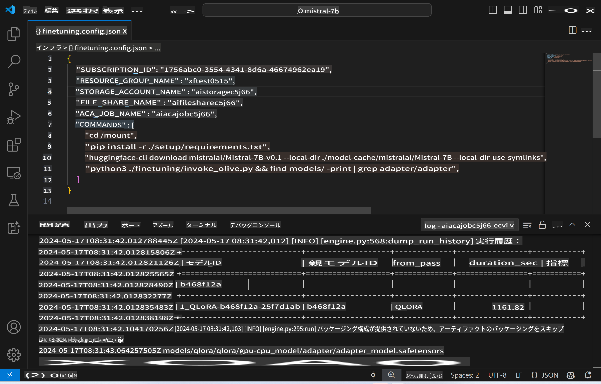
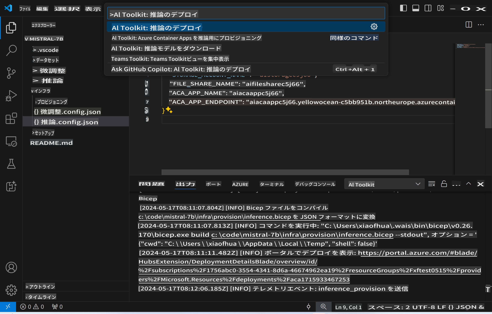
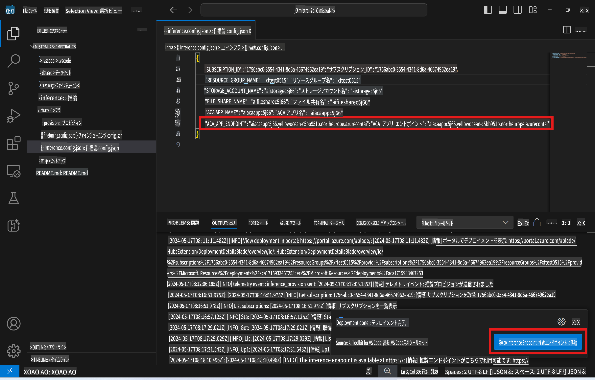

# 微調整済みモデルを使ったリモート推論

リモート環境でアダプターのトレーニングが完了したら、シンプルなGradioアプリケーションを使用してモデルと対話します。



### Azureリソースのプロビジョニング
リモート推論のためのAzureリソースをセットアップするには、コマンドパレットから`AI Toolkit: Provision Azure Container Apps for inference`を実行します。このセットアップ中に、Azureサブスクリプションとリソースグループを選択するよう求められます。  


デフォルトでは、推論用のサブスクリプションとリソースグループは微調整で使用したものと一致する必要があります。推論は同じAzure Container App Environmentを使用し、微調整ステップで生成されたAzure Filesに保存されたモデルとモデルアダプターにアクセスします。

## AI Toolkitの使用

### 推論のためのデプロイ
推論コードを修正したり、推論モデルを再読み込みしたりしたい場合は、`AI Toolkit: Deploy for inference`コマンドを実行してください。これにより、最新のコードがACAに同期され、レプリカが再起動されます。



デプロイが正常に完了すると、このエンドポイントを使用してモデルを評価する準備が整います。

### 推論APIへのアクセス

VSCodeの通知に表示される「*Go to Inference Endpoint*」ボタンをクリックすることで、推論APIにアクセスできます。または、`ACA_APP_ENDPOINT`内の`./infra/inference.config.json`および出力パネルでWeb APIエンドポイントを確認できます。



> **注意:** 推論エンドポイントが完全に動作するようになるまでに数分かかる場合があります。

## テンプレートに含まれる推論コンポーネント

| フォルダー | 内容 |
| ------ |--------- |
| `infra` | リモート操作に必要なすべての設定を含みます。 |
| `infra/provision/inference.parameters.json` | Azureリソースをプロビジョニングするためのbicepテンプレートのパラメーターを保持します。 |
| `infra/provision/inference.bicep` | Azureリソースをプロビジョニングするためのテンプレートが含まれています。 |
| `infra/inference.config.json` | `AI Toolkit: Provision Azure Container Apps for inference`コマンドによって生成される設定ファイル。他のリモートコマンドパレットの入力として使用されます。 |

### AI Toolkitを使用したAzureリソースプロビジョニングの設定
[AI Toolkit](https://marketplace.visualstudio.com/items?itemName=ms-windows-ai-studio.windows-ai-studio)を設定してください。

推論用のAzure Container Appsをプロビジョニングする` command.

You can find configuration parameters in `./infra/provision/inference.parameters.json` file. Here are the details:
| Parameter | Description |
| --------- |------------ |
| `defaultCommands` | This is the commands to initiate a web API. |
| `maximumInstanceCount` | This parameter sets the maximum capacity of GPU instances. |
| `location` | This is the location where Azure resources are provisioned. The default value is the same as the chosen resource group's location. |
| `storageAccountName`, `fileShareName` `acaEnvironmentName`, `acaEnvironmentStorageName`, `acaAppName`,  `acaLogAnalyticsName` | These parameters are used to name the Azure resources for provision. By default, they will be same to the fine-tuning resource name. You can input a new, unused resource name to create your own custom-named resources, or you can input the name of an already existing Azure resource if you'd prefer to use that. For details, refer to the section [Using existing Azure Resources](../../../../../md/01.Introduction/03). |

### Using Existing Azure Resources

By default, the inference provision use the same Azure Container App Environment, Storage Account, Azure File Share, and Azure Log Analytics that were used for fine-tuning. A separate Azure Container App is created solely for the inference API. 

If you have customized the Azure resources during the fine-tuning step or want to use your own existing Azure resources for inference, specify their names in the `./infra/inference.parameters.json`ファイルを編集してください。その後、コマンドパレットから`AI Toolkit: Provision Azure Container Apps for inference`コマンドを実行します。これにより、指定されたリソースが更新され、不足しているリソースが作成されます。

例えば、既存のAzure Container Environmentがある場合、`./infra/finetuning.parameters.json`は次のようになります：

```json
{
    "$schema": "https://schema.management.azure.com/schemas/2019-04-01/deploymentParameters.json#",
    "contentVersion": "1.0.0.0",
    "parameters": {
      ...
      "acaEnvironmentName": {
        "value": "<your-aca-env-name>"
      },
      "acaEnvironmentStorageName": {
        "value": null
      },
      ...
    }
  }
```

### 手動プロビジョニング
Azureリソースを手動で設定したい場合は、`./infra/provision` folders. If you have already set up and configured all the Azure resources without using the AI Toolkit command palette, you can simply enter the resource names in the `inference.config.json`ファイルにある提供されたbicepファイルを使用してください。

例：

```json
{
  "SUBSCRIPTION_ID": "<your-subscription-id>",
  "RESOURCE_GROUP_NAME": "<your-resource-group-name>",
  "STORAGE_ACCOUNT_NAME": "<your-storage-account-name>",
  "FILE_SHARE_NAME": "<your-file-share-name>",
  "ACA_APP_NAME": "<your-aca-name>",
  "ACA_APP_ENDPOINT": "<your-aca-endpoint>"
}
```

**免責事項**:  
本書類は、機械ベースのAI翻訳サービスを使用して翻訳されています。正確性を追求しておりますが、自動翻訳には誤りや不正確さが含まれる可能性があることをご承知おきください。元の言語で記載された原文が公式な情報源と見なされるべきです。重要な情報については、専門の人間による翻訳を推奨いたします。本翻訳の利用に起因する誤解や誤解釈について、当社は一切の責任を負いません。