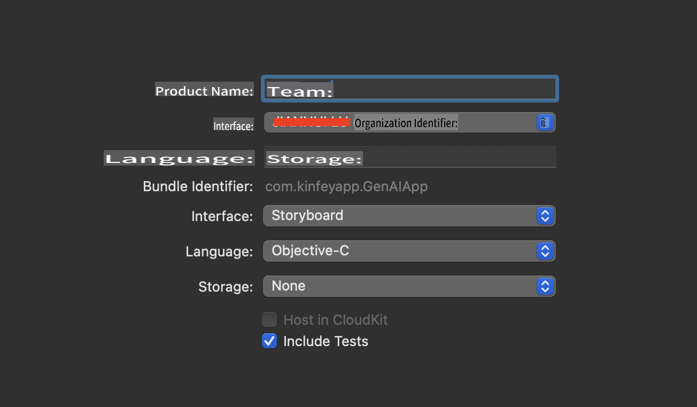
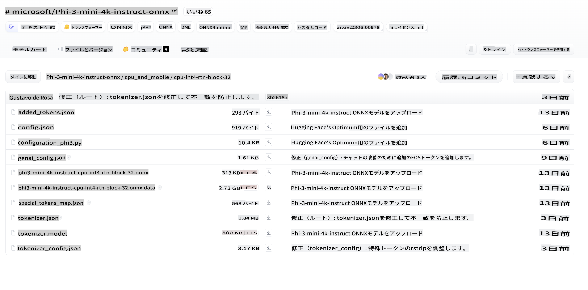
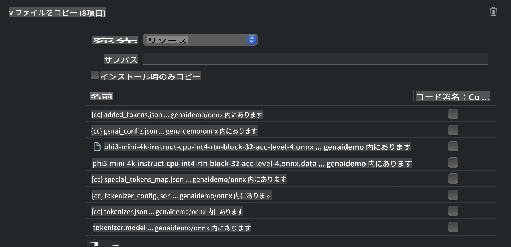
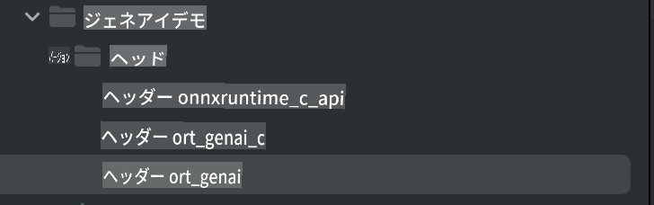
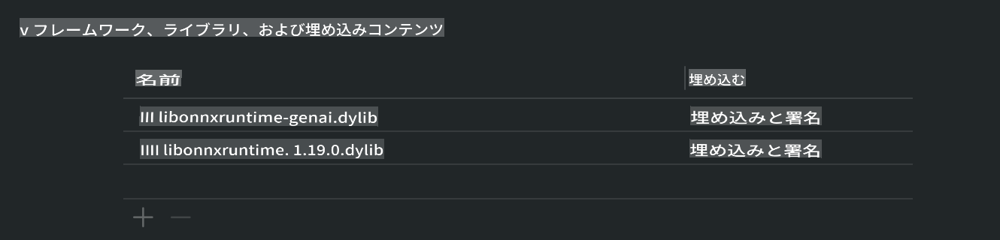
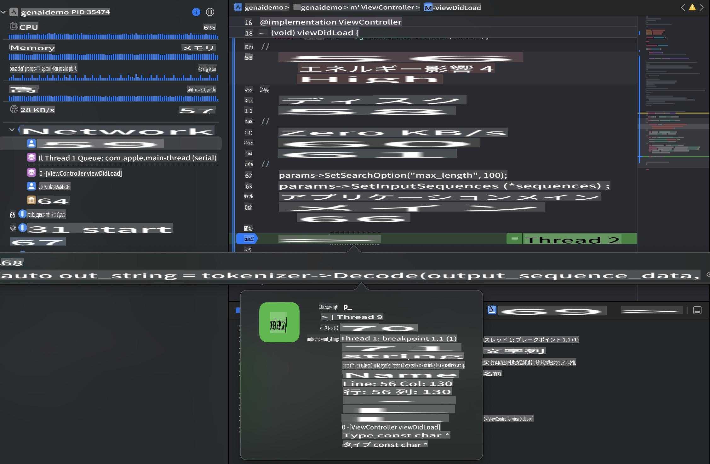

# **iOSでのPhi-3推論**

Phi-3-miniは、Microsoftが提供する新しいモデルシリーズで、大規模言語モデル（LLMs）のエッジデバイスやIoTデバイスへのデプロイを可能にします。Phi-3-miniはiOS、Android、エッジデバイス向けに提供されており、BYOD環境での生成AIの導入を可能にします。以下の例では、iOS上でPhi-3-miniをデプロイする方法を示します。

## **1. 準備**

- **a.** macOS 14以上  
- **b.** Xcode 15以上  
- **c.** iOS SDK 17.x（iPhone 14 A16以降）  
- **d.** Python 3.10以上をインストール（Conda推奨）  
- **e.** Pythonライブラリ `python-flatbuffers` をインストール  
- **f.** CMakeをインストール  

### Semantic Kernelと推論

Semantic Kernelは、Azure OpenAI Service、OpenAIモデル、さらにはローカルモデルと互換性のあるアプリケーションを作成できるフレームワークです。Semantic Kernelを通じてローカルサービスにアクセスすることで、自己ホスト型のPhi-3-miniモデルサーバーとの統合が簡単になります。

### OllamaまたはLlamaEdgeを使用した量子化モデルの呼び出し

多くのユーザーは、モデルをローカルで実行するために量子化モデルを使用することを好みます。[Ollama](https://ollama.com)と[LlamaEdge](https://llamaedge.com)は、異なる量子化モデルを呼び出すことを可能にします。

#### **Ollama**

`ollama run phi3` を直接実行するか、オフラインで設定できます。`gguf` ファイルへのパスを含むModelfileを作成してください。Phi-3-mini量子化モデルを実行するためのサンプルコード：

```gguf
FROM {Add your gguf file path}
TEMPLATE \"\"\"<|user|> .Prompt<|end|> <|assistant|>\"\"\"
PARAMETER stop <|end|>
PARAMETER num_ctx 4096
```

#### **LlamaEdge**

`gguf` をクラウドとエッジデバイスの両方で同時に使用したい場合、LlamaEdgeは優れた選択肢です。

## **2. iOS向けONNX Runtimeのコンパイル**

```bash

git clone https://github.com/microsoft/onnxruntime.git

cd onnxruntime

./build.sh --build_shared_lib --ios --skip_tests --parallel --build_dir ./build_ios --ios --apple_sysroot iphoneos --osx_arch arm64 --apple_deploy_target 17.5 --cmake_generator Xcode --config Release

cd ../

```

### **注意事項**

- **a.** コンパイルを行う前に、Xcodeが正しく設定されていることを確認し、ターミナルでアクティブな開発者ディレクトリとして設定してください：

    ```bash
    sudo xcode-select -switch /Applications/Xcode.app/Contents/Developer
    ```

- **b.** ONNX Runtimeは異なるプラットフォーム向けにコンパイルする必要があります。iOS向けには、`arm64` or `x86_64`用にコンパイルできます。

- **c.** 最新のiOS SDKを使用してコンパイルすることを推奨します。ただし、以前のSDKとの互換性が必要な場合は、古いバージョンを使用することもできます。

## **3. iOS向けONNX Runtimeを使用した生成AIのコンパイル**

> **注意:** ONNX Runtimeを使用した生成AIはプレビュー段階にあるため、変更が発生する可能性があります。

```bash

git clone https://github.com/microsoft/onnxruntime-genai
 
cd onnxruntime-genai
 
mkdir ort
 
cd ort
 
mkdir include
 
mkdir lib
 
cd ../
 
cp ../onnxruntime/include/onnxruntime/core/session/onnxruntime_c_api.h ort/include
 
cp ../onnxruntime/build_ios/Release/Release-iphoneos/libonnxruntime*.dylib* ort/lib
 
export OPENCV_SKIP_XCODEBUILD_FORCE_TRYCOMPILE_DEBUG=1
 
python3 build.py --parallel --build_dir ./build_ios --ios --ios_sysroot iphoneos --ios_arch arm64 --ios_deployment_target 17.5 --cmake_generator Xcode --cmake_extra_defines CMAKE_XCODE_ATTRIBUTE_CODE_SIGNING_ALLOWED=NO

```

## **4. Xcodeでアプリケーションを作成**

私はObjective-Cをアプリ開発の方法として選びました。これは、ONNX Runtime C++ APIを使用した生成AIにおいて、Objective-Cの方が互換性が高いためです。もちろん、Swiftブリッジングを通じて関連する呼び出しを行うことも可能です。



## **5. ONNX量子化INT4モデルをアプリケーションプロジェクトにコピー**

ONNX形式のINT4量子化モデルをインポートする必要があります。まず、モデルをダウンロードしてください。



ダウンロード後、XcodeプロジェクトのResourcesディレクトリに追加してください。



## **6. ViewControllersにC++ APIを追加**

> **注意:**

- **a.** 対応するC++ヘッダーファイルをプロジェクトに追加してください。

  

- **b.** Objective-C++サポートを有効にするために、`onnxruntime-genai` dynamic library in Xcode.

  

- **c.** Use the C Samples code for testing. You can also add additional features like ChatUI for more functionality.

- **d.** Since you need to use C++ in your project, rename `ViewController.m` to `ViewController.mm` を含めてください。

```objc

    NSString *llmPath = [[NSBundle mainBundle] resourcePath];
    char const *modelPath = llmPath.cString;

    auto model =  OgaModel::Create(modelPath);

    auto tokenizer = OgaTokenizer::Create(*model);

    const char* prompt = "<|system|>You are a helpful AI assistant.<|end|><|user|>Can you introduce yourself?<|end|><|assistant|>";

    auto sequences = OgaSequences::Create();
    tokenizer->Encode(prompt, *sequences);

    auto params = OgaGeneratorParams::Create(*model);
    params->SetSearchOption("max_length", 100);
    params->SetInputSequences(*sequences);

    auto output_sequences = model->Generate(*params);
    const auto output_sequence_length = output_sequences->SequenceCount(0);
    const auto* output_sequence_data = output_sequences->SequenceData(0);
    auto out_string = tokenizer->Decode(output_sequence_data, output_sequence_length);
    
    auto tmp = out_string;

```

## **7. アプリケーションの実行**

セットアップが完了したら、アプリケーションを実行してPhi-3-miniモデル推論の結果を確認できます。



詳細なサンプルコードや手順については、[Phi-3 Mini Samplesリポジトリ](https://github.com/Azure-Samples/Phi-3MiniSamples/tree/main/ios)をご覧ください。

**免責事項**:  
本書類は、機械翻訳AIサービスを使用して翻訳されています。正確性を追求しておりますが、自動翻訳には誤りや不正確な表現が含まれる可能性があります。元の言語で作成された原本を正式な情報源としてご参照ください。重要な情報については、専門の人間による翻訳をお勧めします。本翻訳の使用により生じた誤解や誤認に関して、当方は一切の責任を負いかねます。