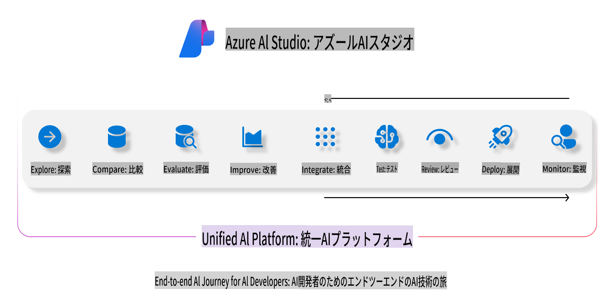
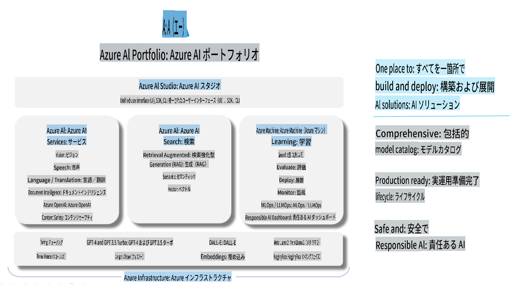

# **Azure AI Foundryを使用した評価**

[Azure AI Foundry](https://ai.azure.com?WT.mc_id=aiml-138114-kinfeylo)を使って生成AIアプリケーションを評価する方法をご紹介します。単一ターンまたは複数ターンの会話を評価する際、Azure AI Foundryはモデルの性能や安全性を評価するためのツールを提供します。

## Azure AI Foundryで生成AIアプリを評価する方法
詳細な手順については、[Azure AI Foundryのドキュメント](https://learn.microsoft.com/azure/ai-studio/how-to/evaluate-generative-ai-app?WT.mc_id=aiml-138114-kinfeylo)をご覧ください。

以下は始めるためのステップです。

## Azure AI Foundryで生成AIモデルを評価する

**前提条件**

- CSVまたはJSON形式のテストデータセット。
- デプロイされた生成AIモデル（Phi-3、GPT 3.5、GPT 4、またはDavinciモデルなど）。
- 評価を実行するための計算インスタンスを備えたランタイム。

## 組み込みの評価指標

Azure AI Foundryでは、単一ターンの会話と複雑な複数ターンの会話の両方を評価できます。
特定のデータに基づいたモデル（RAG: Retrieval Augmented Generation）のシナリオでは、組み込みの評価指標を使用してパフォーマンスを評価できます。
また、一般的な単一ターンの質問応答シナリオ（非RAG）の評価も可能です。

## 評価実行の作成

Azure AI FoundryのUIから、「Evaluate」ページまたは「Prompt Flow」ページに移動します。
評価作成ウィザードに従って評価実行をセットアップします。評価に任意の名前を付けることも可能です。
アプリケーションの目的に合ったシナリオを選択します。
モデルの出力を評価するために1つ以上の評価指標を選択します。

## カスタム評価フロー（オプション）

柔軟性を高めるために、カスタム評価フローを設定することができます。特定の要件に基づいて評価プロセスをカスタマイズしてください。

## 結果の確認

評価を実行した後、Azure AI Foundryで詳細な評価指標を記録、表示、分析します。アプリケーションの能力や限界についての洞察を得ることができます。

**Note** Azure AI Foundryは現在パブリックプレビュー中のため、実験や開発目的での使用をお勧めします。本番環境でのワークロードには他のオプションを検討してください。詳細およびステップバイステップの手順については、公式の[AI Foundryドキュメント](https://learn.microsoft.com/azure/ai-studio/?WT.mc_id=aiml-138114-kinfeylo)をご覧ください。

**免責事項**:  
この文書は、AIによる機械翻訳サービスを使用して翻訳されています。正確性を期すよう努めておりますが、自動翻訳には誤りや不正確な表現が含まれる場合があります。原文（元の言語で書かれた文書）が公式な情報源として優先されるべきです。重要な情報については、専門の人間による翻訳をお勧めします。この翻訳の使用に起因する誤解や解釈の誤りについて、当社は一切の責任を負いかねます。