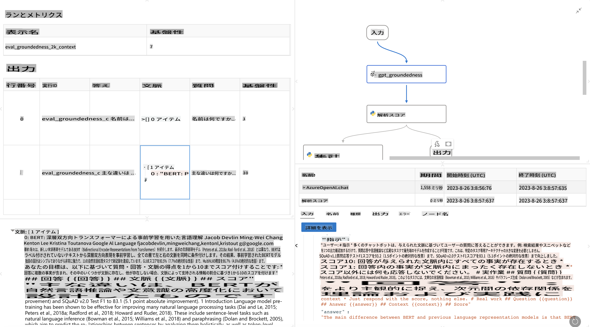

# **Promptflow の紹介**

[Microsoft Prompt Flow](https://microsoft.github.io/promptflow/index.html?WT.mc_id=aiml-138114-kinfeylo) は、事前に用意されたテンプレートやカスタムコネクタを使用して、自動化されたワークフローを作成できるビジュアルなワークフロー自動化ツールです。データ管理、コラボレーション、プロセス最適化などのタスクにおいて、開発者やビジネスアナリストが迅速に自動化プロセスを構築できるよう設計されています。Prompt Flow を使用すると、さまざまなサービス、アプリケーション、システムを簡単に接続し、複雑なビジネスプロセスを自動化できます。

Microsoft Prompt Flow は、大規模言語モデル (LLM) を活用した AI アプリケーションの開発サイクル全体を効率化するよう設計されています。アイデアの発案、プロトタイピング、テスト、評価、展開のいずれの段階であっても、Prompt Flow はプロセスを簡略化し、本番品質の LLM アプリを構築できるようにします。

## Microsoft Prompt Flow を使用する主な特徴と利点:

**インタラクティブなオーサリング体験**

Prompt Flow はフローの構造を視覚的に表現し、プロジェクトを簡単に理解しナビゲートできるようにします。  
ノートブックのようなコーディング体験を提供し、効率的なフロー開発とデバッグが可能です。

**プロンプトのバリエーションと調整**

複数のプロンプトバリエーションを作成して比較し、反復的な改良プロセスを促進します。  
異なるプロンプトのパフォーマンスを評価し、最も効果的なものを選択できます。

**組み込みの評価フロー**

組み込みの評価ツールを使用して、プロンプトやフローの品質と有効性を評価します。  
LLM ベースのアプリケーションがどの程度効果的に機能しているかを理解できます。

**包括的なリソース**

Prompt Flow には、組み込みツール、サンプル、テンプレートのライブラリが含まれています。  
これらのリソースは開発の出発点として役立ち、創造性を刺激し、プロセスを加速します。

**コラボレーションとエンタープライズ対応**

複数のユーザーがプロンプトエンジニアリングプロジェクトに共同で取り組むことで、チームのコラボレーションを支援します。  
バージョン管理を維持し、知識を効果的に共有します。開発、評価、展開、監視に至るプロンプトエンジニアリングプロセス全体を効率化します。

## Prompt Flow における評価

Microsoft Prompt Flow では、AI モデルのパフォーマンスを評価することが重要な役割を果たします。Prompt Flow 内で評価フローと評価指標をカスタマイズする方法を見てみましょう:

**Prompt Flow における評価の理解**

Prompt Flow では、フローは入力を処理して出力を生成する一連のノードを表します。評価フローは、特定の基準や目標に基づいて実行のパフォーマンスを評価するために設計された特別なタイプのフローです。

**評価フローの主な特徴**

- テストされるフローの実行後に実行されることが一般的です。その出力を使用します。  
- テストされたフローのパフォーマンスを測定するためにスコアや指標を計算します。  
- 指標には、正確性、関連性スコア、その他の適切な測定値が含まれる場合があります。

### 評価フローのカスタマイズ

**入力の定義**

評価フローは、テストされる実行の出力を受け取る必要があります。入力は標準的なフローと同様に定義します。  
例えば、QnA フローを評価する場合は、入力名を「answer」とします。分類フローを評価する場合は、入力名を「category」とします。実際のラベルなどのグラウンドトゥルース入力も必要になる場合があります。

**出力と指標**

評価フローは、テストされたフローのパフォーマンスを測定する結果を生成します。  
指標は Python または LLM (大規模言語モデル) を使用して計算できます。log_metric() 関数を使用して関連する指標を記録します。

**カスタマイズされた評価フローの使用**

特定のタスクや目的に合わせた独自の評価フローを作成します。  
評価目標に基づいて指標をカスタマイズします。  
このカスタマイズされた評価フローをバッチ実行に適用して、大規模なテストを行います。

## 組み込みの評価方法

Prompt Flow には組み込みの評価方法も用意されています。  
バッチ実行を送信し、これらの方法を使用してフローが大規模データセットでどの程度機能するかを評価できます。  
評価結果を確認し、指標を比較し、必要に応じて反復を行います。  
評価は、AI モデルが望ましい基準や目標を満たしていることを保証するために不可欠です。Microsoft Prompt Flow の公式ドキュメントを参照して、評価フローの開発と使用に関する詳細な手順を確認してください。

まとめると、Microsoft Prompt Flow は、プロンプトエンジニアリングを簡略化し、堅牢な開発環境を提供することで、高品質な LLM アプリケーションを構築するための強力なツールです。LLM を活用して作業している場合、Prompt Flow はぜひ探索すべき価値のあるツールです。[Prompt Flow 評価ドキュメント](https://learn.microsoft.com/azure/machine-learning/prompt-flow/how-to-develop-an-evaluation-flow?view=azureml-api-2?WT.mc_id=aiml-138114-kinfeylo) を参照して、Microsoft Prompt Flow で評価フローを開発および使用する方法の詳細な指示を確認してください。

**免責事項**:  
本書類は、機械翻訳AIサービスを使用して翻訳されています。正確性を期すよう努めておりますが、自動翻訳には誤りや不正確さが含まれる場合があります。原文（元の言語で記載された文書）が公式な情報源として優先されるべきです。重要な情報については、専門の人間による翻訳をお勧めします。本翻訳の利用に起因する誤解や誤認について、当方は一切の責任を負いかねます。