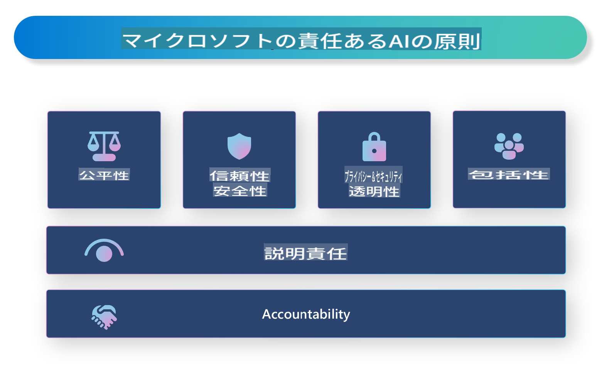

# **責任あるAIの導入**

[Microsoft Responsible AI](https://www.microsoft.com/ai/responsible-ai?WT.mc_id=aiml-138114-kinfeylo) は、透明性があり、信頼でき、説明責任を果たすAIシステムの構築を支援することを目的とした取り組みです。この取り組みは、プライバシー、公平性、透明性といった倫理原則に沿った責任あるAIソリューションの開発に向けたガイダンスやリソースを提供します。また、責任あるAIシステムの構築に関連する課題やベストプラクティスについても探っていきます。

## Microsoft Responsible AI の概要

**倫理原則**

Microsoft Responsible AI は、プライバシー、公平性、透明性、説明責任、安全性といった一連の倫理原則に基づいています。これらの原則は、AIシステムが倫理的かつ責任ある方法で開発されることを保証するために設計されています。

**透明性のあるAI**

Microsoft Responsible AI は、AIシステムにおける透明性の重要性を強調しています。これには、AIモデルがどのように機能するかについて明確な説明を提供することや、データソースやアルゴリズムを公開することが含まれます。

**説明責任のあるAI**

[Microsoft Responsible AI](https://www.microsoft.com/ai/responsible-ai?WT.mc_id=aiml-138114-kinfeylo) は、AIモデルがどのように意思決定を行うかについて洞察を提供できる説明責任のあるAIシステムの開発を推進しています。これにより、ユーザーがAIシステムの出力を理解し、信頼できるようになります。

**包摂性**

AIシステムは、すべての人々に利益をもたらすよう設計されるべきです。Microsoftは、多様な視点を考慮し、偏見や差別を回避する包括的なAIの構築を目指しています。

**信頼性と安全性**

AIシステムの信頼性と安全性を確保することは非常に重要です。Microsoftは、一貫したパフォーマンスを発揮し、有害な結果を回避する堅牢なモデルの構築に注力しています。

**AIの公平性**

Microsoft Responsible AI は、AIシステムが偏ったデータやアルゴリズムで訓練されると偏見を助長する可能性があることを認識しています。この取り組みは、人種、性別、年齢などの要因に基づいて差別を行わない公平なAIシステムの開発に向けたガイダンスを提供します。

**プライバシーとセキュリティ**

Microsoft Responsible AI は、AIシステムにおけるユーザープライバシーとデータセキュリティの保護の重要性を強調しています。これには、強力なデータ暗号化やアクセス制御の実施、AIシステムの脆弱性を定期的に監査することが含まれます。

**説明責任と責務**

Microsoft Responsible AI は、AIの開発と展開における説明責任と責務を推進しています。これには、開発者や組織がAIシステムに関連する潜在的なリスクを認識し、それらのリスクを軽減するための措置を講じることが含まれます。

## 責任あるAIシステム構築のベストプラクティス

**多様なデータセットを使用してAIモデルを開発する**

AIシステムの偏りを回避するためには、多様な視点や経験を反映したデータセットを使用することが重要です。

**説明可能なAI技術を使用する**

説明可能なAI技術は、AIモデルがどのように意思決定を行うかをユーザーが理解するのに役立ち、システムへの信頼を高めることができます。

**AIシステムを定期的に監査して脆弱性を特定する**

AIシステムを定期的に監査することで、対処が必要な潜在的なリスクや脆弱性を特定することができます。

**強力なデータ暗号化とアクセス制御を実施する**

データ暗号化とアクセス制御は、AIシステムにおけるユーザープライバシーとセキュリティを保護するのに役立ちます。

**AI開発において倫理原則を遵守する**

公平性、透明性、説明責任といった倫理原則を遵守することで、AIシステムへの信頼を構築し、責任ある方法で開発を進めることができます。

## AI Foundry を使用した責任あるAIの実現

[Azure AI Foundry](https://ai.azure.com?WT.mc_id=aiml-138114-kinfeylo) は、開発者や組織が迅速にインテリジェントで最先端の市場投入可能な責任あるアプリケーションを作成できる強力なプラットフォームです。以下は、Azure AI Foundry の主な機能と特徴です。

**すぐに使えるAPIとモデル**

Azure AI Foundry は、生成AI、会話のための自然言語処理、検索、モニタリング、翻訳、音声、画像認識、意思決定など、幅広いAIタスクをカバーする事前構築済みおよびカスタマイズ可能なAPIとモデルを提供します。

**プロンプトフロー**

Azure AI Foundry のプロンプトフローは、会話型AI体験を作成する機能を提供します。会話フローを設計および管理することで、チャットボットやバーチャルアシスタント、その他のインタラクティブなアプリケーションを簡単に構築できます。

**Retrieval Augmented Generation (RAG)**

RAGは、検索ベースと生成ベースのアプローチを組み合わせた技術です。既存の知識（検索）と創造的な生成（生成）の両方を活用することで、生成される応答の質を向上させます。

**生成AIの評価とモニタリング指標**

Azure AI Foundry は、生成AIモデルを評価およびモニタリングするためのツールを提供します。これにより、パフォーマンスや公平性などの重要な指標を評価し、責任ある展開を確保できます。また、ダッシュボードを作成した場合、Azure Machine Learning Studio のノーコードUIを使用して、[Responsible AI Toolbox](https://responsibleaitoolbox.ai/?WT.mc_id=aiml-138114-kinfeylo) Pythonライブラリを基に責任あるAIダッシュボードと関連するスコアカードをカスタマイズして生成できます。このスコアカードは、公平性や特徴の重要性など、責任ある展開に関する重要な洞察を技術者と非技術者の両方の関係者と共有するのに役立ちます。

責任あるAIのためにAI Foundryを使用する際は、次のベストプラクティスを遵守してください。

**AIシステムの問題と目的を定義する**

開発プロセスを開始する前に、AIシステムが解決しようとする問題や目的を明確に定義することが重要です。これにより、効果的なモデルを構築するために必要なデータ、アルゴリズム、リソースを特定するのに役立ちます。

**関連データを収集し前処理する**

AIシステムのパフォーマンスには、使用するデータの質と量が大きく影響します。そのため、関連するデータを収集し、クリーンアップし、前処理を行い、対象とする人口や問題を適切に反映していることを確認することが重要です。

**適切な評価アルゴリズムを選択する**

利用可能な評価アルゴリズムはさまざまです。データや問題に基づいて最適なアルゴリズムを選択することが重要です。

**モデルを評価し解釈する**

AIモデルを構築した後は、適切な指標を使用してそのパフォーマンスを評価し、結果を透明性のある方法で解釈することが重要です。これにより、モデルの偏りや限界を特定し、必要に応じて改善を行うことができます。

**透明性と説明可能性を確保する**

AIシステムは透明性があり説明可能であるべきです。これにより、ユーザーがシステムの仕組みや意思決定の方法を理解できるようになります。特に、医療、金融、法務といった人々の生活に大きな影響を与えるアプリケーションにおいては重要です。

**モデルをモニタリングし更新する**

AIシステムは、時間の経過とともに正確性と有効性を維持するために、継続的にモニタリングし更新する必要があります。これには、モデルの継続的なメンテナンス、テスト、再訓練が含まれます。

結論として、Microsoft Responsible AI は、透明性があり、信頼でき、説明責任を果たすAIシステムの構築を支援することを目的とした取り組みです。責任あるAIの実現は非常に重要であり、Azure AI Foundry は組織がこれを実践するための実用的なツールを提供します。倫理原則やベストプラクティスを遵守することで、社会全体に利益をもたらす責任ある方法でAIシステムを開発および展開することができます。

**免責事項**:  
この文書は、機械ベースのAI翻訳サービスを使用して翻訳されています。正確さを期すよう努めておりますが、自動翻訳には誤りや不正確な部分が含まれる場合があります。元の言語で作成された文書を公式な情報源と見なしてください。重要な情報については、専門の人間による翻訳をお勧めします。本翻訳の利用に起因する誤解や誤った解釈について、当方は一切の責任を負いません。