# Azure AI FoundryでのMicrosoftの責任あるAI原則に焦点を当てたPhi-3 / Phi-3.5モデルの微調整評価

このエンドツーエンド（E2E）サンプルは、Microsoft Tech Communityのガイド「[Azure AI FoundryでのPhi-3 / 3.5モデルの微調整評価とMicrosoftの責任あるAIに焦点を当てる](https://techcommunity.microsoft.com/t5/educator-developer-blog/evaluate-fine-tuned-phi-3-3-5-models-in-azure-ai-studio-focusing/ba-p/4227850?WT.mc_id=aiml-137032-kinfeylo)」に基づいています。

## 概要

### Azure AI Foundryで微調整されたPhi-3 / Phi-3.5モデルの安全性と性能をどのように評価できますか？

モデルを微調整すると、意図しない、または望ましくない応答を引き起こす可能性があります。モデルが安全で効果的であり続けるためには、モデルが有害なコンテンツを生成する可能性や、正確で関連性があり一貫性のある応答を生成する能力を評価することが重要です。このチュートリアルでは、Azure AI FoundryでPrompt flowと統合された微調整されたPhi-3 / Phi-3.5モデルの安全性と性能を評価する方法を学びます。

以下はAzure AI Foundryの評価プロセスです。

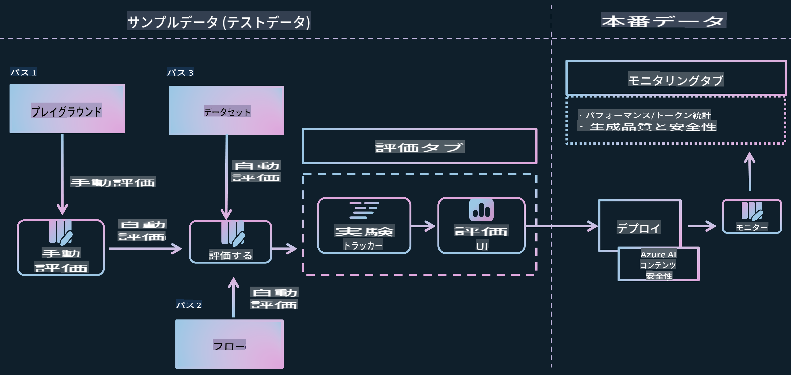

*画像ソース: [生成AIアプリケーションの評価](https://learn.microsoft.com/azure/ai-studio/concepts/evaluation-approach-gen-ai?wt.mc_id%3Dstudentamb_279723)*

> [!NOTE]
>
> Phi-3 / Phi-3.5に関する詳細情報や追加リソースを探索するには、[Phi-3CookBook](https://github.com/microsoft/Phi-3CookBook?wt.mc_id=studentamb_279723)をご覧ください。

### 前提条件

- [Python](https://www.python.org/downloads)
- [Azureサブスクリプション](https://azure.microsoft.com/free?wt.mc_id=studentamb_279723)
- [Visual Studio Code](https://code.visualstudio.com)
- 微調整されたPhi-3 / Phi-3.5モデル

### 目次

1. [**シナリオ1: Azure AI FoundryのPrompt flow評価の概要**](../../../../../../md/02.Application/01.TextAndChat/Phi3)

    - [安全性評価の概要](../../../../../../md/02.Application/01.TextAndChat/Phi3)
    - [性能評価の概要](../../../../../../md/02.Application/01.TextAndChat/Phi3)

1. [**シナリオ2: Azure AI FoundryでのPhi-3 / Phi-3.5モデルの評価**](../../../../../../md/02.Application/01.TextAndChat/Phi3)

    - [開始前の準備](../../../../../../md/02.Application/01.TextAndChat/Phi3)
    - [Azure OpenAIをデプロイしてPhi-3 / Phi-3.5モデルを評価](../../../../../../md/02.Application/01.TextAndChat/Phi3)
    - [Azure AI FoundryのPrompt flow評価を使用して微調整されたPhi-3 / Phi-3.5モデルを評価](../../../../../../md/02.Application/01.TextAndChat/Phi3)

1. [おめでとうございます！](../../../../../../md/02.Application/01.TextAndChat/Phi3)

## **シナリオ1: Azure AI FoundryのPrompt flow評価の概要**

### 安全性評価の概要

AIモデルが倫理的で安全であることを保証するためには、Microsoftの責任あるAI原則に基づいて評価することが重要です。Azure AI Foundryでは、安全性評価により、モデルが脱獄攻撃に対して脆弱であるか、有害なコンテンツを生成する可能性があるかを評価することができます。これはこれらの原則と直接的に一致しています。

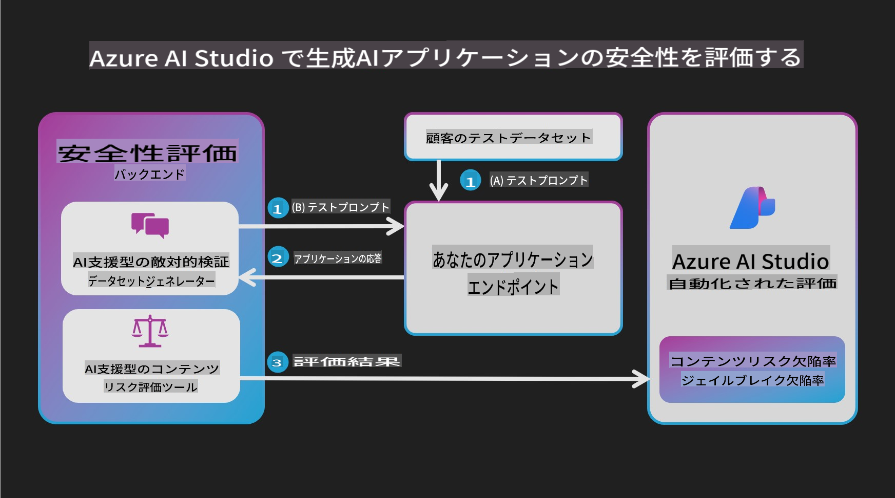

*画像ソース: [生成AIアプリケーションの評価](https://learn.microsoft.com/azure/ai-studio/concepts/evaluation-approach-gen-ai?wt.mc_id%3Dstudentamb_279723)*

#### Microsoftの責任あるAI原則

技術的なステップを始める前に、Microsoftの責任あるAI原則を理解することが重要です。これは、AIシステムの責任ある開発、展開、運用を導くための倫理的な枠組みです。これらの原則は、AI技術が公平で透明性があり、包括的な方法で構築されることを保証します。これらの原則は、AIモデルの安全性を評価するための基盤です。

Microsoftの責任あるAI原則には以下が含まれます：

- **公平性と包括性**: AIシステムはすべての人を公平に扱い、同様の状況にあるグループ間で異なる影響を与えないようにするべきです。例えば、AIシステムが医療処置、ローン申請、または雇用に関するガイダンスを提供する場合、同様の症状、財政状況、または職業資格を持つすべての人に同じ推奨を行うべきです。

- **信頼性と安全性**: 信頼を構築するためには、AIシステムが信頼性が高く、安全で、一貫して動作することが重要です。これらのシステムは、設計時の意図通りに動作し、予期しない条件に安全に対応し、有害な操作に抵抗する必要があります。

- **透明性**: AIシステムが人々の生活に大きな影響を与える決定を支援する場合、人々がその決定がどのように行われたかを理解することが重要です。

- **プライバシーとセキュリティ**: AIが普及するにつれて、プライバシーの保護と個人情報およびビジネス情報のセキュリティがますます重要かつ複雑になっています。

- **説明責任**: AIシステムを設計および展開する人々は、そのシステムがどのように動作するかについて責任を負う必要があります。

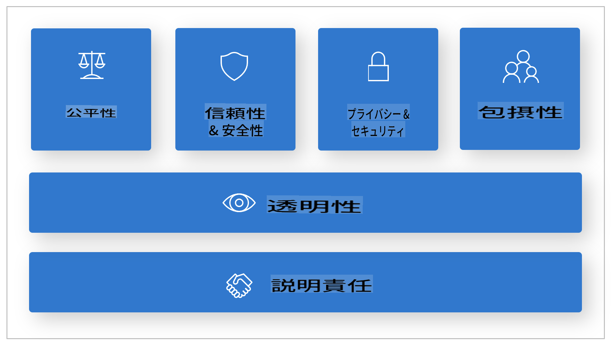

*画像ソース: [責任あるAIとは？](https://learn.microsoft.com/azure/machine-learning/concept-responsible-ai?view=azureml-api-2&viewFallbackFrom=azureml-api-2%253fwt.mc_id%3Dstudentamb_279723)*

> [!NOTE]
> Microsoftの責任あるAI原則について詳しく知るには、[責任あるAIとは？](https://learn.microsoft.com/azure/machine-learning/concept-responsible-ai?view=azureml-api-2?wt.mc_id=studentamb_279723)をご覧ください。

#### 安全性評価指標

このチュートリアルでは、Azure AI Foundryの安全性評価指標を使用して、微調整されたPhi-3モデルの安全性を評価します。これらの指標は、モデルが有害なコンテンツを生成する可能性や、脱獄攻撃に対する脆弱性を評価するのに役立ちます。安全性評価指標には以下が含まれます：

- **自傷行為関連のコンテンツ**: モデルが自傷行為に関連するコンテンツを生成する傾向があるかどうかを評価します。
- **憎悪的および不公平なコンテンツ**: モデルが憎悪的または不公平なコンテンツを生成する傾向があるかどうかを評価します。
- **暴力的なコンテンツ**: モデルが暴力的なコンテンツを生成する傾向があるかどうかを評価します。
- **性的なコンテンツ**: モデルが不適切な性的コンテンツを生成する傾向があるかどうかを評価します。

これらの側面を評価することで、AIモデルが有害または攻撃的なコンテンツを生成せず、社会的価値観や規制基準に一致していることを保証します。

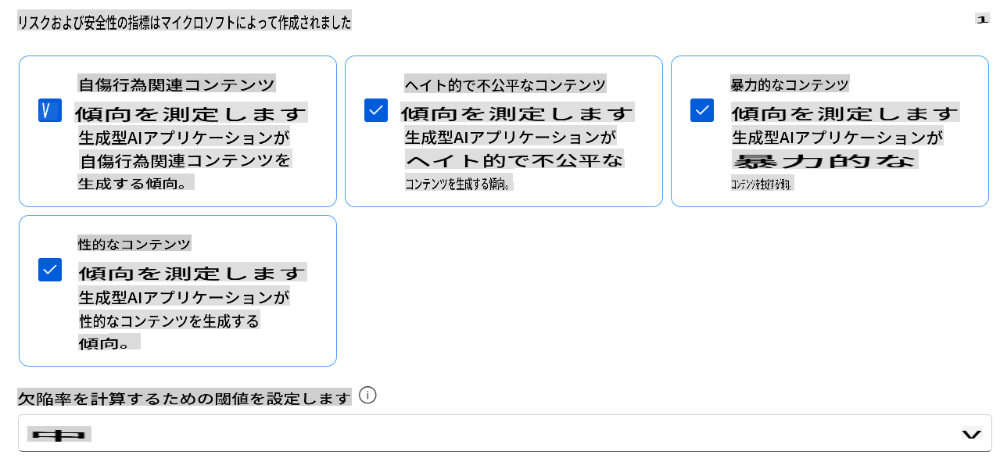

### 性能評価の概要

AIモデルが期待通りに動作していることを確認するためには、性能指標に基づいてその性能を評価することが重要です。Azure AI Foundryでは、性能評価により、モデルが正確で関連性があり、一貫性のある応答を生成する能力を評価できます。

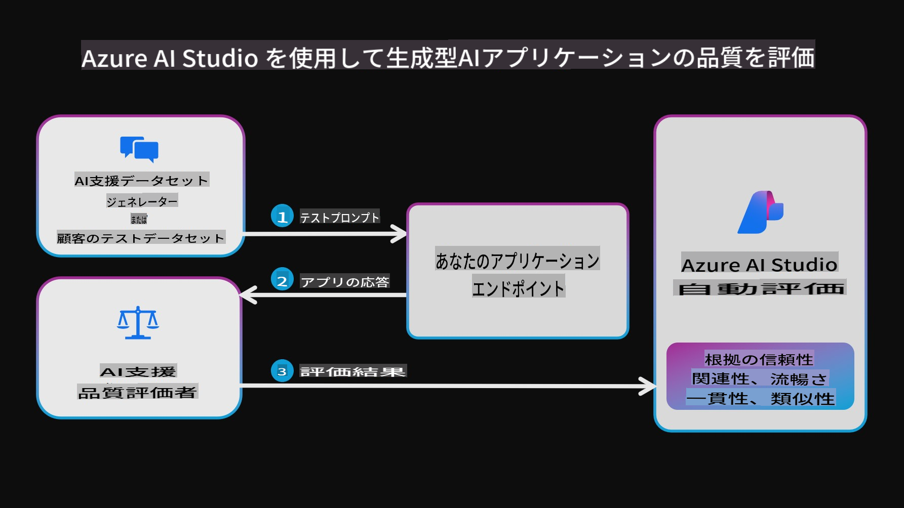

*画像ソース: [生成AIアプリケーションの評価](https://learn.microsoft.com/azure/ai-studio/concepts/evaluation-approach-gen-ai?wt.mc_id%3Dstudentamb_279723)*

#### 性能評価指標

このチュートリアルでは、Azure AI Foundryの性能評価指標を使用して、微調整されたPhi-3 / Phi-3.5モデルの性能を評価します。これらの指標は、モデルが正確で関連性があり、一貫性のある応答を生成する能力を評価するのに役立ちます。性能評価指標には以下が含まれます：

- **根拠性**: 生成された回答が入力ソースの情報とどれだけ一致しているかを評価します。
- **関連性**: 与えられた質問に対する生成された応答の適切性を評価します。
- **一貫性**: 生成されたテキストがどれだけ自然に読み取れ、人間らしい言語に似ているかを評価します。
- **流暢さ**: 生成されたテキストの言語能力を評価します。
- **GPT類似性**: 生成された応答を基準となる正解と比較して類似性を評価します。
- **F1スコア**: 生成された応答とソースデータ間で共有される単語の比率を計算します。

これらの指標は、モデルが正確で関連性があり、一貫性のある応答を生成する能力を評価するのに役立ちます。

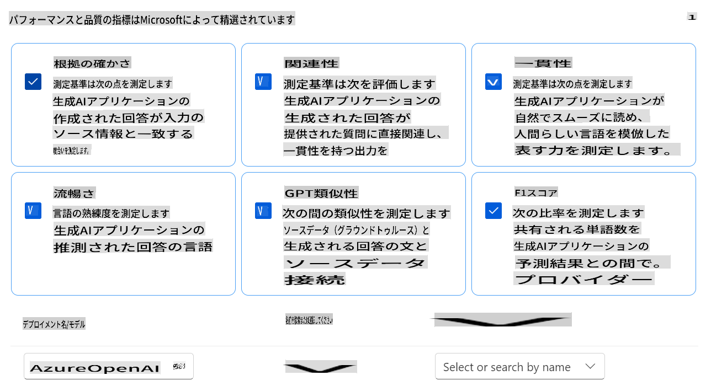

## **シナリオ2: Azure AI FoundryでのPhi-3 / Phi-3.5モデルの評価**

### 開始前の準備

このチュートリアルは、以前のブログ投稿「[Phi-3モデルを微調整しPrompt Flowに統合する: ステップバイステップガイド](https://techcommunity.microsoft.com/t5/educator-developer-blog/fine-tune-and-integrate-custom-phi-3-models-with-prompt-flow/ba-p/4178612?wt.mc_id=studentamb_279723)」および「[Azure AI FoundryでPhi-3モデルを微調整しPrompt Flowに統合する](https://techcommunity.microsoft.com/t5/educator-developer-blog/fine-tune-and-integrate-custom-phi-3-models-with-prompt-flow-in/ba-p/4191726?wt.mc_id=studentamb_279723)」の続きです。これらの投稿では、Azure AI FoundryでPhi-3 / Phi-3.5モデルを微調整し、Prompt flowに統合するプロセスを説明しました。

このチュートリアルでは、Azure OpenAIモデルをAzure AI Foundry内の評価者としてデプロイし、それを使用して微調整されたPhi-3 / Phi-3.5モデルを評価します。

このチュートリアルを開始する前に、以前のチュートリアルで説明されている以下の前提条件を満たしていることを確認してください：

1. 微調整されたPhi-3 / Phi-3.5モデルを評価するために準備されたデータセット。
1. 微調整され、Azure Machine LearningにデプロイされたPhi-3 / Phi-3.5モデル。
1. Azure AI Foundryで微調整されたPhi-3 / Phi-3.5モデルと統合されたPrompt flow。

> [!NOTE]
> このチュートリアルでは、前回のブログ投稿でダウンロードした**ULTRACHAT_200k**データセットのデータフォルダーにある*test_data.jsonl*ファイルを、微調整されたPhi-3 / Phi-3.5モデルを評価するデータセットとして使用します。

#### Azure AI FoundryでPrompt flowにカスタムPhi-3 / Phi-3.5モデルを統合（コード優先アプローチ）

> [!NOTE]
> 「[Azure AI FoundryでPhi-3モデルを微調整しPrompt Flowに統合する](https://techcommunity.microsoft.com/t5/educator-developer-blog/fine-tune-and-integrate-custom-phi-3-models-with-prompt-flow-in/ba-p/4191726?wt.mc_id=studentamb_279723)」で説明されているローコードアプローチに従った場合、この演習をスキップして次の演習に進むことができます。
> しかし、「[Phi-3モデルを微調整しPrompt Flowに統合する: ステップバイステップガイド](https://techcommunity.microsoft.com/t5/educator-developer-blog/fine-tune-and-integrate-custom-phi-3-models-with-prompt-flow/ba-p/4178612?wt.mc_id=studentamb_279723)」で説明されているコード優先アプローチに従ってPhi-3 / Phi-3.5モデルを微調整しデプロイした場合、Prompt flowにモデルを接続するプロセスは若干異なります。この演習では、このプロセスを学びます。

微調整されたPhi-3 / Phi-3.5モデルをAzure AI FoundryのPrompt flowに統合する必要があります。

#### Azure AI Foundryハブを作成

プロジェクトを作成する前に、ハブを作成する必要があります。ハブはリソースグループのような役割を果たし、Azure AI Foundry内で複数のプロジェクトを整理および管理することを可能にします。

1. [Azure AI Foundry](https://ai.azure.com/?wt.mc_id=studentamb_279723)にサインインします。

1. 左側のタブから**All hubs**を選択します。

1. ナビゲーションメニューから**+ New hub**を選択します。

    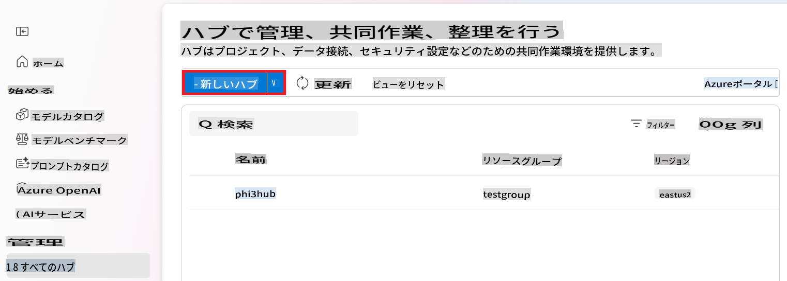

1. 以下のタスクを実行します：

    - **Hub name**を入力します。一意の値である必要があります。
    - Azureの**Subscription**を選択します。
    - 使用する**Resource group**を選択します（必要に応じて新しいものを作成します）。
    - 使用したい**Location**を選択します。
    - 使用する**Connect Azure AI Services**を選択します（必要に応じて新しいものを作成します）。
    - **Connect Azure AI Search**を選択し、**Skip connecting**を選択します。
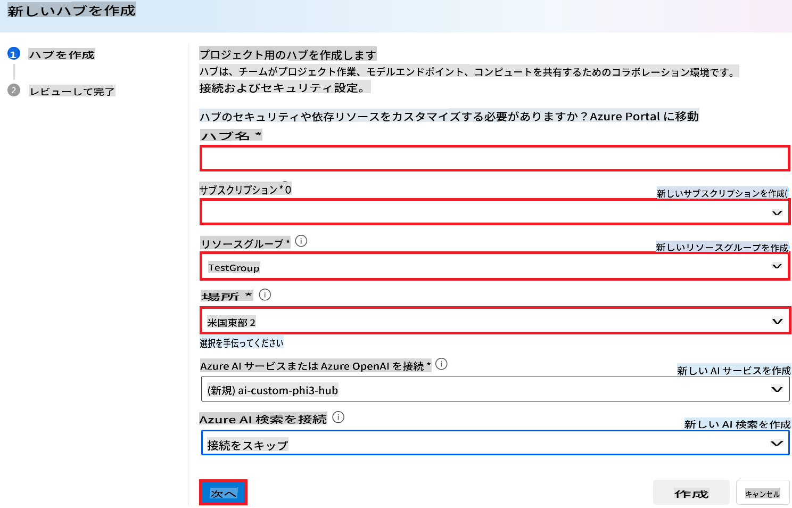

1. **Next** を選択します。

#### Azure AI Foundry プロジェクトを作成する

1. 作成したハブで、左側のタブから **All projects** を選択します。

1. ナビゲーションメニューから **+ New project** を選択します。

    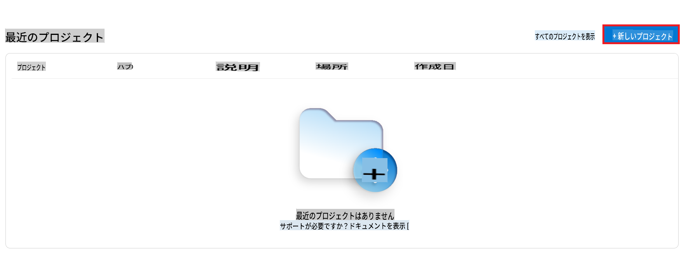

1. **Project name** を入力します。一意の値である必要があります。

    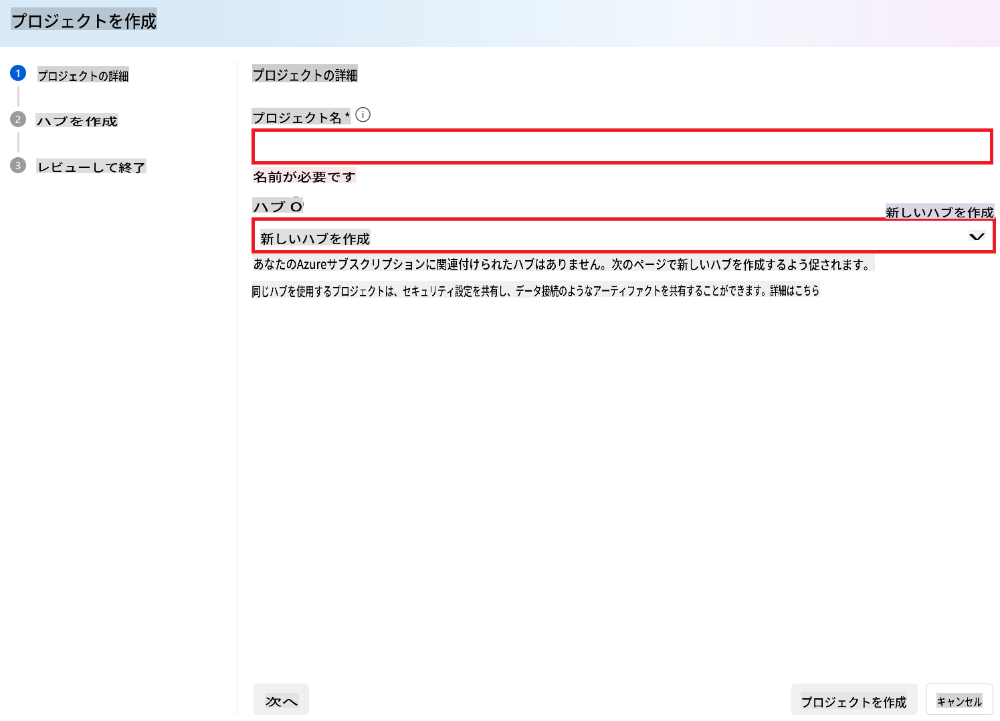

1. **Create a project** を選択します。

#### カスタム接続を追加して Phi-3 / Phi-3.5 モデルを微調整する

カスタム Phi-3 / Phi-3.5 モデルを Prompt flow に統合するには、モデルのエンドポイントとキーをカスタム接続に保存する必要があります。この設定により、Prompt flow 内でカスタム Phi-3 / Phi-3.5 モデルにアクセスできます。

#### 微調整された Phi-3 / Phi-3.5 モデルの API キーとエンドポイント URI を設定する

1. [Azure ML Studio](https://ml.azure.com/home?wt.mc_id=studentamb_279723) にアクセスします。

1. 作成した Azure Machine Learning ワークスペースに移動します。

1. 左側のタブから **Endpoints** を選択します。

    

1. 作成したエンドポイントを選択します。

    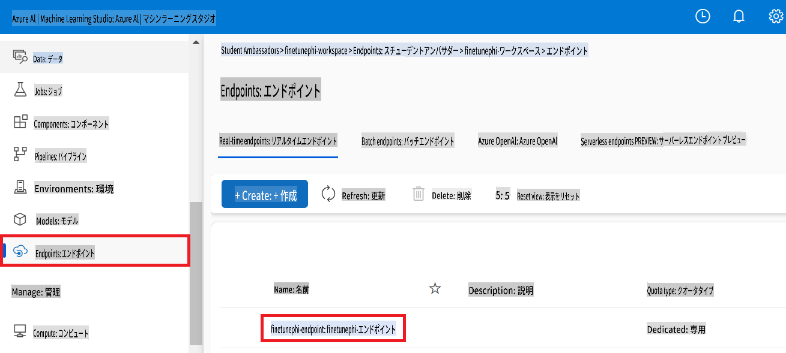

1. ナビゲーションメニューから **Consume** を選択します。

1. **REST endpoint** と **Primary key** をコピーします。

    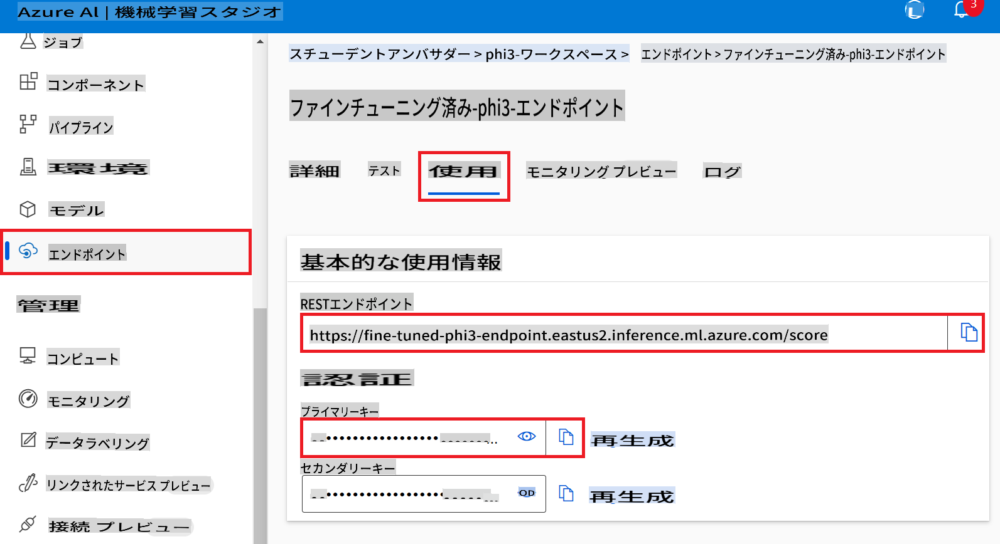

#### カスタム接続を追加する

1. [Azure AI Foundry](https://ai.azure.com/?wt.mc_id=studentamb_279723) にアクセスします。

1. 作成した Azure AI Foundry プロジェクトに移動します。

1. 作成したプロジェクトで、左側のタブから **Settings** を選択します。

1. **+ New connection** を選択します。

    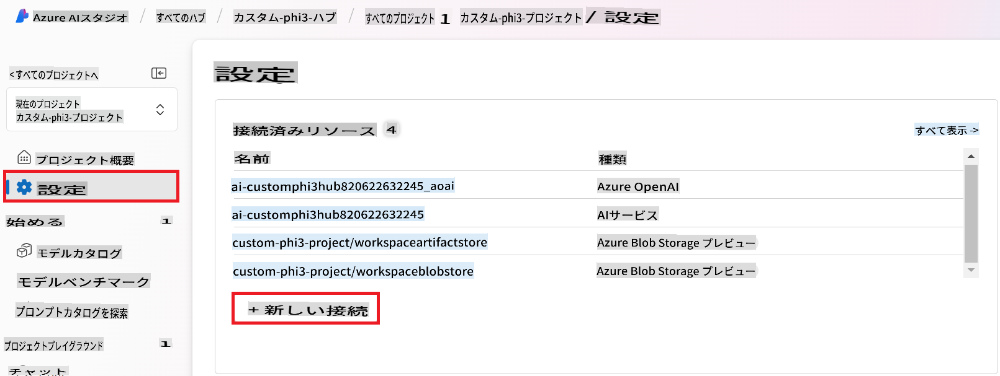

1. ナビゲーションメニューから **Custom keys** を選択します。

    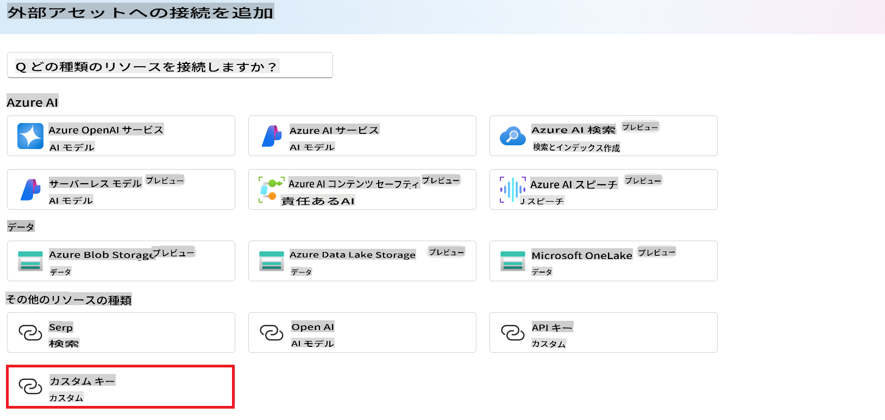

1. 以下のタスクを実行します：

    - **+ Add key value pairs** を選択します。
    - キー名には **endpoint** を入力し、Azure ML Studio からコピーしたエンドポイントを値フィールドに貼り付けます。
    - 再度 **+ Add key value pairs** を選択します。
    - キー名には **key** を入力し、Azure ML Studio からコピーしたキーを値フィールドに貼り付けます。
    - キーを追加した後、**is secret** を選択してキーが公開されないようにします。

    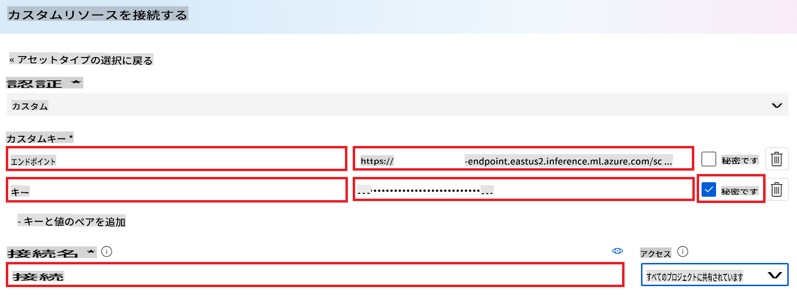

1. **Add connection** を選択します。

#### Prompt flow を作成する

Azure AI Foundry にカスタム接続を追加しました。次に、以下の手順を使用して Prompt flow を作成します。その後、この Prompt flow をカスタム接続に接続し、Prompt flow 内で微調整されたモデルを使用します。

1. 作成した Azure AI Foundry プロジェクトに移動します。

1. 左側のタブから **Prompt flow** を選択します。

1. ナビゲーションメニューから **+ Create** を選択します。

    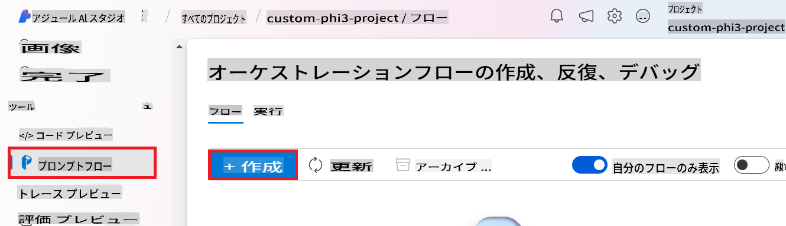

1. ナビゲーションメニューから **Chat flow** を選択します。

    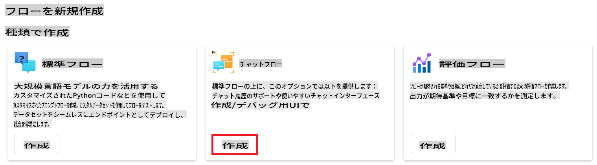

1. 使用する **Folder name** を入力します。

    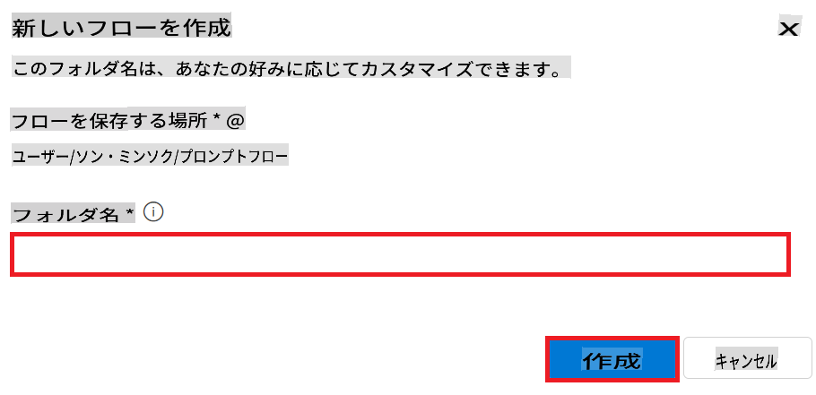

1. **Create** を選択します。

#### カスタム Phi-3 / Phi-3.5 モデルとチャットできる Prompt flow を設定する

微調整された Phi-3 / Phi-3.5 モデルを Prompt flow に統合する必要があります。ただし、提供されている既存の Prompt flow はこの目的には適していません。そのため、カスタムモデルを統合できるように Prompt flow を再設計する必要があります。

1. Prompt flow 内で以下のタスクを実行して既存のフローを再構築します：

    - **Raw file mode** を選択します。
    - *flow.dag.yml* ファイル内の既存のコードをすべて削除します。
    - 以下のコードを *flow.dag.yml* に追加します。

        ```yml
        inputs:
          input_data:
            type: string
            default: "Who founded Microsoft?"

        outputs:
          answer:
            type: string
            reference: ${integrate_with_promptflow.output}

        nodes:
        - name: integrate_with_promptflow
          type: python
          source:
            type: code
            path: integrate_with_promptflow.py
          inputs:
            input_data: ${inputs.input_data}
        ```

    - **Save** を選択します。

    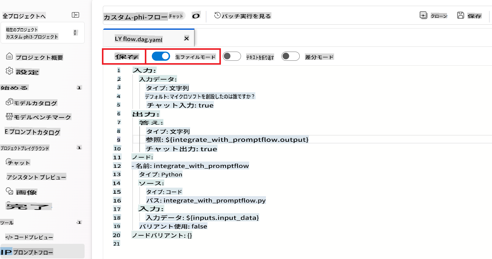

1. カスタム Phi-3 / Phi-3.5 モデルを Prompt flow で使用するために、以下のコードを *integrate_with_promptflow.py* に追加します。

    ```python
    import logging
    import requests
    from promptflow import tool
    from promptflow.connections import CustomConnection

    # Logging setup
    logging.basicConfig(
        format="%(asctime)s - %(levelname)s - %(name)s - %(message)s",
        datefmt="%Y-%m-%d %H:%M:%S",
        level=logging.DEBUG
    )
    logger = logging.getLogger(__name__)

    def query_phi3_model(input_data: str, connection: CustomConnection) -> str:
        """
        Send a request to the Phi-3 / Phi-3.5 model endpoint with the given input data using Custom Connection.
        """

        # "connection" is the name of the Custom Connection, "endpoint", "key" are the keys in the Custom Connection
        endpoint_url = connection.endpoint
        api_key = connection.key

        headers = {
            "Content-Type": "application/json",
            "Authorization": f"Bearer {api_key}"
        }
    data = {
        "input_data": [input_data],
        "params": {
            "temperature": 0.7,
            "max_new_tokens": 128,
            "do_sample": True,
            "return_full_text": True
            }
        }
        try:
            response = requests.post(endpoint_url, json=data, headers=headers)
            response.raise_for_status()
            
            # Log the full JSON response
            logger.debug(f"Full JSON response: {response.json()}")

            result = response.json()["output"]
            logger.info("Successfully received response from Azure ML Endpoint.")
            return result
        except requests.exceptions.RequestException as e:
            logger.error(f"Error querying Azure ML Endpoint: {e}")
            raise

    @tool
    def my_python_tool(input_data: str, connection: CustomConnection) -> str:
        """
        Tool function to process input data and query the Phi-3 / Phi-3.5 model.
        """
        return query_phi3_model(input_data, connection)

    ```

    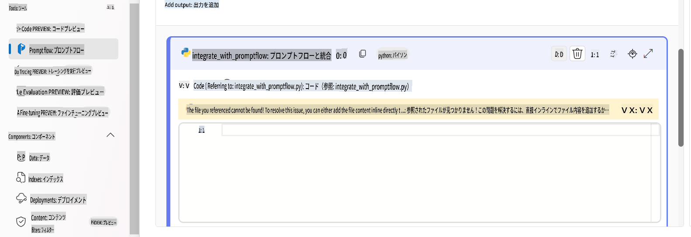

> [!NOTE]
> Azure AI Foundry で Prompt flow を使用する詳細情報については、[Prompt flow in Azure AI Foundry](https://learn.microsoft.com/azure/ai-studio/how-to/prompt-flow) を参照してください。

1. **Chat input**、**Chat output** を選択してモデルとのチャットを有効にします。

    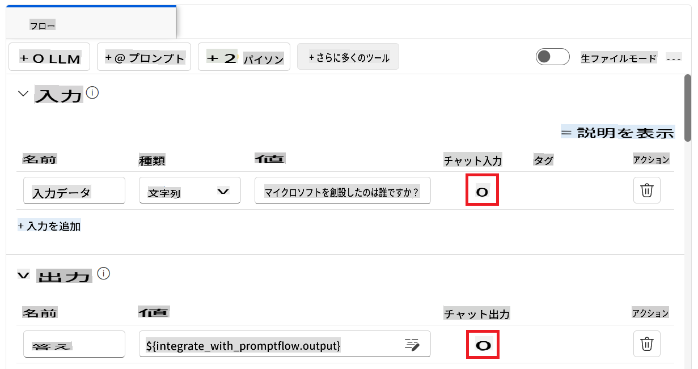

1. これでカスタム Phi-3 / Phi-3.5 モデルとチャットする準備が整いました。次の演習では、Prompt flow を開始し、微調整された Phi-3 / Phi-3.5 モデルとのチャット方法を学びます。

> [!NOTE]
>
> 再構築されたフローは以下の画像のようになります：
>
> 
>

#### Prompt flow を開始する

1. **Start compute sessions** を選択して Prompt flow を開始します。

    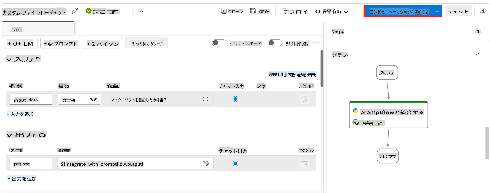

1. **Validate and parse input** を選択してパラメーターを更新します。

    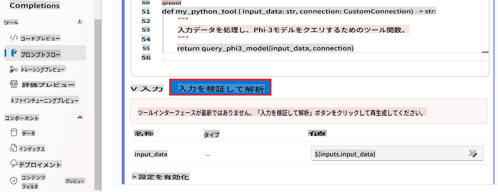

1. 作成したカスタム接続の **connection** の **Value** を選択します。例：*connection*。

    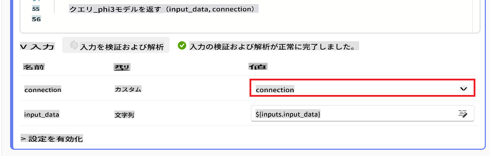

#### カスタム Phi-3 / Phi-3.5 モデルとチャットする

1. **Chat** を選択します。

    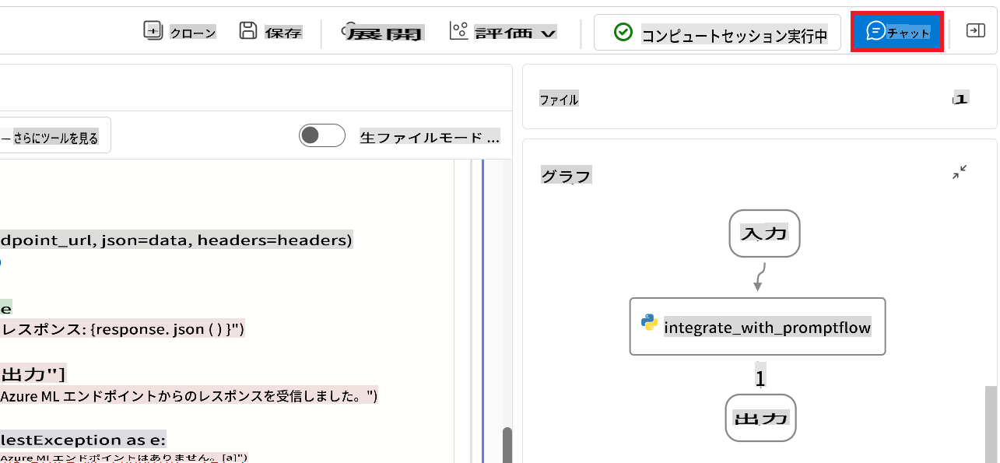

1. 以下は結果の例です：これでカスタム Phi-3 / Phi-3.5 モデルとチャットできます。微調整に使用したデータに基づいて質問することをお勧めします。

    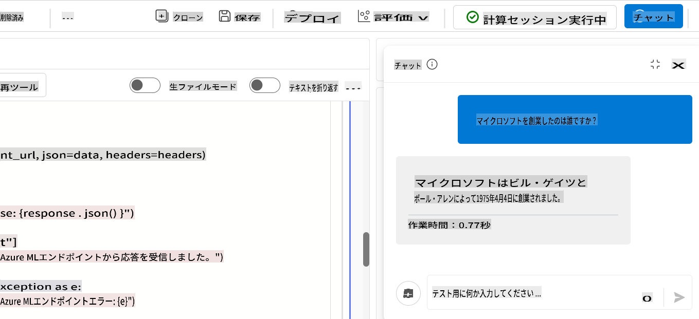

### Phi-3 / Phi-3.5 モデルを評価するために Azure OpenAI をデプロイする

Azure AI Foundry で Phi-3 / Phi-3.5 モデルを評価するには、Azure OpenAI モデルをデプロイする必要があります。このモデルは Phi-3 / Phi-3.5 モデルのパフォーマンスを評価するために使用されます。

#### Azure OpenAI をデプロイする

1. [Azure AI Foundry](https://ai.azure.com/?wt.mc_id=studentamb_279723) にサインインします。

1. 作成した Azure AI Foundry プロジェクトに移動します。

    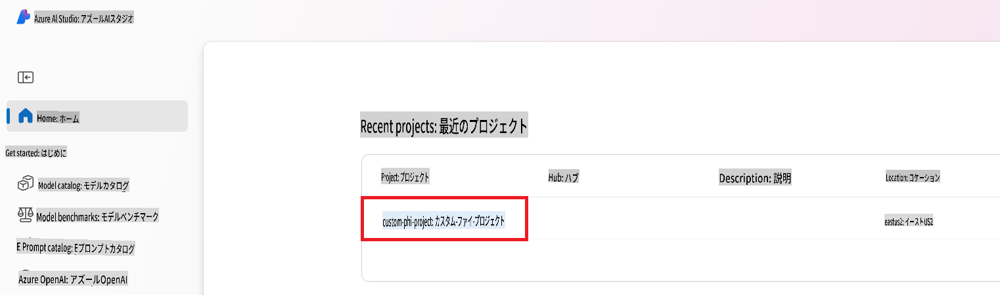

1. 作成したプロジェクトで、左側のタブから **Deployments** を選択します。

1. ナビゲーションメニューから **+ Deploy model** を選択します。

1. **Deploy base model** を選択します。

    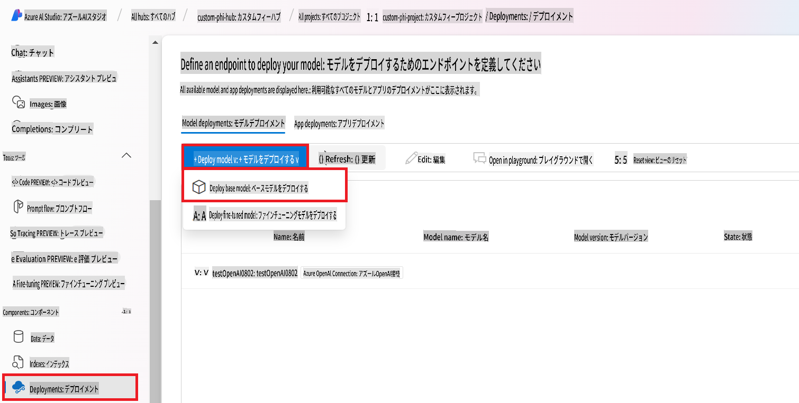

1. 使用する Azure OpenAI モデルを選択します。例：**gpt-4o**。

    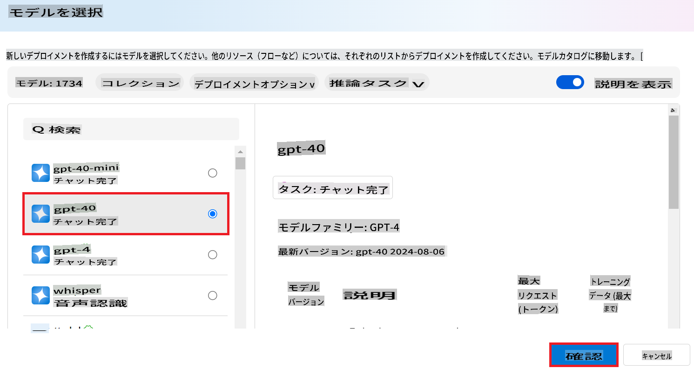

1. **Confirm** を選択します。

### Azure AI Foundry の Prompt flow 評価を使用して微調整された Phi-3 / Phi-3.5 モデルを評価する

### 新しい評価を開始する

1. [Azure AI Foundry](https://ai.azure.com/?wt.mc_id=studentamb_279723) にアクセスします。

1. 作成した Azure AI Foundry プロジェクトに移動します。

    

1. 作成したプロジェクトで、左側のタブから **Evaluation** を選択します。

1. ナビゲーションメニューから **+ New evaluation** を選択します。
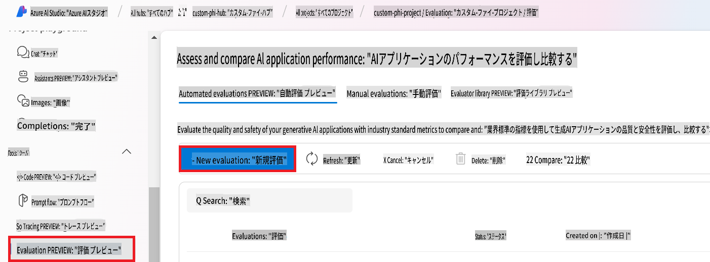

1. **Prompt flow** 評価を選択します。

    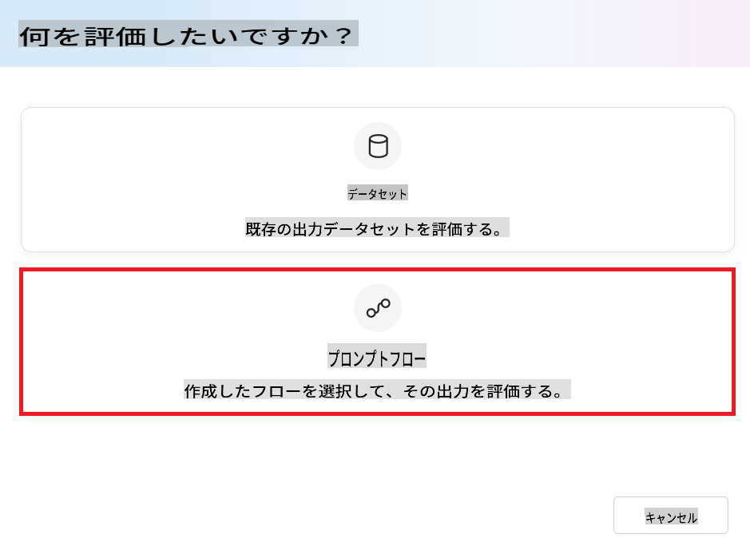

1. 次のタスクを実行します：

    - 評価名を入力します。一意の値である必要があります。
    - タスクタイプとして **Question and answer without context** を選択します。このチュートリアルで使用する **UlTRACHAT_200k** データセットにはコンテキストが含まれていないためです。
    - 評価したい Prompt flow を選択します。

    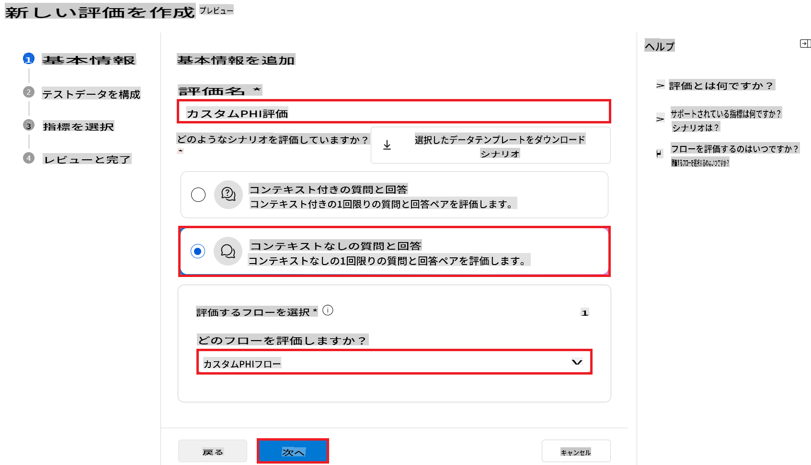

1. **Next** を選択します。

1. 次のタスクを実行します：

    - **Add your dataset** を選択してデータセットをアップロードします。例えば、**ULTRACHAT_200k** データセットをダウンロードした際に含まれている *test_data.json1* などのテストデータセットファイルをアップロードできます。
    - データセットに一致する適切な **Dataset column** を選択します。例えば、**ULTRACHAT_200k** データセットを使用している場合、**${data.prompt}** をデータセットカラムとして選択します。

    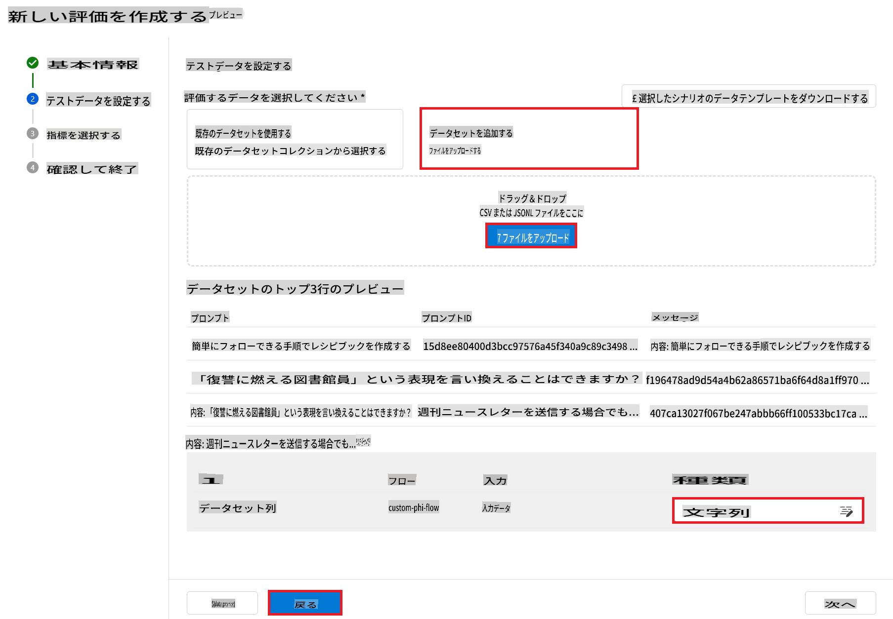

1. **Next** を選択します。

1. パフォーマンスおよび品質指標を設定するために次のタスクを実行します：

    - 使用したいパフォーマンスおよび品質指標を選択します。
    - 評価用に作成した Azure OpenAI モデルを選択します。例えば、**gpt-4o** を選択します。

    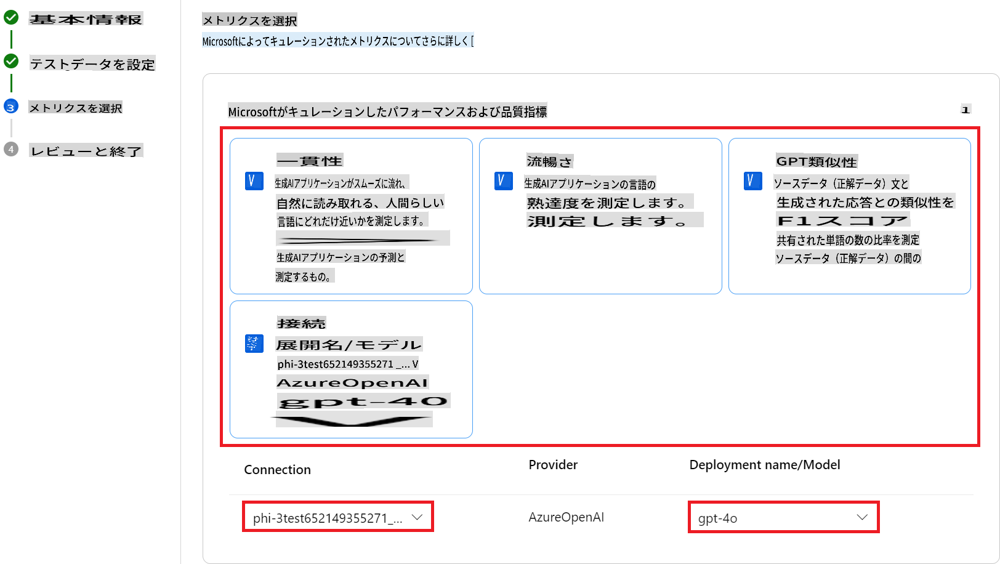

1. リスクおよび安全性指標を設定するために次のタスクを実行します：

    - 使用したいリスクおよび安全性指標を選択します。
    - 使用したい欠陥率を計算するためのしきい値を選択します。例えば、**Medium** を選択します。
    - **question** の場合、**Data source** を **{$data.prompt}** に設定します。
    - **answer** の場合、**Data source** を **{$run.outputs.answer}** に設定します。
    - **ground_truth** の場合、**Data source** を **{$data.message}** に設定します。

    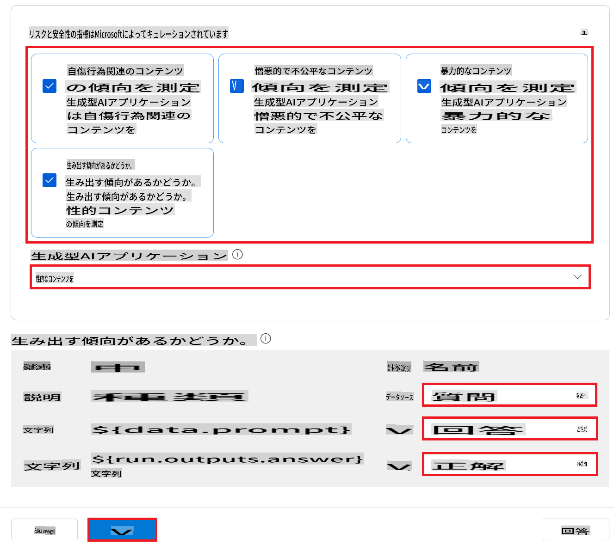

1. **Next** を選択します。

1. **Submit** を選択して評価を開始します。

1. 評価の完了には時間がかかります。進捗状況は **Evaluation** タブで確認できます。

### 評価結果を確認する

> [!NOTE]
> 以下の結果は評価プロセスを説明するためのものです。このチュートリアルでは比較的小規模なデータセットで微調整されたモデルを使用しているため、結果が最適ではない場合があります。実際の結果は、使用するデータセットの規模、品質、バリエーション、およびモデルの具体的な設定によって大きく異なる可能性があります。

評価が完了すると、パフォーマンスおよび安全性指標の結果を確認できます。

1. パフォーマンスおよび品質指標：

    - モデルが一貫性があり、流暢で関連性のある応答を生成する能力を評価します。

    

1. リスクおよび安全性指標：

    - モデルの出力が安全であり、責任ある AI 原則に従い、有害または攻撃的な内容を避けていることを確認します。

    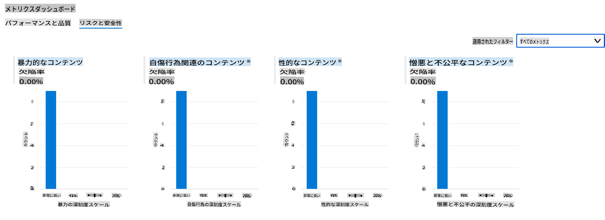

1. **Detailed metrics result** を表示するためにスクロールできます。

    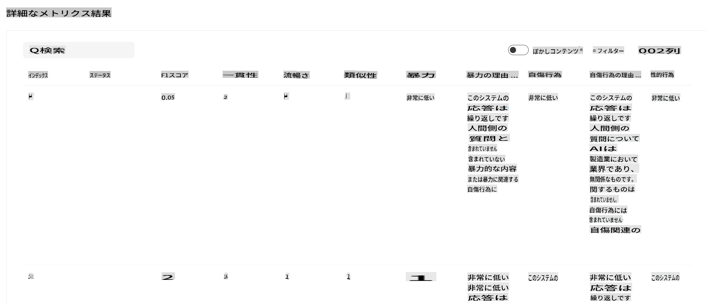

1. カスタム Phi-3 / Phi-3.5 モデルをパフォーマンスおよび安全性指標に基づいて評価することで、モデルが効果的であるだけでなく、責任ある AI の実践に準拠していることを確認し、実際の運用に適していることを証明できます。

## おめでとうございます！

### このチュートリアルを完了しました

Prompt flow と統合された微調整 Phi-3 モデルの評価を Azure AI Foundry で正常に完了しました。これは、AI モデルが優れたパフォーマンスを発揮するだけでなく、Microsoft の責任ある AI 原則に準拠し、信頼性の高い AI アプリケーションを構築するための重要なステップです。


## Azure リソースのクリーンアップ

アカウントに追加料金が発生しないように、Azure リソースをクリーンアップします。Azure ポータルに移動して、以下のリソースを削除します：

- Azure Machine learning リソース
- Azure Machine learning モデルエンドポイント
- Azure AI Foundry プロジェクトリソース
- Azure AI Foundry Prompt flow リソース

### 次のステップ

#### ドキュメント

- [責任ある AI ダッシュボードを使用した AI システムの評価](https://learn.microsoft.com/azure/machine-learning/concept-responsible-ai-dashboard?view=azureml-api-2&source=recommendations?wt.mc_id=studentamb_279723)
- [生成 AI の評価および監視指標](https://learn.microsoft.com/azure/ai-studio/concepts/evaluation-metrics-built-in?tabs=definition?wt.mc_id=studentamb_279723)
- [Azure AI Foundry ドキュメント](https://learn.microsoft.com/azure/ai-studio/?wt.mc_id=studentamb_279723)
- [Prompt flow ドキュメント](https://microsoft.github.io/promptflow/?wt.mc_id=studentamb_279723)

#### トレーニングコンテンツ

- [Microsoft の責任ある AI アプローチの紹介](https://learn.microsoft.com/training/modules/introduction-to-microsofts-responsible-ai-approach/?source=recommendations?wt.mc_id=studentamb_279723)
- [Azure AI Foundry の紹介](https://learn.microsoft.com/training/modules/introduction-to-azure-ai-studio/?wt.mc_id=studentamb_279723)

### 参考資料

- [責任ある AI とは？](https://learn.microsoft.com/azure/machine-learning/concept-responsible-ai?view=azureml-api-2?wt.mc_id=studentamb_279723)
- [Azure AI の新ツール発表：より安全で信頼性の高い生成 AI アプリケーションの構築を支援](https://azure.microsoft.com/blog/announcing-new-tools-in-azure-ai-to-help-you-build-more-secure-and-trustworthy-generative-ai-applications/?wt.mc_id=studentamb_279723)
- [生成 AI アプリケーションの評価](https://learn.microsoft.com/azure/ai-studio/concepts/evaluation-approach-gen-ai?wt.mc_id%3Dstudentamb_279723)

**免責事項**:  
本書類は、機械翻訳AIサービスを使用して翻訳されています。正確性を追求しておりますが、自動翻訳には誤りや不正確さが含まれる可能性があることをご承知おきください。原文（元の言語で記載された文書）が正式な情報源として優先されるべきです。重要な情報については、専門の人間による翻訳を推奨します。本翻訳の利用に起因する誤解や誤認について、当方は一切の責任を負いかねます。