# Phi-3モデルのカスタムチューニングとPrompt flowへの統合

このエンドツーエンド（E2E）サンプルは、Microsoft Tech Communityのガイド「[Fine-Tune and Integrate Custom Phi-3 Models with Prompt Flow: Step-by-Step Guide](https://techcommunity.microsoft.com/t5/educator-developer-blog/fine-tune-and-integrate-custom-phi-3-models-with-prompt-flow/ba-p/4178612?WT.mc_id=aiml-137032-kinfeylo)」に基づいています。このガイドでは、Phi-3モデルのカスタムチューニング、デプロイ、Prompt flowとの統合のプロセスを紹介します。

## 概要

このE2Eサンプルでは、Phi-3モデルのチューニング方法とPrompt flowとの統合方法を学びます。Azure Machine LearningとPrompt flowを活用して、カスタムAIモデルをデプロイして利用するためのワークフローを確立します。このE2Eサンプルは以下の3つのシナリオに分かれています：

**シナリオ1: Azureリソースのセットアップとチューニング準備**

**シナリオ2: Phi-3モデルのチューニングとAzure Machine Learning Studioでのデプロイ**

**シナリオ3: Prompt flowとの統合とカスタムモデルとのチャット**

以下はこのE2Eサンプルの概要です。

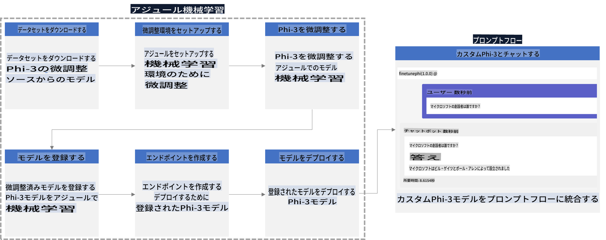

### 目次

1. **[シナリオ1: Azureリソースのセットアップとチューニング準備](../../../../../../md/02.Application/01.TextAndChat/Phi3)**
    - [Azure Machine Learningワークスペースの作成](../../../../../../md/02.Application/01.TextAndChat/Phi3)
    - [AzureサブスクリプションでのGPUクォータのリクエスト](../../../../../../md/02.Application/01.TextAndChat/Phi3)
    - [ロール割り当ての追加](../../../../../../md/02.Application/01.TextAndChat/Phi3)
    - [プロジェクトのセットアップ](../../../../../../md/02.Application/01.TextAndChat/Phi3)
    - [チューニング用データセットの準備](../../../../../../md/02.Application/01.TextAndChat/Phi3)

1. **[シナリオ2: Phi-3モデルのチューニングとAzure Machine Learning Studioでのデプロイ](../../../../../../md/02.Application/01.TextAndChat/Phi3)**
    - [Azure CLIのセットアップ](../../../../../../md/02.Application/01.TextAndChat/Phi3)
    - [Phi-3モデルのチューニング](../../../../../../md/02.Application/01.TextAndChat/Phi3)
    - [チューニング済みモデルのデプロイ](../../../../../../md/02.Application/01.TextAndChat/Phi3)

1. **[シナリオ3: Prompt flowとの統合とカスタムモデルとのチャット](../../../../../../md/02.Application/01.TextAndChat/Phi3)**
    - [カスタムPhi-3モデルをPrompt flowに統合](../../../../../../md/02.Application/01.TextAndChat/Phi3)
    - [カスタムモデルとのチャット](../../../../../../md/02.Application/01.TextAndChat/Phi3)

## シナリオ1: Azureリソースのセットアップとチューニング準備

### Azure Machine Learningワークスペースの作成

1. ポータルページ上部の**検索バー**に「*azure machine learning*」と入力し、表示されるオプションから**Azure Machine Learning**を選択します。

    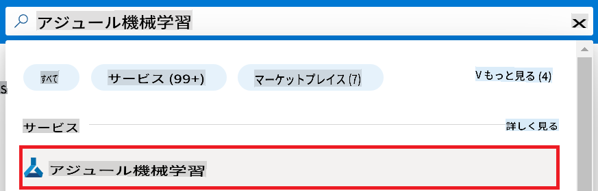

1. **+ Create**を選択します。

1. ナビゲーションメニューから**New workspace**を選択します。

    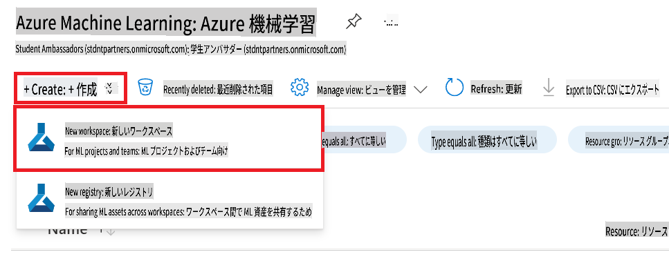

1. 次のタスクを実行します：

    - Azure **Subscription**を選択します。
    - 使用する**Resource group**を選択します（必要に応じて新規作成）。
    - **Workspace Name**を入力します。一意の値である必要があります。
    - 使用する**Region**を選択します。
    - 使用する**Storage account**を選択します（必要に応じて新規作成）。
    - 使用する**Key vault**を選択します（必要に応じて新規作成）。
    - 使用する**Application insights**を選択します（必要に応じて新規作成）。
    - 使用する**Container registry**を選択します（必要に応じて新規作成）。

    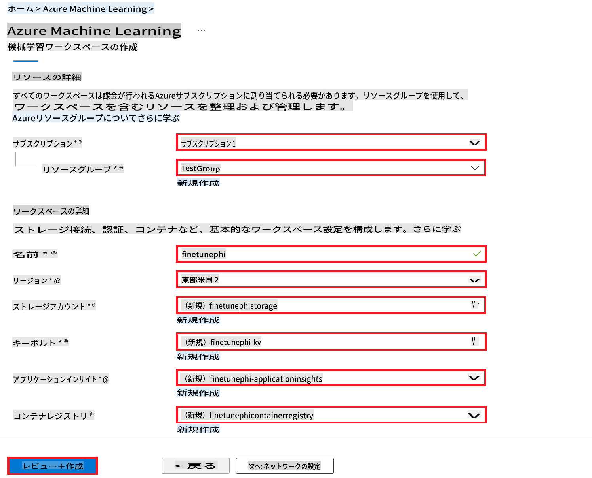

1. **Review + Create**を選択します。

1. **Create**を選択します。

### AzureサブスクリプションでのGPUクォータのリクエスト

このE2Eサンプルでは、チューニングには*Standard_NC24ads_A100_v4 GPU*を使用し（クォータリクエストが必要）、デプロイには*Standard_E4s_v3* CPUを使用します（クォータリクエストは不要）。

> [!NOTE]
>
> GPU割り当てが可能なのはPay-As-You-Goサブスクリプション（標準サブスクリプションタイプ）のみです。特典サブスクリプションは現在サポートされていません。
>
> 特典サブスクリプション（例: Visual Studio Enterprise Subscription）を使用している場合や、チューニングおよびデプロイプロセスを迅速にテストしたい場合、このチュートリアルではCPUを使用して最小データセットでチューニングする方法も提供します。ただし、大規模なデータセットでGPUを使用する方がチューニング結果が大幅に向上します。

1. [Azure ML Studio](https://ml.azure.com/home?wt.mc_id=studentamb_279723)にアクセスします。

1. *Standard NCADSA100v4 Family*クォータをリクエストするために次のタスクを実行します：

    - 左側のタブから**Quota**を選択します。
    - 使用する**Virtual machine family**を選択します。例: **Standard NCADSA100v4 Family Cluster Dedicated vCPUs**（*Standard_NC24ads_A100_v4* GPUを含む）。
    - ナビゲーションメニューから**Request quota**を選択します。

        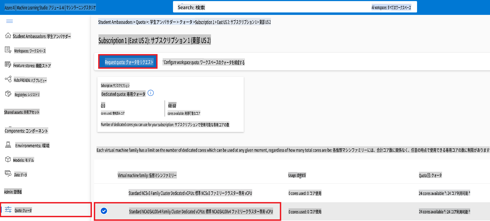

    - Request quotaページで、使用する**New cores limit**を入力します。例: 24。
    - Request quotaページで**Submit**を選択してGPUクォータをリクエストします。

> [!NOTE]
> 必要に応じて適切なGPUまたはCPUを選択するには、[Azureの仮想マシンサイズ](https://learn.microsoft.com/azure/virtual-machines/sizes/overview?tabs=breakdownseries%2Cgeneralsizelist%2Ccomputesizelist%2Cmemorysizelist%2Cstoragesizelist%2Cgpusizelist%2Cfpgasizelist%2Chpcsizelist)のドキュメントを参照してください。

### ロール割り当ての追加

モデルのチューニングとデプロイを行うには、最初にUser Assigned Managed Identity（UAI）を作成し、適切な権限を割り当てる必要があります。このUAIはデプロイ中の認証に使用されます。

#### User Assigned Managed Identity (UAI)の作成

1. ポータルページ上部の**検索バー**に「*managed identities*」と入力し、表示されるオプションから**Managed Identities**を選択します。

    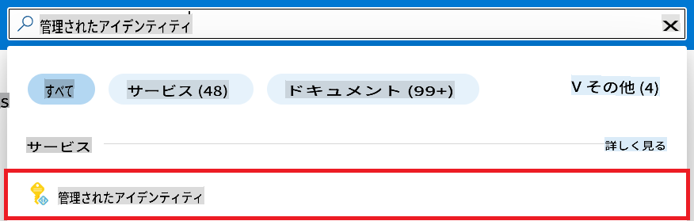

1. **+ Create**を選択します。

    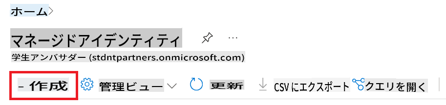

1. 次のタスクを実行します：

    - Azure **Subscription**を選択します。
    - 使用する**Resource group**を選択します（必要に応じて新規作成）。
    - 使用する**Region**を選択します。
    - **Name**を入力します。一意の値である必要があります。

1. **Review + create**を選択します。

1. **+ Create**を選択します。

#### Managed IdentityにContributorロール割り当てを追加

1. 作成したManaged Identityリソースに移動します。

1. 左側のタブから**Azure role assignments**を選択します。

1. ナビゲーションメニューから**+Add role assignment**を選択します。

1. Add role assignmentページで次のタスクを実行します：
    - **Scope**を**Resource group**に設定します。
    - Azure **Subscription**を選択します。
    - 使用する**Resource group**を選択します。
    - **Role**を**Contributor**に設定します。

    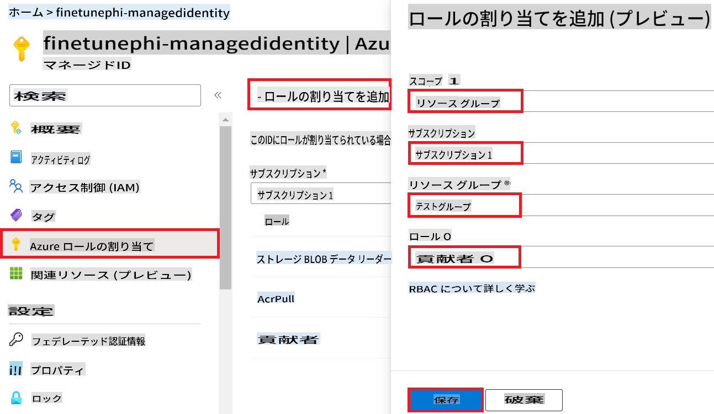

1. **Save**を選択します。

#### Managed IdentityにStorage Blob Data Readerロール割り当てを追加

1. ポータルページ上部の**検索バー**に「*storage accounts*」と入力し、表示されるオプションから**Storage accounts**を選択します。

    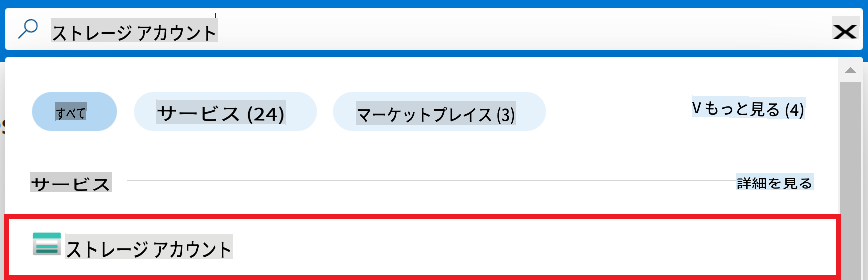

1. 作成したAzure Machine Learningワークスペースに関連付けられているストレージアカウントを選択します。例: *finetunephistorage*。

1. 次のタスクを実行してAdd role assignmentページに移動します：

    - 作成したAzure Storageアカウントに移動します。
    - 左側のタブから**Access Control (IAM)**を選択します。
    - ナビゲーションメニューから**+ Add**を選択します。
    - ナビゲーションメニューから**Add role assignment**を選択します。

    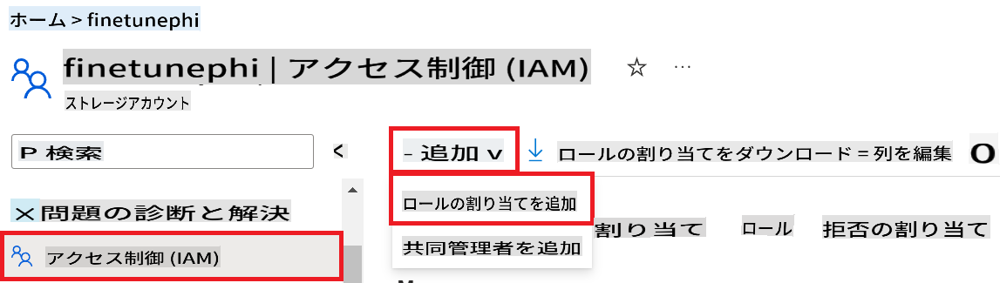

1. Add role assignmentページで次のタスクを実行します：

    - Roleページで**Storage Blob Data Reader**を検索バーに入力し、表示されるオプションから**Storage Blob Data Reader**を選択します。
    - Roleページで**Next**を選択します。
    - Membersページで**Assign access to**を**Managed identity**に設定します。
    - Membersページで**+ Select members**を選択します。
    - Select managed identitiesページでAzure **Subscription**を選択します。
    - Select managed identitiesページで**Managed identity**を**Manage Identity**に設定します。
    - Select managed identitiesページで作成したManaged Identityを選択します。例: *finetunephi-managedidentity*。
    - Select managed identitiesページで**Select**を選択します。

    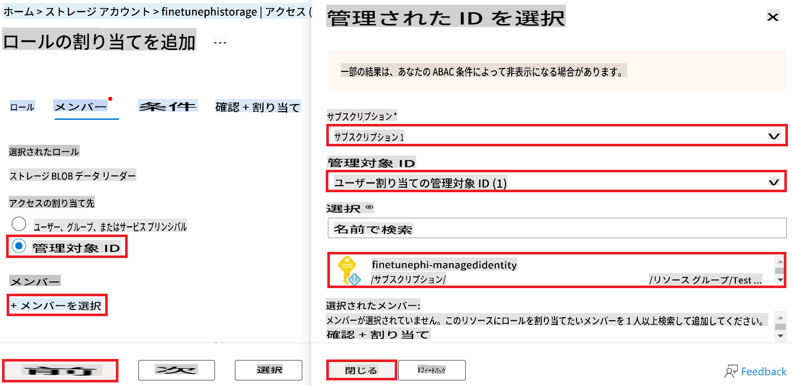

1. **Review + assign**を選択します。

#### Managed IdentityにAcrPullロール割り当てを追加

1. ポータルページ上部の**検索バー**に「*container registries*」と入力し、表示されるオプションから**Container registries**を選択します。

    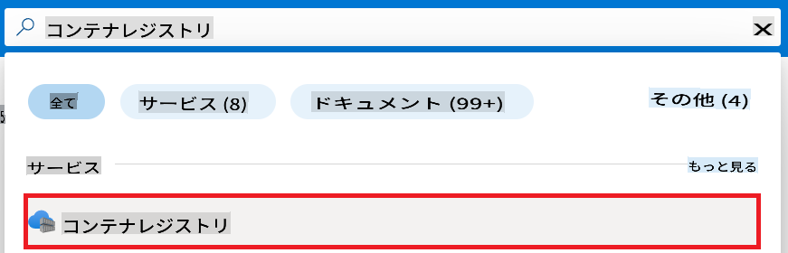

1. 作成したAzure Machine Learningワークスペースに関連付けられているコンテナレジストリを選択します。例: *finetunephicontainerregistries*

1. 次のタスクを実行してAdd role assignmentページに移動します：

    - 左側のタブから**Access Control (IAM)**を選択します。
    - ナビゲーションメニューから**+ Add**を選択します。
    - ナビゲーションメニューから**Add role assignment**を選択します。

1. Add role assignmentページで次のタスクを実行します：

    - Roleページで**AcrPull**を検索バーに入力し、表示されるオプションから**AcrPull**を選択します。
    - Roleページで**Next**を選択します。
    - Membersページで**Assign access to**を**Managed identity**に設定します。
    - Membersページで**+ Select members**を選択します。
    - Select managed identitiesページでAzure **Subscription**を選択します。
    - Select managed identitiesページで**Managed identity**を**Manage Identity**に設定します。
    - Select managed identitiesページで作成したManaged Identityを選択します。例: *finetunephi-managedidentity*。
    - Select managed identitiesページで**Select**を選択します。
    - **Review + assign**を選択します。

### プロジェクトのセットアップ

次に、作業フォルダを作成し、仮想環境を設定して、Azure Cosmos DBに保存されたチャット履歴を使用して応答を生成するプログラムを開発します。

#### 作業フォルダの作成

1. ターミナルウィンドウを開き、以下のコマンドを入力して*finetune-phi*という名前のフォルダをデフォルトパスに作成します。

    ```console
    mkdir finetune-phi
    ```

1. ターミナルで以下のコマンドを入力して作成した*finetune-phi*フォルダに移動します。

    ```console
    cd finetune-phi
    ```

#### 仮想環境の作成

1. ターミナルで以下のコマンドを入力して*.venv*という名前の仮想環境を作成します。

    ```console
    python -m venv .venv
    ```

1. ターミナルで以下のコマンドを入力して仮想環境を有効化します。

    ```console
    .venv\Scripts\activate.bat
    ```

> [!NOTE]
>
> 正常に動作している場合、コマンドプロンプトの前に*(.venv)*が表示されます。

#### 必要なパッケージのインストール

1. ターミナルで以下のコマンドを入力して必要なパッケージをインストールします。

    ```console
    pip install datasets==2.19.1
    pip install transformers==4.41.1
    pip install azure-ai-ml==1.16.0
    pip install torch==2.3.1
    pip install trl==0.9.4
    pip install promptflow==1.12.0
    ```

#### プロジェクトファイルの作成

この演習では、プロジェクトの基本ファイルを作成します。これらのファイルには、データセットのダウンロード、Azure Machine Learning環境の設定、Phi-3モデルのチューニング、チューニング済みモデルのデプロイ用のスクリプトが含まれます。また、チューニング環境を設定するための*conda.yml*ファイルも作成します。

この演習で行うこと：

- データセットをダウンロードするための*download_dataset.py*ファイルを作成します。
- Azure Machine Learning環境を設定するための*setup_ml.py*ファイルを作成します。
- データセットを使用してPhi-3モデルをチューニングするための*finetuning_dir*フォルダ内に*fine_tune.py*ファイルを作成します。
- チューニング環境を設定するための*conda.yml*ファイルを作成します。
- チューニング済みモデルをデプロイするための*deploy_model.py*ファイルを作成します。
- チューニング済みモデルを統合し、Prompt flowを使用してモデルを実行するための*integrate_with_promptflow.py*ファイルを作成します。
- Prompt flowのワークフローストラクチャを設定するための*flow.dag.yml*ファイルを作成します。
- Azure情報を入力するための*config.py*ファイルを作成します。

> [!NOTE]
>
> 完全なフォルダ構成：
>
> ```text
> └── YourUserName
> .    └── finetune-phi
> .        ├── finetuning_dir
> .        │      └── fine_tune.py
> .        ├── conda.yml
> .        ├── config.py
> .        ├── deploy_model.py
> .        ├── download_dataset.py
> .        ├── flow.dag.yml
> .        ├── integrate_with_promptflow.py
> .        └── setup_ml.py
> ```

1. **Visual Studio Code**を開きます。

1. メニューバーから**File**を選択します。

1. **Open Folder**を選択します。

1. 作成した*finetune-phi*フォルダ（*C:\Users\yourUserName\finetune-phi*にあります）を選択します。

    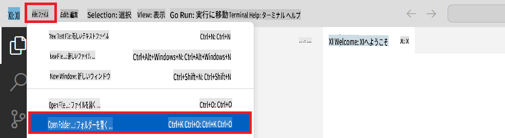

1. Visual Studio Codeの左ペインで右クリックし、**New File**を選択して*download_dataset.py*という名前の新しいファイルを作成します。

1. Visual Studio Codeの左ペインで右クリックし、**New File**を選択して*setup_ml.py*という名前の新しいファイルを作成します。

1. Visual Studio Codeの左ペインで右クリックし、**New File**を選択して*deploy_model.py*という名前の新しいファイルを作成します。

    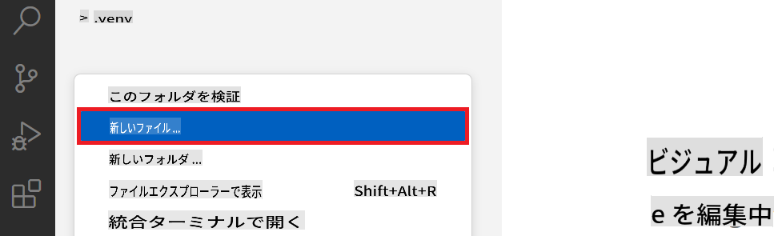

1. Visual Studio Codeの左ペインで右クリックし、**New Folder**を選択して*finetuning_dir*という名前の新しいフォルダを作成します。

1. *finetuning_dir*フォルダ内に*fine_tune.py*という名前の新しいファイルを作成します。

#### *conda.yml*ファイルの作成
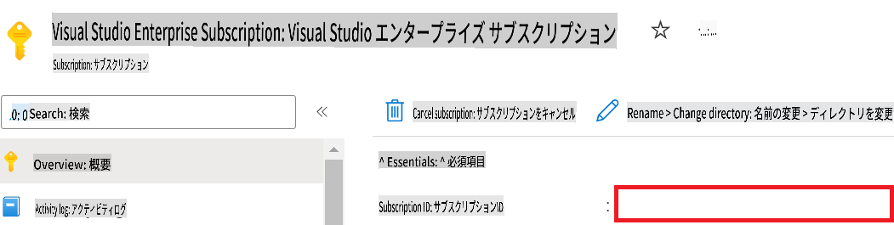

1. Azureワークスペース名を追加するには、以下の手順を実行してください：

    - 作成したAzure Machine Learningリソースに移動します。
    - アカウント名をコピーして、*config.py*ファイルに貼り付けます。

    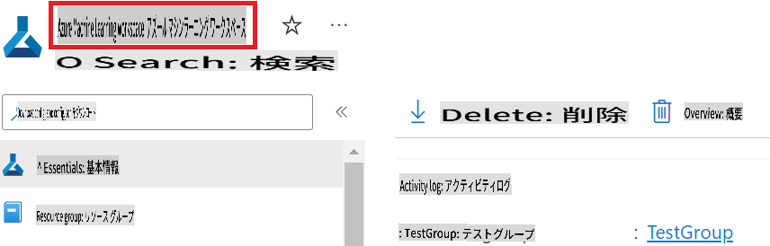

1. Azureリソースグループ名を追加するには、以下の手順を実行してください：

    - 作成したAzure Machine Learningリソースに移動します。
    - Azureリソースグループ名をコピーして、*config.py*ファイルに貼り付けます。

    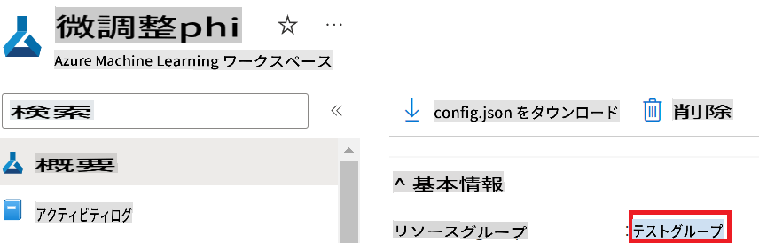

2. AzureマネージドID名を追加するには、以下の手順を実行してください：

    - 作成したマネージドIDリソースに移動します。
    - AzureマネージドID名をコピーして、*config.py*ファイルに貼り付けます。

    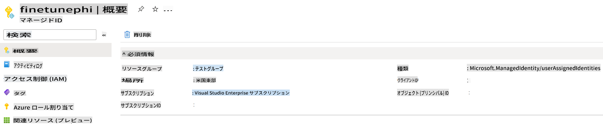

### ファインチューニング用データセットの準備

この演習では、*download_dataset.py*ファイルを実行して*ULTRACHAT_200k*データセットをローカル環境にダウンロードします。その後、このデータセットを使用してAzure Machine LearningでPhi-3モデルをファインチューニングします。

#### *download_dataset.py*を使用してデータセットをダウンロードする

1. Visual Studio Codeで*download_dataset.py*ファイルを開きます。

1. 以下のコードを*download_dataset.py*に追加します。

    ```python
    import json
    import os
    from datasets import load_dataset
    from config import (
        TRAIN_DATA_PATH,
        TEST_DATA_PATH)

    def load_and_split_dataset(dataset_name, config_name, split_ratio):
        """
        Load and split a dataset.
        """
        # Load the dataset with the specified name, configuration, and split ratio
        dataset = load_dataset(dataset_name, config_name, split=split_ratio)
        print(f"Original dataset size: {len(dataset)}")
        
        # Split the dataset into train and test sets (80% train, 20% test)
        split_dataset = dataset.train_test_split(test_size=0.2)
        print(f"Train dataset size: {len(split_dataset['train'])}")
        print(f"Test dataset size: {len(split_dataset['test'])}")
        
        return split_dataset

    def save_dataset_to_jsonl(dataset, filepath):
        """
        Save a dataset to a JSONL file.
        """
        # Create the directory if it does not exist
        os.makedirs(os.path.dirname(filepath), exist_ok=True)
        
        # Open the file in write mode
        with open(filepath, 'w', encoding='utf-8') as f:
            # Iterate over each record in the dataset
            for record in dataset:
                # Dump the record as a JSON object and write it to the file
                json.dump(record, f)
                # Write a newline character to separate records
                f.write('\n')
        
        print(f"Dataset saved to {filepath}")

    def main():
        """
        Main function to load, split, and save the dataset.
        """
        # Load and split the ULTRACHAT_200k dataset with a specific configuration and split ratio
        dataset = load_and_split_dataset("HuggingFaceH4/ultrachat_200k", 'default', 'train_sft[:1%]')
        
        # Extract the train and test datasets from the split
        train_dataset = dataset['train']
        test_dataset = dataset['test']

        # Save the train dataset to a JSONL file
        save_dataset_to_jsonl(train_dataset, TRAIN_DATA_PATH)
        
        # Save the test dataset to a separate JSONL file
        save_dataset_to_jsonl(test_dataset, TEST_DATA_PATH)

    if __name__ == "__main__":
        main()

    ```

> [!TIP]
>
> **CPUを使用して最小限のデータセットでファインチューニングを行うためのガイダンス**
>
> CPUを使用してファインチューニングを行いたい場合、このアプローチはVisual Studio Enterprise Subscriptionなどの特典サブスクリプションを持つ人や、ファインチューニングとデプロイメントプロセスを迅速にテストしたい人に最適です。
>
> `dataset = load_and_split_dataset("HuggingFaceH4/ultrachat_200k", 'default', 'train_sft[:1%]')` with `dataset = load_and_split_dataset("HuggingFaceH4/ultrachat_200k", 'default', 'train_sft[:10]')`を置き換えてください。
>

1. ターミナル内で以下のコマンドを入力してスクリプトを実行し、データセットをローカル環境にダウンロードします。

    ```console
    python download_data.py
    ```

1. データセットがローカルの*finetune-phi/data*ディレクトリに正常に保存されたことを確認します。

> [!NOTE]
>
> **データセットサイズとファインチューニング時間**
>
> このE2Eサンプルでは、データセットの1%（`train_sft[:1%]`）のみを使用します。これにより、データ量が大幅に削減され、アップロードとファインチューニングのプロセスが高速化されます。トレーニング時間とモデル性能のバランスを取るために、割合を調整することができます。小規模なデータセットを使用することで、ファインチューニングに必要な時間を短縮し、E2Eサンプルに適したプロセスになります。

## シナリオ2: Phi-3モデルのファインチューニングとAzure Machine Learning Studioでのデプロイ

### Azure CLIのセットアップ

環境を認証するためにAzure CLIをセットアップする必要があります。Azure CLIを使用すると、コマンドラインから直接Azureリソースを管理でき、Azure Machine Learningがこれらのリソースにアクセスするために必要な資格情報を提供します。始めるには、[Azure CLI](https://learn.microsoft.com/cli/azure/install-azure-cli)をインストールしてください。

1. ターミナルウィンドウを開き、以下のコマンドを入力してAzureアカウントにログインします。

    ```console
    az login
    ```

1. 使用するAzureアカウントを選択します。

1. 使用するAzureサブスクリプションを選択します。

    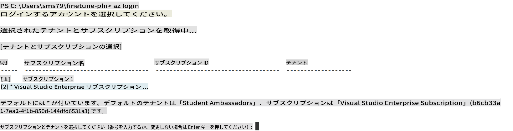

> [!TIP]
>
> Azureへのサインインに問題がある場合は、デバイスコードを使用してみてください。ターミナルウィンドウを開き、以下のコマンドを入力してAzureアカウントにサインインします：
>
> ```console
> az login --use-device-code
> ```
>

### Phi-3モデルのファインチューニング

この演習では、提供されたデータセットを使用してPhi-3モデルをファインチューニングします。最初に、*fine_tune.py*ファイルでファインチューニングプロセスを定義します。その後、Azure Machine Learning環境を設定し、*setup_ml.py*ファイルを実行してファインチューニングプロセスを開始します。このスクリプトは、Azure Machine Learning環境内でファインチューニングが実行されることを保証します。

*setup_ml.py*を実行することで、Azure Machine Learning環境内でファインチューニングプロセスを実行します。

#### *fine_tune.py*ファイルにコードを追加する

1. *finetuning_dir*フォルダーに移動し、Visual Studio Codeで*fine_tune.py*ファイルを開きます。

1. 以下のコードを*fine_tune.py*に追加します。

    ```python
    import argparse
    import sys
    import logging
    import os
    from datasets import load_dataset
    import torch
    import mlflow
    from transformers import AutoModelForCausalLM, AutoTokenizer, TrainingArguments
    from trl import SFTTrainer

    # To avoid the INVALID_PARAMETER_VALUE error in MLflow, disable MLflow integration
    os.environ["DISABLE_MLFLOW_INTEGRATION"] = "True"

    # Logging setup
    logging.basicConfig(
        format="%(asctime)s - %(levelname)s - %(name)s - %(message)s",
        datefmt="%Y-%m-%d %H:%M:%S",
        handlers=[logging.StreamHandler(sys.stdout)],
        level=logging.WARNING
    )
    logger = logging.getLogger(__name__)

    def initialize_model_and_tokenizer(model_name, model_kwargs):
        """
        Initialize the model and tokenizer with the given pretrained model name and arguments.
        """
        model = AutoModelForCausalLM.from_pretrained(model_name, **model_kwargs)
        tokenizer = AutoTokenizer.from_pretrained(model_name)
        tokenizer.model_max_length = 2048
        tokenizer.pad_token = tokenizer.unk_token
        tokenizer.pad_token_id = tokenizer.convert_tokens_to_ids(tokenizer.pad_token)
        tokenizer.padding_side = 'right'
        return model, tokenizer

    def apply_chat_template(example, tokenizer):
        """
        Apply a chat template to tokenize messages in the example.
        """
        messages = example["messages"]
        if messages[0]["role"] != "system":
            messages.insert(0, {"role": "system", "content": ""})
        example["text"] = tokenizer.apply_chat_template(
            messages, tokenize=False, add_generation_prompt=False
        )
        return example

    def load_and_preprocess_data(train_filepath, test_filepath, tokenizer):
        """
        Load and preprocess the dataset.
        """
        train_dataset = load_dataset('json', data_files=train_filepath, split='train')
        test_dataset = load_dataset('json', data_files=test_filepath, split='train')
        column_names = list(train_dataset.features)

        train_dataset = train_dataset.map(
            apply_chat_template,
            fn_kwargs={"tokenizer": tokenizer},
            num_proc=10,
            remove_columns=column_names,
            desc="Applying chat template to train dataset",
        )

        test_dataset = test_dataset.map(
            apply_chat_template,
            fn_kwargs={"tokenizer": tokenizer},
            num_proc=10,
            remove_columns=column_names,
            desc="Applying chat template to test dataset",
        )

        return train_dataset, test_dataset

    def train_and_evaluate_model(train_dataset, test_dataset, model, tokenizer, output_dir):
        """
        Train and evaluate the model.
        """
        training_args = TrainingArguments(
            bf16=True,
            do_eval=True,
            output_dir=output_dir,
            eval_strategy="epoch",
            learning_rate=5.0e-06,
            logging_steps=20,
            lr_scheduler_type="cosine",
            num_train_epochs=3,
            overwrite_output_dir=True,
            per_device_eval_batch_size=4,
            per_device_train_batch_size=4,
            remove_unused_columns=True,
            save_steps=500,
            seed=0,
            gradient_checkpointing=True,
            gradient_accumulation_steps=1,
            warmup_ratio=0.2,
        )

        trainer = SFTTrainer(
            model=model,
            args=training_args,
            train_dataset=train_dataset,
            eval_dataset=test_dataset,
            max_seq_length=2048,
            dataset_text_field="text",
            tokenizer=tokenizer,
            packing=True
        )

        train_result = trainer.train()
        trainer.log_metrics("train", train_result.metrics)

        mlflow.transformers.log_model(
            transformers_model={"model": trainer.model, "tokenizer": tokenizer},
            artifact_path=output_dir,
        )

        tokenizer.padding_side = 'left'
        eval_metrics = trainer.evaluate()
        eval_metrics["eval_samples"] = len(test_dataset)
        trainer.log_metrics("eval", eval_metrics)

    def main(train_file, eval_file, model_output_dir):
        """
        Main function to fine-tune the model.
        """
        model_kwargs = {
            "use_cache": False,
            "trust_remote_code": True,
            "torch_dtype": torch.bfloat16,
            "device_map": None,
            "attn_implementation": "eager"
        }

        # pretrained_model_name = "microsoft/Phi-3-mini-4k-instruct"
        pretrained_model_name = "microsoft/Phi-3.5-mini-instruct"

        with mlflow.start_run():
            model, tokenizer = initialize_model_and_tokenizer(pretrained_model_name, model_kwargs)
            train_dataset, test_dataset = load_and_preprocess_data(train_file, eval_file, tokenizer)
            train_and_evaluate_model(train_dataset, test_dataset, model, tokenizer, model_output_dir)

    if __name__ == "__main__":
        parser = argparse.ArgumentParser()
        parser.add_argument("--train-file", type=str, required=True, help="Path to the training data")
        parser.add_argument("--eval-file", type=str, required=True, help="Path to the evaluation data")
        parser.add_argument("--model_output_dir", type=str, required=True, help="Directory to save the fine-tuned model")
        args = parser.parse_args()
        main(args.train_file, args.eval_file, args.model_output_dir)

    ```

1. *fine_tune.py*ファイルを保存して閉じます。

> [!TIP]
> **Phi-3.5モデルをファインチューニングすることも可能**
>
> *fine_tune.py*ファイルで、`pretrained_model_name` from `"microsoft/Phi-3-mini-4k-instruct"` to any model you want to fine-tune. For example, if you change it to `"microsoft/Phi-3.5-mini-instruct"`, you'll be using the Phi-3.5-mini-instruct model for fine-tuning. To find and use the model name you prefer, visit [Hugging Face](https://huggingface.co/), search for the model you're interested in, and then copy and paste its name into the `pretrained_model_name`フィールドを変更することができます。
>
> :::image type="content" source="../../imgs/03/FineTuning-PromptFlow/finetunephi3.5.png" alt-text="Phi-3.5のファインチューニング。":::
>

#### *setup_ml.py*ファイルにコードを追加する

1. Visual Studio Codeで*setup_ml.py*ファイルを開きます。

1. 以下のコードを*setup_ml.py*に追加します。

    ```python
    import logging
    from azure.ai.ml import MLClient, command, Input
    from azure.ai.ml.entities import Environment, AmlCompute
    from azure.identity import AzureCliCredential
    from config import (
        AZURE_SUBSCRIPTION_ID,
        AZURE_RESOURCE_GROUP_NAME,
        AZURE_ML_WORKSPACE_NAME,
        TRAIN_DATA_PATH,
        TEST_DATA_PATH
    )

    # Constants

    # Uncomment the following lines to use a CPU instance for training
    # COMPUTE_INSTANCE_TYPE = "Standard_E16s_v3" # cpu
    # COMPUTE_NAME = "cpu-e16s-v3"
    # DOCKER_IMAGE_NAME = "mcr.microsoft.com/azureml/openmpi4.1.0-ubuntu20.04:latest"

    # Uncomment the following lines to use a GPU instance for training
    COMPUTE_INSTANCE_TYPE = "Standard_NC24ads_A100_v4"
    COMPUTE_NAME = "gpu-nc24s-a100-v4"
    DOCKER_IMAGE_NAME = "mcr.microsoft.com/azureml/curated/acft-hf-nlp-gpu:59"

    CONDA_FILE = "conda.yml"
    LOCATION = "eastus2" # Replace with the location of your compute cluster
    FINETUNING_DIR = "./finetuning_dir" # Path to the fine-tuning script
    TRAINING_ENV_NAME = "phi-3-training-environment" # Name of the training environment
    MODEL_OUTPUT_DIR = "./model_output" # Path to the model output directory in azure ml

    # Logging setup to track the process
    logger = logging.getLogger(__name__)
    logging.basicConfig(
        format="%(asctime)s - %(levelname)s - %(name)s - %(message)s",
        datefmt="%Y-%m-%d %H:%M:%S",
        level=logging.WARNING
    )

    def get_ml_client():
        """
        Initialize the ML Client using Azure CLI credentials.
        """
        credential = AzureCliCredential()
        return MLClient(credential, AZURE_SUBSCRIPTION_ID, AZURE_RESOURCE_GROUP_NAME, AZURE_ML_WORKSPACE_NAME)

    def create_or_get_environment(ml_client):
        """
        Create or update the training environment in Azure ML.
        """
        env = Environment(
            image=DOCKER_IMAGE_NAME,  # Docker image for the environment
            conda_file=CONDA_FILE,  # Conda environment file
            name=TRAINING_ENV_NAME,  # Name of the environment
        )
        return ml_client.environments.create_or_update(env)

    def create_or_get_compute_cluster(ml_client, compute_name, COMPUTE_INSTANCE_TYPE, location):
        """
        Create or update the compute cluster in Azure ML.
        """
        try:
            compute_cluster = ml_client.compute.get(compute_name)
            logger.info(f"Compute cluster '{compute_name}' already exists. Reusing it for the current run.")
        except Exception:
            logger.info(f"Compute cluster '{compute_name}' does not exist. Creating a new one with size {COMPUTE_INSTANCE_TYPE}.")
            compute_cluster = AmlCompute(
                name=compute_name,
                size=COMPUTE_INSTANCE_TYPE,
                location=location,
                tier="Dedicated",  # Tier of the compute cluster
                min_instances=0,  # Minimum number of instances
                max_instances=1  # Maximum number of instances
            )
            ml_client.compute.begin_create_or_update(compute_cluster).wait()  # Wait for the cluster to be created
        return compute_cluster

    def create_fine_tuning_job(env, compute_name):
        """
        Set up the fine-tuning job in Azure ML.
        """
        return command(
            code=FINETUNING_DIR,  # Path to fine_tune.py
            command=(
                "python fine_tune.py "
                "--train-file ${{inputs.train_file}} "
                "--eval-file ${{inputs.eval_file}} "
                "--model_output_dir ${{inputs.model_output}}"
            ),
            environment=env,  # Training environment
            compute=compute_name,  # Compute cluster to use
            inputs={
                "train_file": Input(type="uri_file", path=TRAIN_DATA_PATH),  # Path to the training data file
                "eval_file": Input(type="uri_file", path=TEST_DATA_PATH),  # Path to the evaluation data file
                "model_output": MODEL_OUTPUT_DIR
            }
        )

    def main():
        """
        Main function to set up and run the fine-tuning job in Azure ML.
        """
        # Initialize ML Client
        ml_client = get_ml_client()

        # Create Environment
        env = create_or_get_environment(ml_client)
        
        # Create or get existing compute cluster
        create_or_get_compute_cluster(ml_client, COMPUTE_NAME, COMPUTE_INSTANCE_TYPE, LOCATION)

        # Create and Submit Fine-Tuning Job
        job = create_fine_tuning_job(env, COMPUTE_NAME)
        returned_job = ml_client.jobs.create_or_update(job)  # Submit the job
        ml_client.jobs.stream(returned_job.name)  # Stream the job logs
        
        # Capture the job name
        job_name = returned_job.name
        print(f"Job name: {job_name}")

    if __name__ == "__main__":
        main()

    ```

1. `COMPUTE_INSTANCE_TYPE`, `COMPUTE_NAME`, and `LOCATION`を具体的な詳細に置き換えます。

    ```python
   # Uncomment the following lines to use a GPU instance for training
    COMPUTE_INSTANCE_TYPE = "Standard_NC24ads_A100_v4"
    COMPUTE_NAME = "gpu-nc24s-a100-v4"
    ...
    LOCATION = "eastus2" # Replace with the location of your compute cluster
    ```

> [!TIP]
>
> **CPUを使用して最小限のデータセットでファインチューニングを行うためのガイダンス**
>
> CPUを使用してファインチューニングを行いたい場合、このアプローチはVisual Studio Enterprise Subscriptionなどの特典サブスクリプションを持つ人や、ファインチューニングとデプロイメントプロセスを迅速にテストしたい人に最適です。
>
> 1. *setup_ml*ファイルを開きます。
> 1. `COMPUTE_INSTANCE_TYPE`, `COMPUTE_NAME`, and `DOCKER_IMAGE_NAME` with the following. If you do not have access to *Standard_E16s_v3*, you can use an equivalent CPU instance or request a new quota.
> 1. Replace `LOCATION`を具体的な詳細に置き換えます。
>
>    ```python
>    # Uncomment the following lines to use a CPU instance for training
>    COMPUTE_INSTANCE_TYPE = "Standard_E16s_v3" # cpu
>    COMPUTE_NAME = "cpu-e16s-v3"
>    DOCKER_IMAGE_NAME = "mcr.microsoft.com/azureml/openmpi4.1.0-ubuntu20.04:latest"
>    LOCATION = "eastus2" # Replace with the location of your compute cluster
>    ```
>

1. 以下のコマンドを入力して*setup_ml.py*スクリプトを実行し、Azure Machine Learningでファインチューニングプロセスを開始します。

    ```python
    python setup_ml.py
    ```

1. この演習では、Azure Machine Learningを使用してPhi-3モデルを正常にファインチューニングしました。*setup_ml.py*スクリプトを実行することで、Azure Machine Learning環境を設定し、*fine_tune.py*ファイルで定義されたファインチューニングプロセスを開始しました。ファインチューニングプロセスにはかなりの時間がかかる場合があります。`python setup_ml.py` command, you need to wait for the process to complete. You can monitor the status of the fine-tuning job by following the link provided in the terminal to the Azure Machine Learning portal.

    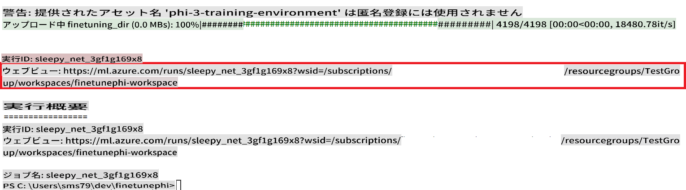

### Deploy the fine-tuned model

To integrate the fine-tuned Phi-3 model with Prompt Flow, you need to deploy the model to make it accessible for real-time inference. This process involves registering the model, creating an online endpoint, and deploying the model.

#### Set the model name, endpoint name, and deployment name for deployment

1. Open *config.py* file.

1. Replace `AZURE_MODEL_NAME = "your_fine_tuned_model_name"` with the desired name for your model.

1. Replace `AZURE_ENDPOINT_NAME = "your_fine_tuned_model_endpoint_name"` with the desired name for your endpoint.

1. Replace `AZURE_DEPLOYMENT_NAME = "your_fine_tuned_model_deployment_name"`を使用して、デプロイメントのための希望の名前を指定してください。

#### *deploy_model.py*ファイルにコードを追加する

*deploy_model.py*ファイルを実行することで、デプロイメントプロセス全体を自動化します。このスクリプトはモデルを登録し、エンドポイントを作成し、*config.py*ファイルで指定された設定（モデル名、エンドポイント名、デプロイメント名）に基づいてデプロイメントを実行します。

1. Visual Studio Codeで*deploy_model.py*ファイルを開きます。

1. 以下のコードを*deploy_model.py*に追加します。

    ```python
    import logging
    from azure.identity import AzureCliCredential
    from azure.ai.ml import MLClient
    from azure.ai.ml.entities import Model, ProbeSettings, ManagedOnlineEndpoint, ManagedOnlineDeployment, IdentityConfiguration, ManagedIdentityConfiguration, OnlineRequestSettings
    from azure.ai.ml.constants import AssetTypes

    # Configuration imports
    from config import (
        AZURE_SUBSCRIPTION_ID,
        AZURE_RESOURCE_GROUP_NAME,
        AZURE_ML_WORKSPACE_NAME,
        AZURE_MANAGED_IDENTITY_RESOURCE_ID,
        AZURE_MANAGED_IDENTITY_CLIENT_ID,
        AZURE_MODEL_NAME,
        AZURE_ENDPOINT_NAME,
        AZURE_DEPLOYMENT_NAME
    )

    # Constants
    JOB_NAME = "your-job-name"
    COMPUTE_INSTANCE_TYPE = "Standard_E4s_v3"

    deployment_env_vars = {
        "SUBSCRIPTION_ID": AZURE_SUBSCRIPTION_ID,
        "RESOURCE_GROUP_NAME": AZURE_RESOURCE_GROUP_NAME,
        "UAI_CLIENT_ID": AZURE_MANAGED_IDENTITY_CLIENT_ID,
    }

    # Logging setup
    logging.basicConfig(
        format="%(asctime)s - %(levelname)s - %(name)s - %(message)s",
        datefmt="%Y-%m-%d %H:%M:%S",
        level=logging.DEBUG
    )
    logger = logging.getLogger(__name__)

    def get_ml_client():
        """Initialize and return the ML Client."""
        credential = AzureCliCredential()
        return MLClient(credential, AZURE_SUBSCRIPTION_ID, AZURE_RESOURCE_GROUP_NAME, AZURE_ML_WORKSPACE_NAME)

    def register_model(ml_client, model_name, job_name):
        """Register a new model."""
        model_path = f"azureml://jobs/{job_name}/outputs/artifacts/paths/model_output"
        logger.info(f"Registering model {model_name} from job {job_name} at path {model_path}.")
        run_model = Model(
            path=model_path,
            name=model_name,
            description="Model created from run.",
            type=AssetTypes.MLFLOW_MODEL,
        )
        model = ml_client.models.create_or_update(run_model)
        logger.info(f"Registered model ID: {model.id}")
        return model

    def delete_existing_endpoint(ml_client, endpoint_name):
        """Delete existing endpoint if it exists."""
        try:
            endpoint_result = ml_client.online_endpoints.get(name=endpoint_name)
            logger.info(f"Deleting existing endpoint {endpoint_name}.")
            ml_client.online_endpoints.begin_delete(name=endpoint_name).result()
            logger.info(f"Deleted existing endpoint {endpoint_name}.")
        except Exception as e:
            logger.info(f"No existing endpoint {endpoint_name} found to delete: {e}")

    def create_or_update_endpoint(ml_client, endpoint_name, description=""):
        """Create or update an endpoint."""
        delete_existing_endpoint(ml_client, endpoint_name)
        logger.info(f"Creating new endpoint {endpoint_name}.")
        endpoint = ManagedOnlineEndpoint(
            name=endpoint_name,
            description=description,
            identity=IdentityConfiguration(
                type="user_assigned",
                user_assigned_identities=[ManagedIdentityConfiguration(resource_id=AZURE_MANAGED_IDENTITY_RESOURCE_ID)]
            )
        )
        endpoint_result = ml_client.online_endpoints.begin_create_or_update(endpoint).result()
        logger.info(f"Created new endpoint {endpoint_name}.")
        return endpoint_result

    def create_or_update_deployment(ml_client, endpoint_name, deployment_name, model):
        """Create or update a deployment."""

        logger.info(f"Creating deployment {deployment_name} for endpoint {endpoint_name}.")
        deployment = ManagedOnlineDeployment(
            name=deployment_name,
            endpoint_name=endpoint_name,
            model=model.id,
            instance_type=COMPUTE_INSTANCE_TYPE,
            instance_count=1,
            environment_variables=deployment_env_vars,
            request_settings=OnlineRequestSettings(
                max_concurrent_requests_per_instance=3,
                request_timeout_ms=180000,
                max_queue_wait_ms=120000
            ),
            liveness_probe=ProbeSettings(
                failure_threshold=30,
                success_threshold=1,
                period=100,
                initial_delay=500,
            ),
            readiness_probe=ProbeSettings(
                failure_threshold=30,
                success_threshold=1,
                period=100,
                initial_delay=500,
            ),
        )
        deployment_result = ml_client.online_deployments.begin_create_or_update(deployment).result()
        logger.info(f"Created deployment {deployment.name} for endpoint {endpoint_name}.")
        return deployment_result

    def set_traffic_to_deployment(ml_client, endpoint_name, deployment_name):
        """Set traffic to the specified deployment."""
        try:
            # Fetch the current endpoint details
            endpoint = ml_client.online_endpoints.get(name=endpoint_name)
            
            # Log the current traffic allocation for debugging
            logger.info(f"Current traffic allocation: {endpoint.traffic}")
            
            # Set the traffic allocation for the deployment
            endpoint.traffic = {deployment_name: 100}
            
            # Update the endpoint with the new traffic allocation
            endpoint_poller = ml_client.online_endpoints.begin_create_or_update(endpoint)
            updated_endpoint = endpoint_poller.result()
            
            # Log the updated traffic allocation for debugging
            logger.info(f"Updated traffic allocation: {updated_endpoint.traffic}")
            logger.info(f"Set traffic to deployment {deployment_name} at endpoint {endpoint_name}.")
            return updated_endpoint
        except Exception as e:
            # Log any errors that occur during the process
            logger.error(f"Failed to set traffic to deployment: {e}")
            raise


    def main():
        ml_client = get_ml_client()

        registered_model = register_model(ml_client, AZURE_MODEL_NAME, JOB_NAME)
        logger.info(f"Registered model ID: {registered_model.id}")

        endpoint = create_or_update_endpoint(ml_client, AZURE_ENDPOINT_NAME, "Endpoint for finetuned Phi-3 model")
        logger.info(f"Endpoint {AZURE_ENDPOINT_NAME} is ready.")

        try:
            deployment = create_or_update_deployment(ml_client, AZURE_ENDPOINT_NAME, AZURE_DEPLOYMENT_NAME, registered_model)
            logger.info(f"Deployment {AZURE_DEPLOYMENT_NAME} is created for endpoint {AZURE_ENDPOINT_NAME}.")

            set_traffic_to_deployment(ml_client, AZURE_ENDPOINT_NAME, AZURE_DEPLOYMENT_NAME)
            logger.info(f"Traffic is set to deployment {AZURE_DEPLOYMENT_NAME} at endpoint {AZURE_ENDPOINT_NAME}.")
        except Exception as e:
            logger.error(f"Failed to create or update deployment: {e}")

    if __name__ == "__main__":
        main()

    ```

1. `JOB_NAME`:

    - Navigate to Azure Machine Learning resource that you created.
    - Select **Studio web URL** to open the Azure Machine Learning workspace.
    - Select **Jobs** from the left side tab.
    - Select the experiment for fine-tuning. For example, *finetunephi*.
    - Select the job that you created.
    - Copy and paste your job Name into the `JOB_NAME = "your-job-name"` in *deploy_model.py* file.

1. Replace `COMPUTE_INSTANCE_TYPE`を具体的な詳細に置き換えるタスクを実行します。

1. 以下のコマンドを入力して*deploy_model.py*スクリプトを実行し、Azure Machine Learningでデプロイメントプロセスを開始します。

    ```python
    python deploy_model.py
    ```

> [!WARNING]
> アカウントに追加料金が発生しないように、Azure Machine Learningワークスペースで作成したエンドポイントを削除することを忘れないでください。
>

#### Azure Machine Learningワークスペースでのデプロイメントステータスを確認する

1. [Azure ML Studio](https://ml.azure.com/home?wt.mc_id=studentamb_279723)を訪問します。

1. 作成したAzure Machine Learningワークスペースに移動します。

1. **Studio web URL**を選択してAzure Machine Learningワークスペースを開きます。

1. 左側のタブから**Endpoints**を選択します。

    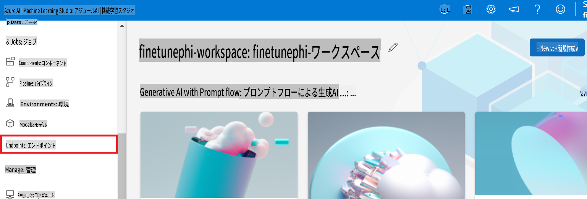

2. 作成したエンドポイントを選択します。

    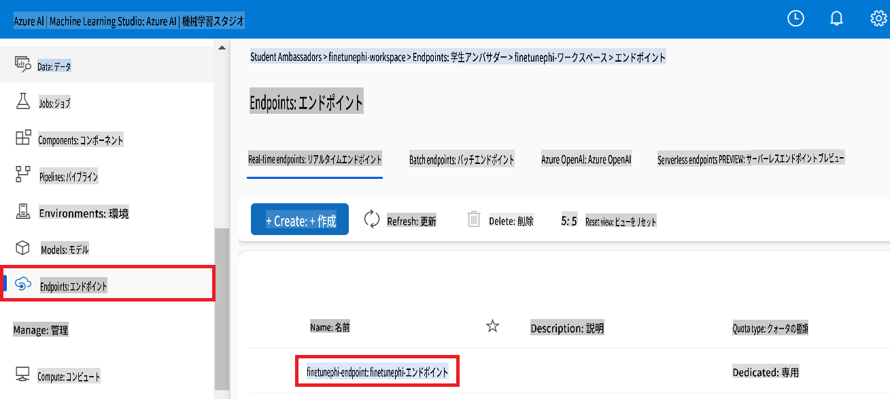

3. このページで、デプロイメントプロセス中に作成されたエンドポイントを管理できます。

## シナリオ3: Prompt flowとの統合とカスタムモデルとの対話

### カスタムPhi-3モデルをPrompt flowと統合する

ファインチューニングされたモデルを正常にデプロイした後、Prompt flowと統合してリアルタイムアプリケーションでモデルを使用できるようになります。これにより、カスタムPhi-3モデルを使用したさまざまなインタラクティブなタスクが可能になります。

#### ファインチューニングされたPhi-3モデルのAPIキーとエンドポイントURIを設定する

1. 作成したAzure Machine Learningワークスペースに移動します。
1. 左側のタブから**Endpoints**を選択します。
1. 作成したエンドポイントを選択します。
1. ナビゲーションメニューから**Consume**を選択します。
1. **RESTエンドポイント**をコピーし、*config.py*ファイルに貼り付けて、`AZURE_ML_ENDPOINT = "your_fine_tuned_model_endpoint_uri"` with your **REST endpoint**.
1. Copy and paste your **Primary key** into the *config.py* file, replacing `AZURE_ML_API_KEY = "your_fine_tuned_model_api_key"`を**Primary key**に置き換えます。

    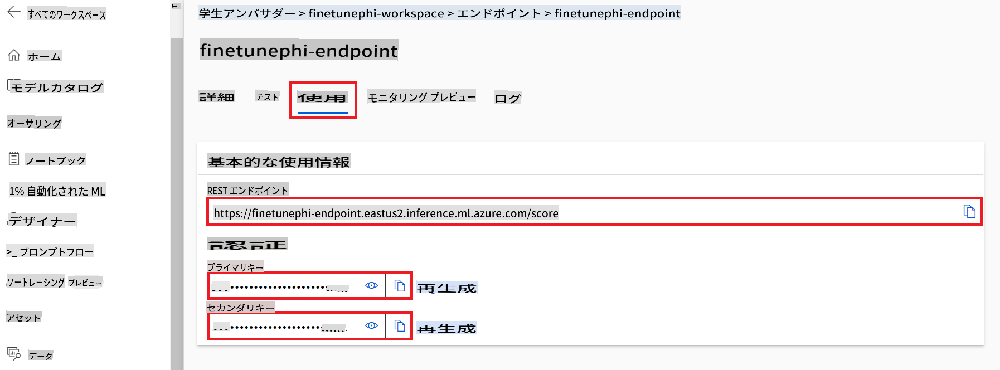

#### *flow.dag.yml*ファイルにコードを追加する

1. Visual Studio Codeで*flow.dag.yml*ファイルを開きます。

1. 以下のコードを*flow.dag.yml*に追加します。

    ```yml
    inputs:
      input_data:
        type: string
        default: "Who founded Microsoft?"

    outputs:
      answer:
        type: string
        reference: ${integrate_with_promptflow.output}

    nodes:
    - name: integrate_with_promptflow
      type: python
      source:
        type: code
        path: integrate_with_promptflow.py
      inputs:
        input_data: ${inputs.input_data}
    ```

#### *integrate_with_promptflow.py*ファイルにコードを追加する

1. Visual Studio Codeで*integrate_with_promptflow.py*ファイルを開きます。

1. 以下のコードを*integrate_with_promptflow.py*に追加します。

    ```python
    import logging
    import requests
    from promptflow.core import tool
    import asyncio
    import platform
    from config import (
        AZURE_ML_ENDPOINT,
        AZURE_ML_API_KEY
    )

    # Logging setup
    logging.basicConfig(
        format="%(asctime)s - %(levelname)s - %(name)s - %(message)s",
        datefmt="%Y-%m-%d %H:%M:%S",
        level=logging.DEBUG
    )
    logger = logging.getLogger(__name__)

    def query_azml_endpoint(input_data: list, endpoint_url: str, api_key: str) -> str:
        """
        Send a request to the Azure ML endpoint with the given input data.
        """
        headers = {
            "Content-Type": "application/json",
            "Authorization": f"Bearer {api_key}"
        }
        data = {
            "input_data": [input_data],
            "params": {
                "temperature": 0.7,
                "max_new_tokens": 128,
                "do_sample": True,
                "return_full_text": True
            }
        }
        try:
            response = requests.post(endpoint_url, json=data, headers=headers)
            response.raise_for_status()
            result = response.json()[0]
            logger.info("Successfully received response from Azure ML Endpoint.")
            return result
        except requests.exceptions.RequestException as e:
            logger.error(f"Error querying Azure ML Endpoint: {e}")
            raise

    def setup_asyncio_policy():
        """
        Setup asyncio event loop policy for Windows.
        """
        if platform.system() == 'Windows':
            asyncio.set_event_loop_policy(asyncio.WindowsSelectorEventLoopPolicy())
            logger.info("Set Windows asyncio event loop policy.")

    @tool
    def my_python_tool(input_data: str) -> str:
        """
        Tool function to process input data and query the Azure ML endpoint.
        """
        setup_asyncio_policy()
        return query_azml_endpoint(input_data, AZURE_ML_ENDPOINT, AZURE_ML_API_KEY)

    ```

### カスタムモデルとの対話

1. 以下のコマンドを入力して*deploy_model.py*スクリプトを実行し、Azure Machine Learningでデプロイメントプロセスを開始します。

    ```python
    pf flow serve --source ./ --port 8080 --host localhost
    ```

1. 結果の例：カスタムPhi-3モデルと対話できます。ファインチューニングに使用したデータに基づいて質問することをお勧めします。

    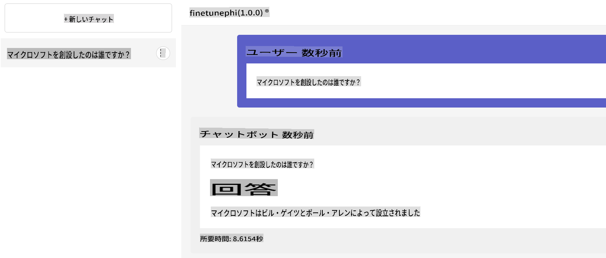

**免責事項**:  
本書類は、機械ベースのAI翻訳サービスを使用して翻訳されています。正確性を追求しておりますが、自動翻訳にはエラーや不正確な箇所が含まれる可能性があることをご承知おきください。原文（原本）が信頼できる正式な情報源とみなされるべきです。重要な情報については、専門の人間による翻訳を推奨します。本翻訳の利用に起因する誤解や誤った解釈について、当方は一切の責任を負いかねます。