# Phi-3 カスタムモデルの微調整と Azure AI Foundry における Prompt flow との統合

このエンドツーエンド (E2E) サンプルは、Microsoft Tech Community のガイド「[Fine-Tune and Integrate Custom Phi-3 Models with Prompt Flow in Azure AI Foundry](https://techcommunity.microsoft.com/t5/educator-developer-blog/fine-tune-and-integrate-custom-phi-3-models-with-prompt-flow-in/ba-p/4191726?WT.mc_id=aiml-137032-kinfeylo)」に基づいています。このサンプルでは、Azure AI Foundry においてカスタム Phi-3 モデルを微調整、デプロイ、および Prompt flow と統合するプロセスを紹介します。  
E2E サンプル「[Fine-Tune and Integrate Custom Phi-3 Models with Prompt Flow](./E2E_Phi-3-FineTuning_PromptFlow_Integration.md)」ではローカル環境でコードを実行しましたが、このチュートリアルでは Azure AI / ML Studio 内でモデルを微調整および統合することに焦点を当てています。

## 概要

この E2E サンプルでは、Phi-3 モデルの微調整方法と、Azure AI Foundry 内で Prompt flow と統合する方法を学びます。Azure AI / ML Studio を活用することで、カスタム AI モデルをデプロイおよび利用するためのワークフローを構築します。このサンプルは以下の 3 つのシナリオに分かれています。

**シナリオ 1: Azure リソースの設定と微調整の準備**  
**シナリオ 2: Phi-3 モデルの微調整と Azure Machine Learning Studio へのデプロイ**  
**シナリオ 3: Prompt flow との統合と Azure AI Foundry 内でのカスタムモデルとの対話**

以下はこの E2E サンプルの概要です。

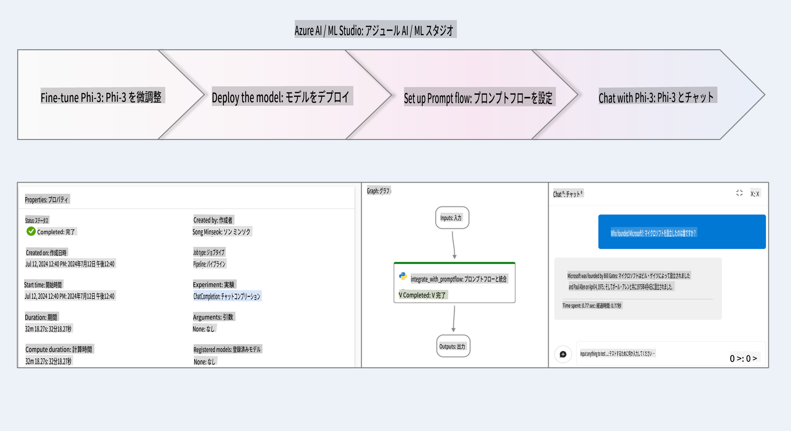

### 目次

1. **[シナリオ 1: Azure リソースの設定と微調整の準備](../../../../../../md/02.Application/01.TextAndChat/Phi3)**  
    - [Azure Machine Learning ワークスペースを作成する](../../../../../../md/02.Application/01.TextAndChat/Phi3)  
    - [Azure サブスクリプションで GPU クォータをリクエストする](../../../../../../md/02.Application/01.TextAndChat/Phi3)  
    - [ロール割り当てを追加する](../../../../../../md/02.Application/01.TextAndChat/Phi3)  
    - [プロジェクトをセットアップする](../../../../../../md/02.Application/01.TextAndChat/Phi3)  
    - [微調整用のデータセットを準備する](../../../../../../md/02.Application/01.TextAndChat/Phi3)  

1. **[シナリオ 2: Phi-3 モデルを微調整して Azure Machine Learning Studio にデプロイする](../../../../../../md/02.Application/01.TextAndChat/Phi3)**  
    - [Phi-3 モデルを微調整する](../../../../../../md/02.Application/01.TextAndChat/Phi3)  
    - [微調整した Phi-3 モデルをデプロイする](../../../../../../md/02.Application/01.TextAndChat/Phi3)  

1. **[シナリオ 3: Prompt flow との統合と Azure AI Foundry 内でのカスタムモデルとの対話](../../../../../../md/02.Application/01.TextAndChat/Phi3)**  
    - [カスタム Phi-3 モデルを Prompt flow と統合する](../../../../../../md/02.Application/01.TextAndChat/Phi3)  
    - [カスタム Phi-3 モデルと対話する](../../../../../../md/02.Application/01.TextAndChat/Phi3)  

## シナリオ 1: Azure リソースの設定と微調整の準備

### Azure Machine Learning ワークスペースを作成する

1. ポータルページ上部の **検索バー** に「*azure machine learning*」と入力し、表示されるオプションから **Azure Machine Learning** を選択します。

    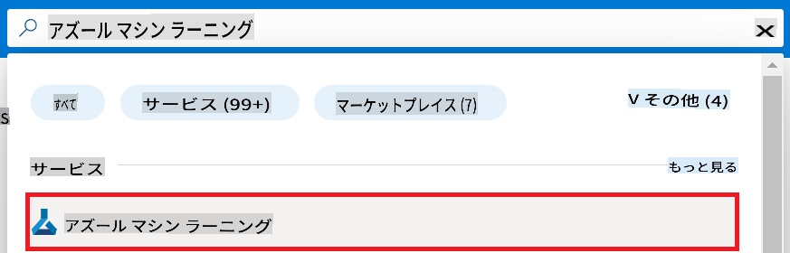

2. ナビゲーションメニューから **+ 作成** を選択します。

3. ナビゲーションメニューから **新しいワークスペース** を選択します。

    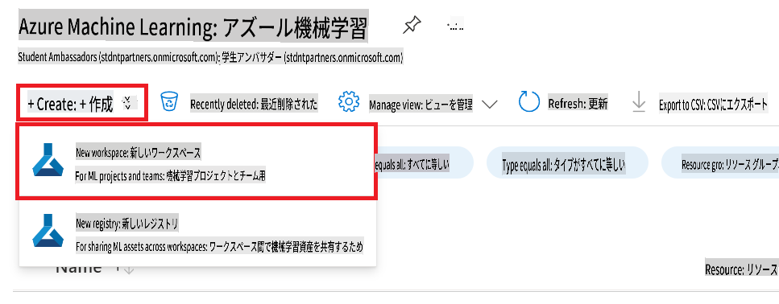

4. 以下のタスクを実行します。

    - Azure **サブスクリプション** を選択します。
    - 使用する **リソースグループ** を選択します（必要に応じて新しいものを作成します）。
    - **ワークスペース名** を入力します。一意の値である必要があります。
    - 使用する **リージョン** を選択します。
    - 使用する **ストレージアカウント** を選択します（必要に応じて新しいものを作成します）。
    - 使用する **Key Vault** を選択します（必要に応じて新しいものを作成します）。
    - 使用する **Application Insights** を選択します（必要に応じて新しいものを作成します）。
    - 使用する **コンテナレジストリ** を選択します（必要に応じて新しいものを作成します）。

    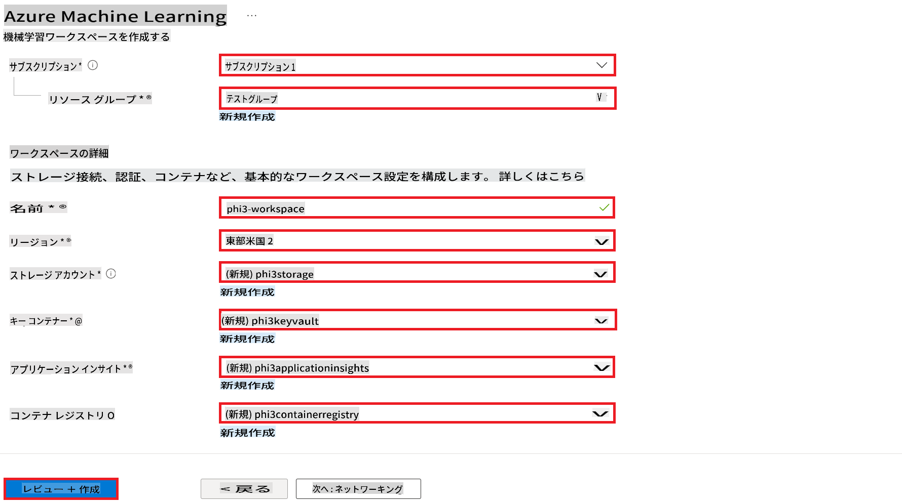

5. **確認 + 作成** を選択します。

6. **作成** を選択します。

### Azure サブスクリプションで GPU クォータをリクエストする

このチュートリアルでは、GPU を使用して Phi-3 モデルを微調整およびデプロイします。微調整には *Standard_NC24ads_A100_v4* GPU を使用し、デプロイには *Standard_NC6s_v3* GPU を使用します。それぞれの GPU のクォータリクエストが必要です。

> [!NOTE]
>
> GPU 割り当てが可能なのは Pay-As-You-Go サブスクリプション（標準サブスクリプションタイプ）のみで、現在は特典サブスクリプションはサポートされていません。

1. [Azure ML Studio](https://ml.azure.com/home?wt.mc_id=studentamb_279723) にアクセスします。

1. *Standard NCADSA100v4 Family* クォータをリクエストするため、以下のタスクを実行します。

    - 左側のタブから **クォータ** を選択します。
    - 使用する **仮想マシンファミリ** を選択します。たとえば、*Standard NCADSA100v4 Family Cluster Dedicated vCPUs* を選択します。このファミリには *Standard_NC24ads_A100_v4* GPU が含まれます。
    - ナビゲーションメニューから **クォータリクエスト** を選択します。

        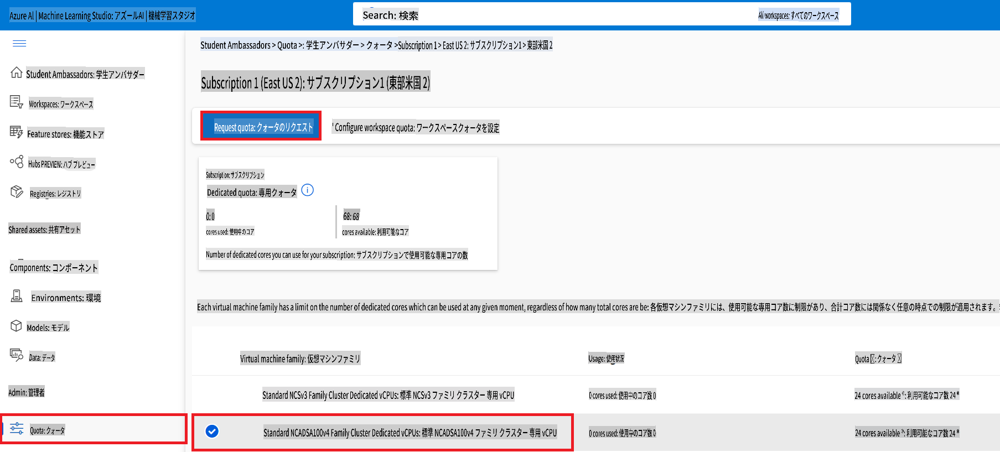

    - クォータリクエストページで、使用したい **新しいコア制限** を入力します（例: 24）。
    - クォータリクエストページで **送信** を選択して GPU クォータをリクエストします。

1. *Standard NCSv3 Family* クォータをリクエストするため、以下のタスクを実行します。

    - 左側のタブから **クォータ** を選択します。
    - 使用する **仮想マシンファミリ** を選択します。たとえば、*Standard NCSv3 Family Cluster Dedicated vCPUs* を選択します。このファミリには *Standard_NC6s_v3* GPU が含まれます。
    - ナビゲーションメニューから **クォータリクエスト** を選択します。
    - クォータリクエストページで、使用したい **新しいコア制限** を入力します（例: 24）。
    - クォータリクエストページで **送信** を選択して GPU クォータをリクエストします。

### ロール割り当てを追加する

モデルを微調整およびデプロイするには、まずユーザー割り当てマネージド ID (UAI) を作成し、適切な権限を割り当てる必要があります。この UAI はデプロイ時の認証に使用されます。

#### ユーザー割り当てマネージド ID (UAI) を作成する

1. ポータルページ上部の **検索バー** に「*managed identities*」と入力し、表示されるオプションから **Managed Identities** を選択します。

    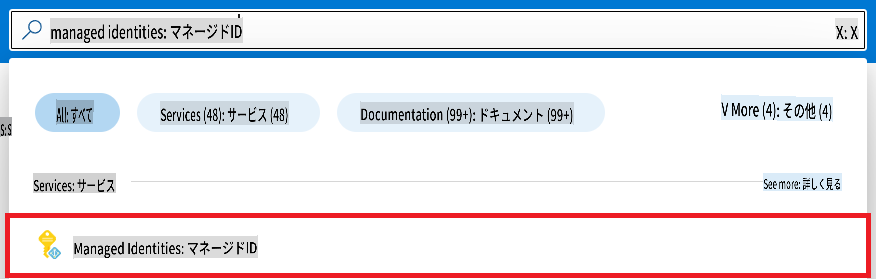

1. **+ 作成** を選択します。

    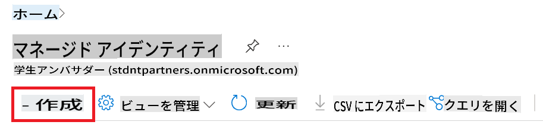

1. 以下のタスクを実行します。

    - Azure **サブスクリプション** を選択します。
    - 使用する **リソースグループ** を選択します（必要に応じて新しいものを作成します）。
    - 使用する **リージョン** を選択します。
    - **名前** を入力します。一意の値である必要があります。

    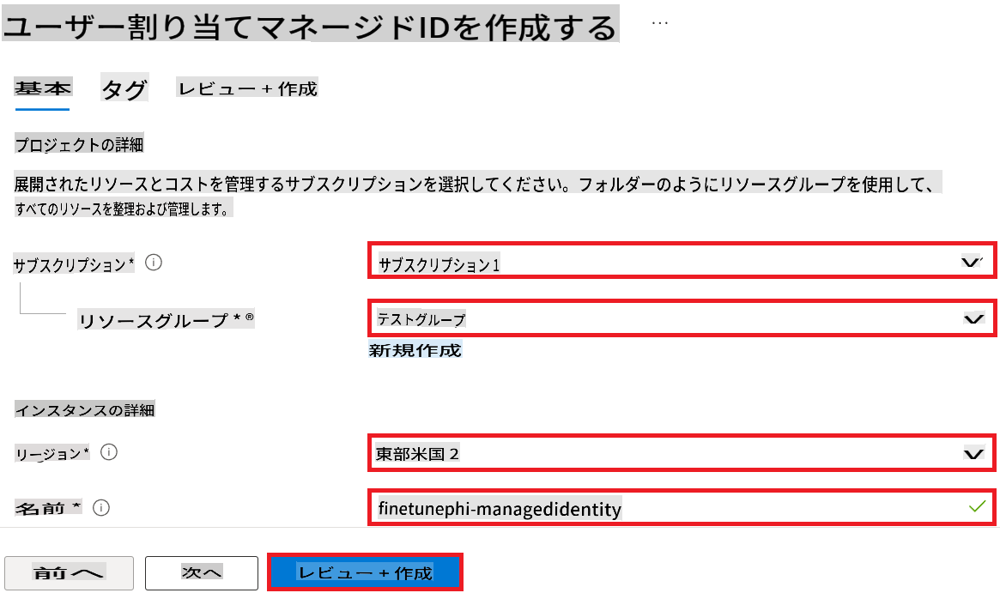

1. **確認 + 作成** を選択します。

1. **作成** を選択します。

#### マネージド ID に Contributor ロールを割り当てる

1. 作成したマネージド ID リソースに移動します。

1. 左側のタブから **Azure ロール割り当て** を選択します。

1. ナビゲーションメニューから **+ ロール割り当てを追加** を選択します。

1. **ロール割り当てを追加** ページで以下のタスクを実行します:
    - **スコープ** を **リソースグループ** に設定します。
    - Azure **サブスクリプション** を選択します。
    - 使用する **リソースグループ** を選択します。
    - **ロール** を **Contributor** に設定します。

    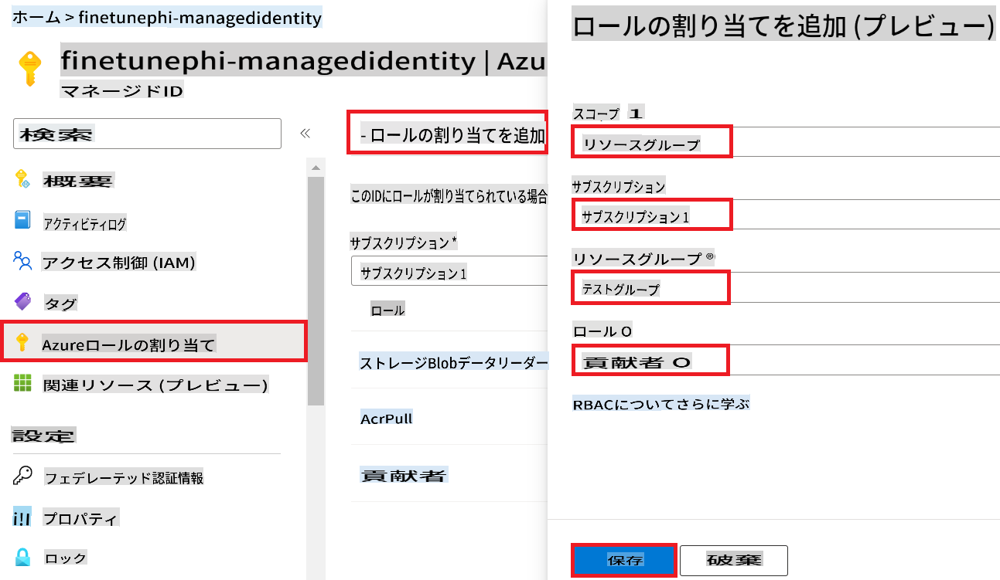

2. **保存** を選択します。

#### マネージド ID に Storage Blob Data Reader ロールを割り当てる

1. ポータルページ上部の **検索バー** に「*storage accounts*」と入力し、表示されるオプションから **Storage accounts** を選択します。

    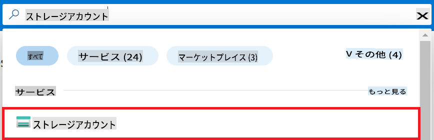

1. 作成した Azure Machine Learning ワークスペースに関連付けられているストレージアカウントを選択します（例: *finetunephistorage*）。

1. 以下のタスクを実行して **ロール割り当てを追加** ページに移動します:

    - 作成した Azure ストレージアカウントに移動します。
    - 左側のタブから **アクセス制御 (IAM)** を選択します。
    - ナビゲーションメニューから **+ 追加** を選択します。
    - ナビゲーションメニューから **ロール割り当てを追加** を選択します。

    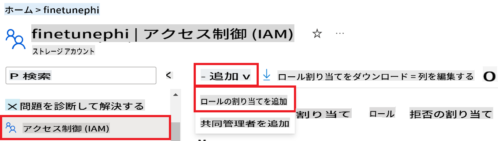

1. **ロール割り当てを追加** ページで以下のタスクを実行します:

    - **ロール** ページで **Storage Blob Data Reader** と入力し、表示されるオプションから **Storage Blob Data Reader** を選択します。
    - **ロール** ページで **次へ** を選択します。
    - **メンバー** ページで **アクセスを割り当てる対象** を **Managed identity** に設定します。
    - **メンバー** ページで **+ メンバーを選択** を選択します。
    - **マネージド ID を選択** ページで Azure **サブスクリプション** を選択します。
    - **マネージド ID を選択** ページで **マネージド ID** を **Manage Identity** に設定します。
    - **マネージド ID を選択** ページで作成したマネージド ID を選択します（例: *finetunephi-managedidentity*）。
    - **マネージド ID を選択** ページで **選択** を選択します。

    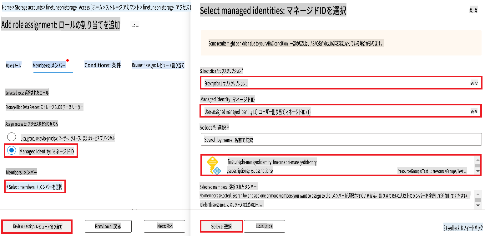

1. **確認 + 割り当て** を選択します。

#### マネージド ID に AcrPull ロールを割り当てる

1. ポータルページ上部の **検索バー** に「*container registries*」と入力し、表示されるオプションから **Container registries** を選択します。

    

1. Azure Machine Learning ワークスペースに関連付けられているコンテナレジストリを選択します（例: *finetunephicontainerregistry*）。

1. 以下のタスクを実行して **ロール割り当てを追加** ページに移動します:

    - 左側のタブから **アクセス制御 (IAM)** を選択します。
    - ナビゲーションメニューから **+ 追加** を選択します。
    - ナビゲーションメニューから **ロール割り当てを追加** を選択します。

1. **ロール割り当てを追加** ページで以下のタスクを実行します:

    - **ロール** ページで **AcrPull** と入力し、表示されるオプションから **AcrPull** を選択します。
    - **ロール** ページで **次へ** を選択します。
    - **メンバー** ページで **アクセスを割り当てる対象** を **Managed identity** に設定します。
    - **メンバー** ページで **+ メンバーを選択** を選択します。
    - **マネージド ID を選択** ページで Azure **サブスクリプション** を選択します。
    - **マネージド ID を選択** ページで **マネージド ID** を **Manage Identity** に設定します。
    - **マネージド ID を選択** ページで作成したマネージド ID を選択します（例: *finetunephi-managedidentity*）。
    - **マネージド ID を選択** ページで **選択** を選択します。
    - **確認 + 割り当て** を選択します。

### プロジェクトをセットアップする

微調整に必要なデータセットをダウンロードするため、ローカル環境をセットアップします。

この演習では以下を行います:

- 作業用フォルダを作成する。
- 仮想環境を作成する。
- 必要なパッケージをインストールする。
- データセットをダウンロードするための *download_dataset.py* ファイルを作成する。

#### 作業用フォルダを作成する

1. ターミナルウィンドウを開き、以下のコマンドを入力してデフォルトのパスに *finetune-phi* という名前のフォルダを作成します。

    ```console
    mkdir finetune-phi
    ```

2. 作成した *finetune-phi* フォルダに移動するには、以下のコマンドを入力します。

    ```console
    cd finetune-phi
    ```

#### 仮想環境を作成する

1. 以下のコマンドを入力して *.venv* という名前の仮想環境を作成します。

    ```console
    python -m venv .venv
    ```

2. 仮想環境を有効化するには、以下のコマンドを入力します。

    ```console
    .venv\Scripts\activate.bat
    ```

> [!NOTE]
> 成功すると、コマンドプロンプトの前に *(.venv)* が表示されます。

#### 必要なパッケージをインストールする

1. 以下のコマンドを入力して必要なパッケージをインストールします。

    ```console
    pip install datasets==2.19.1
    ```

#### `download_dataset.py` を作成する

> [!NOTE]
> 完全なフォルダ構造:
>
> @@CODE_BLOCK_5
1. [Azure ML Studio](https://ml.azure.com/home?wt.mc_id=studentamb_279723) を開きます。

1. 左側のタブから **Compute** を選択します。

1. ナビゲーションメニューから **Compute clusters** を選択します。

1. **+ New** を選択します。

    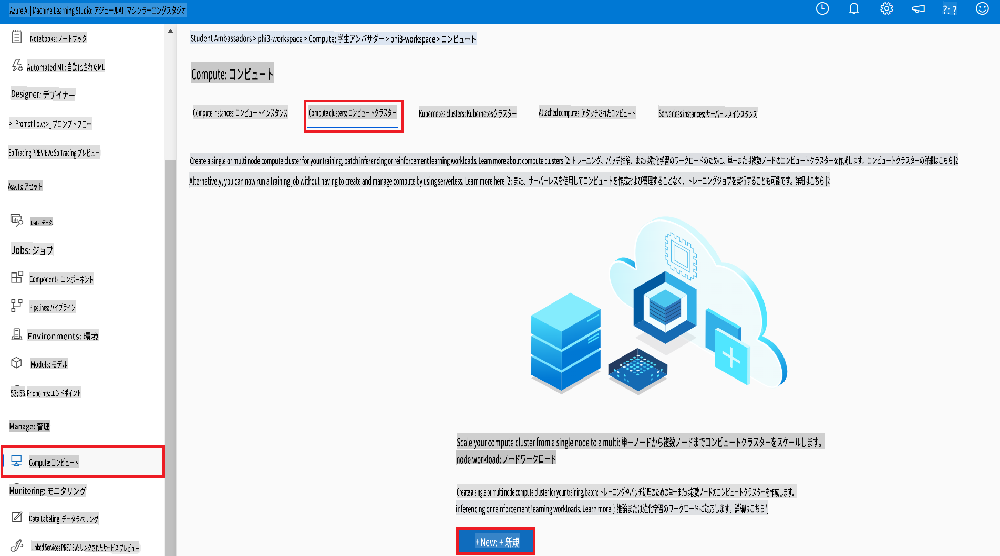

1. 以下のタスクを実行します：

    - 使用したい **Region** を選択します。
    - **Virtual machine tier** を **Dedicated** に設定します。
    - **Virtual machine type** を **GPU** に設定します。
    - **Virtual machine size** のフィルタを **Select from all options** に設定します。
    - **Virtual machine size** を **Standard_NC24ads_A100_v4** に設定します。

    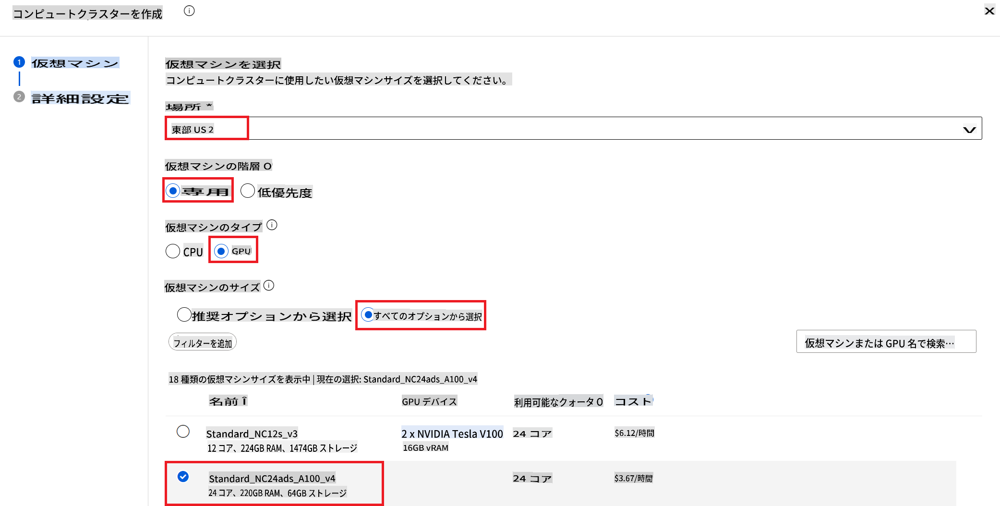

1. **Next** を選択します。

1. 以下のタスクを実行します：

    - **Compute name** を入力します。一意の値である必要があります。
    - **Minimum number of nodes** を **0** に設定します。
    - **Maximum number of nodes** を **1** に設定します。
    - **Idle seconds before scale down** を **120** に設定します。

    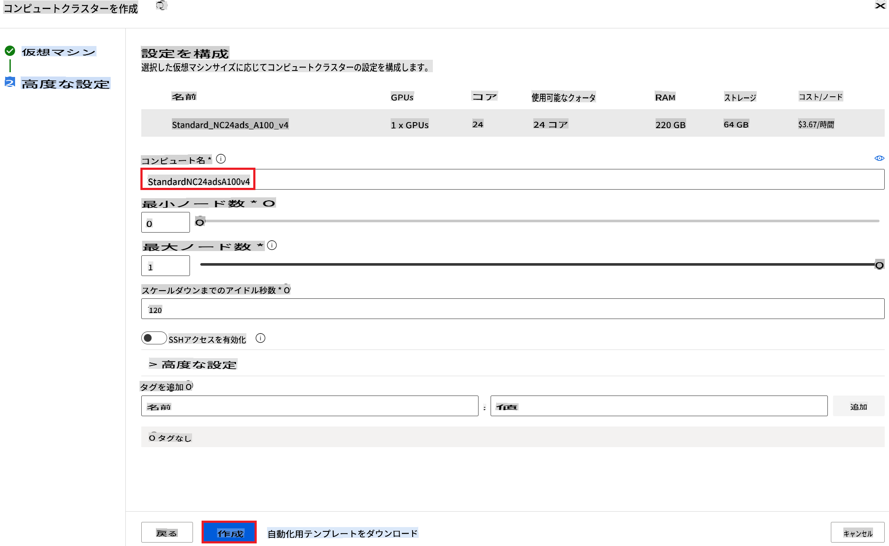

1. **Create** を選択します。

#### Phi-3 モデルのファインチューニング

1. [Azure ML Studio](https://ml.azure.com/home?wt.mc_id=studentamb_279723) を開きます。

1. 作成した Azure Machine Learning ワークスペースを選択します。

    

1. 以下のタスクを実行します：

    - 左側のタブから **Model catalog** を選択します。
    - **検索バー**に *phi-3-mini-4k* と入力し、表示されるオプションから **Phi-3-mini-4k-instruct** を選択します。

    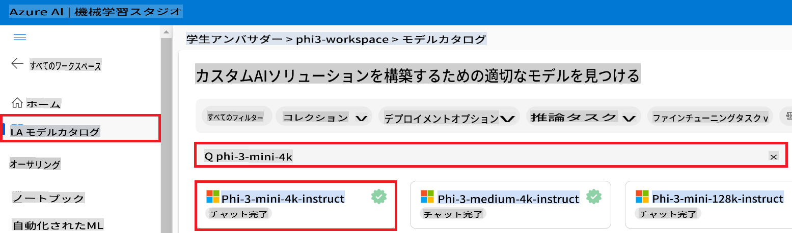

1. ナビゲーションメニューから **Fine-tune** を選択します。

    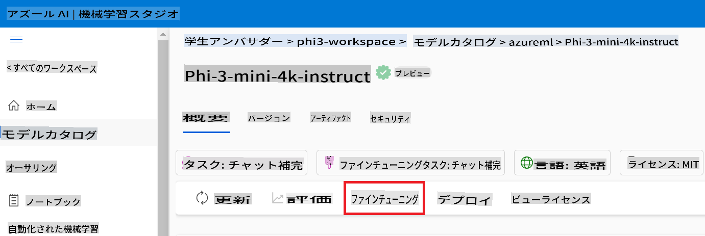

1. 以下のタスクを実行します：

    - **Select task type** を **Chat completion** に設定します。
    - **+ Select data** を選択して **Traning data** をアップロードします。
    - 検証データのアップロードタイプを **Provide different validation data** に設定します。
    - **+ Select data** を選択して **Validation data** をアップロードします。

    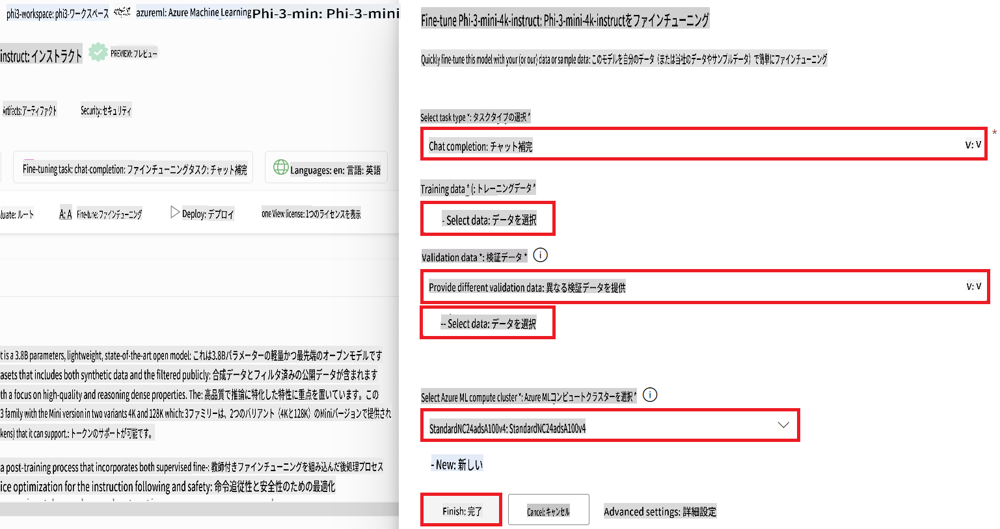

    > [!TIP]
    >
    > **Advanced settings** を選択して、**learning_rate** や **lr_scheduler_type** などの設定をカスタマイズし、ファインチューニングプロセスを最適化することができます。

1. **Finish** を選択します。

1. この演習では、Azure Machine Learning を使用して Phi-3 モデルのファインチューニングを成功させました。ファインチューニングプロセスにはかなりの時間がかかる場合があります。ジョブを実行した後は完了するまで待つ必要があります。Azure Machine Learning ワークスペースの左側の **Jobs** タブに移動して、ファインチューニングジョブのステータスを監視できます。次のシリーズでは、ファインチューニングされたモデルをデプロイし、Prompt flow と統合します。

    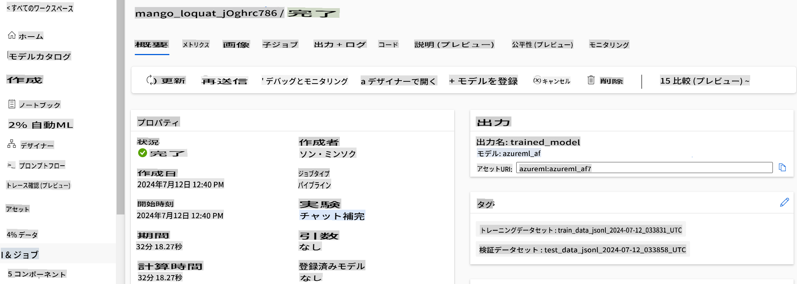

### ファインチューニングされた Phi-3 モデルのデプロイ

ファインチューニングされた Phi-3 モデルを Prompt flow と統合するには、モデルをデプロイしてリアルタイム推論にアクセス可能にする必要があります。このプロセスには、モデルの登録、オンラインエンドポイントの作成、およびモデルのデプロイが含まれます。

この演習では以下を行います：

- ファインチューニングされたモデルを Azure Machine Learning ワークスペースに登録します。
- オンラインエンドポイントを作成します。
- 登録されたファインチューニング済み Phi-3 モデルをデプロイします。

#### ファインチューニングされたモデルの登録

1. [Azure ML Studio](https://ml.azure.com/home?wt.mc_id=studentamb_279723) を開きます。

1. 作成した Azure Machine Learning ワークスペースを選択します。

    

1. 左側のタブから **Models** を選択します。
1. **+ Register** を選択します。
1. **From a job output** を選択します。

    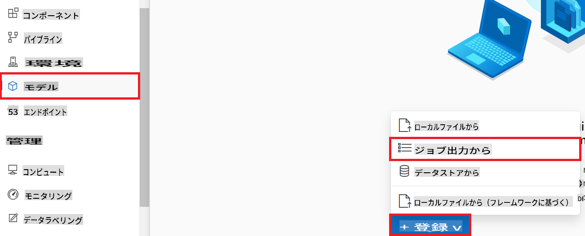

1. 作成したジョブを選択します。

    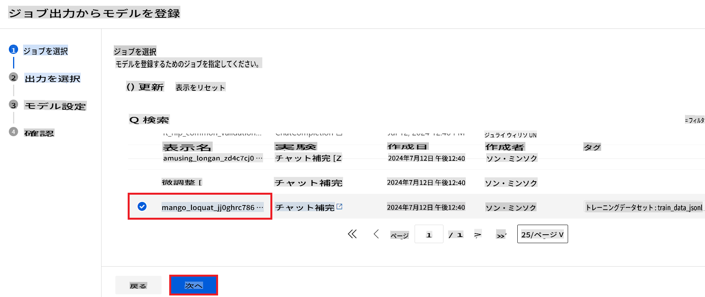

1. **Next** を選択します。

1. **Model type** を **MLflow** に設定します。

1. **Job output** が選択されていることを確認します（自動的に選択されているはずです）。

    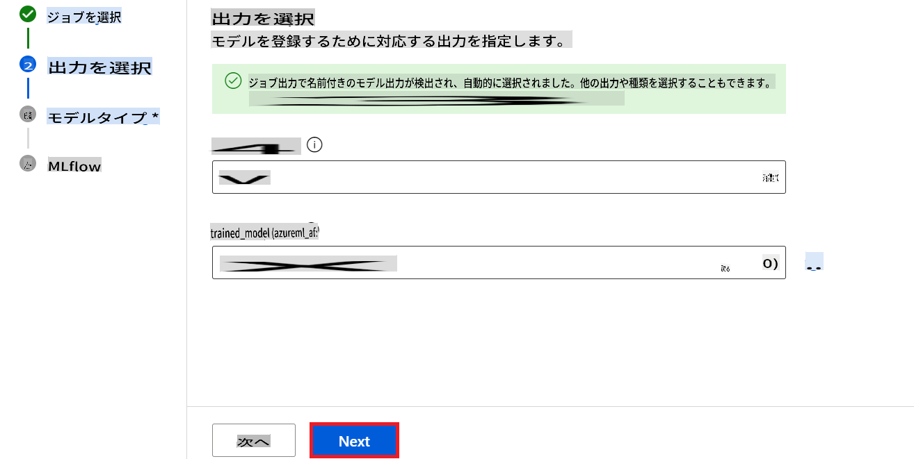

2. **Next** を選択します。

3. **Register** を選択します。

    

4. 左側のタブから **Models** メニューに移動して、登録されたモデルを確認できます。

    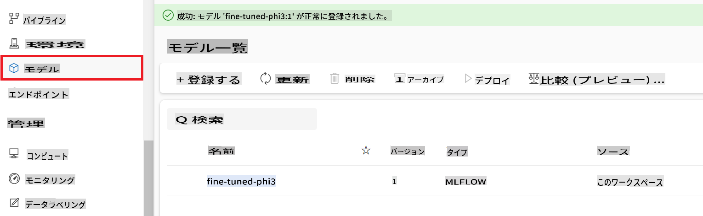

#### ファインチューニングされたモデルのデプロイ

1. 作成した Azure Machine Learning ワークスペースに移動します。

1. 左側のタブから **Endpoints** を選択します。

1. ナビゲーションメニューから **Real-time endpoints** を選択します。

    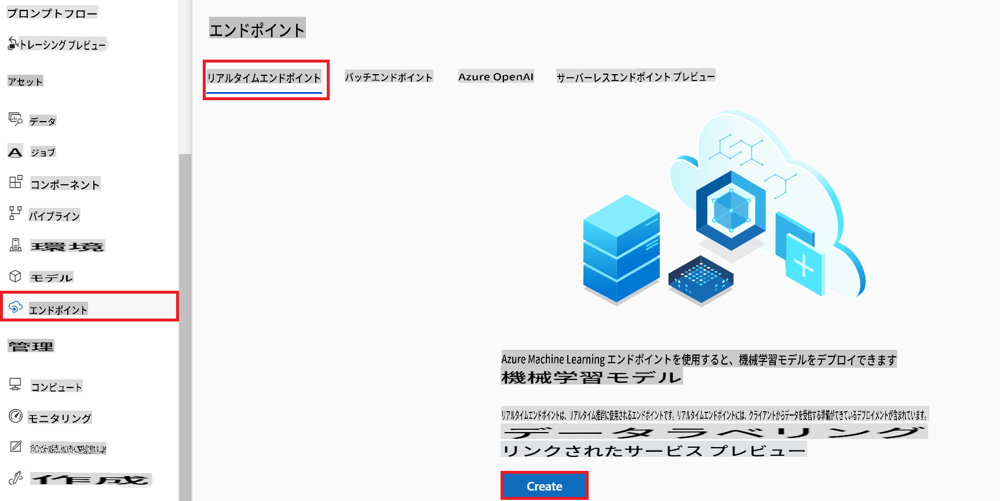

1. **Create** を選択します。

1. 登録されたモデルを選択します。

    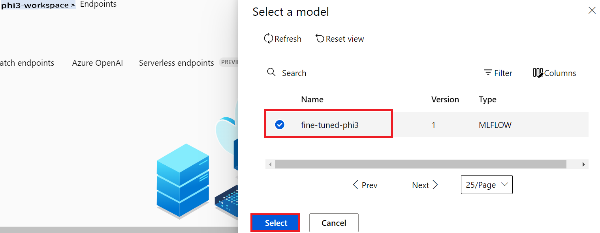

1. **Select** を選択します。

1. 以下のタスクを実行します：

    - **Virtual machine** を *Standard_NC6s_v3* に設定します。
    - 使用する **Instance count** を選択します（例：*1*）。
    - **Endpoint** を **New** に設定して新しいエンドポイントを作成します。
    - **Endpoint name** を入力します。一意の値である必要があります。
    - **Deployment name** を入力します。一意の値である必要があります。

    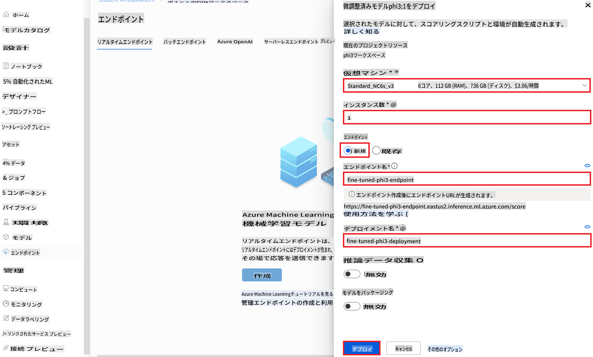

1. **Deploy** を選択します。

> [!WARNING]
> アカウントに追加の課金が発生しないように、Azure Machine Learning ワークスペースで作成したエンドポイントを削除することを忘れないでください。
>

#### Azure Machine Learning ワークスペースでデプロイステータスを確認する

1. 作成した Azure Machine Learning ワークスペースに移動します。

1. 左側のタブから **Endpoints** を選択します。

1. 作成したエンドポイントを選択します。

    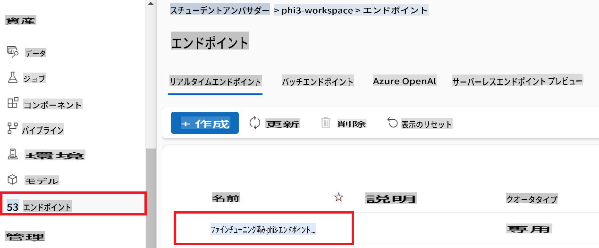

1. このページでは、デプロイプロセス中にエンドポイントを管理できます。

> [!NOTE]
> デプロイが完了したら、**Live traffic** が **100%** に設定されていることを確認してください。設定されていない場合は、**Update traffic** を選択してトラフィック設定を調整してください。トラフィックが 0% に設定されている場合、モデルをテストすることはできません。
>
> 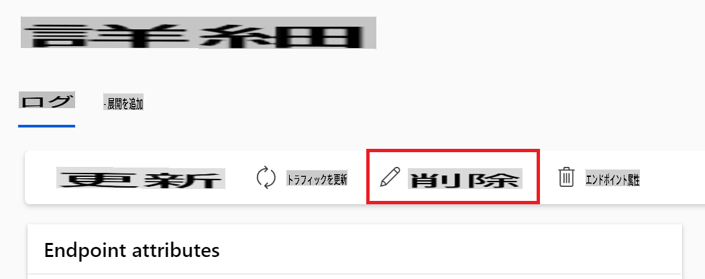
>

## シナリオ 3: Prompt flow と統合し、カスタムモデルを Azure AI Foundry で使用する

### カスタム Phi-3 モデルを Prompt flow と統合する

ファインチューニング済みモデルをデプロイした後、Prompt Flow に統合してリアルタイムアプリケーションでモデルを使用できるようになります。これにより、カスタム Phi-3 モデルを使用してさまざまなインタラクティブタスクを実行することが可能になります。

この演習では以下を行います：

- Azure AI Foundry Hub を作成します。
- Azure AI Foundry Project を作成します。
- Prompt flow を作成します。
- ファインチューニング済み Phi-3 モデル用のカスタム接続を追加します。
- Prompt flow を設定してカスタム Phi-3 モデルとチャットします。

> [!NOTE]
> Azure ML Studio を使用して Promptflow と統合することもできます。同じ統合プロセスを Azure ML Studio に適用することが可能です。

#### Azure AI Foundry Hub を作成する

Project を作成する前に Hub を作成する必要があります。Hub はリソースグループのような役割を果たし、Azure AI Foundry 内で複数の Project を整理および管理できます。

1. [Azure AI Foundry](https://ai.azure.com/?WT.mc_id=aiml-137032-kinfeylo) を開きます。

1. 左側のタブから **All hubs** を選択します。

1. ナビゲーションメニューから **+ New hub** を選択します。

    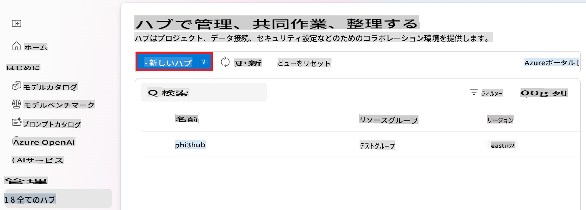

1. 以下のタスクを実行します：

    - **Hub name** を入力します。一意の値である必要があります。
    - 使用する Azure **Subscription** を選択します。
    - 使用する **Resource group** を選択します（必要に応じて新規作成します）。
    - 使用したい **Location** を選択します。
    - 使用する **Connect Azure AI Services** を選択します（必要に応じて新規作成します）。
    - **Connect Azure AI Search** を **Skip connecting** に設定します。

    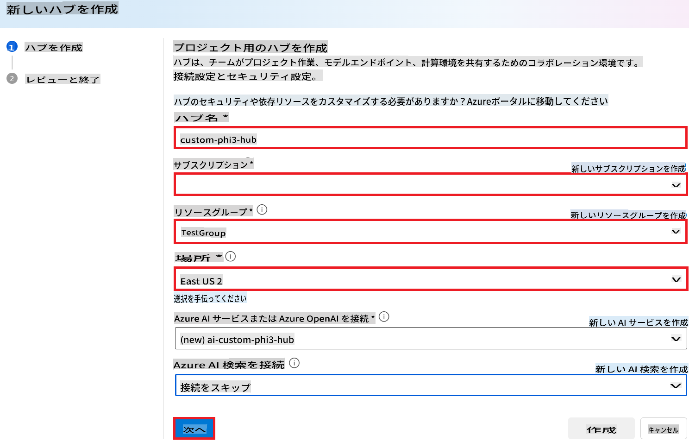

1. **Next** を選択します。

#### Azure AI Foundry Project を作成する

1. 作成した Hub で、左側のタブから **All projects** を選択します。

1. ナビゲーションメニューから **+ New project** を選択します。

    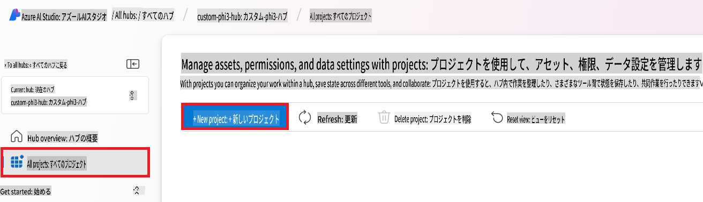

1. **Project name** を入力します。一意の値である必要があります。

    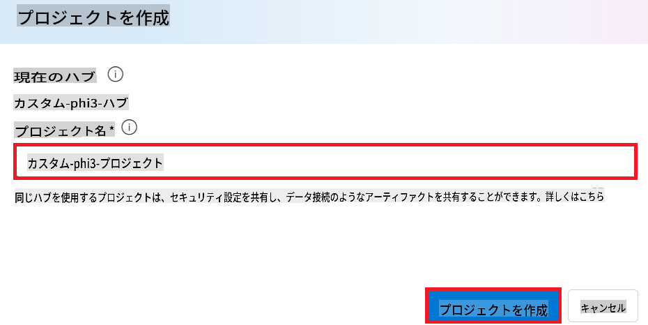

1. **Create a project** を選択します。

#### ファインチューニング済み Phi-3 モデル用のカスタム接続を追加する

カスタム Phi-3 モデルを Prompt flow に統合するには、モデルのエンドポイントとキーをカスタム接続に保存する必要があります。この設定により、Prompt flow でカスタム Phi-3 モデルにアクセスできるようになります。

#### ファインチューニング済み Phi-3 モデルの API キーとエンドポイント URI を設定する

1. [Azure ML Studio](https://ml.azure.com/home?WT.mc_id=aiml-137032-kinfeylo) を開きます。

1. 作成した Azure Machine Learning ワークスペースに移動します。

1. 左側のタブから **Endpoints** を選択します。

    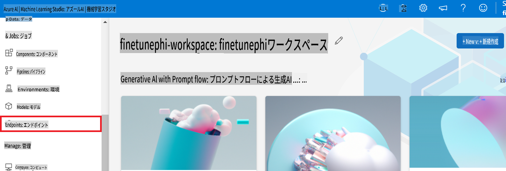

1. 作成したエンドポイントを選択します。

    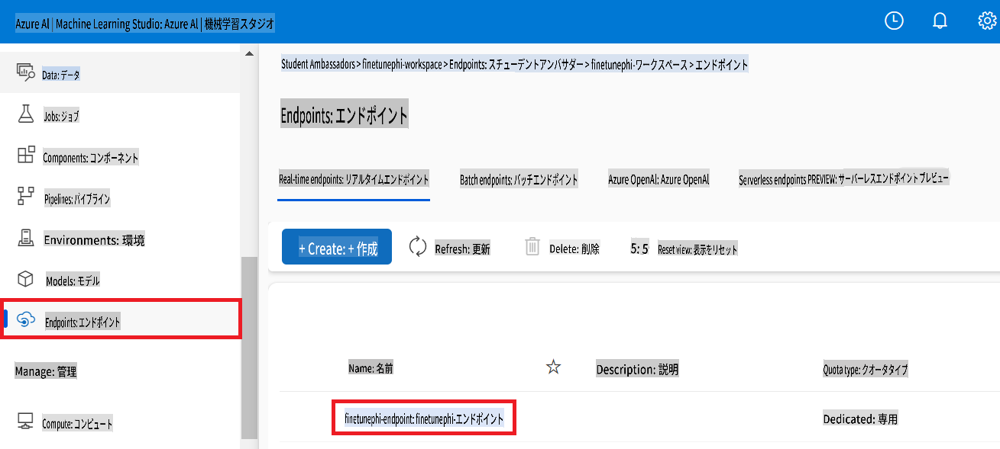

1. ナビゲーションメニューから **Consume** を選択します。

1. **REST endpoint** と **Primary key** をコピーします。
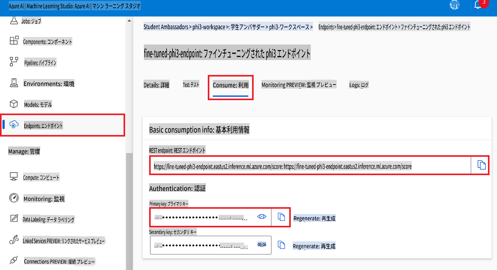

#### カスタム接続を追加する

1. [Azure AI Foundry](https://ai.azure.com/?WT.mc_id=aiml-137032-kinfeylo)を開きます。

1. 作成したAzure AI Foundryプロジェクトに移動します。

1. 作成したプロジェクトで、左側のタブから**Settings**を選択します。

1. **+ New connection**を選択します。

    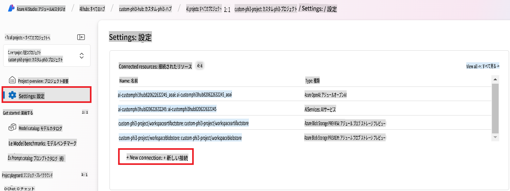

1. ナビゲーションメニューから**Custom keys**を選択します。

    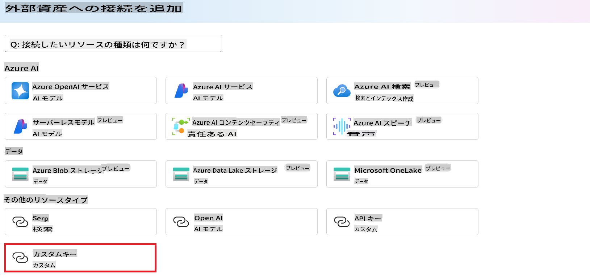

1. 以下の作業を行います：

    - **+ Add key value pairs**を選択します。
    - キー名に**endpoint**を入力し、Azure ML Studioからコピーしたエンドポイントを値フィールドに貼り付けます。
    - 再度**+ Add key value pairs**を選択します。
    - キー名に**key**を入力し、Azure ML Studioからコピーしたキーを値フィールドに貼り付けます。
    - キーを追加した後、**is secret**を選択してキーが公開されないようにします。

    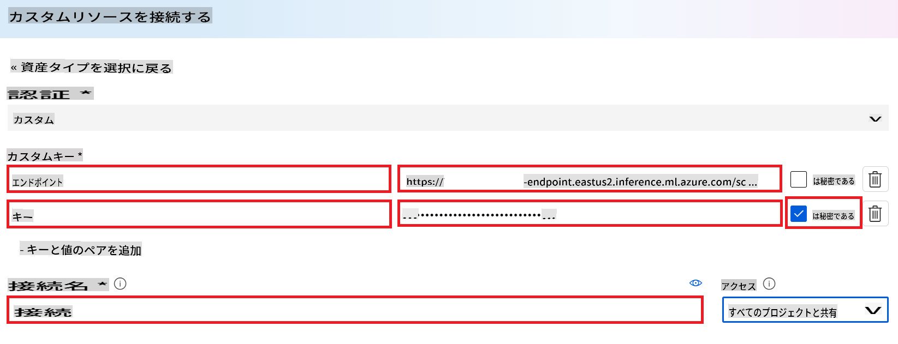

1. **Add connection**を選択します。

#### Prompt flowを作成する

Azure AI Foundryにカスタム接続を追加しました。次に、以下の手順を使用してPrompt flowを作成します。その後、このPrompt flowをカスタム接続に接続し、Prompt flow内でファインチューニング済みモデルを使用できるようにします。

1. 作成したAzure AI Foundryプロジェクトに移動します。

1. 左側のタブから**Prompt flow**を選択します。

1. ナビゲーションメニューから**+ Create**を選択します。

    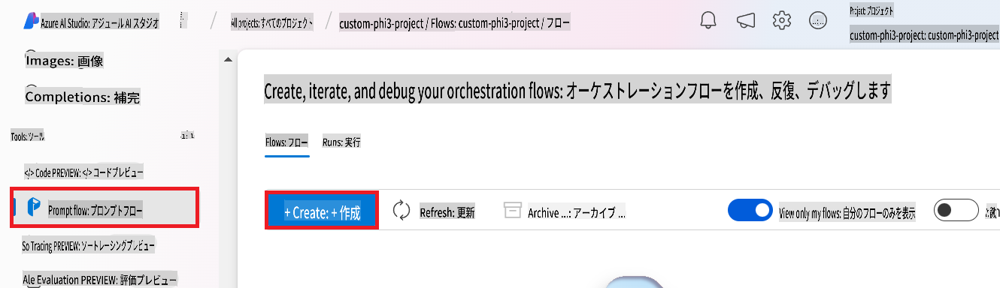

1. ナビゲーションメニューから**Chat flow**を選択します。

    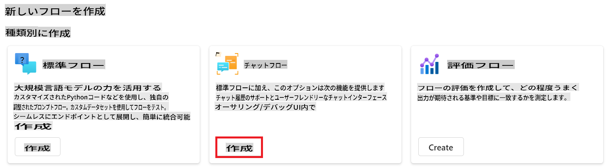

1. 使用する**Folder name**を入力します。

    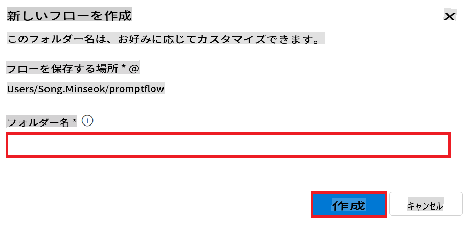

2. **Create**を選択します。

#### カスタムPhi-3モデルとチャットするためのPrompt flowを設定する

ファインチューニング済みのPhi-3モデルをPrompt flowに統合する必要があります。ただし、提供されている既存のPrompt flowはこの目的には設計されていません。そのため、カスタムモデルを統合できるようにPrompt flowを再設計する必要があります。

1. Prompt flow内で、以下の作業を行い既存のフローを再構築します：

    - **Raw file mode**を選択します。
    - *flow.dag.yml*ファイル内の既存のコードをすべて削除します。
    - 以下のコードを*flow.dag.yml*ファイルに追加します。

        ```yml
        inputs:
          input_data:
            type: string
            default: "Who founded Microsoft?"

        outputs:
          answer:
            type: string
            reference: ${integrate_with_promptflow.output}

        nodes:
        - name: integrate_with_promptflow
          type: python
          source:
            type: code
            path: integrate_with_promptflow.py
          inputs:
            input_data: ${inputs.input_data}
        ```

    - **Save**を選択します。

    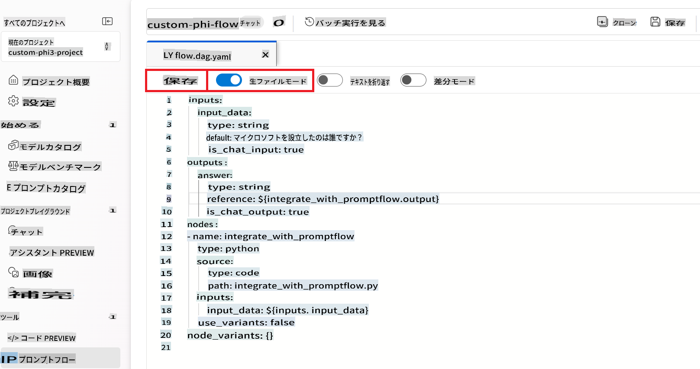

1. カスタムPhi-3モデルをPrompt flowで使用するために、以下のコードを*integrate_with_promptflow.py*ファイルに追加します。

    ```python
    import logging
    import requests
    from promptflow import tool
    from promptflow.connections import CustomConnection

    # Logging setup
    logging.basicConfig(
        format="%(asctime)s - %(levelname)s - %(name)s - %(message)s",
        datefmt="%Y-%m-%d %H:%M:%S",
        level=logging.DEBUG
    )
    logger = logging.getLogger(__name__)

    def query_phi3_model(input_data: str, connection: CustomConnection) -> str:
        """
        Send a request to the Phi-3 model endpoint with the given input data using Custom Connection.
        """

        # "connection" is the name of the Custom Connection, "endpoint", "key" are the keys in the Custom Connection
        endpoint_url = connection.endpoint
        api_key = connection.key

        headers = {
            "Content-Type": "application/json",
            "Authorization": f"Bearer {api_key}"
        }
        data = {
            "input_data": {
                "input_string": [
                    {"role": "user", "content": input_data}
                ],
                "parameters": {
                    "temperature": 0.7,
                    "max_new_tokens": 128
                }
            }
        }
        try:
            response = requests.post(endpoint_url, json=data, headers=headers)
            response.raise_for_status()
            
            # Log the full JSON response
            logger.debug(f"Full JSON response: {response.json()}")

            result = response.json()["output"]
            logger.info("Successfully received response from Azure ML Endpoint.")
            return result
        except requests.exceptions.RequestException as e:
            logger.error(f"Error querying Azure ML Endpoint: {e}")
            raise

    @tool
    def my_python_tool(input_data: str, connection: CustomConnection) -> str:
        """
        Tool function to process input data and query the Phi-3 model.
        """
        return query_phi3_model(input_data, connection)

    ```

    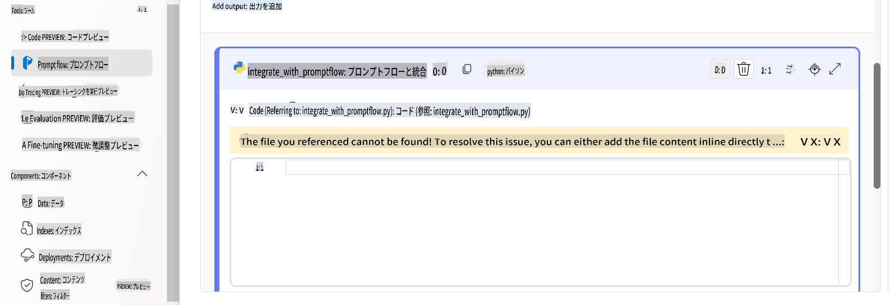

> [!NOTE]
> Azure AI FoundryでPrompt flowを使用する方法についての詳細は、[Prompt flow in Azure AI Foundry](https://learn.microsoft.com/azure/ai-studio/how-to/prompt-flow)を参照してください。

1. **Chat input**と**Chat output**を選択し、モデルとのチャットを有効にします。

    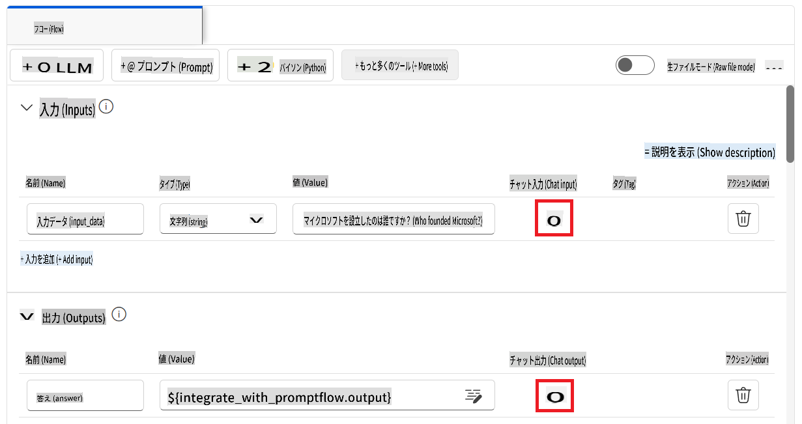

1. これでカスタムPhi-3モデルとのチャットが可能になりました。次の演習では、Prompt flowを起動し、ファインチューニング済みPhi-3モデルとのチャットを行う方法を学びます。

> [!NOTE]
>
> 再構築されたフローは以下の画像のようになります：
>
> 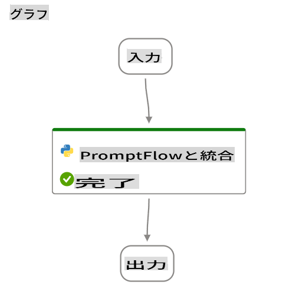
>

### カスタムPhi-3モデルとのチャット

ファインチューニングを行い、カスタムPhi-3モデルをPrompt flowに統合したので、これでモデルと対話を開始する準備が整いました。この演習では、Prompt flowを使用してモデルとのチャットを設定し開始する手順を説明します。これにより、ファインチューニング済みPhi-3モデルの機能をさまざまなタスクや会話で最大限に活用できるようになります。

- Prompt flowを使用してカスタムPhi-3モデルとチャットします。

#### Prompt flowを開始する

1. **Start compute sessions**を選択してPrompt flowを開始します。

    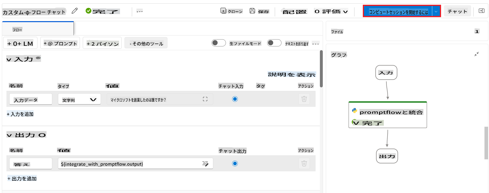

1. **Validate and parse input**を選択してパラメータを更新します。

    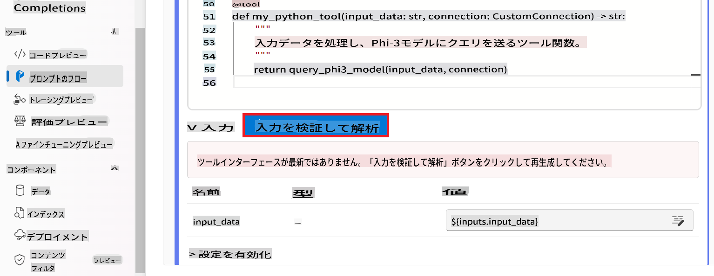

1. **connection**の**Value**に作成したカスタム接続を選択します。例：*connection*。

    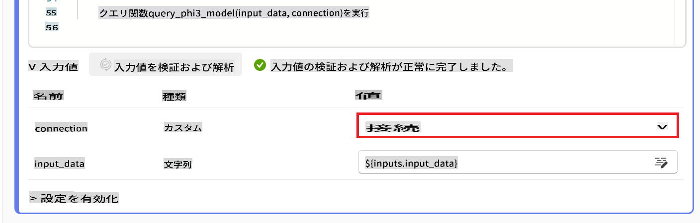

#### カスタムモデルとチャットする

1. **Chat**を選択します。

    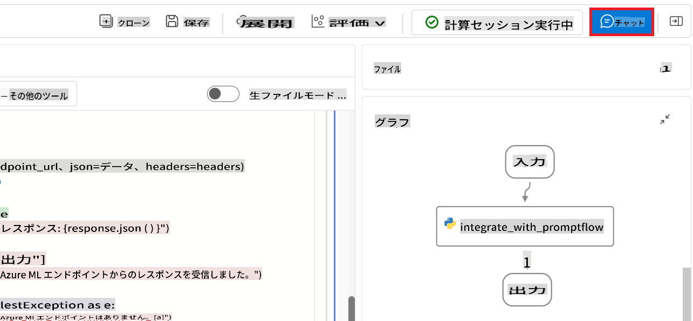

1. 以下は結果の例です：これでカスタムPhi-3モデルとチャットできます。ファインチューニングに使用したデータに基づいた質問をすることをお勧めします。

    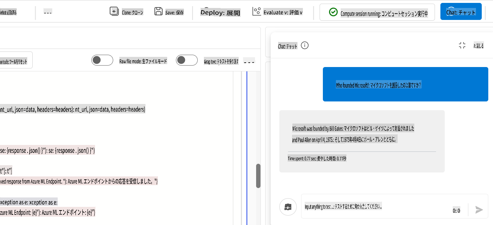

**免責事項**:  
この文書は、機械ベースのAI翻訳サービスを使用して翻訳されています。正確性を追求しておりますが、自動翻訳には誤りや不正確さが含まれる可能性があります。元の言語で記載された原文を信頼できる情報源としてご参照ください。重要な情報については、専門の人間による翻訳をお勧めします。この翻訳の使用に起因する誤解や解釈の誤りについて、当方は一切の責任を負いかねます。