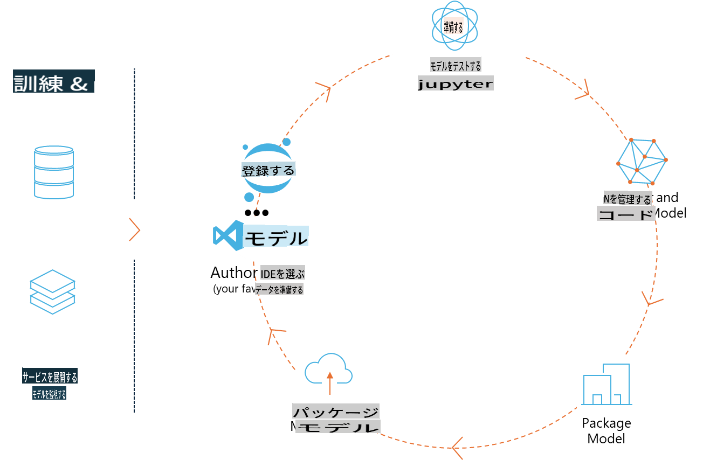
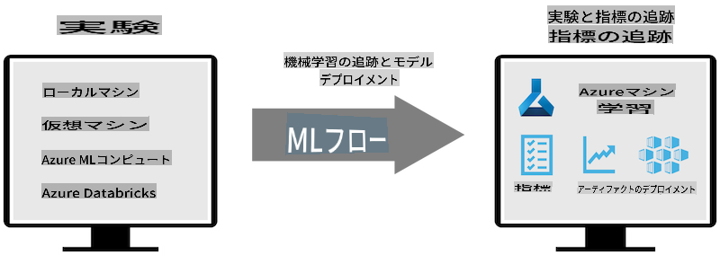
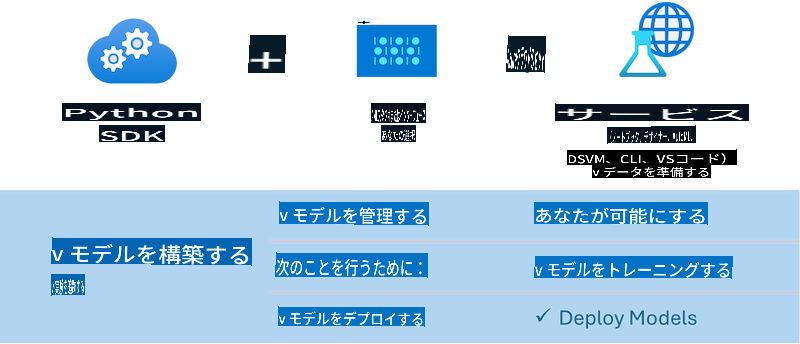

# MLflow

[MLflow](https://mlflow.org/) は、機械学習のライフサイクル全体を管理するために設計されたオープンソースプラットフォームです。



MLFlowは、実験、再現性、デプロイメント、中央モデルレジストリを含むMLライフサイクルを管理するために使用されます。現在、MLFlowは以下の4つのコンポーネントを提供しています。

- **MLflow Tracking:** 実験、コード、データ設定、結果を記録し、クエリを実行します。
- **MLflow Projects:** データサイエンスコードを、どのプラットフォームでも実行可能な形式でパッケージ化します。
- **MLflow Models:** 様々な提供環境で機械学習モデルをデプロイします。
- **Model Registry:** モデルを中央リポジトリに保存、注釈付け、管理します。

MLFlowには、実験の追跡、コードの再現可能な実行へのパッケージ化、モデルの共有とデプロイメントのための機能が含まれています。MLFlowはDatabricksに統合されており、様々なMLライブラリをサポートしているため、ライブラリに依存しません。REST APIとCLIを提供しているため、任意の機械学習ライブラリやプログラミング言語で使用できます。



MLFlowの主な特徴は以下の通りです：

- **実験追跡:** パラメータと結果を記録して比較します。
- **モデル管理:** モデルを様々な提供・推論プラットフォームにデプロイします。
- **モデルレジストリ:** MLflowモデルのライフサイクルをバージョン管理や注釈付けを含めて共同管理します。
- **プロジェクト:** MLコードを共有や本番利用のためにパッケージ化します。

MLFlowはまた、データの準備、モデルの登録と管理、モデルの実行用パッケージ化、サービスのデプロイ、モデルの監視を含むMLOpsループもサポートしています。特にクラウドやエッジ環境で、プロトタイプから本番ワークフローへの移行プロセスを簡素化することを目指しています。

## E2Eシナリオ - ラッパーを構築し、Phi-3をMLFlowモデルとして使用する

このE2Eサンプルでは、Phi-3小型言語モデル（SLM）をラップする2つの異なるアプローチを示し、それをMLFlowモデルとしてローカルまたはクラウド（例：Azure Machine Learningワークスペース）で実行します。



| プロジェクト | 説明 | 場所 |
| ------------ | ----------- | -------- |
| Transformer Pipeline | Transformer Pipelineは、HuggingFaceモデルをMLFlowの実験的なtransformersフレーバーと共に使用する場合に、ラッパーを構築する最も簡単なオプションです。 | [**TransformerPipeline.ipynb**](../../../../../../code/06.E2E/E2E_Phi-3-MLflow_TransformerPipeline.ipynb) |
| カスタムPythonラッパー | 記述時点では、transformer pipelineはHuggingFaceモデルのONNX形式に対するMLFlowラッパー生成を、実験的なoptimum Pythonパッケージを使用してもサポートしていませんでした。このような場合には、MLFlowモードのためにカスタムPythonラッパーを構築することができます。 | [**CustomPythonWrapper.ipynb**](../../../../../../code/06.E2E/E2E_Phi-3-MLflow_CustomPythonWrapper.ipynb) |

## プロジェクト: Transformer Pipeline

1. MLFlowとHuggingFaceから関連するPythonパッケージが必要です：

    ``` Python
    import mlflow
    import transformers
    ```

2. 次に、HuggingFaceレジストリ内の対象Phi-3モデルを参照して、transformer pipelineを初期化します。_Phi-3-mini-4k-instruct_のモデルカードからわかるように、そのタスクは「テキスト生成」タイプです：

    ``` Python
    pipeline = transformers.pipeline(
        task = "text-generation",
        model = "microsoft/Phi-3-mini-4k-instruct"
    )
    ```

3. Phi-3モデルのtransformer pipelineをMLFlow形式で保存し、対象アーティファクトパス、特定のモデル設定、推論APIタイプなどの追加情報を提供します：

    ``` Python
    model_info = mlflow.transformers.log_model(
        transformers_model = pipeline,
        artifact_path = "phi3-mlflow-model",
        model_config = model_config,
        task = "llm/v1/chat"
    )
    ```

## プロジェクト: カスタムPythonラッパー

1. ここではMicrosoftの[ONNX Runtime generate() API](https://github.com/microsoft/onnxruntime-genai)を利用して、ONNXモデルの推論およびトークンのエンコード/デコードを行います。以下の例ではCPUを対象にした_onnxruntime_genai_パッケージを選択します：

    ``` Python
    import mlflow
    from mlflow.models import infer_signature
    import onnxruntime_genai as og
    ```

1. カスタムクラスは、以下の2つのメソッドを実装します：_load_context()_ はPhi-3 Mini 4K Instructの**ONNXモデル**、**生成パラメータ**、**トークナイザー**を初期化し、_predict()_ は提供されたプロンプトに対して出力トークンを生成します：

    ``` Python
    class Phi3Model(mlflow.pyfunc.PythonModel):
        def load_context(self, context):
            # Retrieving model from the artifacts
            model_path = context.artifacts["phi3-mini-onnx"]
            model_options = {
                 "max_length": 300,
                 "temperature": 0.2,         
            }
        
            # Defining the model
            self.phi3_model = og.Model(model_path)
            self.params = og.GeneratorParams(self.phi3_model)
            self.params.set_search_options(**model_options)
            
            # Defining the tokenizer
            self.tokenizer = og.Tokenizer(self.phi3_model)
    
        def predict(self, context, model_input):
            # Retrieving prompt from the input
            prompt = model_input["prompt"][0]
            self.params.input_ids = self.tokenizer.encode(prompt)
    
            # Generating the model's response
            response = self.phi3_model.generate(self.params)
    
            return self.tokenizer.decode(response[0][len(self.params.input_ids):])
    ```

1. _mlflow.pyfunc.log_model()_ 関数を使用して、Phi-3モデルのカスタムPythonラッパー（ピクル形式）を生成し、元のONNXモデルおよび必要な依存関係を含めます：

    ``` Python
    model_info = mlflow.pyfunc.log_model(
        artifact_path = artifact_path,
        python_model = Phi3Model(),
        artifacts = {
            "phi3-mini-onnx": "cpu_and_mobile/cpu-int4-rtn-block-32-acc-level-4",
        },
        input_example = input_example,
        signature = infer_signature(input_example, ["Run"]),
        extra_pip_requirements = ["torch", "onnxruntime_genai", "numpy"],
    )
    ```

## 生成されたMLFlowモデルのシグネチャ

1. 上記のTransformer Pipelineプロジェクトのステップ3では、MLFlowモデルのタスクを「_llm/v1/chat_」に設定しました。この指示により、以下のようにOpenAIのChat APIと互換性のあるモデルのAPIラッパーが生成されます：

    ``` Python
    {inputs: 
      ['messages': Array({content: string (required), name: string (optional), role: string (required)}) (required), 'temperature': double (optional), 'max_tokens': long (optional), 'stop': Array(string) (optional), 'n': long (optional), 'stream': boolean (optional)],
    outputs: 
      ['id': string (required), 'object': string (required), 'created': long (required), 'model': string (required), 'choices': Array({finish_reason: string (required), index: long (required), message: {content: string (required), name: string (optional), role: string (required)} (required)}) (required), 'usage': {completion_tokens: long (required), prompt_tokens: long (required), total_tokens: long (required)} (required)],
    params: 
      None}
    ```

1. その結果、以下の形式でプロンプトを送信できます：

    ``` Python
    messages = [{"role": "user", "content": "What is the capital of Spain?"}]
    ```

1. 次に、OpenAI API互換の後処理（例：_response[0][‘choices’][0][‘message’][‘content’]_）を使用して、以下のような出力を整形します：

    ``` JSON
    Question: What is the capital of Spain?
    
    Answer: The capital of Spain is Madrid. It is the largest city in Spain and serves as the political, economic, and cultural center of the country. Madrid is located in the center of the Iberian Peninsula and is known for its rich history, art, and architecture, including the Royal Palace, the Prado Museum, and the Plaza Mayor.
    
    Usage: {'prompt_tokens': 11, 'completion_tokens': 73, 'total_tokens': 84}
    ```

1. 上記のCustom Python Wrapperプロジェクトのステップ3では、与えられた入力例からMLFlowパッケージがモデルのシグネチャを生成できるようにしました。我々のMLFlowラッパーのシグネチャは以下のようになります：

    ``` Python
    {inputs: 
      ['prompt': string (required)],
    outputs: 
      [string (required)],
    params: 
      None}
    ```

1. そのため、プロンプトには以下のように"prompt"という辞書キーが必要です：

    ``` Python
    {"prompt": "<|system|>You are a stand-up comedian.<|end|><|user|>Tell me a joke about atom<|end|><|assistant|>",}
    ```

1. モデルの出力は文字列形式で提供されます：

    ``` JSON
    Alright, here's a little atom-related joke for you!
    
    Why don't electrons ever play hide and seek with protons?
    
    Because good luck finding them when they're always "sharing" their electrons!
    
    Remember, this is all in good fun, and we're just having a little atomic-level humor!
    ```

**免責事項**:  
この文書は、機械ベースのAI翻訳サービスを使用して翻訳されています。正確さを期すよう努めていますが、自動翻訳には誤りや不正確さが含まれる可能性があります。元の言語で記載された文書が公式な情報源と見なされるべきです。重要な情報については、専門の人間による翻訳をお勧めします。本翻訳の使用に起因する誤解や解釈の誤りについて、当社は一切の責任を負いません。