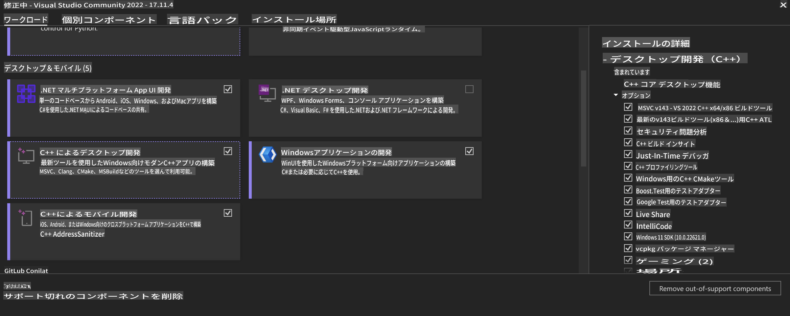
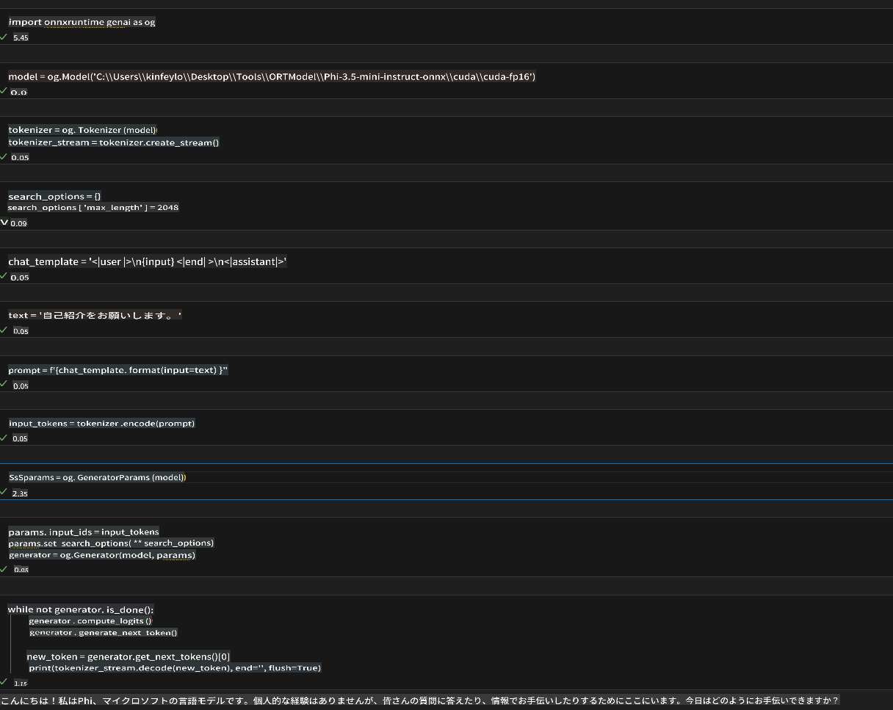
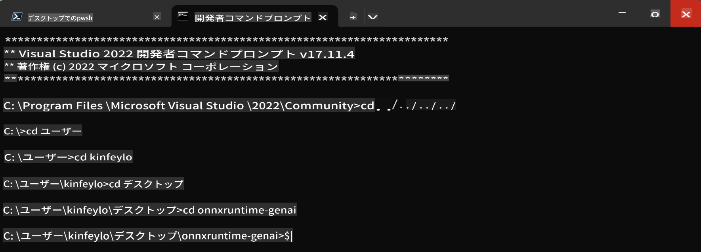

# **OnnxRuntime GenAI Windows GPU ガイドライン**

このガイドラインは、Windows上でGPUを使用したONNX Runtime (ORT) のセットアップと利用手順を提供します。GPU加速を活用してモデルのパフォーマンスと効率を向上させるための手助けとなるよう設計されています。

このドキュメントでは以下について説明します:

- **環境設定**: CUDA、cuDNN、ONNX Runtimeなど必要な依存関係のインストール手順
- **設定**: GPUリソースを効果的に活用するための環境およびONNX Runtimeの設定方法
- **最適化のヒント**: GPU設定を微調整して最適なパフォーマンスを得るためのアドバイス

### **1. Python 3.10.x /3.11.8**

   ***Note*** [miniforge](https://github.com/conda-forge/miniforge/releases/latest/download/Miniforge3-Windows-x86_64.exe) をPython環境として使用することを推奨します。

   ```bash

   conda create -n pydev python==3.11.8

   conda activate pydev

   ```

   ***Reminder*** Python用ONNXライブラリをすでにインストールしている場合は、アンインストールしてください。

### **2. wingetでCMakeをインストール**

   ```bash

   winget install -e --id Kitware.CMake

   ```

### **3. Visual Studio 2022 - C++によるデスクトップ開発をインストール**

   ***Note*** コンパイルを行わない場合はこのステップをスキップできます。



### **4. NVIDIA ドライバのインストール**

1. **NVIDIA GPU ドライバ** [https://www.nvidia.com/en-us/drivers/](https://www.nvidia.com/en-us/drivers/)

2. **NVIDIA CUDA 12.4** [https://developer.nvidia.com/cuda-12-4-0-download-archive](https://developer.nvidia.com/cuda-12-4-0-download-archive)

3. **NVIDIA CUDNN 9.4** [https://developer.nvidia.com/cudnn-downloads](https://developer.nvidia.com/cudnn-downloads)

***Reminder*** インストールフローではデフォルト設定を使用してください。

### **5. NVIDIA 環境の設定**

NVIDIA CUDNN 9.4 のlib, bin, includeをNVIDIA CUDA 12.4のlib, bin, includeにコピーします。

- *'C:\Program Files\NVIDIA\CUDNN\v9.4\bin\12.6'* のファイルを *'C:\Program Files\NVIDIA GPU Computing Toolkit\CUDA\v12.4\bin'* にコピー

- *'C:\Program Files\NVIDIA\CUDNN\v9.4\include\12.6'* のファイルを *'C:\Program Files\NVIDIA GPU Computing Toolkit\CUDA\v12.4\include'* にコピー

- *'C:\Program Files\NVIDIA\CUDNN\v9.4\lib\12.6'* のファイルを *'C:\Program Files\NVIDIA GPU Computing Toolkit\CUDA\v12.4\lib\x64'* にコピー

### **6. Phi-3.5-mini-instruct-onnx のダウンロード**

   ```bash

   winget install -e --id Git.Git

   winget install -e --id GitHub.GitLFS

   git lfs install

   git clone https://huggingface.co/microsoft/Phi-3.5-mini-instruct-onnx

   ```

### **7. InferencePhi35Instruct.ipynb を実行**

   [Notebook](../../../../../../code/09.UpdateSamples/Aug/ortgpu-phi35-instruct.ipynb) を開いて実行します。



### **8. ORT GenAI GPU のコンパイル**

   ***Note*** 
   
   1. まず、onnx、onnxruntime、onnxruntime-genaiに関連するすべてをアンインストールしてください。

   ```bash

   pip list 
   
   ```

   次に、すべてのonnxruntimeライブラリをアンインストールします。例:

   ```bash

   pip uninstall onnxruntime

   pip uninstall onnxruntime-genai

   pip uninstall onnxruntume-genai-cuda
   
   ```

   2. Visual Studio Extension サポートの確認

   *C:\Program Files\NVIDIA GPU Computing Toolkit\CUDA\v12.4\extras* に *visual_studio_integration* があることを確認してください。

   見つからない場合は、他のCUDA Toolkitドライバフォルダを確認し、*visual_studio_integration* フォルダとその内容を *C:\Program Files\NVIDIA GPU Computing Toolkit\CUDA\v12.4\extras* にコピーします。

   - コンパイルを行わない場合はこのステップをスキップできます。

   ```bash

   git clone https://github.com/microsoft/onnxruntime-genai

   ```

   - [https://github.com/microsoft/onnxruntime/releases/download/v1.19.2/onnxruntime-win-x64-gpu-1.19.2.zip](https://github.com/microsoft/onnxruntime/releases/download/v1.19.2/onnxruntime-win-x64-gpu-1.19.2.zip) をダウンロード

   - *onnxruntime-win-x64-gpu-1.19.2.zip* を解凍し、**ort** にリネームしてonnxruntime-genaiにコピー

   - Windows Terminalを使用して、VS 2022用のDeveloper Command Promptを開き、onnxruntime-genaiに移動



   - Python環境でコンパイルを実行

   ```bash

   cd onnxruntime-genai

   python build.py --use_cuda  --cuda_home "C:\Program Files\NVIDIA GPU Computing Toolkit\CUDA\v12.4" --config Release
 

   cd build/Windows/Release/Wheel

   pip install .whl

   ```

**免責事項**:  
この文書は、機械翻訳AIサービスを使用して翻訳されています。正確性を追求しておりますが、自動翻訳にはエラーや不正確な表現が含まれる可能性があります。元の言語で記載された原文を信頼できる情報源としてご参照ください。重要な情報については、専門の人間による翻訳を推奨します。本翻訳の利用により生じた誤解や誤った解釈について、当方は一切の責任を負いません。