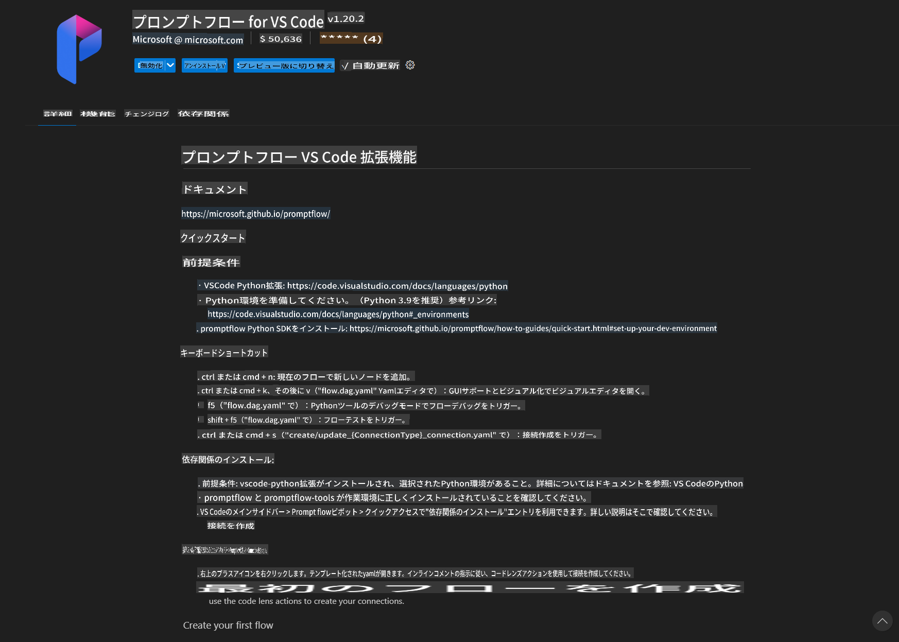
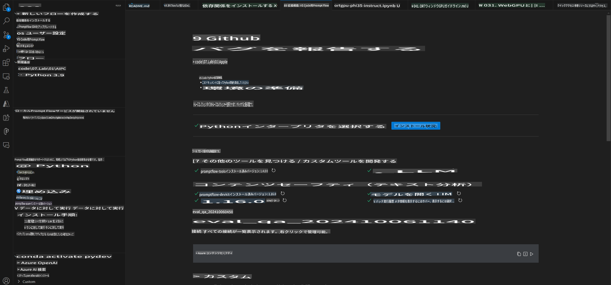
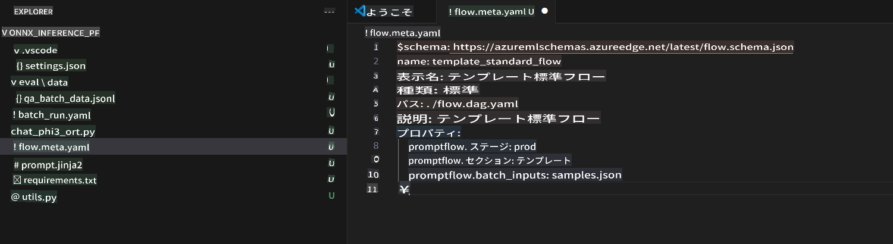
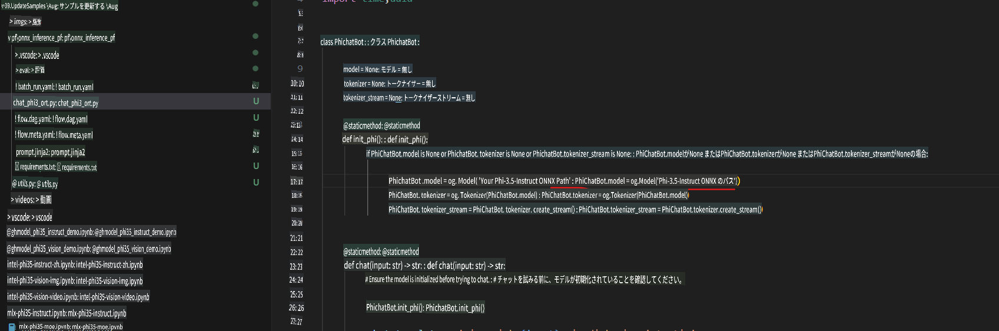
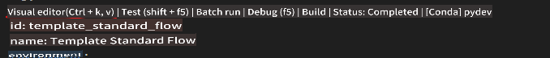
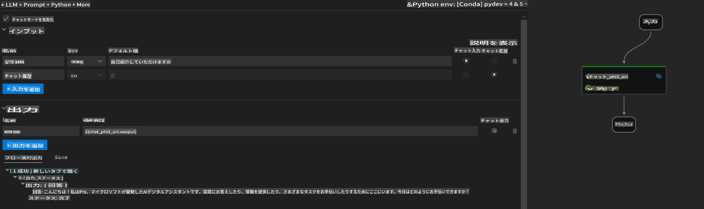
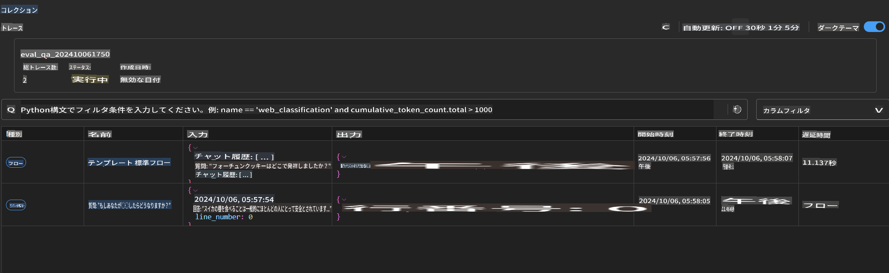

# Windows GPU を使用して Phi-3.5-Instruct ONNX の Prompt flow ソリューションを作成する

このドキュメントは、PromptFlow と ONNX (Open Neural Network Exchange) を使用して Phi-3 モデルを基にした AI アプリケーションを開発する方法の例です。

PromptFlow は、LLM (Large Language Model) ベースの AI アプリケーションのアイデア出しからプロトタイピング、テスト、評価まで、エンドツーエンドの開発サイクルを効率化するための開発ツール群です。

PromptFlow を ONNX と統合することで、開発者は以下を実現できます:

- **モデルパフォーマンスの最適化**: ONNX を活用して効率的なモデル推論とデプロイを実現。
- **開発の簡素化**: PromptFlow を使用してワークフローを管理し、繰り返し作業を自動化。
- **コラボレーションの強化**: チームメンバー間のコラボレーションを促進し、統一された開発環境を提供。

**Prompt flow** は、LLM ベースの AI アプリケーションのアイデア出し、プロトタイピング、テスト、評価から、本番環境へのデプロイやモニタリングまで、エンドツーエンドの開発サイクルを効率化する開発ツール群です。これにより、プロンプトエンジニアリングが大幅に簡素化され、プロダクション品質の LLM アプリケーションを構築できるようになります。

Prompt flow は OpenAI、Azure OpenAI Service、カスタマイズ可能なモデル (Huggingface、ローカル LLM/SLM) に接続できます。Phi-3.5 の量子化された ONNX モデルをローカルアプリケーションにデプロイすることを目指しています。Prompt flow を活用することで、ビジネスの計画をより良く立て、Phi-3.5 に基づいたローカルソリューションを完成させることができます。この例では、ONNX Runtime GenAI ライブラリを組み合わせて、Windows GPU を基にした Prompt flow ソリューションを完成させます。

## **インストール**

### **Windows GPU 用 ONNX Runtime GenAI**

Windows GPU 用 ONNX Runtime GenAI を設定するためのガイドラインはこちらをご覧ください [click here](./ORTWindowGPUGuideline.md)

### **VSCode で Prompt flow をセットアップ**

1. Prompt flow VS Code 拡張機能をインストールします



2. Prompt flow VS Code 拡張機能をインストールした後、拡張機能をクリックし、**Installation dependencies** を選択して、このガイドラインに従って環境に Prompt flow SDK をインストールします



3. [サンプルコード](../../../../../../code/09.UpdateSamples/Aug/pf/onnx_inference_pf) をダウンロードし、VS Code でこのサンプルを開きます



4. **flow.dag.yaml** を開いて Python 環境を選択します


   **chat_phi3_ort.py** を開いて Phi-3.5-instruct ONNX モデルの場所を変更します



5. Prompt flow を実行してテストします

**flow.dag.yaml** を開き、ビジュアルエディタをクリックします



クリック後、これを実行してテストします



1. ターミナルでバッチを実行して、さらに多くの結果を確認できます

```bash

pf run create --file batch_run.yaml --stream --name 'Your eval qa name'    

```

デフォルトのブラウザで結果を確認できます



**免責事項**:  
本書類は、機械ベースのAI翻訳サービスを使用して翻訳されています。正確性を期すよう努めておりますが、自動翻訳には誤りや不正確さが含まれる場合があります。原文（元の言語の文書）を正式な情報源としてご参照ください。重要な情報については、専門の人間による翻訳をお勧めします。本翻訳の使用に起因する誤解や誤解釈について、当方は一切の責任を負いません。