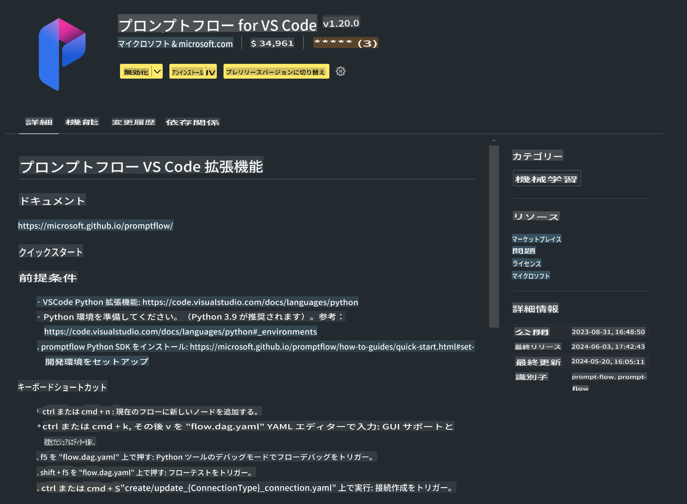

# **Lab 0 - インストール**

Lab に入る際には、関連する環境を設定する必要があります。


### **1. Python 3.11+**

Python 環境を設定するには、miniforge を使用することをお勧めします。

miniforge の設定方法については、[https://github.com/conda-forge/miniforge](https://github.com/conda-forge/miniforge) を参照してください。

miniforge を設定した後、Power Shell で以下のコマンドを実行してください。

```bash

conda create -n pyenv python==3.11.8 -y

conda activate pyenv

```


### **2. Prompt flow SDK のインストール**

Lab 1 では Prompt flow を使用するため、Prompt flow SDK を設定する必要があります。

```bash

pip install promptflow --upgrade

```

以下のコマンドで promptflow SDK を確認できます。

```bash

pf --version

```

### **3. Visual Studio Code Prompt flow 拡張機能のインストール**




### **4. Intel NPU アクセラレーションライブラリ**

Intel の新世代プロセッサは NPU をサポートしています。ローカルで LLMs / SLMs を実行するために NPU を使用したい場合は、***Intel NPU Acceleration Library*** を利用できます。詳細については、[https://github.com/microsoft/PhiCookBook/blob/main/md/01.Introduction/03/AIPC_Inference.md](https://github.com/microsoft/PhiCookBook/blob/main/md/01.Introduction/03/AIPC_Inference.md) を参照してください。

bash で Intel NPU Acceleration Library をインストールします。

```bash

pip install intel-npu-acceleration-library

```

***Note***: このライブラリは transformers ***4.40.2*** をサポートしていますので、バージョンを確認してください。


### **5. その他の Python ライブラリ**

requirements.txt を作成し、以下の内容を追加してください。

```txt

notebook
numpy 
scipy 
scikit-learn 
matplotlib 
pandas 
pillow 
graphviz

```


### **6. NVM のインストール**

Powershell で nvm をインストールします。

```bash

winget install -e --id CoreyButler.NVMforWindows

```

nodejs 18.20 をインストールします。

```bash

nvm install 18.20.0

nvm use 18.20.0

```

### **7. Visual Studio Code 開発サポートのインストール**

```bash

npm install --global yo generator-code

```

おめでとうございます！SDK の設定が完了しました。次はハンズオンステップに進みましょう。

**免責事項**:  
本書類は、機械ベースのAI翻訳サービスを使用して翻訳されています。正確さを追求しておりますが、自動翻訳には誤りや不正確さが含まれる可能性があることをご了承ください。本書類の原文が正式な情報源とみなされるべきです。重要な情報については、専門の人間による翻訳をお勧めします。本翻訳の使用に起因する誤解や解釈の誤りについて、当方は一切の責任を負いません。