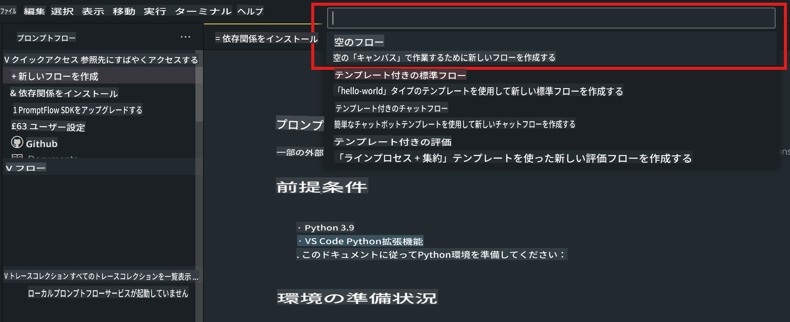
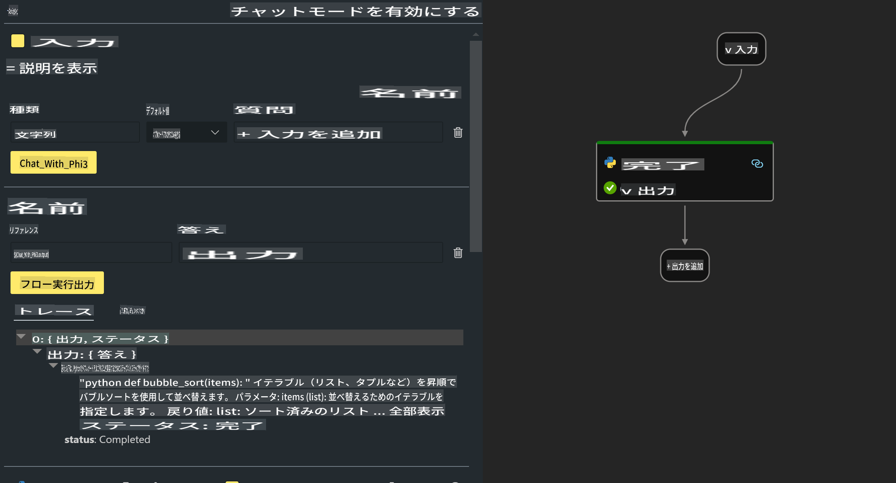

# **Lab 2 - AIPCでPhi-3-miniを使ったPrompt flowの実行**

## **Prompt flowとは**

Prompt flowは、LLMベースのAIアプリケーションのアイデア出し、プロトタイピング、テスト、評価から本番展開、モニタリングまでの開発サイクルを効率化するための開発ツール群です。プロンプトエンジニアリングを容易にし、生産品質のLLMアプリを構築できるようにします。

Prompt flowを使うことで以下が可能になります：

- LLM、プロンプト、Pythonコード、その他のツールを結びつけた実行可能なワークフローを作成する。

- 特にLLMとのインタラクションを簡単にデバッグし、フローを反復改善する。

- フローを評価し、大規模なデータセットを用いて品質とパフォーマンス指標を計算する。

- テストと評価をCI/CDシステムに統合し、フローの品質を確保する。

- フローを選択したサービングプラットフォームにデプロイする、またはアプリのコードベースに簡単に統合する。

- （任意ですが強く推奨）Azure AIのクラウド版Prompt flowを活用してチームで共同作業を行う。

## **AIPCとは**

AI PCは、CPU、GPU、NPUを搭載しており、それぞれ特定のAI加速機能を持っています。NPU（ニューラルプロセッシングユニット）は、クラウドにデータを送信する代わりに、PC上で人工知能（AI）や機械学習（ML）のタスクを処理するための特殊なアクセラレータです。GPUやCPUもこれらのタスクを処理できますが、NPUは特に低電力でのAI計算に優れています。AI PCは、私たちのコンピュータの動作方法における根本的な変化を表しています。これは以前には存在しなかった問題の解決策ではなく、日常的なPC利用において大きな改善をもたらすものです。

では、どのように機能するのでしょうか？生成AIや膨大な公開データでトレーニングされた大規模言語モデル（LLM）と比較して、PC上で動作するAIはほぼすべてのレベルでアクセスしやすいものです。この概念は理解しやすく、クラウドにアクセスする必要がないため、個人のデータでトレーニングされたAIの利点は、より広い層にとってすぐに魅力的なものとなります。

近い将来、AI PCの世界では、個人アシスタントや小規模なAIモデルがPC上で直接動作し、日常的に行う作業を支援するために、個人的でプライベートかつ安全なAI機能を提供します。例えば、会議の議事録作成、ファンタジーフットボールリーグの管理、写真や動画編集の自動化、家族の到着・出発時間に基づいた完璧な旅程の作成などです。

## **AIPCで生成コードフローを構築する**

***Note*** ：環境のインストールがまだ完了していない場合は、[Lab 0 -Installations](./01.Installations.md)を参照してください。

1. Visual Studio CodeでPrompt flow Extensionを開き、空のフロープロジェクトを作成します。



2. 入力および出力パラメーターを追加し、新しいフローとしてPythonコードを追加します。



以下の構造（flow.dag.yaml）を参考にしてフローを構築できます。

```yaml

inputs:
  question:
    type: string
    default: how to write Bubble Algorithm
outputs:
  answer:
    type: string
    reference: ${Chat_With_Phi3.output}
nodes:
- name: Chat_With_Phi3
  type: python
  source:
    type: code
    path: Chat_With_Phi3.py
  inputs:
    question: ${inputs.question}


```

3. ***Chat_With_Phi3.py*** にコードを追加します。

```python


from promptflow.core import tool

# import torch
from transformers import AutoTokenizer, pipeline,TextStreamer
import intel_npu_acceleration_library as npu_lib

import warnings

import asyncio
import platform

class Phi3CodeAgent:
    
    model = None
    tokenizer = None
    text_streamer = None
    
    model_id = "microsoft/Phi-3-mini-4k-instruct"

    @staticmethod
    def init_phi3():
        
        if Phi3CodeAgent.model is None or Phi3CodeAgent.tokenizer is None or Phi3CodeAgent.text_streamer is None:
            Phi3CodeAgent.model = npu_lib.NPUModelForCausalLM.from_pretrained(
                                    Phi3CodeAgent.model_id,
                                    torch_dtype="auto",
                                    dtype=npu_lib.int4,
                                    trust_remote_code=True
                                )
            Phi3CodeAgent.tokenizer = AutoTokenizer.from_pretrained(Phi3CodeAgent.model_id)
            Phi3CodeAgent.text_streamer = TextStreamer(Phi3CodeAgent.tokenizer, skip_prompt=True)

    

    @staticmethod
    def chat_with_phi3(prompt):
        
        Phi3CodeAgent.init_phi3()

        messages = "<|system|>You are a AI Python coding assistant. Please help me to generate code in Python.The answer only genertated Python code, but any comments and instructions do not need to be generated<|end|><|user|>" + prompt +"<|end|><|assistant|>"


        generation_args = {
            "max_new_tokens": 1024,
            "return_full_text": False,
            "temperature": 0.3,
            "do_sample": False,
            "streamer": Phi3CodeAgent.text_streamer,
        }

        pipe = pipeline(
            "text-generation",
            model=Phi3CodeAgent.model,
            tokenizer=Phi3CodeAgent.tokenizer,
            # **generation_args
        )

        result = ''

        with warnings.catch_warnings():
            warnings.simplefilter("ignore")
            response = pipe(messages, **generation_args)
            result =response[0]['generated_text']
            return result


@tool
def my_python_tool(question: str) -> str:
    if platform.system() == 'Windows':
        asyncio.set_event_loop_policy(asyncio.WindowsSelectorEventLoopPolicy())
    return Phi3CodeAgent.chat_with_phi3(question)


```

4. デバッグまたは実行からフローをテストし、生成コードが正常かどうか確認します。


5. ターミナルで開発用APIとしてフローを実行します。

```

pf flow serve --source ./ --port 8080 --host localhost   

```

PostmanまたはThunder Clientでテストすることができます。

### **注意事項**

1. 初回の実行には時間がかかります。Hugging Face CLIからphi-3モデルをダウンロードすることを推奨します。

2. Intel NPUの計算能力が限られていることを考慮し、Phi-3-mini-4k-instructを使用することを推奨します。

3. Intel NPU Accelerationを使用してINT4変換を量子化しますが、サービスを再実行する場合は、キャッシュとnc_workshopフォルダを削除する必要があります。

## **リソース**

1. Promptflowを学ぶ [https://microsoft.github.io/promptflow/](https://microsoft.github.io/promptflow/)

2. Intel NPU Accelerationを学ぶ [https://github.com/intel/intel-npu-acceleration-library](https://github.com/intel/intel-npu-acceleration-library)

3. サンプルコードをダウンロード [Local NPU Agent Sample Code](../../../../../../../../../code/07.Lab/01/AIPC)

**免責事項**:  
この文書は、機械ベースのAI翻訳サービスを使用して翻訳されています。正確性を期して努力しておりますが、自動翻訳には誤りや不正確な部分が含まれる可能性があります。元の言語で作成された文書が公式な情報源とみなされるべきです。重要な情報については、専門の人間による翻訳をお勧めします。本翻訳の使用に起因する誤解や誤認について、当方は一切の責任を負いません。