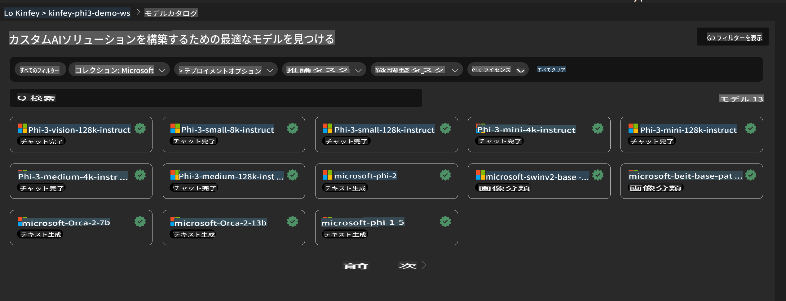
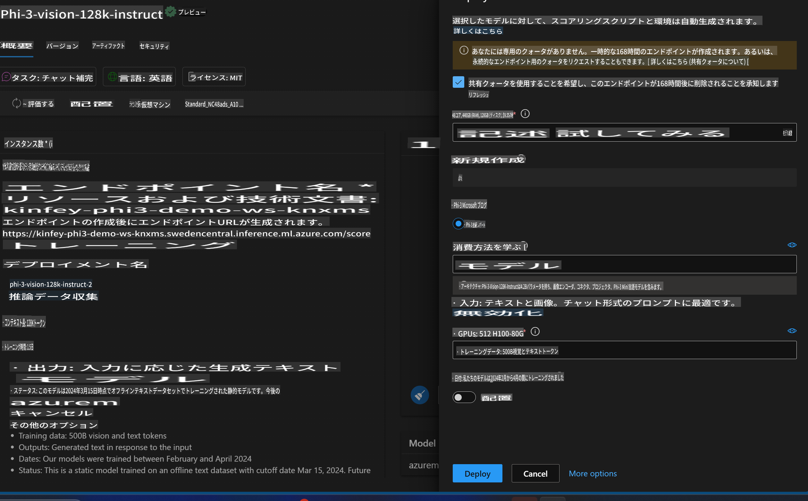
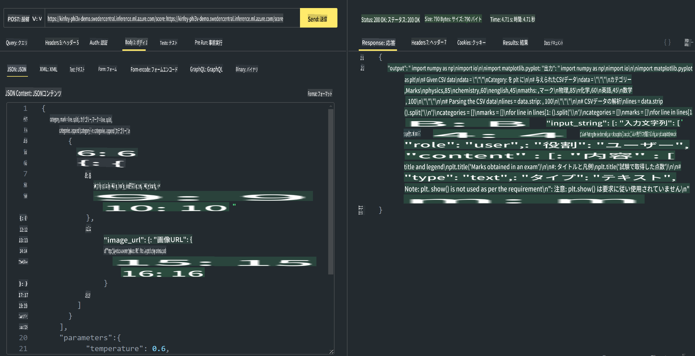

# **Lab 3 - Azure Machine Learning ServiceでPhi-3-Visionをデプロイ**

NPUを使用してローカルコードの本番デプロイを完了し、その後、PHI-3-VISIONの機能を導入することで、画像からコードを生成する機能を実現します。

この手順では、Azure Machine Learning Service上でPhi-3 VisionのModel As Serviceを素早く構築する方法を紹介します。

***Note***： Phi-3 Visionは、コンテンツをより高速に生成するために計算能力を必要とします。クラウドコンピューティングの力を活用してこれを実現します。

### **1. Azure Machine Learning Serviceを作成する**

Azure PortalでAzure Machine Learning Serviceを作成する必要があります。作成方法を学びたい場合は、次のリンクをご参照ください：[https://learn.microsoft.com/azure/machine-learning/quickstart-create-resources?view=azureml-api-2](https://learn.microsoft.com/azure/machine-learning/quickstart-create-resources?view=azureml-api-2)

### **2. Azure Machine Learning ServiceでPhi-3 Visionを選択する**



### **3. AzureでPhi-3-Visionをデプロイする**



### **4. Postmanでエンドポイントをテストする**



***Note***

1. 送信するパラメータには、Authorization、azureml-model-deployment、およびContent-Typeが含まれている必要があります。これらはデプロイ情報を確認して取得してください。

2. パラメータを送信する際、Phi-3-Visionは画像リンクを送信する必要があります。パラメータの送信方法については、GPT-4-Visionの方法を参照してください。例:

```json

{
  "input_data":{
    "input_string":[
      {
        "role":"user",
        "content":[ 
          {
            "type": "text",
            "text": "You are a Python coding assistant.Please create Python code for image "
          },
          {
              "type": "image_url",
              "image_url": {
                "url": "https://ajaytech.co/wp-content/uploads/2019/09/index.png"
              }
          }
        ]
      }
    ],
    "parameters":{
          "temperature": 0.6,
          "top_p": 0.9,
          "do_sample": false,
          "max_new_tokens": 2048
    }
  }
}

```

3. Postメソッドを使用して**/score**を呼び出します。

**おめでとうございます**！ これで、PHI-3-VISIONの迅速なデプロイを完了し、画像からコードを生成する方法を試しました。次は、NPUとクラウドを組み合わせてアプリケーションを構築してみましょう。

**免責事項**:  
この文書は、機械翻訳AIサービスを使用して翻訳されています。正確性を追求しておりますが、自動翻訳には誤りや不正確な表現が含まれる可能性があります。原文（元の言語で記載された文書）が正式な情報源と見なされるべきです。重要な情報については、専門の人間による翻訳を推奨します。本翻訳の使用により生じた誤解や誤認について、当方は一切の責任を負いません。