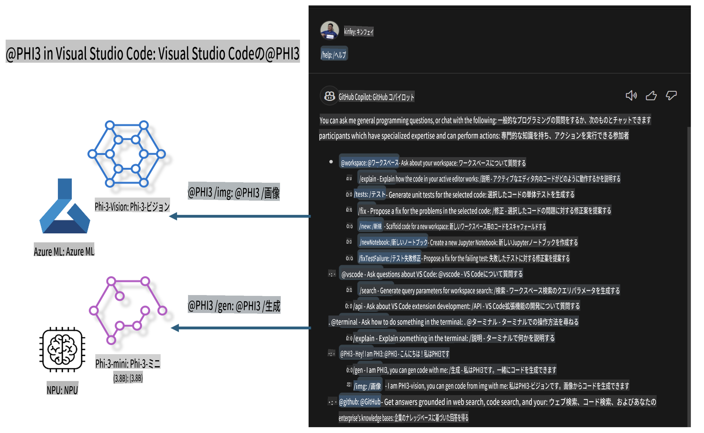

# **Microsoft Phi-3 ファミリーで Visual Studio Code GitHub Copilot Chat を構築する**

GitHub Copilot Chat のワークスペースエージェントを使ったことはありますか？自分のチーム専用のコードエージェントを作りたいと思ったことはありませんか？このハンズオンラボでは、オープンソースモデルを組み合わせて、エンタープライズ向けのコード業務エージェントを構築することを目指します。

## **基礎**

### **Microsoft Phi-3 を選ぶ理由**

Phi-3 はファミリーシリーズであり、テキスト生成、対話補完、コード生成用に異なる学習パラメータを持つ phi-3-mini、phi-3-small、phi-3-medium を含んでいます。また、Vision に基づいた phi-3-vision もあります。企業や異なるチームがオフラインで生成型 AI ソリューションを作成するのに適しています。

こちらのリンクを読むことをお勧めします: [https://github.com/microsoft/PhiCookBook/blob/main/md/01.Introduction/01/01.PhiFamily.md](https://github.com/microsoft/PhiCookBook/blob/main/md/01.Introduction/01/01.PhiFamily.md)

### **Microsoft GitHub Copilot Chat**

GitHub Copilot Chat 拡張機能は、VS Code 内で GitHub Copilot と直接対話し、コーディング関連の質問に対する回答を得ることができるチャットインターフェースを提供します。これにより、ドキュメントを探したりオンラインフォーラムを検索したりする手間が省けます。

Copilot Chat は、構文のハイライト、インデント、その他のフォーマット機能を使用して、生成された回答を分かりやすくします。ユーザーの質問の種類に応じて、Copilot が回答を生成する際に使用したソースコードファイルやドキュメントへのリンク、または VS Code 機能にアクセスするためのボタンが結果に含まれることがあります。

- Copilot Chat は開発者のワークフローに統合され、必要な場所で支援を提供します：

- エディタやターミナルから直接インラインチャットを開始し、コーディング中に助けを得る

- サイドバーのチャットビューを使用して、いつでも AI アシスタントに相談できる

- クイックチャットを起動して簡単な質問をし、すぐに作業に戻る

GitHub Copilot Chat は以下のようなシナリオで使用できます：

- 問題を解決する最適な方法についてのコーディング質問への回答

- 他人のコードを説明し、改善案を提案する

- コード修正の提案

- 単体テストケースの生成

- コードドキュメントの生成

こちらのリンクを読むことをお勧めします: [https://code.visualstudio.com/docs/copilot/copilot-chat](https://code.visualstudio.com/docs/copilot/copilot-chat?WT.mc_id=aiml-137032-kinfeylo)

###  **Microsoft GitHub Copilot Chat @workspace**

Copilot Chat 内で **@workspace** を参照すると、コードベース全体に関する質問をすることができます。質問に基づき、Copilot は関連するファイルやシンボルを賢く取得し、それらをリンクやコード例として回答に含めます。

**@workspace** は、開発者が VS Code 内でコードベースをナビゲートする際に使用するのと同じソースを検索します：

- ワークスペース内のすべてのファイル（.gitignore ファイルで無視されているファイルを除く）

- ネストされたフォルダやファイル名を含むディレクトリ構造

- ワークスペースが GitHub リポジトリであり、コード検索でインデックス化されている場合は GitHub のコード検索インデックス

- ワークスペース内のシンボルと定義

- アクティブエディタで選択されているテキストや表示されているテキスト

注意: .gitignore に無視されているファイルを開いている場合や、そのファイル内でテキストを選択している場合は、.gitignore が無視されます。

こちらのリンクを読むことをお勧めします: [https://code.visualstudio.com/docs/copilot/copilot-chat](https://code.visualstudio.com/docs/copilot/workspace-context?WT.mc_id=aiml-137032-kinfeylo)

## **このラボについてもっと知る**

GitHub Copilot は企業のプログラミング効率を大幅に向上させており、どの企業も GitHub Copilot の関連機能をカスタマイズしたいと考えています。多くの企業が自社のビジネスシナリオやオープンソースモデルに基づいて GitHub Copilot に似た拡張機能をカスタマイズしています。企業にとって、カスタマイズされた拡張機能は管理しやすいですが、これはユーザーエクスペリエンスにも影響します。やはり、一般的なシナリオや専門性において GitHub Copilot の方が強力です。もし体験が一貫しているならば、企業独自の拡張機能をカスタマイズする方が良いでしょう。GitHub Copilot Chat は、企業がチャット体験を拡張するための関連 API を提供しています。一貫した体験を維持しながら、カスタマイズされた機能を持つことが、より良いユーザー体験となります。

このラボでは、Phi-3 モデルをローカル NPU と Azure ハイブリッドと組み合わせて、GitHub Copilot Chat 内でカスタムエージェント ***@PHI3*** を構築し、エンタープライズ開発者がコード生成 ***(@PHI3 /gen)*** や画像に基づくコード生成 ***(@PHI3 /img)*** を完了できるよう支援します。

### ***注意:*** 

このラボは現在、Intel CPU および Apple Silicon の AIPC で実装されています。Qualcomm バージョンの NPU は引き続き更新予定です。

## **ラボ**

| 名前 | 説明 | AIPC | Apple |
| ------------ | ----------- | -------- |-------- |
| Lab0 - インストール(✅) | 関連する環境とインストールツールの構成とインストール | [Go](./HOL/AIPC/01.Installations.md) |[Go](./HOL/Apple/01.Installations.md) |
| Lab1 - Phi-3-mini を使ったプロンプトフローの実行 (✅) | AIPC / Apple Silicon と組み合わせ、ローカル NPU を使用して Phi-3-mini を通じてコード生成を作成 | [Go](./HOL/AIPC/02.PromptflowWithNPU.md) |  [Go](./HOL/Apple/02.PromptflowWithMLX.md) |
| Lab2 - Azure Machine Learning Service に Phi-3-vision をデプロイ (✅) | Azure Machine Learning Service のモデルカタログ - Phi-3-vision イメージをデプロイしてコード生成を行う | [Go](./HOL/AIPC/03.DeployPhi3VisionOnAzure.md) |[Go](./HOL/Apple/03.DeployPhi3VisionOnAzure.md) |
| Lab3 - GitHub Copilot Chat に @phi-3 エージェントを作成 (✅)  | GitHub Copilot Chat にカスタム Phi-3 エージェントを作成し、コード生成、グラフ生成コード、RAG などを完了 | [Go](./HOL/AIPC/04.CreatePhi3AgentInVSCode.md) | [Go](./HOL/Apple/04.CreatePhi3AgentInVSCode.md) |
| サンプルコード (✅)  | サンプルコードをダウンロード | [Go](../../../../../../../code/07.Lab/01/AIPC) | [Go](../../../../../../../code/07.Lab/01/Apple) |

## **リソース**

1. Phi-3 Cookbook [https://github.com/microsoft/Phi-3CookBook](https://github.com/microsoft/Phi-3CookBook)

2. GitHub Copilot について学ぶ [https://learn.microsoft.com/training/paths/copilot/](https://learn.microsoft.com/training/paths/copilot/?WT.mc_id=aiml-137032-kinfeylo)

3. GitHub Copilot Chat について学ぶ [https://learn.microsoft.com/training/paths/accelerate-app-development-using-github-copilot/](https://learn.microsoft.com/training/paths/accelerate-app-development-using-github-copilot/?WT.mc_id=aiml-137032-kinfeylo)

4. GitHub Copilot Chat API について学ぶ [https://code.visualstudio.com/api/extension-guides/chat](https://code.visualstudio.com/api/extension-guides/chat?WT.mc_id=aiml-137032-kinfeylo)

5. Azure AI Foundry について学ぶ [https://learn.microsoft.com/training/paths/create-custom-copilots-ai-studio/](https://learn.microsoft.com/training/paths/create-custom-copilots-ai-studio/?WT.mc_id=aiml-137032-kinfeylo)

6. Azure AI Foundry のモデルカタログについて学ぶ [https://learn.microsoft.com/azure/ai-studio/how-to/model-catalog-overview](https://learn.microsoft.com/azure/ai-studio/how-to/model-catalog-overview)

**免責事項**:  
この文書は、AIによる機械翻訳サービスを使用して翻訳されています。正確性を期すよう努めておりますが、自動翻訳には誤りや不正確な表現が含まれる可能性があります。元の言語で作成された文書が正式な情報源と見なされるべきです。重要な情報については、専門の人間による翻訳をお勧めします。本翻訳の使用に起因する誤解や誤解釈について、当社は一切の責任を負いません。