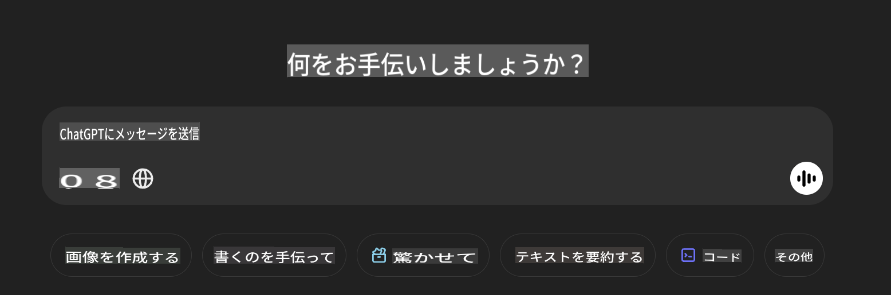

## **Phi-4-multimodalを使って画像を読み取りコードを生成する**

Phi-4-multimodalは、優れた画像読み取り機能を持っています。以下の機能をPythonで実装してみましょう。この画像はChatGPTのページです。



### **サンプルコード**

```python

import requests
import torch
from PIL import Image
import soundfile
from transformers import AutoModelForCausalLM, AutoProcessor, GenerationConfig,pipeline,AutoTokenizer

model_path = 'Your Phi-4-multimodal location'

kwargs = {}
kwargs['torch_dtype'] = torch.bfloat16

processor = AutoProcessor.from_pretrained(model_path, trust_remote_code=True)

model = AutoModelForCausalLM.from_pretrained(
    model_path,
    trust_remote_code=True,
    torch_dtype='auto',
    _attn_implementation='flash_attention_2',
).cuda()

generation_config = GenerationConfig.from_pretrained(model_path, 'generation_config.json')

user_prompt = '<|user|>'
assistant_prompt = '<|assistant|>'
prompt_suffix = '<|end|>'

prompt = f'{user_prompt}Can you generate HTML + JS code about this image <|image_1|> ? Please step by step {prompt_suffix}{assistant_prompt}'

image = Image.open("./demo.png")

inputs = processor(text=prompt, images=[image], return_tensors='pt').to('cuda:0')

generate_ids = model.generate(
    **inputs,
    max_new_tokens=4096,
    generation_config=generation_config,
)

generate_ids = generate_ids[:, inputs['input_ids'].shape[1] :]

response = processor.batch_decode(
    generate_ids, skip_special_tokens=True, clean_up_tokenization_spaces=False
)[0]

print(response)

```

**免責事項**:  
この文書は、機械翻訳AIサービスを使用して翻訳されています。正確性を追求しておりますが、自動翻訳には誤りや不正確な部分が含まれる場合があります。原文（元の言語で記載された文書）が公式な情報源と見なされるべきです。重要な情報については、専門の人間による翻訳をお勧めします。この翻訳の使用に起因する誤解や誤った解釈について、当方は一切の責任を負いません。