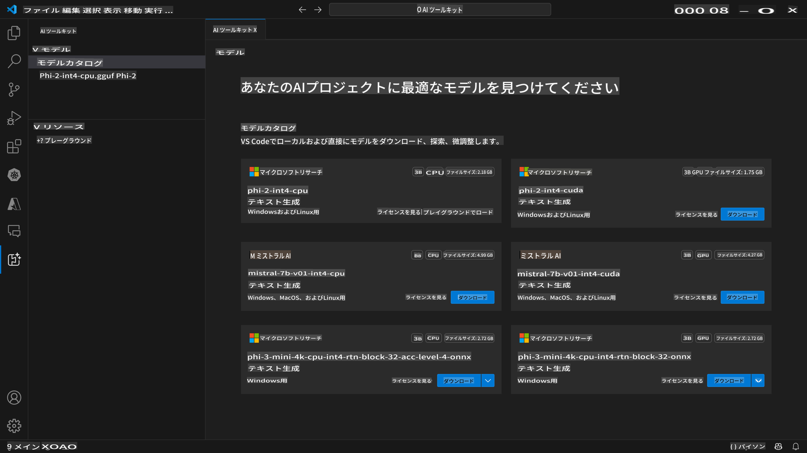
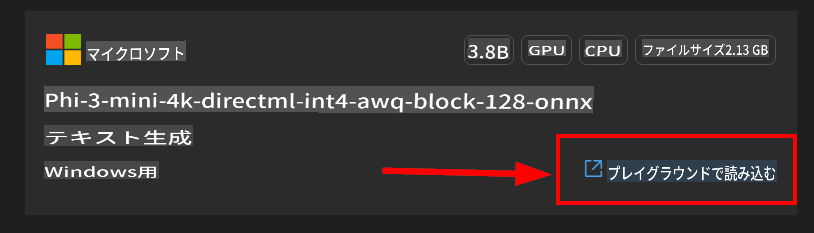

# AI Toolkit for VScode (Windows)

[AI Toolkit for VS Code](https://marketplace.visualstudio.com/items?itemName=ms-windows-ai-studio.windows-ai-studio) は、Azure AI Studio Catalog や Hugging Face などのカタログから最先端の AI 開発ツールとモデルを集めて、生成 AI アプリの開発を簡素化します。Azure ML や Hugging Face が提供する AI モデルカタログを閲覧し、ローカルにダウンロードして微調整、テスト、アプリケーションでの使用が可能です。

AI Toolkit Preview はローカルで実行されます。選択したモデルに依存しますが、いくつかのタスクは Windows と Linux のみサポートされています。

ローカルでの推論や微調整には、選択したモデルに応じて NVIDIA CUDA GPU などの GPU が必要な場合があります。

リモートで実行する場合、クラウドリソースに GPU が必要です。環境を確認してください。Windows + WSL でローカル実行する場合、WSL Ubuntu ディストリビューション 18.4 以上がインストールされ、デフォルトに設定されている必要があります。

## はじめに

[Windows Subsystem for Linux のインストール方法についてはこちら](https://learn.microsoft.com/windows/wsl/install?WT.mc_id=aiml-137032-kinfeylo)

および [デフォルトディストリビューションの変更](https://learn.microsoft.com/windows/wsl/install#change-the-default-linux-distribution-installed)。

[AI Tooklit GitHub リポジトリ](https://github.com/microsoft/vscode-ai-toolkit/)

- Windows または Linux。
- **MacOS のサポートは近日公開予定**
- Windows と Linux の両方で微調整を行うには、Nvidia GPU が必要です。さらに、**Windows** では Ubuntu ディストリビューション 18.4 以上の Linux サブシステムが必要です。[Windows Subsystem for Linux のインストール方法についてはこちら](https://learn.microsoft.com/windows/wsl/install) および [デフォルトディストリビューションの変更](https://learn.microsoft.com/windows/wsl/install#change-the-default-linux-distribution-installed)。

### AI Toolkit のインストール

AI Toolkit は [Visual Studio Code Extension](https://code.visualstudio.com/docs/setup/additional-components#_vs-code-extensions) として提供されているため、まず [VS Code](https://code.visualstudio.com/docs/setup/windows?WT.mc_id=aiml-137032-kinfeylo) をインストールし、[VS Marketplace](https://marketplace.visualstudio.com/items?itemName=ms-windows-ai-studio.windows-ai-studio) から AI Toolkit をダウンロードする必要があります。
[AI Toolkit は Visual Studio Marketplace で利用可能](https://marketplace.visualstudio.com/items?itemName=ms-windows-ai-studio.windows-ai-studio) であり、他の VS Code 拡張機能と同様にインストールできます。

VS Code 拡張機能のインストールに慣れていない場合は、以下の手順に従ってください。

### サインイン

1. VS Code のアクティビティバーで **Extensions** を選択します。
1. 拡張機能の検索バーに「AI Toolkit」と入力します。
1. 「AI Toolkit for Visual Studio code」を選択します。
1. **Install** を選択します。

これで、拡張機能の使用準備が整いました！

GitHub にサインインするように求められるので、「許可」をクリックして続行してください。GitHub のサインインページにリダイレクトされます。

サインインしてプロセスステップに従ってください。完了すると、VS Code にリダイレクトされます。

拡張機能がインストールされると、アクティビティバーに AI Toolkit アイコンが表示されます。

利用可能なアクションを見てみましょう！

### 利用可能なアクション

AI Toolkit のメインサイドバーは次のように整理されています：

- **Models**
- **Resources**
- **Playground**
- **Fine-tuning**

これらは Resources セクションで利用可能です。開始するには **Model Catalog** を選択します。

### カタログからモデルをダウンロード

VS Code サイドバーから AI Toolkit を起動すると、次のオプションから選択できます：



- **Model Catalog** からサポートされているモデルを見つけてローカルにダウンロード
- **Model Playground** でモデル推論をテスト
- **Model Fine-tuning** でローカルまたはリモートでモデルを微調整
- コマンドパレットを通じてクラウドに微調整されたモデルをデプロイ

> [!NOTE]
>
> **GPU と CPU**
>
> モデルカードには、モデルサイズ、プラットフォーム、アクセラレータタイプ（CPU、GPU）が表示されます。**GPU を搭載した Windows デバイス**での最適なパフォーマンスを得るために、Windows のみをターゲットにしたモデルバージョンを選択してください。
>
> これにより、DirectML アクセラレータ用に最適化されたモデルを使用できます。
>
> モデル名の形式は次のとおりです：
>
> - `{model_name}-{accelerator}-{quantization}-{format}`.
>
> Windows デバイスに GPU があるかどうかを確認するには、**タスクマネージャー**を開き、**パフォーマンス**タブを選択します。GPU がある場合は、「GPU 0」や「GPU 1」などの名前で表示されます。

### プレイグラウンドでモデルを実行

すべてのパラメータが設定されたら、**Generate Project** をクリックします。

モデルがダウンロードされたら、カタログのモデルカードで **Load in Playground** を選択します：

- モデルのダウンロードを開始
- すべての前提条件と依存関係をインストール
- VS Code ワークスペースを作成



モデルがダウンロードされたら、AI Toolkit からプロジェクトを起動できます。

> ***Note*** リモートで推論や微調整を行うプレビューフィーチャーを試したい場合は、[このガイド](https://github.com/microsoft/vscode-ai-toolkit/blob/main/archive/remote-overall.md) に従ってください。

### Windows に最適化されたモデル

モデルの応答がストリーミングされて戻ってくるのを確認できます：

AI Toolkit は、Windows に最適化された公開されている AI モデルのコレクションを提供します。これらのモデルは Hugging Face や GitHub などの異なる場所に保存されていますが、すべてのモデルを一つの場所でブラウズして、Windows アプリケーションで使用するためにダウンロードできます。


### モデルの選択

**GPU** が **Windows** デバイスにないが、

- Phi-3-mini-4k-**directml**-int4-awq-block-128-onnx モデル

を選択した場合、モデルの応答は *非常に遅く* なります。

代わりに、CPU に最適化されたバージョンをダウンロードしてください：

- Phi-3-mini-4k-**cpu**-int4-rtn-block-32-acc-level-4-onnx。

また、次のように変更することも可能です：

**コンテキスト指示:** モデルがリクエストの大きな絵を理解するのを助けます。これは背景情報、求めるものの例やデモ、またはタスクの目的を説明するものです。

**推論パラメータ:**

- *最大応答長*: モデルが返す最大トークン数。
- *温度*: モデル温度は、言語モデルの出力のランダム性を制御するパラメータです。温度が高いとモデルはリスクを取り、さまざまな単語を生成します。一方、温度が低いとモデルは安全策を取り、より集中した予測可能な応答を生成します。
- *トップ P*: 核サンプリングとも呼ばれ、次の単語を予測する際に言語モデルが考慮する可能性のある単語やフレーズの数を制御する設定。
- *頻度ペナルティ*: このパラメータは、モデルが出力で単語やフレーズを繰り返す頻度に影響します。値が高い（1.0 に近い）ほど、モデルは単語やフレーズの繰り返しを避けるようになります。
- *存在ペナルティ*: このパラメータは、生成されたテキストの多様性と具体性を促進するために使用されます。値が高い（1.0 に近い）ほど、モデルは新しいトークンを多く含むようになります。値が低いと、モデルは一般的なフレーズやクリシェを生成しやすくなります。

### アプリケーションで REST API を使用する

AI Toolkit には [OpenAI chat completions format](https://platform.openai.com/docs/api-reference/chat/create) を使用するローカル REST API Web サーバー **ポート 5272** が付属しています。

これにより、クラウド AI モデルサービスに依存せずにローカルでアプリケーションをテストできます。たとえば、次の JSON ファイルはリクエストの本文を構成する方法を示しています：

```json
{
    "model": "Phi-3-mini-4k-directml-int4-awq-block-128-onnx",
    "messages": [
        {
            "role": "user",
            "content": "what is the golden ratio?"
        }
    ],
    "temperature": 0.7,
    "top_p": 1,
    "top_k": 10,
    "max_tokens": 100,
    "stream": true
}
```

REST API を [Postman](https://www.postman.com/) や CURL (Client URL) ユーティリティを使用してテストできます：

```bash
curl -vX POST http://127.0.0.1:5272/v1/chat/completions -H 'Content-Type: application/json' -d @body.json
```

### Python 用 OpenAI クライアントライブラリの使用

```python
from openai import OpenAI

client = OpenAI(
    base_url="http://127.0.0.1:5272/v1/", 
    api_key="x" # required for the API but not used
)

chat_completion = client.chat.completions.create(
    messages=[
        {
            "role": "user",
            "content": "what is the golden ratio?",
        }
    ],
    model="Phi-3-mini-4k-cuda-int4-onnx",
)

print(chat_completion.choices[0].message.content)
```

### .NET 用 Azure OpenAI クライアントライブラリの使用

NuGet を使用してプロジェクトに [Azure OpenAI クライアントライブラリ for .NET](https://www.nuget.org/packages/Azure.AI.OpenAI/) を追加します：

```bash
dotnet add {project_name} package Azure.AI.OpenAI --version 1.0.0-beta.17
```

プロジェクトに **OverridePolicy.cs** という名前の C# ファイルを追加し、次のコードを貼り付けます：

```csharp
// OverridePolicy.cs
using Azure.Core.Pipeline;
using Azure.Core;

internal partial class OverrideRequestUriPolicy(Uri overrideUri)
    : HttpPipelineSynchronousPolicy
{
    private readonly Uri _overrideUri = overrideUri;

    public override void OnSendingRequest(HttpMessage message)
    {
        message.Request.Uri.Reset(_overrideUri);
    }
}
```

次に、**Program.cs** ファイルに次のコードを貼り付けます：

```csharp
// Program.cs
using Azure.AI.OpenAI;

Uri localhostUri = new("http://localhost:5272/v1/chat/completions");

OpenAIClientOptions clientOptions = new();
clientOptions.AddPolicy(
    new OverrideRequestUriPolicy(localhostUri),
    Azure.Core.HttpPipelinePosition.BeforeTransport);
OpenAIClient client = new(openAIApiKey: "unused", clientOptions);

ChatCompletionsOptions options = new()
{
    DeploymentName = "Phi-3-mini-4k-directml-int4-awq-block-128-onnx",
    Messages =
    {
        new ChatRequestSystemMessage("You are a helpful assistant. Be brief and succinct."),
        new ChatRequestUserMessage("What is the golden ratio?"),
    }
};

StreamingResponse<StreamingChatCompletionsUpdate> streamingChatResponse
    = await client.GetChatCompletionsStreamingAsync(options);

await foreach (StreamingChatCompletionsUpdate chatChunk in streamingChatResponse)
{
    Console.Write(chatChunk.ContentUpdate);
}
```

## AI Toolkit での微調整

- モデルディスカバリーとプレイグラウンドから始めましょう。
- ローカルコンピューティングリソースを使用したモデルの微調整と推論。
- Azure リソースを使用したリモート微調整と推論。

[AI Toolkit での微調整](../04.Fine-tuning/Finetuning_VSCodeaitoolkit.md)

## AI Toolkit Q&A リソース

最も一般的な問題と解決策については、[Q&A ページ](https://github.com/microsoft/vscode-ai-toolkit/blob/main/archive/QA.md) を参照してください。

**免責事項**:
この文書は機械翻訳AIサービスを使用して翻訳されています。正確性を期すために努めておりますが、自動翻訳には誤りや不正確さが含まれる可能性があります。原文が権威ある情報源と見なされるべきです。重要な情報については、専門の人間による翻訳をお勧めします。この翻訳の使用に起因する誤解や誤解釈については、一切の責任を負いかねます。