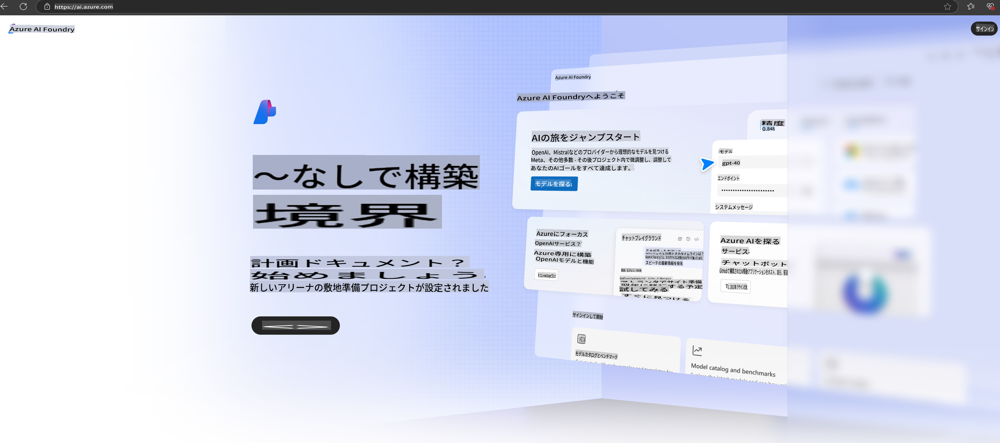

# **Azure AI FoundryでのPhi-3の使用**

生成AIの発展に伴い、統一されたプラットフォームで異なるLLMやSLM、企業データの統合、微調整/RAG操作、LLMやSLMを統合した後の企業ビジネスの評価などを管理し、生成AIのスマートアプリケーションをより効果的に実現することを目指しています。[Azure AI Foundry](https://ai.azure.com)は、エンタープライズ向けの生成AIアプリケーションプラットフォームです。

Azure AI Foundryを使用すると、大規模言語モデル（LLM）の応答を評価し、Prompt Flowを用いてプロンプトアプリケーションコンポーネントを編成し、パフォーマンスを向上させることができます。このプラットフォームは、概念実証から本格的な運用環境への移行を容易にし、スケーラビリティを実現します。継続的なモニタリングと改善により、長期的な成功をサポートします。

Phi-3モデルをAzure AI Foundryに簡単なステップで迅速にデプロイし、その後、Azure AI Foundryを使用してPhi-3関連のPlayground/Chat、微調整、評価などの作業を完了できます。

## **1. 準備**

お使いのマシンにすでに[Azure Developer CLI](https://learn.microsoft.com/azure/developer/azure-developer-cli/overview?WT.mc_id=aiml-138114-kinfeylo)がインストールされている場合、新しいディレクトリで次のコマンドを実行するだけで、このテンプレートを使用できます。

## 手動作成

Microsoft Azure AI Foundryプロジェクトとハブを作成することで、AI作業を整理し管理する優れた方法となります。以下はそのステップバイステップガイドです。

### Azure AI Foundryでプロジェクトを作成する

1. **Azure AI Foundryにアクセス**: Azure AI Foundryポータルにサインインします。
2. **プロジェクトを作成**:
   - プロジェクト内にいる場合は、ページ左上の「Azure AI Foundry」を選択してホームページに移動します。
   - 「+ Create project」を選択します。
   - プロジェクト名を入力します。
   - ハブがある場合はデフォルトで選択されます。複数のハブにアクセスできる場合は、ドロップダウンから別のハブを選択できます。新しいハブを作成する場合は、「Create new hub」を選択して名前を入力します。
   - 「Create」を選択します。

### Azure AI Foundryでハブを作成する

1. **Azure AI Foundryにアクセス**: Azureアカウントでサインインします。
2. **ハブを作成**:
   - 左側のメニューから管理センターを選択します。
   - 「All resources」を選択し、「+ New project」の横の下向き矢印を選択して「+ New hub」を選択します。
   - 「Create a new hub」ダイアログでハブ名（例: contoso-hub）を入力し、他のフィールドを必要に応じて変更します。
   - 「Next」を選択し、情報を確認した後、「Create」を選択します。

詳細な手順については、公式の[Microsoftドキュメント](https://learn.microsoft.com/azure/ai-studio/how-to/create-projects)を参照してください。

作成に成功した後、[ai.azure.com](https://ai.azure.com/)を通じて作成したスタジオにアクセスできます。

1つのAI Foundryに複数のプロジェクトを作成できます。AI Foundry内でプロジェクトを作成して準備を進めてください。

Azure AI Foundry [QuickStarts](https://learn.microsoft.com/azure/ai-studio/quickstarts/get-started-code)

## **2. Azure AI FoundryでPhiモデルをデプロイする**

プロジェクトのExploreオプションをクリックしてModel Catalogに入り、Phi-3を選択します。

Phi-3-mini-4k-instructを選択します。

「Deploy」をクリックしてPhi-3-mini-4k-instructモデルをデプロイします。

> [!NOTE]
>
> デプロイ時に計算能力を選択することができます。

## **3. Azure AI FoundryでPlayground Chat Phiを使用する**

デプロイメントページに移動し、Playgroundを選択してAzure AI FoundryのPhi-3とチャットします。

## **4. Azure AI Foundryからモデルをデプロイする**

Azure Model Catalogからモデルをデプロイするには、次の手順に従います。

- Azure AI Foundryにサインインします。
- Azure AI Foundryのモデルカタログからデプロイしたいモデルを選択します。
- モデルの詳細ページで「Deploy」を選択し、Azure AI Content Safetyを使用したServerless APIを選択します。
- モデルをデプロイしたいプロジェクトを選択します。Serverless APIオファリングを使用するには、ワークスペースがEast US 2またはSweden Centralリージョンに属している必要があります。デプロイメント名をカスタマイズできます。
- デプロイメントウィザードでPricing and termsを選択して、価格と利用規約を確認します。
- 「Deploy」を選択します。デプロイメントが準備完了になるまで待機し、デプロイメントページにリダイレクトされます。
- 「Open in playground」を選択してモデルとの対話を開始します。
- デプロイメントページに戻り、デプロイメントを選択してエンドポイントのTarget URLとSecret Keyを確認できます。これらを使用してデプロイメントを呼び出し、補完を生成することができます。
- Buildタブに移動し、ComponentsセクションからDeploymentsを選択することで、エンドポイントの詳細、URL、アクセスキーをいつでも確認できます。

> [!NOTE]
> これらの手順を実行するには、リソースグループに対するAzure AI Developerロールの権限をアカウントが持っている必要があります。

## **5. Azure AI FoundryでPhi APIを使用する**

PostmanのGETを通じてhttps://{Your project name}.region.inference.ml.azure.com/swagger.jsonにアクセスし、Keyを組み合わせて提供されるインターフェースを確認できます。

リクエストパラメータやレスポンスパラメータを非常に簡単に取得できます。

**免責事項**:  
この文書は、機械翻訳AIサービスを使用して翻訳されています。正確性を追求しておりますが、自動翻訳には誤りや不正確な部分が含まれる可能性があります。原文（元の言語で記載された文書）が信頼できる正式な情報源と見なされるべきです。重要な情報については、専門の人間による翻訳をお勧めします。この翻訳の使用に起因する誤解や誤認について、当方は一切の責任を負いません。