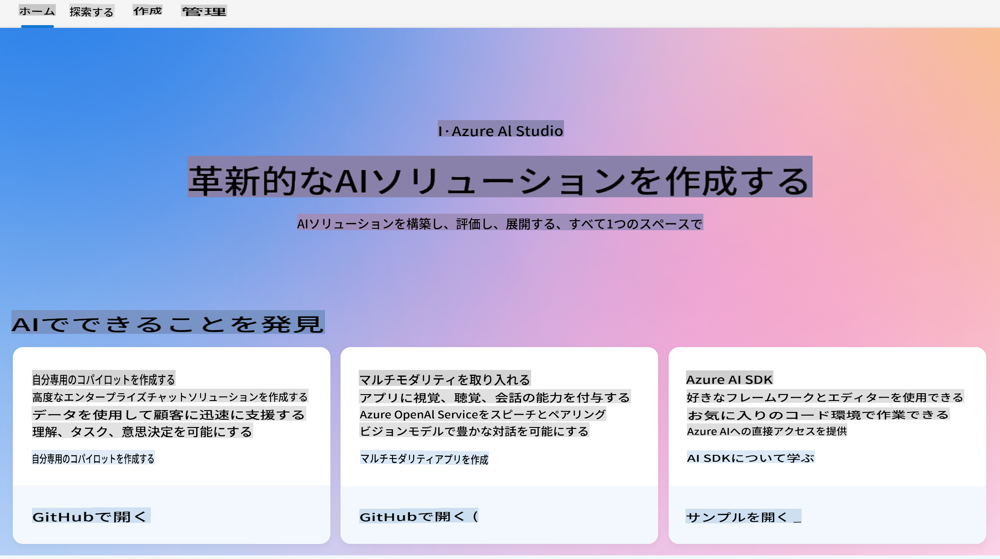
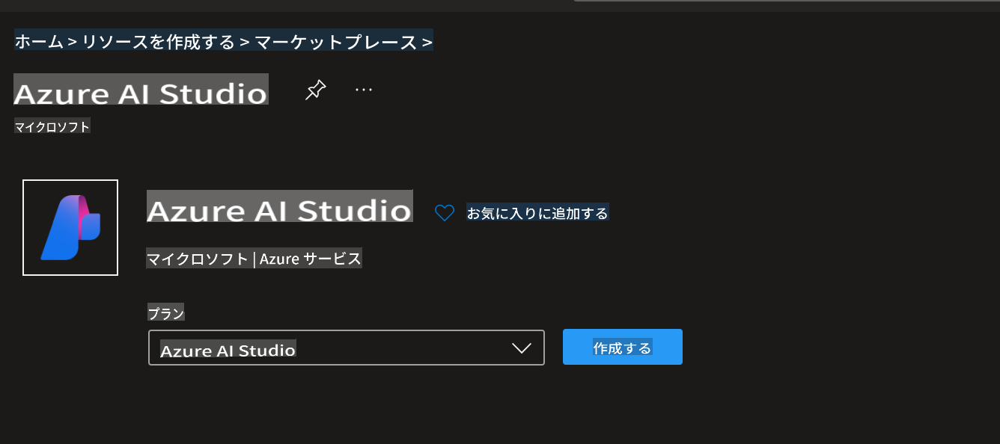
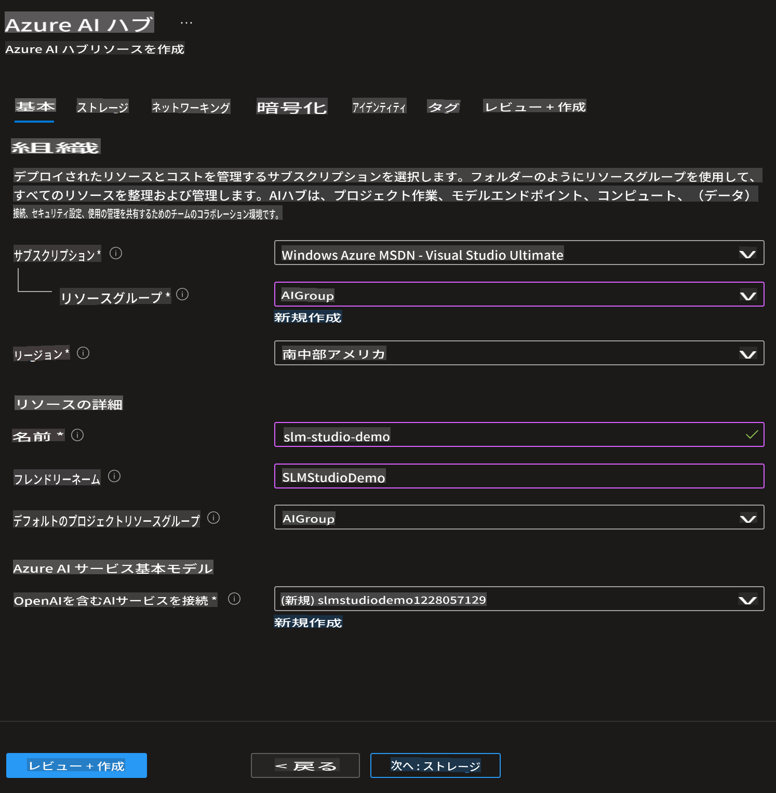
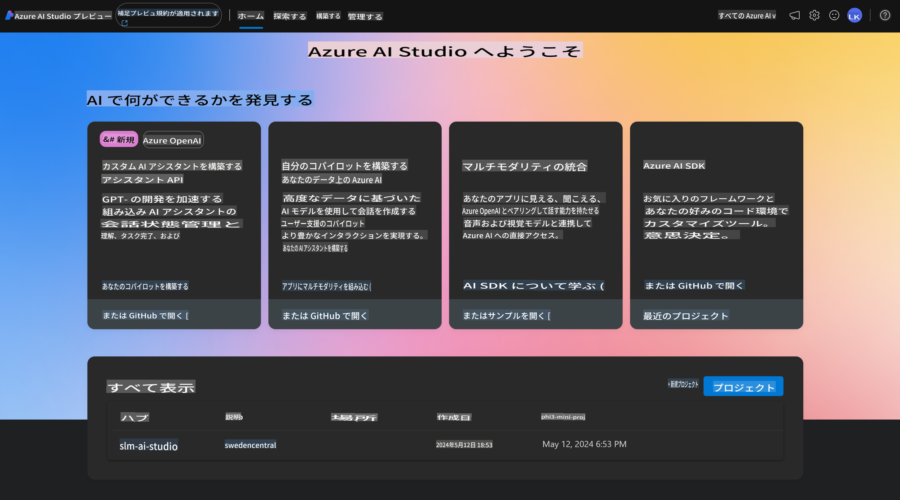
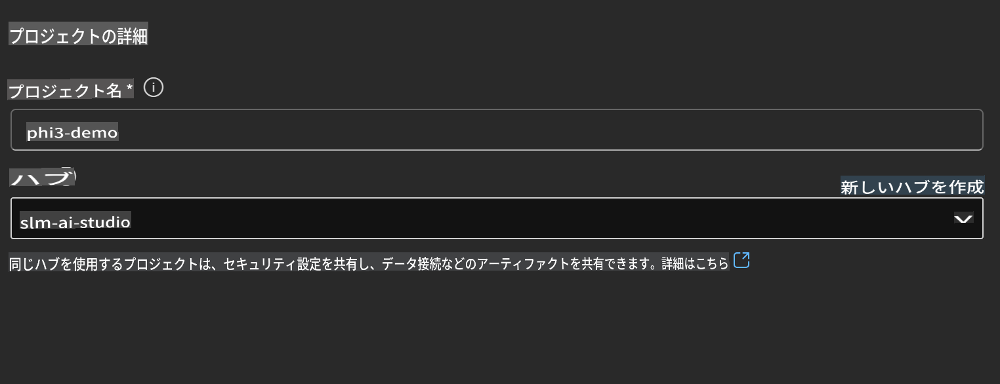
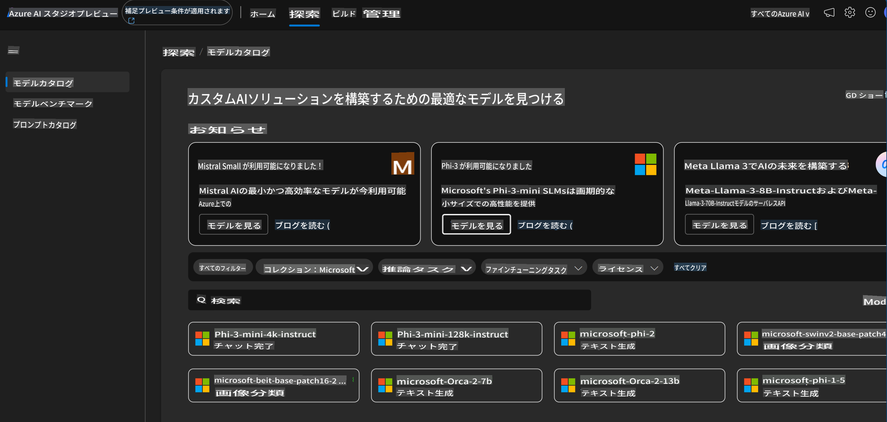
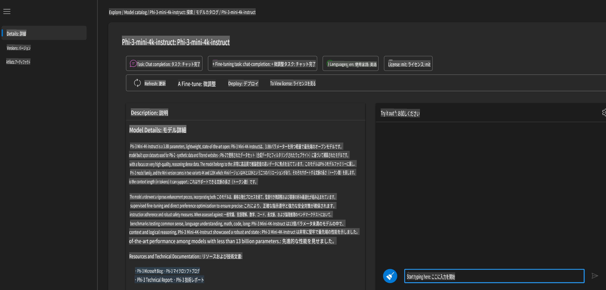
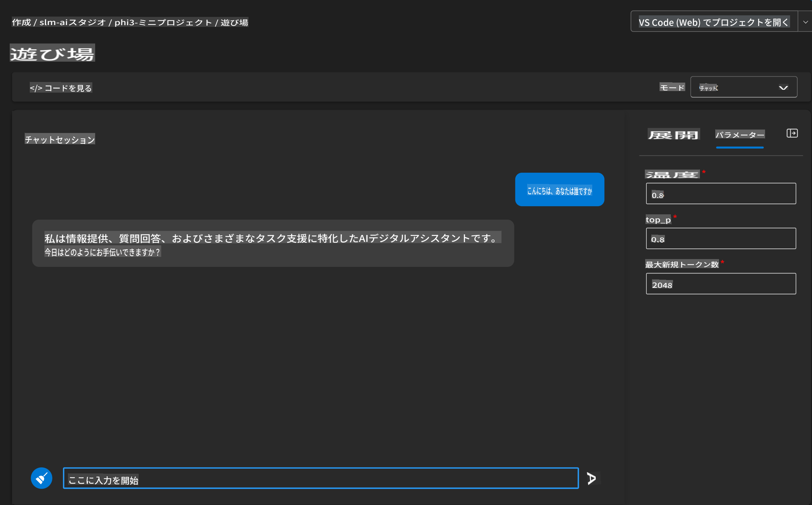
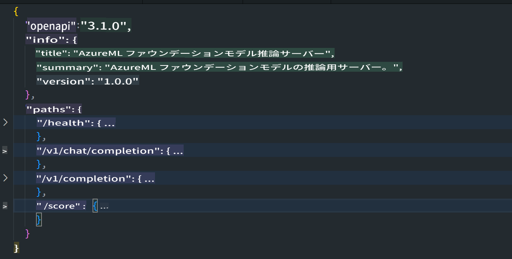
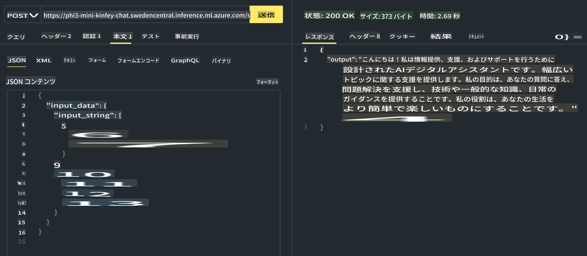

# **Azure AI StudioでのPhi-3の使用方法**

生成AIの発展に伴い、異なるLLMやSLMの管理、企業データの統合、ファインチューニング/RAG操作、およびLLMとSLMを統合した後の企業ビジネスの評価などを統一プラットフォームで行い、生成AIのスマートアプリケーションをより良く実現したいと考えています。[Azure AI Studio](https://ai.azure.com)は、エンタープライズ向けの生成AIアプリケーションプラットフォームです。



Azure AI Studioを使用すると、大規模言語モデル（LLM）の応答を評価し、プロンプトフローを使ってプロンプトアプリケーションコンポーネントを調整し、パフォーマンスを向上させることができます。このプラットフォームは、概念実証から本格的な生産への移行を容易にし、スケーラビリティを提供します。継続的な監視と改良が長期的な成功をサポートします。

簡単な手順でAzure AI Studio上にPhi-3モデルを迅速にデプロイし、Azure AI Studioを使用してPhi-3関連のPlayground/Chat、ファインチューニング、評価などの関連作業を完了できます。

## **1. 準備**

## [AZD AI Studio スターターテンプレート](https://azure.github.io/awesome-azd/?name=AI+Studio)

### Azure AI Studio スターター

これは、Azure AI Studioを開始するために必要なすべてをデプロイするBicepテンプレートです。依存リソースを含むAI Hub、AIプロジェクト、AIサービス、およびオンラインエンドポイントが含まれます。

### クイック使用

既にマシンに[Azure Developer CLI](https://learn.microsoft.com/azure/developer/azure-developer-cli/overview?WT.mc_id=aiml-138114-kinfeylo)がインストールされている場合、新しいディレクトリでこのコマンドを実行するだけでこのテンプレートを使用できます。

### ターミナルコマンド

```bash
azd init -t azd-aistudio-starter
```

または
azd VS Code拡張機能を使用している場合は、このURLをVS Codeコマンドターミナルに貼り付けることができます。

### ターミナルURL

```bash
azd-aistudio-starter
```

## 手動作成

[Azure Portal](https://portal.azure.com?WT.mc_id=aiml-138114-kinfeylo)でAzure AI Studioを作成します。



スタジオの命名とリージョンの設定を完了した後、作成できます。



作成が成功すると、[ai.azure.com](https://ai.azure.com/)を通じて作成したスタジオにアクセスできます。



1つのAI Studioには複数のプロジェクトが存在できます。AI Studioでプロジェクトを作成して準備を整えます。



## **2. Azure AI StudioでPhi-3モデルをデプロイ**

プロジェクトのExploreオプションをクリックしてモデルカタログに入り、Phi-3を選択します。



Phi-3-mini-4k-instructを選択します。



「Deploy」をクリックしてPhi-3-mini-4k-instructモデルをデプロイします。

> [!NOTE]
>
> デプロイ時にコンピューティングパワーを選択できます。

## **3. Azure AI StudioでPlayground Chat Phi-3**

デプロイメントページに移動し、Playgroundを選択してAzure AI StudioのPhi-3とチャットします。



## **4. Azure AI Studioからモデルをデプロイ**

Azure Model Catalogからモデルをデプロイするには、次の手順に従います。

- Azure AI Studioにサインインします。
- Azure AI Studioのモデルカタログからデプロイしたいモデルを選択します。
- モデルの詳細ページで「Deploy」を選択し、次に「Serverless API with Azure AI Content Safety」を選択します。
- モデルをデプロイしたいプロジェクトを選択します。Serverless APIオファリングを使用するには、ワークスペースがEast US 2またはSweden Centralリージョンに属している必要があります。デプロイメント名をカスタマイズできます。
- デプロイメントウィザードで、価格と利用規約を確認します。
- 「Deploy」を選択します。デプロイメントが完了するまで待ち、デプロイメントページにリダイレクトされます。
- 「Open in playground」を選択してモデルと対話を開始します。
- デプロイメントページに戻り、デプロイメントを選択し、エンドポイントのターゲットURLとシークレットキーを確認します。これを使用してデプロイメントを呼び出し、完了を生成できます。
- Buildタブに移動し、ComponentsセクションからDeploymentsを選択して、エンドポイントの詳細、URL、およびアクセスキーをいつでも確認できます。

> [!NOTE]
> これらの手順を実行するには、アカウントにResource GroupのAzure AI Developerロールの権限が必要です。

## **5. Azure AI StudioでPhi-3 APIを使用**

Postman GETを通じてhttps://{Your project name}.region.inference.ml.azure.com/swagger.jsonにアクセスし、Keyと組み合わせて提供されるインターフェースについて学ぶことができます。



例えば、スコアAPIにアクセスする場合


リクエストパラメータやレスポンスパラメータを非常に簡単に取得できます。これはPostmanの結果です。



免責事項: 翻訳はAIモデルによって原文から翻訳されたものであり、完璧ではない可能性があります。
出力を確認し、必要な修正を行ってください。