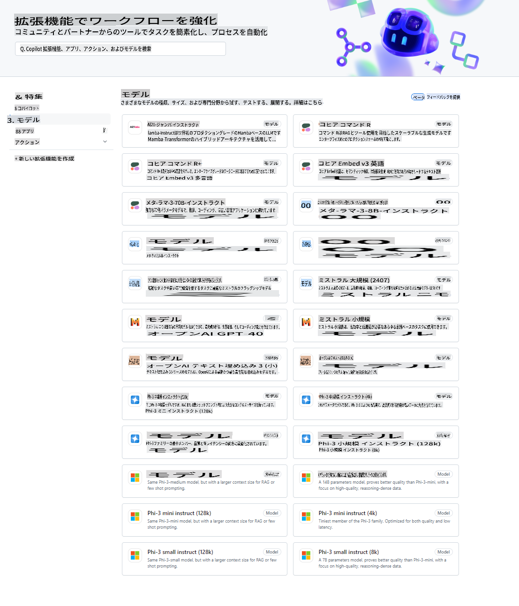
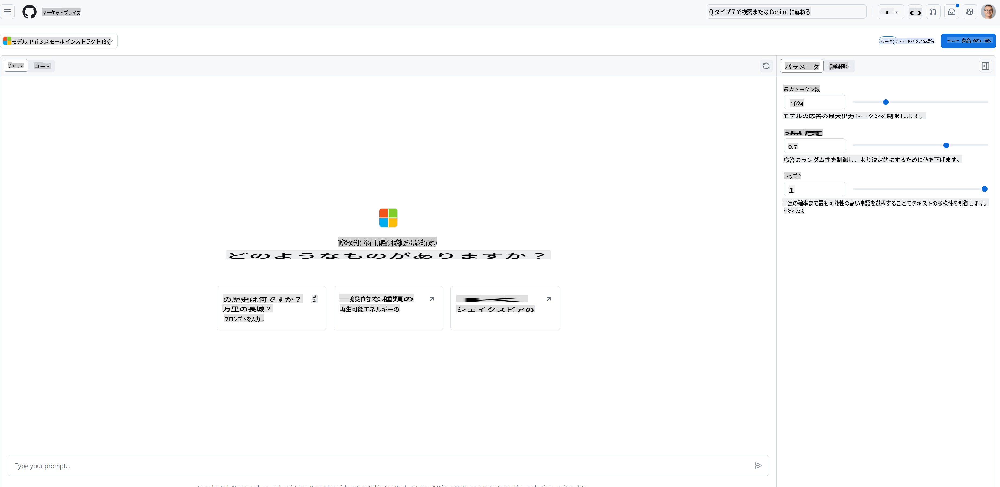
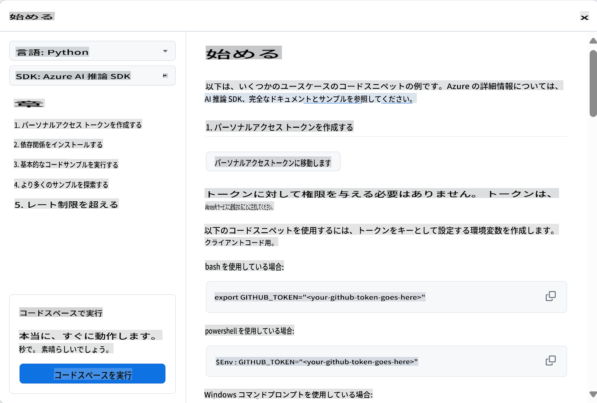
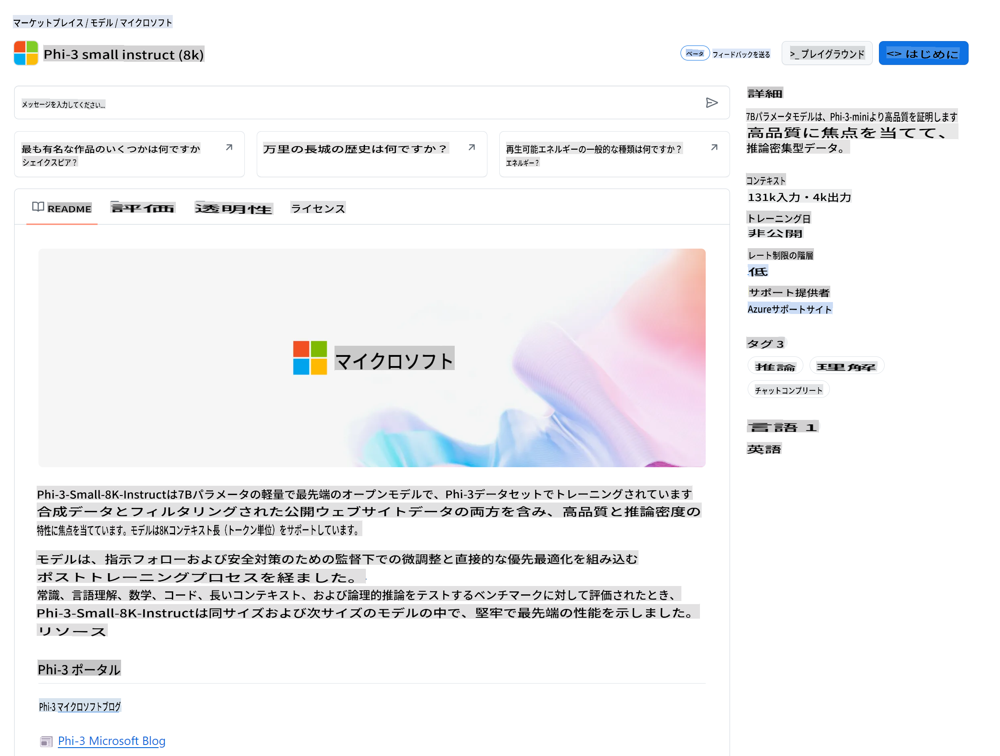

## GitHub Models - Limited Public Beta

[GitHub Models](https://github.com/marketplace/models)へようこそ！Azure AI上でホスティングされているAIモデルを探索する準備が整いました。



GitHub Modelsで利用可能なモデルの詳細については、[GitHub Model Marketplace](https://github.com/marketplace/models)をチェックしてください。

## 利用可能なモデル

各モデルには専用のプレイグラウンドとサンプルコードがあります。



### GitHub Model CatalogのPhi-3モデル

[Phi-3-Medium-128k-Instruct](https://github.com/marketplace/models/azureml/Phi-3-medium-128k-instruct)

[Phi-3-medium-4k-instruct](https://github.com/marketplace/models/azureml/Phi-3-medium-4k-instruct)

[Phi-3-mini-128k-instruct](https://github.com/marketplace/models/azureml/Phi-3-mini-128k-instruct)

[Phi-3-mini-4k-instruct](https://github.com/marketplace/models/azureml/Phi-3-mini-4k-instruct)

[Phi-3-small-128k-instruct](https://github.com/marketplace/models/azureml/Phi-3-small-128k-instruct)

[Phi-3-small-8k-instruct](https://github.com/marketplace/models/azureml/Phi-3-small-8k-instruct)

## はじめに

いくつかの基本的な例がすぐに実行できるように準備されています。サンプルディレクトリにそれらを見つけることができます。お好みの言語にすぐに飛びたい場合は、以下の言語で例を見つけることができます：

- Python
- JavaScript
- cURL

また、サンプルやモデルを実行するための専用のCodespaces環境も用意されています。



## サンプルコード

以下は、いくつかのユースケースに対するサンプルコードのスニペットです。Azure AI Inference SDKの詳細については、完全なドキュメントとサンプルを参照してください。

## セットアップ

1. 個人アクセストークンを作成する
トークンに権限を与える必要はありません。トークンはMicrosoftのサービスに送信されることに注意してください。

以下のコードスニペットを使用するには、環境変数を作成してトークンをクライアントコードのキーとして設定します。

bashを使用している場合：
```
export GITHUB_TOKEN="<your-github-token-goes-here>"
```
powershellを使用している場合：

```
$Env:GITHUB_TOKEN="<your-github-token-goes-here>"
```

Windowsコマンドプロンプトを使用している場合：

```
set GITHUB_TOKEN=<your-github-token-goes-here>
```

## Pythonサンプル

### 依存関係のインストール
pipを使用してAzure AI Inference SDKをインストールします（必要条件：Python >=3.8）：

```
pip install azure-ai-inference
```
### 基本的なコードサンプルを実行する

このサンプルは、チャット完了APIへの基本的な呼び出しを示しています。GitHub AIモデルの推論エンドポイントとあなたのGitHubトークンを利用しています。この呼び出しは同期的です。

```
import os
from azure.ai.inference import ChatCompletionsClient
from azure.ai.inference.models import SystemMessage, UserMessage
from azure.core.credentials import AzureKeyCredential

endpoint = "https://models.inference.ai.azure.com"
# Replace Model_Name 
model_name = "Phi-3-small-8k-instruct"
token = os.environ["GITHUB_TOKEN"]

client = ChatCompletionsClient(
    endpoint=endpoint,
    credential=AzureKeyCredential(token),
)

response = client.complete(
    messages=[
        SystemMessage(content="You are a helpful assistant."),
        UserMessage(content="What is the capital of France?"),
    ],
    model=model_name,
    temperature=1.,
    max_tokens=1000,
    top_p=1.
)

print(response.choices[0].message.content)
```

### 複数ターンの会話を実行する

このサンプルは、チャット完了APIを使用した複数ターンの会話を示しています。チャットアプリケーションでモデルを使用する場合、その会話の履歴を管理し、最新のメッセージをモデルに送信する必要があります。

```
import os
from azure.ai.inference import ChatCompletionsClient
from azure.ai.inference.models import AssistantMessage, SystemMessage, UserMessage
from azure.core.credentials import AzureKeyCredential

token = os.environ["GITHUB_TOKEN"]
endpoint = "https://models.inference.ai.azure.com"
# Replace Model_Name
model_name = "Phi-3-small-8k-instruct"

client = ChatCompletionsClient(
    endpoint=endpoint,
    credential=AzureKeyCredential(token),
)

messages = [
    SystemMessage(content="You are a helpful assistant."),
    UserMessage(content="What is the capital of France?"),
    AssistantMessage(content="The capital of France is Paris."),
    UserMessage(content="What about Spain?"),
]

response = client.complete(messages=messages, model=model_name)

print(response.choices[0].message.content)
```

### 出力をストリーミングする

より良いユーザー体験のために、モデルの応答をストリーミングして、最初のトークンが早く表示されるようにし、長い応答を待つのを避けたいです。

```
import os
from azure.ai.inference import ChatCompletionsClient
from azure.ai.inference.models import SystemMessage, UserMessage
from azure.core.credentials import AzureKeyCredential

token = os.environ["GITHUB_TOKEN"]
endpoint = "https://models.inference.ai.azure.com"
# Replace Model_Name
model_name = "Phi-3-small-8k-instruct"

client = ChatCompletionsClient(
    endpoint=endpoint,
    credential=AzureKeyCredential(token),
)

response = client.complete(
    stream=True,
    messages=[
        SystemMessage(content="You are a helpful assistant."),
        UserMessage(content="Give me 5 good reasons why I should exercise every day."),
    ],
    model=model_name,
)

for update in response:
    if update.choices:
        print(update.choices[0].delta.content or "", end="")

client.close()
```
## JavaScript

### 依存関係のインストール

Node.jsをインストールします。

以下のテキストをコピーして、フォルダー内にpackage.jsonというファイルとして保存します。

```
{
  "type": "module",
  "dependencies": {
    "@azure-rest/ai-inference": "latest",
    "@azure/core-auth": "latest",
    "@azure/core-sse": "latest"
  }
}
```

注: @azure/core-sseはチャット完了応答をストリーミングする際にのみ必要です。

このフォルダー内でターミナルウィンドウを開き、npm installを実行します。

以下の各コードスニペットについて、内容をsample.jsというファイルにコピーし、node sample.jsで実行します。

### 基本的なコードサンプルを実行する

このサンプルは、チャット完了APIへの基本的な呼び出しを示しています。GitHub AIモデルの推論エンドポイントとあなたのGitHubトークンを利用しています。この呼び出しは同期的です。

```
import ModelClient from "@azure-rest/ai-inference";
import { AzureKeyCredential } from "@azure/core-auth";

const token = process.env["GITHUB_TOKEN"];
const endpoint = "https://models.inference.ai.azure.com";
// Update your modelname
const modelName = "Phi-3-small-8k-instruct";

export async function main() {

  const client = new ModelClient(endpoint, new AzureKeyCredential(token));

  const response = await client.path("/chat/completions").post({
    body: {
      messages: [
        { role:"system", content: "You are a helpful assistant." },
        { role:"user", content: "What is the capital of France?" }
      ],
      model: modelName,
      temperature: 1.,
      max_tokens: 1000,
      top_p: 1.
    }
  });

  if (response.status !== "200") {
    throw response.body.error;
  }
  console.log(response.body.choices[0].message.content);
}

main().catch((err) => {
  console.error("The sample encountered an error:", err);
});
```

### 複数ターンの会話を実行する

このサンプルは、チャット完了APIを使用した複数ターンの会話を示しています。チャットアプリケーションでモデルを使用する場合、その会話の履歴を管理し、最新のメッセージをモデルに送信する必要があります。

```
import ModelClient from "@azure-rest/ai-inference";
import { AzureKeyCredential } from "@azure/core-auth";

const token = process.env["GITHUB_TOKEN"];
const endpoint = "https://models.inference.ai.azure.com";
// Update your modelname
const modelName = "Phi-3-small-8k-instruct";

export async function main() {

  const client = new ModelClient(endpoint, new AzureKeyCredential(token));

  const response = await client.path("/chat/completions").post({
    body: {
      messages: [
        { role: "system", content: "You are a helpful assistant." },
        { role: "user", content: "What is the capital of France?" },
        { role: "assistant", content: "The capital of France is Paris." },
        { role: "user", content: "What about Spain?" },
      ],
      model: modelName,
    }
  });

  if (response.status !== "200") {
    throw response.body.error;
  }

  for (const choice of response.body.choices) {
    console.log(choice.message.content);
  }
}

main().catch((err) => {
  console.error("The sample encountered an error:", err);
});
```

### 出力をストリーミングする
より良いユーザー体験のために、モデルの応答をストリーミングして、最初のトークンが早く表示されるようにし、長い応答を待つのを避けたいです。

```
import ModelClient from "@azure-rest/ai-inference";
import { AzureKeyCredential } from "@azure/core-auth";
import { createSseStream } from "@azure/core-sse";

const token = process.env["GITHUB_TOKEN"];
const endpoint = "https://models.inference.ai.azure.com";
// Update your modelname
const modelName = "Phi-3-small-8k-instruct";

export async function main() {

  const client = new ModelClient(endpoint, new AzureKeyCredential(token));

  const response = await client.path("/chat/completions").post({
    body: {
      messages: [
        { role: "system", content: "You are a helpful assistant." },
        { role: "user", content: "Give me 5 good reasons why I should exercise every day." },
      ],
      model: modelName,
      stream: true
    }
  }).asNodeStream();

  const stream = response.body;
  if (!stream) {
    throw new Error("The response stream is undefined");
  }

  if (response.status !== "200") {
    stream.destroy();
    throw new Error(`Failed to get chat completions, http operation failed with ${response.status} code`);
  }

  const sseStream = createSseStream(stream);

  for await (const event of sseStream) {
    if (event.data === "[DONE]") {
      return;
    }
    for (const choice of (JSON.parse(event.data)).choices) {
        process.stdout.write(choice.delta?.content ?? ``);
    }
  }
}

main().catch((err) => {
  console.error("The sample encountered an error:", err);
});
```

## REST

### 基本的なコードサンプルを実行する

シェルに以下を貼り付けます：

```
curl -X POST "https://models.inference.ai.azure.com/chat/completions" \
    -H "Content-Type: application/json" \
    -H "Authorization: Bearer $GITHUB_TOKEN" \
    -d '{
        "messages": [
            {
                "role": "system",
                "content": "You are a helpful assistant."
            },
            {
                "role": "user",
                "content": "What is the capital of France?"
            }
        ],
        "model": "Phi-3-small-8k-instruct"
    }'
```
### 複数ターンの会話を実行する

チャット履歴を渡してチャット完了APIを呼び出します：

```
curl -X POST "https://models.inference.ai.azure.com/chat/completions" \
    -H "Content-Type: application/json" \
    -H "Authorization: Bearer $GITHUB_TOKEN" \
    -d '{
        "messages": [
            {
                "role": "system",
                "content": "You are a helpful assistant."
            },
            {
                "role": "user",
                "content": "What is the capital of France?"
            },
            {
                "role": "assistant",
                "content": "The capital of France is Paris."
            },
            {
                "role": "user",
                "content": "What about Spain?"
            }
        ],
        "model": "Phi-3-small-8k-instruct"
    }'
```
### 出力をストリーミングする

エンドポイントを呼び出し、応答をストリーミングする例です。

```
curl -X POST "https://models.inference.ai.azure.com/chat/completions" \
    -H "Content-Type: application/json" \
    -H "Authorization: Bearer $GITHUB_TOKEN" \
    -d '{
        "messages": [
            {
                "role": "system",
                "content": "You are a helpful assistant."
            },
            {
                "role": "user",
                "content": "Give me 5 good reasons why I should exercise every day."
            }
        ],
        "stream": true,
        "model": "Phi-3-small-8k-instruct"
    }'
```

## GitHub Modelsの無料使用とレート制限



プレイグラウンドおよび無料API使用の[レート制限](https://docs.github.com/en/github-models/prototyping-with-ai-models#rate-limits)は、モデルを試してAIアプリケーションをプロトタイプ化するのに役立ちます。これらの制限を超えて使用する場合、およびアプリケーションをスケールさせるためには、Azureアカウントからリソースをプロビジョニングし、GitHubの個人アクセストークンの代わりにそこから認証する必要があります。コードの他の部分を変更する必要はありません。Azure AIで無料ティアの制限を超える方法については、このリンクを使用して確認してください。

### 開示事項

モデルと対話する際には、AIを試していることを忘れないでください。したがって、内容に誤りが含まれる可能性があります。

この機能にはさまざまな制限（1分あたりのリクエスト数、1日あたりのリクエスト数、リクエストごとのトークン数、および同時リクエスト数など）があり、プロダクション用途には設計されていません。

GitHub ModelsはAzure AI Content Safetyを使用しています。これらのフィルターはGitHub Modelsの体験の一部としてオフにすることはできません。有料サービスを通じてモデルを利用することを決定した場合は、要件に合わせてコンテンツフィルターを構成してください。

このサービスはGitHubのプレリリース条件に基づいています。

**免責事項**:
この文書は機械翻訳サービスを使用して翻訳されています。正確さを期していますが、自動翻訳には誤りや不正確さが含まれる場合があります。原文が権威ある情報源と見なされるべきです。重要な情報については、専門の人間による翻訳をお勧めします。この翻訳の使用に起因する誤解や誤訳について、当社は一切の責任を負いません。