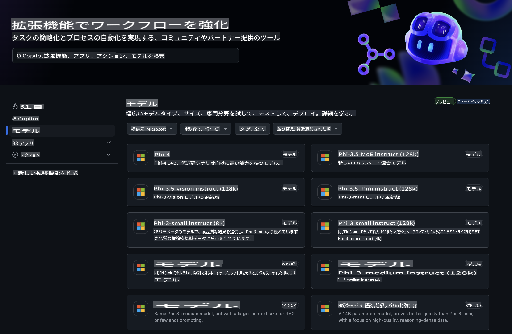
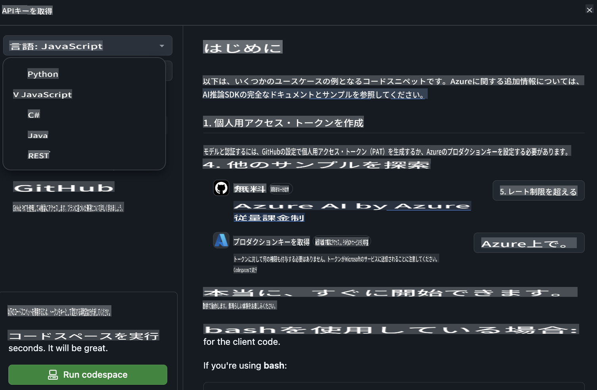
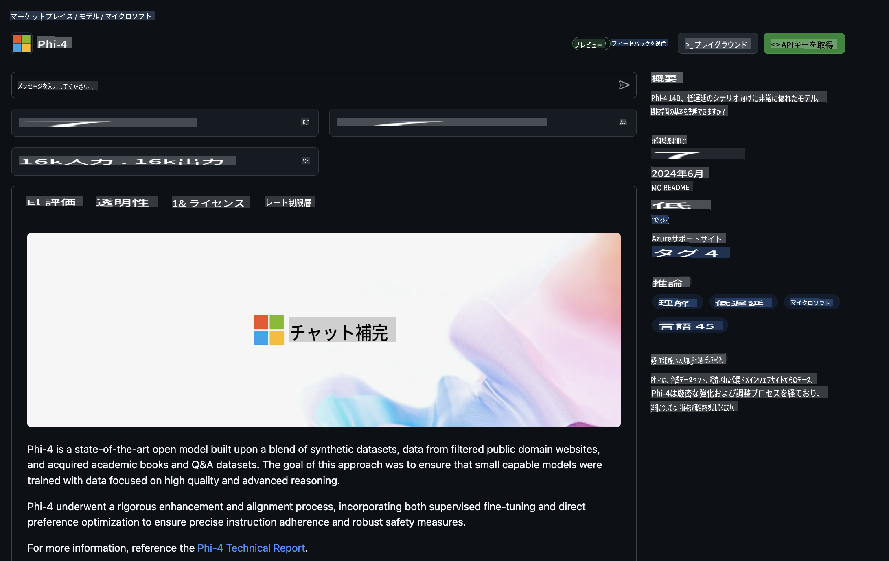

## GitHubモデル - 限定公開ベータ版

[GitHub Models](https://github.com/marketplace/models)へようこそ！Azure AI上にホストされたAIモデルを探索できる準備が整っています。



GitHub Modelsで利用可能なモデルに関する詳細は、[GitHub Model Marketplace](https://github.com/marketplace/models)をご覧ください。

## 利用可能なモデル

各モデルには専用のプレイグラウンドとサンプルコードがあります。


### GitHub Model Catalog内のPhi-3モデル

[Phi-3-Medium-128k-Instruct](https://github.com/marketplace/models/azureml/Phi-3-medium-128k-instruct)

[Phi-3-medium-4k-instruct](https://github.com/marketplace/models/azureml/Phi-3-medium-4k-instruct)

[Phi-3-mini-128k-instruct](https://github.com/marketplace/models/azureml/Phi-3-mini-128k-instruct)

[Phi-3-mini-4k-instruct](https://github.com/marketplace/models/azureml/Phi-3-mini-4k-instruct)

[Phi-3-small-128k-instruct](https://github.com/marketplace/models/azureml/Phi-3-small-128k-instruct)

[Phi-3-small-8k-instruct](https://github.com/marketplace/models/azureml/Phi-3-small-8k-instruct)

## はじめに

すぐに実行可能な基本的なサンプルがいくつか用意されています。これらはsamplesディレクトリにあります。特定の言語をすぐに試したい場合は、以下の言語でサンプルを確認できます：

- Python  
- JavaScript  
- cURL  

また、サンプルやモデルを実行するための専用のCodespaces環境も用意されています。



## サンプルコード

以下は、いくつかのユースケースのためのサンプルコードスニペットです。Azure AI Inference SDKに関する詳細情報は、完全なドキュメントとサンプルをご覧ください。

## セットアップ

1. パーソナルアクセストークンを作成  
トークンに権限を付与する必要はありません。このトークンはMicrosoftのサービスに送信されます。

以下のコードスニペットを使用するには、環境変数を作成して、クライアントコード用のキーとしてトークンを設定してください。

bashを使用している場合：  
```
export GITHUB_TOKEN="<your-github-token-goes-here>"
```  
powershellを使用している場合：  

```
$Env:GITHUB_TOKEN="<your-github-token-goes-here>"
```  

Windowsコマンドプロンプトを使用している場合：  

```
set GITHUB_TOKEN=<your-github-token-goes-here>
```  

## Pythonサンプル

### 依存関係のインストール  
pipを使用してAzure AI Inference SDKをインストールします（要件：Python >=3.8）：  

```
pip install azure-ai-inference
```  

### 基本的なコードサンプルを実行する

このサンプルでは、chat completion APIへの基本的な呼び出しを示しています。GitHub AIモデル推論エンドポイントとGitHubトークンを活用しています。この呼び出しは同期的に行われます。

```
import os
from azure.ai.inference import ChatCompletionsClient
from azure.ai.inference.models import SystemMessage, UserMessage
from azure.core.credentials import AzureKeyCredential

endpoint = "https://models.inference.ai.azure.com"
# Replace Model_Name 
model_name = "Phi-3-small-8k-instruct"
token = os.environ["GITHUB_TOKEN"]

client = ChatCompletionsClient(
    endpoint=endpoint,
    credential=AzureKeyCredential(token),
)

response = client.complete(
    messages=[
        SystemMessage(content="You are a helpful assistant."),
        UserMessage(content="What is the capital of France?"),
    ],
    model=model_name,
    temperature=1.,
    max_tokens=1000,
    top_p=1.
)

print(response.choices[0].message.content)
```  

### マルチターン会話を実行する

このサンプルでは、chat completion APIを使用したマルチターン会話を示しています。チャットアプリケーション用にモデルを使用する場合、その会話の履歴を管理し、最新のメッセージをモデルに送信する必要があります。

```
import os
from azure.ai.inference import ChatCompletionsClient
from azure.ai.inference.models import AssistantMessage, SystemMessage, UserMessage
from azure.core.credentials import AzureKeyCredential

token = os.environ["GITHUB_TOKEN"]
endpoint = "https://models.inference.ai.azure.com"
# Replace Model_Name
model_name = "Phi-3-small-8k-instruct"

client = ChatCompletionsClient(
    endpoint=endpoint,
    credential=AzureKeyCredential(token),
)

messages = [
    SystemMessage(content="You are a helpful assistant."),
    UserMessage(content="What is the capital of France?"),
    AssistantMessage(content="The capital of France is Paris."),
    UserMessage(content="What about Spain?"),
]

response = client.complete(messages=messages, model=model_name)

print(response.choices[0].message.content)
```  

### 出力をストリームする

より良いユーザー体験のために、モデルの応答をストリームして、最初のトークンが早く表示され、長い応答を待つのを避けることができます。

```
import os
from azure.ai.inference import ChatCompletionsClient
from azure.ai.inference.models import SystemMessage, UserMessage
from azure.core.credentials import AzureKeyCredential

token = os.environ["GITHUB_TOKEN"]
endpoint = "https://models.inference.ai.azure.com"
# Replace Model_Name
model_name = "Phi-3-small-8k-instruct"

client = ChatCompletionsClient(
    endpoint=endpoint,
    credential=AzureKeyCredential(token),
)

response = client.complete(
    stream=True,
    messages=[
        SystemMessage(content="You are a helpful assistant."),
        UserMessage(content="Give me 5 good reasons why I should exercise every day."),
    ],
    model=model_name,
)

for update in response:
    if update.choices:
        print(update.choices[0].delta.content or "", end="")

client.close()
```  

## JavaScript

### 依存関係のインストール

Node.jsをインストールしてください。

以下のテキストをコピーし、package.jsonという名前のファイルとしてフォルダ内に保存してください。

```
{
  "type": "module",
  "dependencies": {
    "@azure-rest/ai-inference": "latest",
    "@azure/core-auth": "latest",
    "@azure/core-sse": "latest"
  }
}
```  

注意：@azure/core-sseは、チャット完了応答をストリームする際にのみ必要です。

このフォルダ内でターミナルウィンドウを開き、npm installを実行します。

以下の各コードスニペットについて、その内容をsample.jsというファイルにコピーし、node sample.jsで実行してください。

### 基本的なコードサンプルを実行する

このサンプルでは、chat completion APIへの基本的な呼び出しを示しています。GitHub AIモデル推論エンドポイントとGitHubトークンを活用しています。この呼び出しは同期的に行われます。

```
import ModelClient from "@azure-rest/ai-inference";
import { AzureKeyCredential } from "@azure/core-auth";

const token = process.env["GITHUB_TOKEN"];
const endpoint = "https://models.inference.ai.azure.com";
// Update your modelname
const modelName = "Phi-3-small-8k-instruct";

export async function main() {

  const client = new ModelClient(endpoint, new AzureKeyCredential(token));

  const response = await client.path("/chat/completions").post({
    body: {
      messages: [
        { role:"system", content: "You are a helpful assistant." },
        { role:"user", content: "What is the capital of France?" }
      ],
      model: modelName,
      temperature: 1.,
      max_tokens: 1000,
      top_p: 1.
    }
  });

  if (response.status !== "200") {
    throw response.body.error;
  }
  console.log(response.body.choices[0].message.content);
}

main().catch((err) => {
  console.error("The sample encountered an error:", err);
});
```  

### マルチターン会話を実行する

このサンプルでは、chat completion APIを使用したマルチターン会話を示しています。チャットアプリケーション用にモデルを使用する場合、その会話の履歴を管理し、最新のメッセージをモデルに送信する必要があります。

```
import ModelClient from "@azure-rest/ai-inference";
import { AzureKeyCredential } from "@azure/core-auth";

const token = process.env["GITHUB_TOKEN"];
const endpoint = "https://models.inference.ai.azure.com";
// Update your modelname
const modelName = "Phi-3-small-8k-instruct";

export async function main() {

  const client = new ModelClient(endpoint, new AzureKeyCredential(token));

  const response = await client.path("/chat/completions").post({
    body: {
      messages: [
        { role: "system", content: "You are a helpful assistant." },
        { role: "user", content: "What is the capital of France?" },
        { role: "assistant", content: "The capital of France is Paris." },
        { role: "user", content: "What about Spain?" },
      ],
      model: modelName,
    }
  });

  if (response.status !== "200") {
    throw response.body.error;
  }

  for (const choice of response.body.choices) {
    console.log(choice.message.content);
  }
}

main().catch((err) => {
  console.error("The sample encountered an error:", err);
});
```  

### 出力をストリームする  
より良いユーザー体験のために、モデルの応答をストリームして、最初のトークンが早く表示され、長い応答を待つのを避けることができます。

```
import ModelClient from "@azure-rest/ai-inference";
import { AzureKeyCredential } from "@azure/core-auth";
import { createSseStream } from "@azure/core-sse";

const token = process.env["GITHUB_TOKEN"];
const endpoint = "https://models.inference.ai.azure.com";
// Update your modelname
const modelName = "Phi-3-small-8k-instruct";

export async function main() {

  const client = new ModelClient(endpoint, new AzureKeyCredential(token));

  const response = await client.path("/chat/completions").post({
    body: {
      messages: [
        { role: "system", content: "You are a helpful assistant." },
        { role: "user", content: "Give me 5 good reasons why I should exercise every day." },
      ],
      model: modelName,
      stream: true
    }
  }).asNodeStream();

  const stream = response.body;
  if (!stream) {
    throw new Error("The response stream is undefined");
  }

  if (response.status !== "200") {
    stream.destroy();
    throw new Error(`Failed to get chat completions, http operation failed with ${response.status} code`);
  }

  const sseStream = createSseStream(stream);

  for await (const event of sseStream) {
    if (event.data === "[DONE]") {
      return;
    }
    for (const choice of (JSON.parse(event.data)).choices) {
        process.stdout.write(choice.delta?.content ?? ``);
    }
  }
}

main().catch((err) => {
  console.error("The sample encountered an error:", err);
});
```  

## REST

### 基本的なコードサンプルを実行する

以下をシェルに貼り付けてください：

```
curl -X POST "https://models.inference.ai.azure.com/chat/completions" \
    -H "Content-Type: application/json" \
    -H "Authorization: Bearer $GITHUB_TOKEN" \
    -d '{
        "messages": [
            {
                "role": "system",
                "content": "You are a helpful assistant."
            },
            {
                "role": "user",
                "content": "What is the capital of France?"
            }
        ],
        "model": "Phi-3-small-8k-instruct"
    }'
```  

### マルチターン会話を実行する

chat completion APIを呼び出し、チャット履歴を渡します：

```
curl -X POST "https://models.inference.ai.azure.com/chat/completions" \
    -H "Content-Type: application/json" \
    -H "Authorization: Bearer $GITHUB_TOKEN" \
    -d '{
        "messages": [
            {
                "role": "system",
                "content": "You are a helpful assistant."
            },
            {
                "role": "user",
                "content": "What is the capital of France?"
            },
            {
                "role": "assistant",
                "content": "The capital of France is Paris."
            },
            {
                "role": "user",
                "content": "What about Spain?"
            }
        ],
        "model": "Phi-3-small-8k-instruct"
    }'
```  

### 出力をストリームする

エンドポイントを呼び出して応答をストリームする例です。

```
curl -X POST "https://models.inference.ai.azure.com/chat/completions" \
    -H "Content-Type: application/json" \
    -H "Authorization: Bearer $GITHUB_TOKEN" \
    -d '{
        "messages": [
            {
                "role": "system",
                "content": "You are a helpful assistant."
            },
            {
                "role": "user",
                "content": "Give me 5 good reasons why I should exercise every day."
            }
        ],
        "stream": true,
        "model": "Phi-3-small-8k-instruct"
    }'
```  

## GitHubモデルの無料利用とレート制限



[プレイグラウンドおよび無料API利用のレート制限](https://docs.github.com/en/github-models/prototyping-with-ai-models#rate-limits)は、モデルを試したりAIアプリケーションをプロトタイプする際に役立つよう設計されています。これらの制限を超えて利用する場合や、アプリケーションをスケールさせる場合は、Azureアカウントからリソースをプロビジョニングし、GitHubパーソナルアクセストークンではなくAzureから認証する必要があります。それ以外のコードは変更する必要はありません。Azure AIで無料利用枠を超える方法については、こちらのリンクをご覧ください。

### 開示事項

モデルと対話する際、AIを使った実験を行っていることを忘れないでください。そのため、コンテンツに間違いが含まれる可能性があります。

この機能はさまざまな制限（1分あたりのリクエスト数、1日あたりのリクエスト数、1リクエストあたりのトークン数、同時リクエスト数など）の対象であり、プロダクション用途には設計されていません。

GitHub ModelsはAzure AI Content Safetyを使用しています。これらのフィルタはGitHub Modelsの体験の一環としてオフにすることはできません。有料サービスを通じてモデルを利用する場合は、要件に応じてコンテンツフィルタを設定してください。

このサービスはGitHubの事前リリース条件に準拠しています。

**免責事項**:  
この文書は、機械翻訳AIサービスを使用して翻訳されています。正確性を期すよう努めておりますが、自動翻訳には誤りや不正確な箇所が含まれる場合があります。元の言語で記載された原文を正式な情報源としてご参照ください。重要な情報については、専門の人間による翻訳を推奨します。この翻訳の利用により生じた誤解や誤認について、当方は一切の責任を負いかねます。