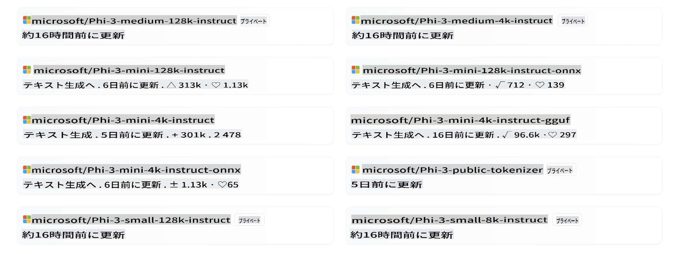
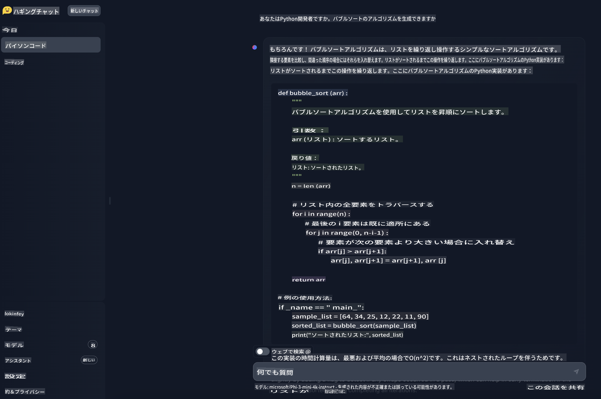

# **Hugging FaceでPhi-3を使用する**

[Hugging Face](https://huggingface.co/)は、豊富なデータとオープンソースモデルリソースを持つ非常に人気のあるAIコミュニティです。Microsoft、Meta、Mistral、Apple、Googleなど、さまざまなメーカーがHugging Faceを通じてオープンソースのLLMやSLMを公開しています。



Microsoft Phi-3はHugging Faceで公開されています。開発者はシナリオやビジネスに基づいて対応するPhi-3モデルをダウンロードできます。Hugging FaceでPhi-3のPytorchモデルをデプロイするだけでなく、エンドユーザーに選択肢を提供するためにGGUFおよびONNX形式の量子化モデルも公開しました。

## **1. Hugging FaceからPhi-3をダウンロードする**

```bash

git lfs install 

git clone https://huggingface.co/microsoft/Phi-3-mini-4k-instruct

```

## **2. Phi-3のプロンプトテンプレートについて学ぶ**

Phi-3をトレーニングする際には特定のデータテンプレートがあります。そのため、Phi-3を使用する際にはテンプレートを通じてプロンプトを設定する必要があります。ファインチューニングの際には、データもテンプレートに従って拡張する必要があります。

テンプレートには、システム、ユーザー、アシスタントの3つの役割があります。

```txt

<|system|>
Your Role<|end|>
<|user|>
Your Question?<|end|>
<|assistant|>

```

例えば

```txt

<|system|>
Your are a python developer.<|end|>
<|user|>
Help me generate a bubble algorithm<|end|>
<|assistant|>

```

## **3. PythonでPhi-3を推論する**

Phi-3を使用した推論とは、入力データに基づいてPhi-3モデルを使用して予測や出力を生成するプロセスを指します。Phi-3モデルは、Phi-3-Mini、Phi-3-Small、Phi-3-Mediumなどのバリアントを含む小型言語モデル（SLM）のファミリーであり、各バリアントは異なるアプリケーションシナリオに対応し、異なるパラメータサイズを持っています。これらのモデルは高品質なデータでトレーニングされ、チャット機能、アライメント、堅牢性、安全性に特化しています。ONNXやTensorFlow Liteを使用してエッジおよびクラウドプラットフォームにデプロイでき、MicrosoftのResponsible AI原則に基づいて開発されています。

例えば、Phi-3-Miniは3.8億パラメータを持つ軽量の最先端オープンモデルであり、チャット形式を使用したプロンプトに適しており、最大128Kトークンのコンテキスト長をサポートします。このクラスで初めてこれほど長いコンテキストをサポートするモデルです。

Phi-3モデルは、Azure AI MaaS、HuggingFace、NVIDIA、Ollama、ONNXなどのプラットフォームで利用可能で、リアルタイムのインタラクション、自律システム、低レイテンシーを必要とするアプリケーションなど、さまざまな用途に使用できます。

Phi-3を参照する方法はたくさんあります。異なるプログラミング言語を使用してモデルを参照できます。

ここでは、Pythonの例を示します。

```python

import torch
from transformers import AutoModelForCausalLM, AutoTokenizer, pipeline

torch.random.manual_seed(0)

model = AutoModelForCausalLM.from_pretrained(
    "microsoft/Phi-3-mini-4k-instruct", 
    device_map="cuda", 
    torch_dtype="auto", 
    trust_remote_code=True, 
)
tokenizer = AutoTokenizer.from_pretrained("microsoft/Phi-3-mini-4k-instruct")

messages = [
    {"role": "system", "content": "Your are a python developer."},
    {"role": "user", "content": "Help me generate a bubble algorithm"},
]

pipe = pipeline(
    "text-generation",
    model=model,
    tokenizer=tokenizer,
)

generation_args = {
    "max_new_tokens": 600,
    "return_full_text": False,
    "temperature": 0.3,
    "do_sample": False,
}

output = pipe(messages, **generation_args)
print(output[0]['generated_text'])


```

> [!NOTE]
> この結果があなたの考えと一致しているか確認できます

## **4. C#でPhi-3を推論する**

ここでは、.NETコンソールアプリケーションの例を示します。

C#プロジェクトには以下のパッケージを追加する必要があります。

```bash
dotnet add package Microsoft.ML.OnnxRuntime --version 1.18.0
dotnet add package Microsoft.ML.OnnxRuntimeGenAI --version 0.3.0-rc2
dotnet add package Microsoft.ML.OnnxRuntimeGenAI.Cuda --version 0.3.0-rc2
```

C#コードは以下の通りです。

```csharp
using System;
using Microsoft.ML.OnnxRuntimeGenAI;


// folder location of the ONNX model file
var modelPath = @"..\models\Phi-3-mini-4k-instruct-onnx";
var model = new Model(modelPath);
var tokenizer = new Tokenizer(model);

var systemPrompt = "You are an AI assistant that helps people find information. Answer questions using a direct style. Do not share more information that the requested by the users.";

// chat start
Console.WriteLine(@"Ask your question. Type an empty string to Exit.");


// chat loop
while (true)
{
    // Get user question
    Console.WriteLine();
    Console.Write(@"Q: ");
    var userQ = Console.ReadLine();    
    if (string.IsNullOrEmpty(userQ))
    {
        break;
    }

    // show phi3 response
    Console.Write("Phi3: ");
    var fullPrompt = $"<|system|>{systemPrompt}<|end|><|user|>{userQ}<|end|><|assistant|>";
    var tokens = tokenizer.Encode(fullPrompt);

    var generatorParams = new GeneratorParams(model);
    generatorParams.SetSearchOption("max_length", 2048);
    generatorParams.SetSearchOption("past_present_share_buffer", false);
    generatorParams.SetInputSequences(tokens);

    var generator = new Generator(model, generatorParams);
    while (!generator.IsDone())
    {
        generator.ComputeLogits();
        generator.GenerateNextToken();
        var outputTokens = generator.GetSequence(0);
        var newToken = outputTokens.Slice(outputTokens.Length - 1, 1);
        var output = tokenizer.Decode(newToken);
        Console.Write(output);
    }
    Console.WriteLine();
}
```

実行デモは次のようになります：


***注:** 最初の質問に誤字がありますが、Phi-3は正しい答えを共有するのに十分クールです！*

## **5. Hugging Face ChatでPhi-3を使用する**

Hugging Face Chatは関連する体験を提供します。ブラウザで[こちらからPhi-3チャットを試す](https://huggingface.co/chat/models/microsoft/Phi-3-mini-4k-instruct)ことができます。



**免責事項**:
この文書は機械翻訳サービスを使用して翻訳されています。正確さを期すために努めていますが、自動翻訳には誤りや不正確さが含まれる場合がありますのでご注意ください。原文の母国語の文書が権威ある情報源と見なされるべきです。重要な情報については、専門の人間による翻訳をお勧めします。この翻訳の使用に起因する誤解や誤訳について、当社は責任を負いません。