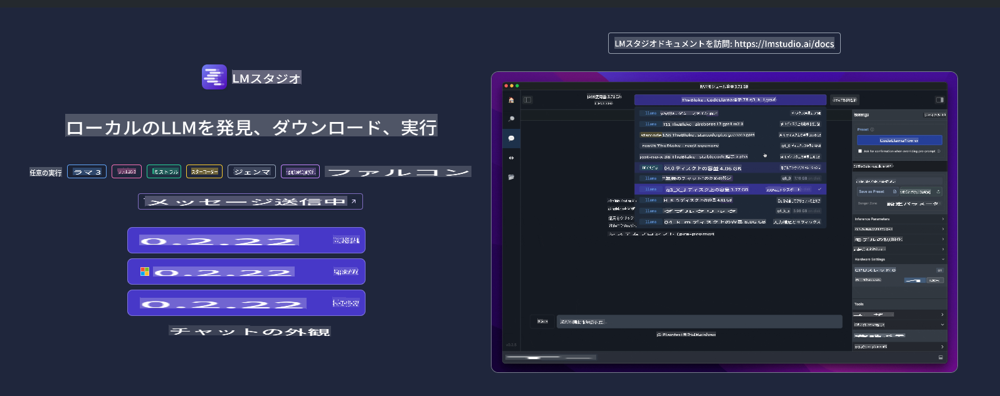
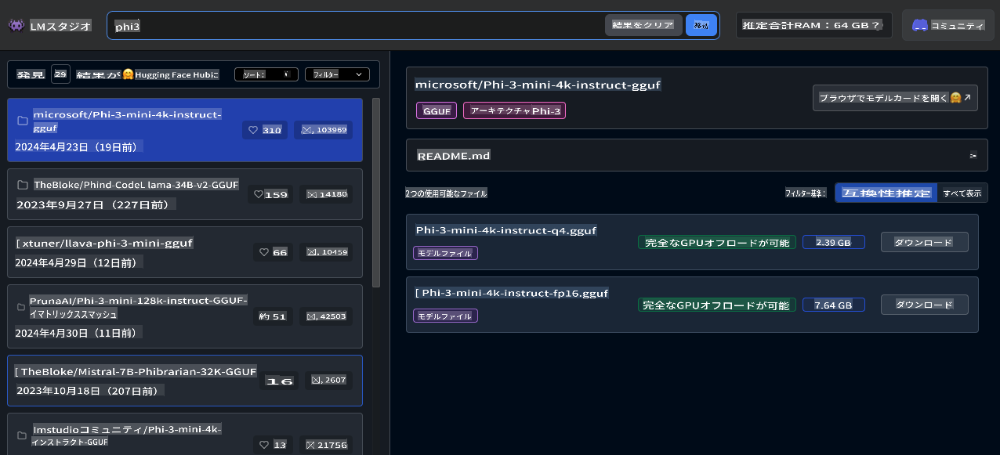
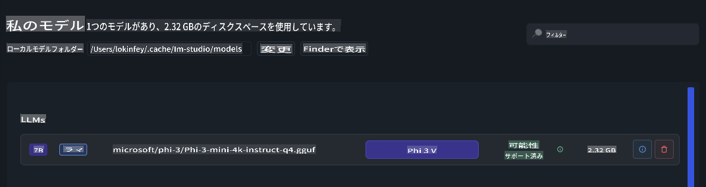
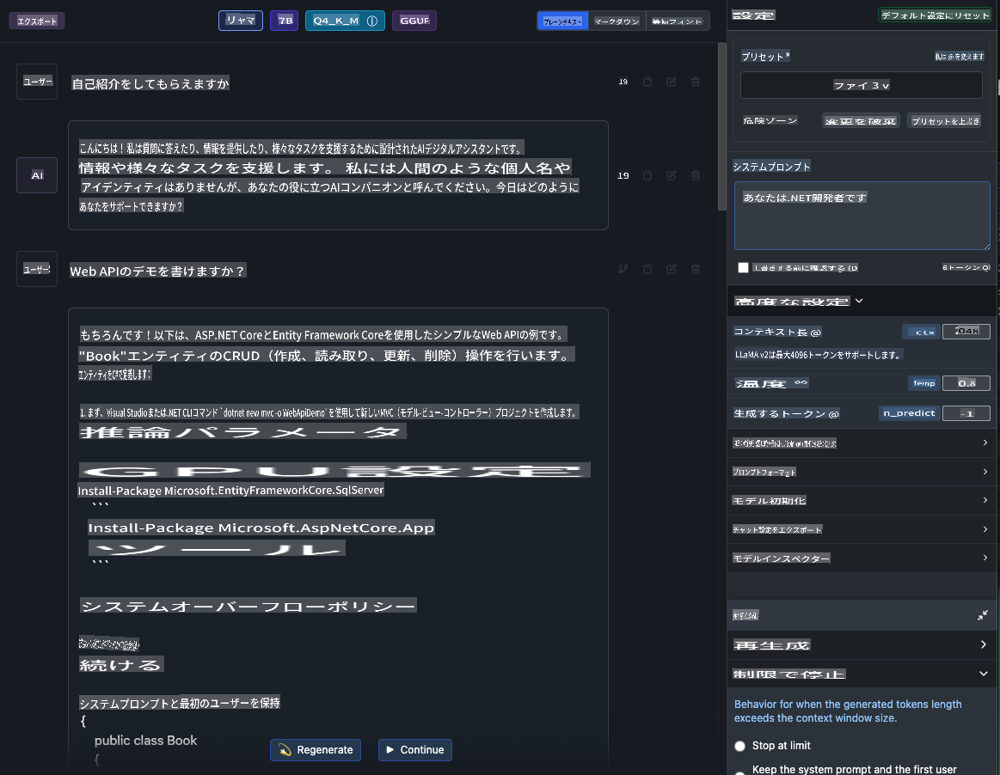
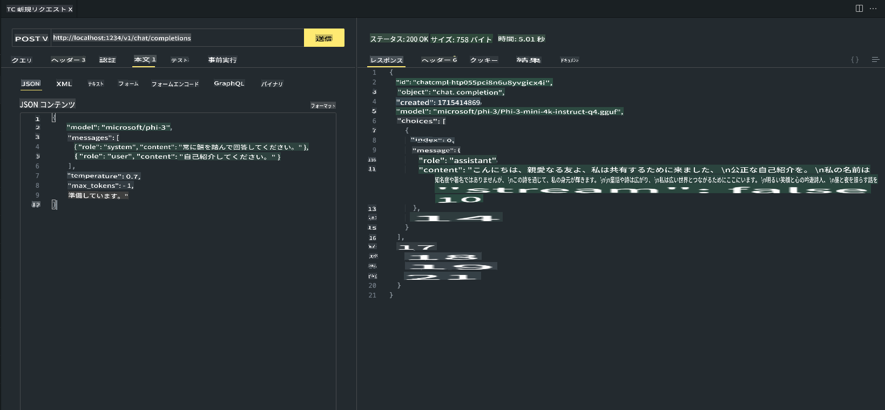

# **LM StudioでPhi-3を使用する**

[LM Studio](https://lmstudio.ai) は、ローカルデスクトップアプリケーションでSLMとLLMを呼び出すためのアプリケーションです。ユーザーは異なるモデルを簡単に使用でき、NVIDIA/AMD GPU/Apple Siliconを使用した高速計算をサポートします。LM Studioを通じて、ユーザーはHugging Faceに基づいたさまざまなオープンソースのLLMとSLMをダウンロード、インストール、実行して、コードを書かずにローカルでモデルの性能をテストできます。

## **1. インストール**

Windows、Linux、macOSにインストールするには、LM Studioのウェブサイト [https://lmstudio.ai/](https://lmstudio.ai/) から選択できます。

## **2. LM StudioでPhi-3をダウンロードする**

LM Studioは、量子化されたgguf形式のオープンソースモデルを呼び出します。LM Studio Search UIが提供するプラットフォームから直接ダウンロードするか、自分でダウンロードして関連ディレクトリに指定して呼び出すことができます。

***LM Studio SearchでPhi3を検索し、Phi-3 ggufモデルをダウンロードします***

***ダウンロードしたモデルをLM Studioで管理します***

## **3. LM StudioでPhi-3とチャットする**

LM Studio ChatでPhi-3を選択し、チャットテンプレート（Preset - Phi3）を設定して、Phi-3とのローカルチャットを開始します。

***Note***:

a. LM Studioのコントロールパネルで詳細設定を通じてパラメータを設定できます。

b. Phi-3には特定のチャットテンプレート要件があるため、PresetでPhi-3を選択する必要があります。

c. GPUの使用量など、異なるパラメータも設定できます。

## **4. LM StudioからPhi-3 APIを呼び出す**

LM Studioはローカルサービスの迅速な展開をサポートし、コードを書かずにモデルサービスを構築できます。

これはPostmanでの結果です。

**免責事項**:
この文書は機械翻訳AIサービスを使用して翻訳されています。正確さを期すよう努めていますが、自動翻訳には誤りや不正確さが含まれる可能性があることをご承知おきください。元の言語で書かれた文書が信頼できる情報源と見なされるべきです。重要な情報については、専門の人間による翻訳をお勧めします。この翻訳の使用に起因する誤解や誤訳について、当社は一切の責任を負いません。