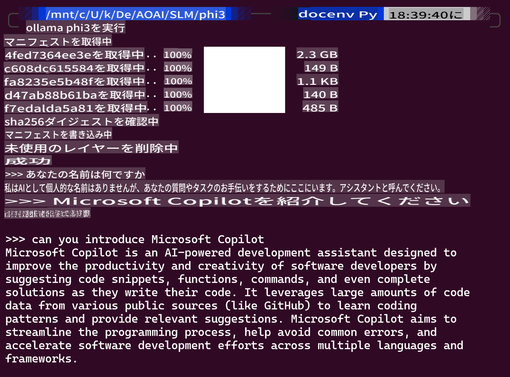
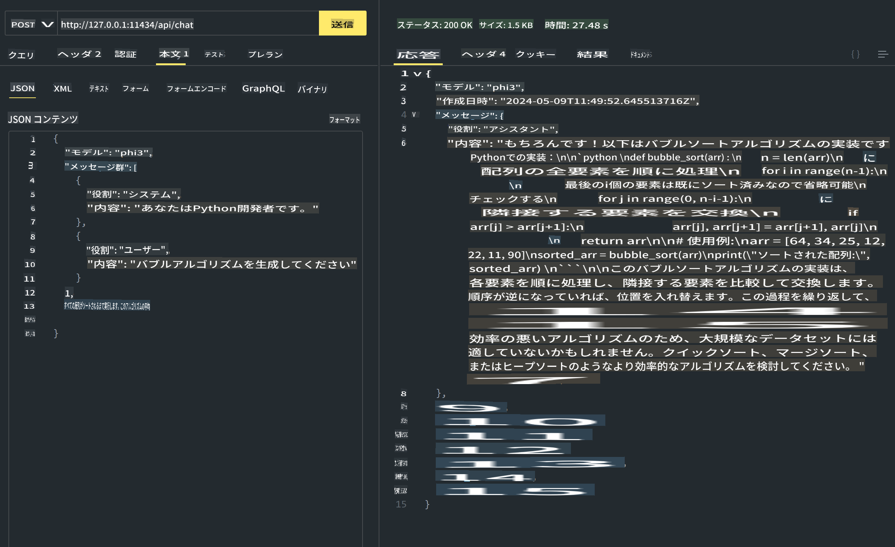
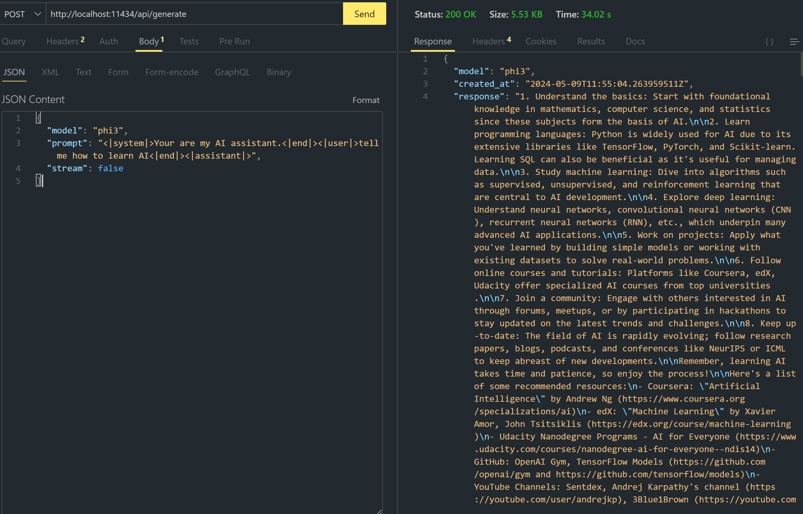

# **OllamaでPhi-3を使用する**

[Ollama](https://ollama.com)は、シンプルなスクリプトを通じて、より多くの人々がオープンソースのLLMやSLMを直接デプロイできるようにし、ローカルのCopilotアプリケーションシナリオを支援するためのAPIを構築することもできます。

## **1. インストール**

OllamaはWindows、macOS、Linux上で動作します。こちらのリンクからOllamaをインストールできます（[https://ollama.com/download](https://ollama.com/download)）。インストールが成功したら、ターミナルウィンドウを通じてOllamaスクリプトを使用してPhi-3を呼び出すことができます。すべての[利用可能なライブラリはOllamaで確認できます](https://ollama.com/library)。Codespaceでこのリポジトリを開くと、すでにOllamaがインストールされています。

```bash

ollama run phi3

```

> [!NOTE]
> 初めて実行する際にはモデルがダウンロードされます。もちろん、すでにダウンロードされたPhi-3モデルを直接指定することもできます。WSLを例としてコマンドを実行します。モデルが正常にダウンロードされた後、ターミナル上で直接対話することができます。



## **2. Ollamaからphi-3 APIを呼び出す**

Ollamaで生成されたPhi-3 APIを呼び出したい場合、ターミナルでこのコマンドを使用してOllamaサーバーを起動できます。

```bash

ollama serve

```

> [!NOTE]
> MacOSやLinuxを実行している場合、**"Error: listen tcp 127.0.0.1:11434: bind: address already in use"**というエラーに遭遇する可能性があります。このエラーは、通常サーバーがすでに実行中であることを示しているため、無視するか、Ollamaを停止して再起動することができます。

**macOS**

```bash

brew services restart ollama

```

**Linux**

```bash

sudo systemctl stop ollama

```

Ollamaは2つのAPIをサポートしています：generateとchat。Ollamaが提供するモデルAPIを、ポート11434で実行されているローカルサービスにリクエストを送信することで、ニーズに応じて呼び出すことができます。

**Chat**

```bash

curl http://127.0.0.1:11434/api/chat -d '{
  "model": "phi3",
  "messages": [
    {
      "role": "system",
      "content": "Your are a python developer."
    },
    {
      "role": "user",
      "content": "Help me generate a bubble algorithm"
    }
  ],
  "stream": false
  
}'


```

これはPostmanでの結果です



```bash

curl http://127.0.0.1:11434/api/generate -d '{
  "model": "phi3",
  "prompt": "<|system|>Your are my AI assistant.<|end|><|user|>tell me how to learn AI<|end|><|assistant|>",
  "stream": false
}'


```

これはPostmanでの結果です



## 追加リソース

Ollamaで利用可能なモデルのリストは[こちらのライブラリ](https://ollama.com/library)で確認できます。

このコマンドを使用してOllamaサーバーからモデルを取得します

```bash
ollama pull phi3
```

このコマンドを使用してモデルを実行します

```bash
ollama run phi3
```

***Note:*** 詳細については、こちらのリンクをご覧ください [https://github.com/ollama/ollama/blob/main/docs/api.md](https://github.com/ollama/ollama/blob/main/docs/api.md)

## PythonからOllamaを呼び出す

`requests` or `urllib3`を使用して、上記のローカルサーバーエンドポイントにリクエストを送信することができます。ただし、PythonでOllamaを使用する人気の方法は、[openai](https://pypi.org/project/openai/) SDKを介する方法です。OllamaはOpenAI互換のサーバーエンドポイントを提供しているためです。

phi3-miniの例は以下の通りです：

```python
import openai

client = openai.OpenAI(
    base_url="http://localhost:11434/v1",
    api_key="nokeyneeded",
)

response = client.chat.completions.create(
    model="phi3",
    temperature=0.7,
    n=1,
    messages=[
        {"role": "system", "content": "You are a helpful assistant."},
        {"role": "user", "content": "Write a haiku about a hungry cat"},
    ],
)

print("Response:")
print(response.choices[0].message.content)
```

## JavaScriptからOllamaを呼び出す

```javascript
// Example of Summarize a file with Phi-3
script({
    model: "ollama:phi3",
    title: "Summarize with Phi-3",
    system: ["system"],
})

// Example of summarize
const file = def("FILE", env.files)
$`Summarize ${file} in a single paragraph.`
```

## C#からOllamaを呼び出す

新しいC#コンソールアプリケーションを作成し、以下のNuGetパッケージを追加します：

```bash
dotnet add package Microsoft.SemanticKernel --version 1.13.0
```

次に、このコードを`Program.cs`ファイルに置き換えます

```csharp
using Microsoft.SemanticKernel;
using Microsoft.SemanticKernel.ChatCompletion;

// add chat completion service using the local ollama server endpoint
#pragma warning disable SKEXP0001, SKEXP0003, SKEXP0010, SKEXP0011, SKEXP0050, SKEXP0052
builder.AddOpenAIChatCompletion(
    modelId: "phi3.5",
    endpoint: new Uri("http://localhost:11434/"),
    apiKey: "non required");

// invoke a simple prompt to the chat service
string prompt = "Write a joke about kittens";
var response = await kernel.InvokePromptAsync(prompt);
Console.WriteLine(response.GetValue<string>());
```

このコマンドでアプリを実行します：

```bash
dotnet run
```

**免責事項**：
この文書は機械ベースのAI翻訳サービスを使用して翻訳されています。正確性を期しておりますが、自動翻訳には誤りや不正確さが含まれる場合があります。元の言語の文書が権威ある情報源と見なされるべきです。重要な情報については、専門の人間による翻訳を推奨します。この翻訳の使用に起因する誤解や誤訳について、当社は一切の責任を負いません。