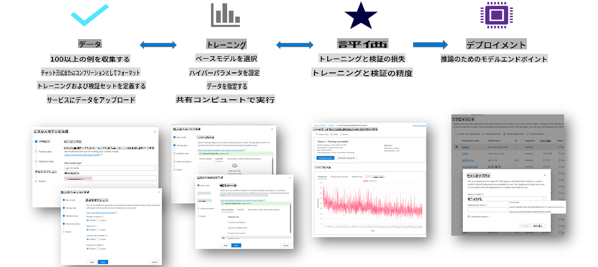
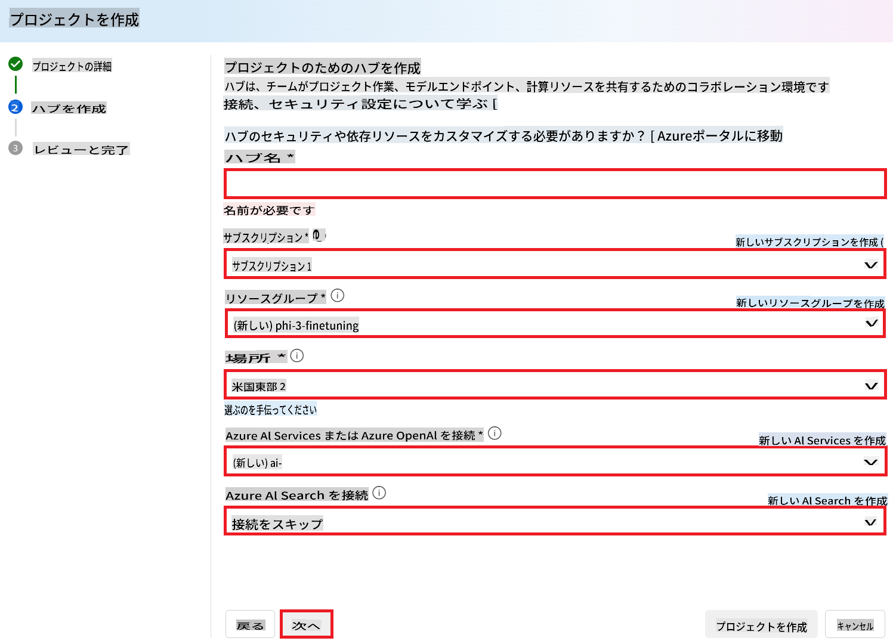
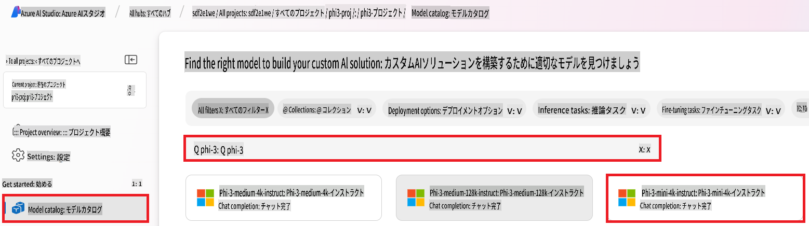
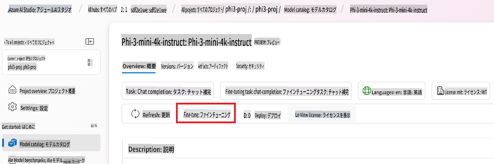
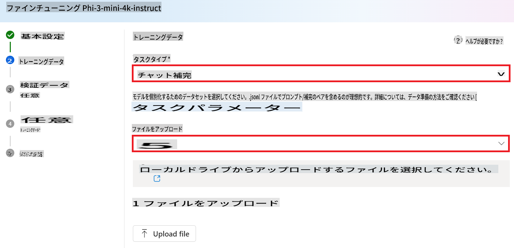
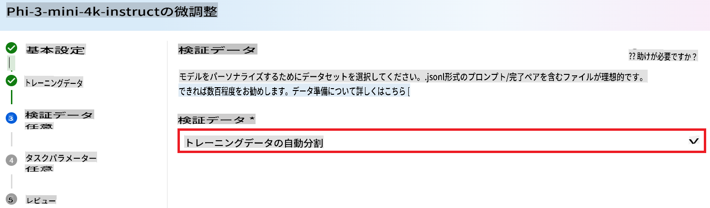
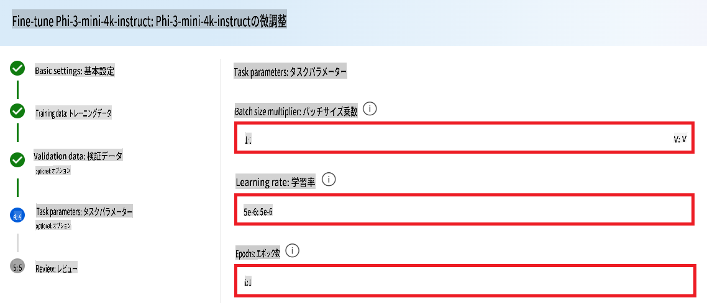
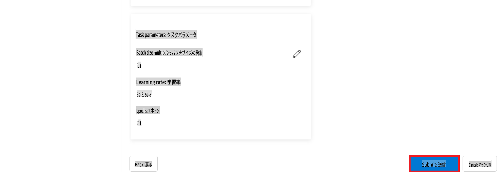
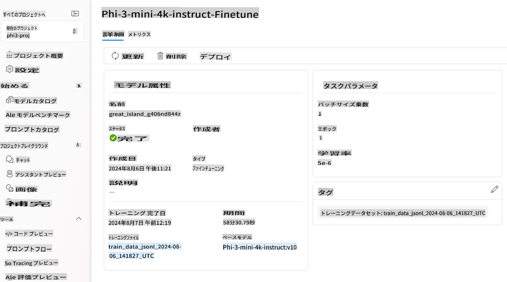

# Phi-3をAzure AI Foundryでファインチューニング

MicrosoftのPhi-3 Mini言語モデルをAzure AI Foundryを使用してファインチューニングする方法を見ていきましょう。ファインチューニングにより、Phi-3 Miniを特定のタスクに適応させ、より強力で文脈に応じたモデルに仕上げることができます。

## 考慮事項

- **機能:** どのモデルがファインチューニング可能か？ベースモデルをどのようにカスタマイズできるか？
- **コスト:** ファインチューニングの料金体系は？
- **カスタマイズ性:** ベースモデルをどの程度変更できるのか？どのような変更が可能か？
- **利便性:** ファインチューニングの実行方法は？カスタムコードを書く必要があるか？独自の計算リソースが必要か？
- **安全性:** ファインチューニングしたモデルには安全性リスクが伴う場合がありますが、不測の害を防ぐための対策はあるのか？


## ファインチューニングの準備

### 必要条件

> [!NOTE]  
> Phi-3ファミリーモデルの場合、従量課金モデルのファインチューニングは**East US 2**リージョンで作成されたハブでのみ利用可能です。

- Azureサブスクリプション。Azureサブスクリプションをお持ちでない場合は、[有料Azureアカウント](https://azure.microsoft.com/pricing/purchase-options/pay-as-you-go)を作成してください。

- [AI Foundryプロジェクト](https://ai.azure.com?WT.mc_id=aiml-138114-kinfeylo)。  
- Azureロールベースアクセス制御（Azure RBAC）は、Azure AI Foundryでの操作へのアクセスを付与するために使用されます。この記事の手順を実行するには、ユーザーアカウントがリソースグループに対して__Azure AI Developerロール__に割り当てられている必要があります。

### サブスクリプションプロバイダーの登録

サブスクリプションが`Microsoft.Network`リソースプロバイダーに登録されていることを確認します。

1. [Azureポータル](https://portal.azure.com)にサインインします。
1. 左メニューから**サブスクリプション**を選択します。
1. 使用するサブスクリプションを選択します。
1. 左メニューから**AIプロジェクト設定** > **リソースプロバイダー**を選択します。
1. **Microsoft.Network**がリソースプロバイダーのリストにあることを確認します。ない場合は追加してください。

### データ準備

トレーニングデータと検証データを準備し、モデルをファインチューニングします。トレーニングデータと検証データセットには、モデルに期待する動作を示す入力例と出力例が含まれます。

トレーニング例が推論に期待されるフォーマットに従っていることを確認してください。効果的なファインチューニングを行うには、バランスが取れ多様性のあるデータセットを用意する必要があります。

これには、データのバランスを維持し、さまざまなシナリオを含め、トレーニングデータを定期的に調整して現実世界の期待に沿うようにすることが含まれます。最終的に、より正確でバランスの取れたモデル応答を実現できます。

モデルの種類によって、必要なトレーニングデータのフォーマットが異なります。

### チャット補完

使用するトレーニングデータと検証データは、JSON Lines（JSONL）ドキュメント形式である必要があります。`Phi-3-mini-128k-instruct`の場合、ファインチューニングデータセットは、Chat completions APIで使用される会話形式でフォーマットされる必要があります。

### サンプルファイル形式

```json
    {"messages": [{"role": "system", "content": "You are an Xbox customer support agent whose primary goal is to help users with issues they are experiencing with their Xbox devices. You are friendly and concise. You only provide factual answers to queries, and do not provide answers that are not related to Xbox."}, {"role": "user", "content": "Is Xbox better than PlayStation?"}, {"role": "assistant", "content": "I apologize, but I cannot provide personal opinions. My primary job is to assist you with any issues related to your Xbox device. Do you have any Xbox-related issues that need addressing?"}]}
    {"messages": [{"role": "system", "content": "You are an Xbox customer support agent whose primary goal is to help users with issues they are experiencing with their Xbox devices. You are friendly and concise. You only provide factual answers to queries, and do not provide answers that are not related to Xbox."}, {"role": "user", "content": "Can I play PC games on my Xbox?"}, {"role": "assistant", "content": "While Xbox consoles don't natively support PC games, they can play an array of Xbox games, many of which are also available on PC. Can I assist you with finding games compatible with your Xbox device?"}]}
    {"messages": [{"role": "system", "content": "You are an Xbox customer support agent whose primary goal is to help users with issues they are experiencing with their Xbox devices. You are friendly and concise. You only provide factual answers to queries, and do not provide answers that are not related to Xbox."}, {"role": "user", "content": "I'm having trouble connecting my Xbox to the Wi-Fi."}, {"role": "assistant", "content": "No worries, let's go through the network settings on your Xbox. Can you please tell me what happens when you try to connect it to the Wi-Fi?"}]}
```

サポートされているファイルタイプはJSON Linesです。ファイルはデフォルトのデータストアにアップロードされ、プロジェクト内で利用可能になります。

## Azure AI FoundryでPhi-3をファインチューニング

Azure AI Foundryを使用すると、ファインチューニングというプロセスを通じて、個別のデータセットに合わせて大規模言語モデルを調整できます。ファインチューニングは、特定のタスクやアプリケーションに対してカスタマイズと最適化を可能にすることで、大きな価値をもたらします。これにより、パフォーマンスの向上、コスト効率、遅延の削減、カスタマイズされた出力が実現します。



### 新しいプロジェクトを作成する

1. [Azure AI Foundry](https://ai.azure.com)にサインインします。

1. **+New project**を選択して、新しいプロジェクトを作成します。

    

1. 次のタスクを実行します：

    - プロジェクトの**ハブ名**を入力します。一意の値である必要があります。
    - 使用する**ハブ**を選択します（必要に応じて新しいものを作成）。

    

1. 新しいハブを作成するために次のタスクを実行します：

    - **ハブ名**を入力します。一意の値である必要があります。
    - Azureの**サブスクリプション**を選択します。
    - 使用する**リソースグループ**を選択します（必要に応じて新しいものを作成）。
    - 使用する**場所**を選択します。
    - 使用する**Azure AI Servicesを接続**を選択します（必要に応じて新しいものを作成）。
    - **Azure AI Searchを接続**するには**接続をスキップ**を選択します。

    

1. **次へ**を選択します。
1. **プロジェクトを作成**を選択します。

### データ準備

ファインチューニングの前に、チャット指示、質問と回答のペア、またはその他の関連するテキストデータなど、タスクに関連するデータセットを収集または作成します。このデータをクリーンアップして前処理を行い、ノイズを除去し、欠損値を処理し、テキストをトークン化します。

### Azure AI FoundryでPhi-3モデルをファインチューニング

> [!NOTE]  
> Phi-3モデルのファインチューニングは、現在East US 2に配置されたプロジェクトでのみサポートされています。

1. 左側のタブから**モデルカタログ**を選択します。

1. **検索バー**に*phi-3*と入力し、使用するphi-3モデルを選択します。

    

1. **ファインチューニング**を選択します。

    

1. **ファインチューニングモデル名**を入力します。

    

1. **次へ**を選択します。

1. 次のタスクを実行します：

    - **タスクタイプ**を**Chat completion**に選択します。
    - 使用する**トレーニングデータ**を選択します。Azure AI Foundryのデータまたはローカル環境からアップロードできます。

    

1. **次へ**を選択します。

1. 使用する**検証データ**をアップロードします。または、**トレーニングデータの自動分割**を選択できます。

    

1. **次へ**を選択します。

1. 次のタスクを実行します：

    - 使用する**バッチサイズ倍率**を選択します。
    - 使用する**学習率**を選択します。
    - 使用する**エポック数**を選択します。

    

1. **送信**を選択してファインチューニングプロセスを開始します。

    

1. モデルのファインチューニングが完了すると、状態が**完了**と表示されます。これで、モデルをデプロイして、独自のアプリケーション、プレイグラウンド、またはプロンプトフローで使用できます。詳細については、[Azure AI FoundryでPhi-3ファミリーの小型言語モデルをデプロイする方法](https://learn.microsoft.com/azure/ai-studio/how-to/deploy-models-phi-3?tabs=phi-3-5&pivots=programming-language-python)を参照してください。

    

> [!NOTE]  
> Phi-3のファインチューニングに関する詳細情報は、[Azure AI FoundryでPhi-3モデルをファインチューニングする](https://learn.microsoft.com/azure/ai-studio/how-to/fine-tune-phi-3?tabs=phi-3-mini)を参照してください。

## ファインチューニングしたモデルのクリーンアップ

ファインチューニングモデルリストまたはモデル詳細ページからファインチューニングモデルを削除できます。[Azure AI Foundry](https://ai.azure.com)でファインチューニングページから削除するモデルを選択し、削除ボタンをクリックして削除します。

> [!NOTE]  
> カスタムモデルに既存のデプロイメントがある場合、そのモデルを削除することはできません。カスタムモデルを削除する前に、モデルデプロイメントを削除する必要があります。

## コストとクォータ

### サービスとしてファインチューニングされたPhi-3モデルのコストとクォータに関する考慮事項

サービスとしてファインチューニングされたPhiモデルはMicrosoftによって提供され、Azure AI Foundryと統合されています。料金は、[デプロイ](https://learn.microsoft.com/azure/ai-studio/how-to/deploy-models-phi-3?tabs=phi-3-5&pivots=programming-language-python)またはファインチューニングの際に、デプロイメントウィザードの料金と条件タブで確認できます。

## コンテンツフィルタリング

従量課金でサービスとしてデプロイされたモデルは、Azure AI Content Safetyによって保護されています。リアルタイムエンドポイントにデプロイする際、この機能をオプトアウトすることも可能です。Azure AIコンテンツセーフティが有効な場合、プロンプトと出力の両方が有害なコンテンツを検出・防止するための分類モデル群を通過します。このコンテンツフィルタリングシステムは、入力プロンプトと出力完了の両方で潜在的に有害なコンテンツの特定カテゴリを検出し、対応します。詳細は[Azure AI Content Safety](https://learn.microsoft.com/azure/ai-studio/concepts/content-filtering)をご覧ください。

**ファインチューニング設定**

ハイパーパラメータ: 学習率、バッチサイズ、トレーニングエポック数などを定義します。

**損失関数**

タスクに適した損失関数（例: クロスエントロピー）を選択します。

**オプティマイザ**

トレーニング中の勾配更新のためにオプティマイザ（例: Adam）を選択します。

**ファインチューニングプロセス**

- 事前学習モデルの読み込み: Phi-3 Miniのチェックポイントを読み込みます。
- カスタムレイヤーの追加: タスク固有のレイヤー（例: チャット指示用の分類ヘッド）を追加します。

**モデルのトレーニング**  
準備したデータセットを使用してモデルをファインチューニングします。トレーニングの進行状況を監視し、必要に応じてハイパーパラメータを調整します。

**評価と検証**

検証セット: データをトレーニングセットと検証セットに分割します。

**パフォーマンス評価**

精度、F1スコア、またはパープレキシティなどの指標を使用してモデルのパフォーマンスを評価します。

## ファインチューニングモデルの保存

**チェックポイント**  
将来使用するためにファインチューニングされたモデルのチェックポイントを保存します。

## デプロイ

- Webサービスとしてデプロイ: ファインチューニングされたモデルをAzure AI FoundryでWebサービスとしてデプロイします。
- エンドポイントのテスト: デプロイされたエンドポイントにテストクエリを送信して、機能を確認します。

## 繰り返しと改善

繰り返し: パフォーマンスが満足いかない場合、ハイパーパラメータを調整したり、データを追加したり、追加のエポックでファインチューニングを行ったりして改善します。

## モニタリングと改良

モデルの動作を継続的に監視し、必要に応じて改良します。

## カスタマイズと拡張

カスタムタスク: Phi-3 Miniはチャット指示以外のさまざまなタスクにファインチューニング可能です。他のユースケースを探求してください！  
実験: パフォーマンスを向上させるために、さまざまなアーキテクチャ、レイヤーの組み合わせ、技術を試してみてください。

> [!NOTE]  
> ファインチューニングは反復的なプロセスです。試行錯誤を重ねて学び、モデルを適応させて、特定のタスクで最適な結果を達成しましょう！

**免責事項**:  
この文書は、機械ベースのAI翻訳サービスを使用して翻訳されています。正確性を追求しておりますが、自動翻訳には誤りや不正確な部分が含まれる可能性があります。元の言語で記載された原文を信頼できる情報源としてご参照ください。重要な情報については、専門の人間による翻訳を推奨します。本翻訳の使用により生じる誤解や解釈の相違について、当方は一切の責任を負いかねます。