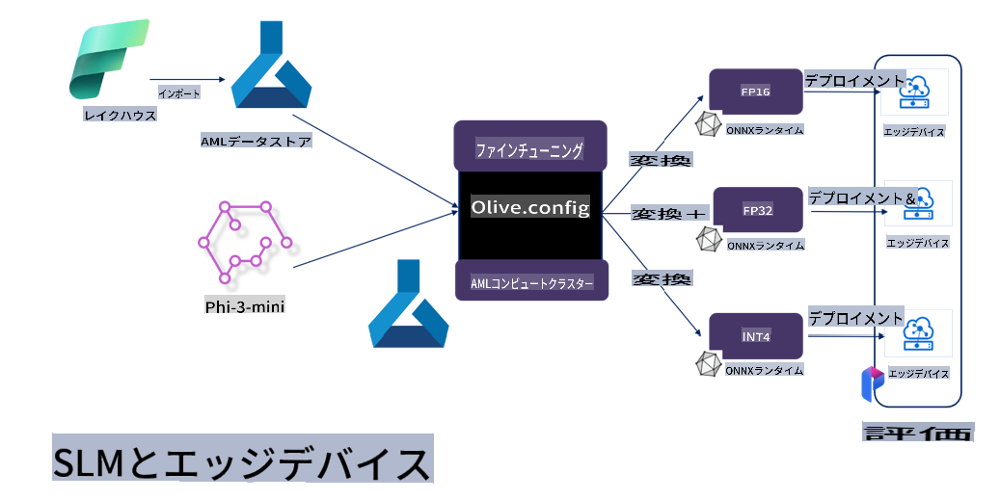

# **Microsoft Olive を使用した Phi-3 のファインチューニング**

[Olive](https://github.com/microsoft/OLive?WT.mc_id=aiml-138114-kinfeylo) は、モデル圧縮、最適化、コンパイルにおける業界トップの技術を統合した、ハードウェア対応のモデル最適化ツールです。

このツールは、機械学習モデルの最適化プロセスを簡素化し、特定のハードウェアアーキテクチャを最大限に活用できるよう設計されています。

クラウドベースのアプリケーションでもエッジデバイスでも、Olive を使用することで、モデルを簡単かつ効果的に最適化できます。

## 主な特徴:
- Olive は、ターゲットとするハードウェア向けの最適化技術を統合し、自動化します。
- すべてのシナリオに適した単一の最適化技術は存在しないため、Olive は業界の専門家が独自の最適化技術を拡張できるように設計されています。

## エンジニアリング作業の削減:
- 開発者は通常、トレーニング済みモデルをデプロイ用に準備・最適化するために、複数のハードウェアベンダー固有のツールチェーンを学ぶ必要があります。
- Olive は、希望するハードウェア向けの最適化技術を自動化することで、このプロセスを簡素化します。

## 使いやすい E2E 最適化ソリューション:

Olive は統合された技術を組み合わせて調整し、エンドツーエンドの最適化ソリューションを提供します。
モデルを最適化する際、精度やレイテンシーといった制約を考慮します。

## Microsoft Olive を使用したファインチューニング

Microsoft Olive は、生成型人工知能の分野でファインチューニングとリファレンスの両方をカバーできる、非常に使いやすいオープンソースのモデル最適化ツールです。簡単な設定と、オープンソースの小型言語モデルや関連するランタイム環境（AzureML / ローカル GPU、CPU、DirectML）を組み合わせるだけで、自動最適化を通じてモデルのファインチューニングやリファレンスを完了し、最適なモデルを見つけてクラウドまたはエッジデバイスにデプロイできます。これにより、企業はオンプレミスやクラウド上で独自の業界特化型モデルを構築できます。


## Microsoft Olive を使用した Phi-3 のファインチューニング



## Phi-3 Olive サンプルコードと例
この例では、Olive を使用して以下を行います：

- LoRA アダプターをファインチューニングし、フレーズを Sad、Joy、Fear、Surprise に分類。
- アダプターの重みをベースモデルに統合。
- モデルを最適化し、int4 に量子化。

[サンプルコード](../../code/03.Finetuning/olive-ort-example/README.md)

### Microsoft Olive のセットアップ

Microsoft Olive のインストールは非常に簡単で、CPU、GPU、DirectML、Azure ML にもインストール可能です。

```bash
pip install olive-ai
```

CPU で ONNX モデルを実行したい場合：

```bash
pip install olive-ai[cpu]
```

GPU で ONNX モデルを実行したい場合：

```python
pip install olive-ai[gpu]
```

Azure ML を使用したい場合：

```python
pip install git+https://github.com/microsoft/Olive#egg=olive-ai[azureml]
```

**注意事項**
OS 要件 : Ubuntu 20.04 / 22.04 

### **Microsoft Olive の Config.json**

インストール後、Config ファイルを通じてデータ、計算、トレーニング、デプロイ、モデル生成など、モデル固有の設定を構成できます。

**1. データ**

Microsoft Olive ではローカルデータやクラウドデータでのトレーニングがサポートされており、設定で構成できます。

*ローカルデータの設定*

通常は json 形式で、トレーニングするデータセットを簡単に設定できます。データテンプレートに適合させる必要があり、モデルの要件に基づいて調整します（例：Microsoft Phi-3-mini が必要とする形式に適合させる。他のモデルを使用する場合は、それぞれのファインチューニング形式を参照してください）。

```json

    "data_configs": [
        {
            "name": "dataset_default_train",
            "type": "HuggingfaceContainer",
            "load_dataset_config": {
                "params": {
                    "data_name": "json", 
                    "data_files":"dataset/dataset-classification.json",
                    "split": "train"
                }
            },
            "pre_process_data_config": {
                "params": {
                    "dataset_type": "corpus",
                    "text_cols": [
                            "phrase",
                            "tone"
                    ],
                    "text_template": "### Text: {phrase}\n### The tone is:\n{tone}",
                    "corpus_strategy": "join",
                    "source_max_len": 2048,
                    "pad_to_max_len": false,
                    "use_attention_mask": false
                }
            }
        }
    ],
```

**クラウドデータソースの設定**

Azure AI Studio/Azure Machine Learning Service のデータストアをリンクすることで、クラウド上のデータを接続できます。Microsoft Fabric や Azure Data を介して異なるデータソースを導入し、ファインチューニングデータをサポートすることが可能です。

```json

    "data_configs": [
        {
            "name": "dataset_default_train",
            "type": "HuggingfaceContainer",
            "load_dataset_config": {
                "params": {
                    "data_name": "json", 
                    "data_files": {
                        "type": "azureml_datastore",
                        "config": {
                            "azureml_client": {
                                "subscription_id": "Your Azure Subscrition ID",
                                "resource_group": "Your Azure Resource Group",
                                "workspace_name": "Your Azure ML Workspaces name"
                            },
                            "datastore_name": "workspaceblobstore",
                            "relative_path": "Your train_data.json Azure ML Location"
                        }
                    },
                    "split": "train"
                }
            },
            "pre_process_data_config": {
                "params": {
                    "dataset_type": "corpus",
                    "text_cols": [
                            "Question",
                            "Best Answer"
                    ],
                    "text_template": "<|user|>\n{Question}<|end|>\n<|assistant|>\n{Best Answer}\n<|end|>",
                    "corpus_strategy": "join",
                    "source_max_len": 2048,
                    "pad_to_max_len": false,
                    "use_attention_mask": false
                }
            }
        }
    ],
    
```

**2. コンピューティング設定**

ローカルで実行する場合、ローカルデータリソースを直接使用できます。Azure AI Studio / Azure Machine Learning Service のリソースを使用する場合は、関連する Azure パラメータやコンピューティングパワー名などを設定する必要があります。

```json

    "systems": {
        "aml": {
            "type": "AzureML",
            "config": {
                "accelerators": ["gpu"],
                "hf_token": true,
                "aml_compute": "Your Azure AI Studio / Azure Machine Learning Service Compute Name",
                "aml_docker_config": {
                    "base_image": "Your Azure AI Studio / Azure Machine Learning Service docker",
                    "conda_file_path": "conda.yaml"
                }
            }
        },
        "azure_arc": {
            "type": "AzureML",
            "config": {
                "accelerators": ["gpu"],
                "aml_compute": "Your Azure AI Studio / Azure Machine Learning Service Compute Name",
                "aml_docker_config": {
                    "base_image": "Your Azure AI Studio / Azure Machine Learning Service docker",
                    "conda_file_path": "conda.yaml"
                }
            }
        }
    },
```

***注意事項***

Azure AI Studio / Azure Machine Learning Service 上でコンテナを通じて実行されるため、必要な環境を構成する必要があります。これは conda.yaml 環境で構成されます。

```yaml

name: project_environment
channels:
  - defaults
dependencies:
  - python=3.8.13
  - pip=22.3.1
  - pip:
      - einops
      - accelerate
      - azure-keyvault-secrets
      - azure-identity
      - bitsandbytes
      - datasets
      - huggingface_hub
      - peft
      - scipy
      - sentencepiece
      - torch>=2.2.0
      - transformers
      - git+https://github.com/microsoft/Olive@jiapli/mlflow_loading_fix#egg=olive-ai[gpu]
      - --extra-index-url https://aiinfra.pkgs.visualstudio.com/PublicPackages/_packaging/ORT-Nightly/pypi/simple/ 
      - ort-nightly-gpu==1.18.0.dev20240307004
      - --extra-index-url https://aiinfra.pkgs.visualstudio.com/PublicPackages/_packaging/onnxruntime-genai/pypi/simple/
      - onnxruntime-genai-cuda

    

```

**3. SLM の選択**

Hugging Face から直接モデルを使用することも、Azure AI Studio / Azure Machine Learning のモデルカタログと組み合わせてモデルを選択することも可能です。以下のコード例では、Microsoft Phi-3-mini を例として使用します。

ローカルにモデルがある場合は、次の方法を使用します：

```json

    "input_model":{
        "type": "PyTorchModel",
        "config": {
            "hf_config": {
                "model_name": "model-cache/microsoft/phi-3-mini",
                "task": "text-generation",
                "model_loading_args": {
                    "trust_remote_code": true
                }
            }
        }
    },
```

Azure AI Studio / Azure Machine Learning Service からモデルを使用する場合は、次の方法を使用します：

```json

    "input_model":{
        "type": "PyTorchModel",
        "config": {
            "model_path": {
                "type": "azureml_registry_model",
                "config": {
                    "name": "microsoft/Phi-3-mini-4k-instruct",
                    "registry_name": "azureml-msr",
                    "version": "11"
                }
            },
             "model_file_format": "PyTorch.MLflow",
             "hf_config": {
                "model_name": "microsoft/Phi-3-mini-4k-instruct",
                "task": "text-generation",
                "from_pretrained_args": {
                    "trust_remote_code": true
                }
            }
        }
    },
```

**注意事項:**
Azure AI Studio / Azure Machine Learning Service と統合する必要があるため、モデル設定時にはバージョン番号や関連する命名規則を参照してください。

Azure 上のすべてのモデルは PyTorch.MLflow に設定する必要があります。

Hugging Face アカウントを持ち、Azure AI Studio / Azure Machine Learning の Key 値にキーをバインドする必要があります。

**4. アルゴリズム**

Microsoft Olive は LoRA と QLoRA のファインチューニングアルゴリズムを非常にうまくカプセル化しています。関連するパラメータをいくつか設定するだけで済みます。ここでは QLoRA を例として取り上げます。

```json
        "lora": {
            "type": "LoRA",
            "config": {
                "target_modules": [
                    "o_proj",
                    "qkv_proj"
                ],
                "double_quant": true,
                "lora_r": 64,
                "lora_alpha": 64,
                "lora_dropout": 0.1,
                "train_data_config": "dataset_default_train",
                "eval_dataset_size": 0.3,
                "training_args": {
                    "seed": 0,
                    "data_seed": 42,
                    "per_device_train_batch_size": 1,
                    "per_device_eval_batch_size": 1,
                    "gradient_accumulation_steps": 4,
                    "gradient_checkpointing": false,
                    "learning_rate": 0.0001,
                    "num_train_epochs": 3,
                    "max_steps": 10,
                    "logging_steps": 10,
                    "evaluation_strategy": "steps",
                    "eval_steps": 187,
                    "group_by_length": true,
                    "adam_beta2": 0.999,
                    "max_grad_norm": 0.3
                }
            }
        },
```

量子化変換を行いたい場合、Microsoft Olive のメインブランチはすでに onnxruntime-genai メソッドをサポートしています。必要に応じて以下のように設定できます：

1. アダプターの重みをベースモデルに統合
2. ModelBuilder を使用して必要な精度でモデルを ONNX モデルに変換

例：量子化された INT4 に変換

```json

        "merge_adapter_weights": {
            "type": "MergeAdapterWeights"
        },
        "builder": {
            "type": "ModelBuilder",
            "config": {
                "precision": "int4"
            }
        }
```

**注意事項** 
- QLoRA を使用する場合、ONNXRuntime-genai の量子化変換は現在サポートされていません。

- 上記の手順は自身のニーズに応じて設定可能です。完全に上記の手順を構成する必要はなく、ニーズに応じてアルゴリズムの手順のみを使用することも可能です。最後に関連するエンジンを設定する必要があります。

```json

    "engine": {
        "log_severity_level": 0,
        "host": "aml",
        "target": "aml",
        "search_strategy": false,
        "execution_providers": ["CUDAExecutionProvider"],
        "cache_dir": "../model-cache/models/phi3-finetuned/cache",
        "output_dir" : "../model-cache/models/phi3-finetuned"
    }
```

**5. ファインチューニングの完了**

コマンドラインで、olive-config.json のディレクトリで以下を実行します：

```bash
olive run --config olive-config.json  
```

**免責事項**:  
この文書は、機械ベースのAI翻訳サービスを使用して翻訳されています。正確性を期すよう努めておりますが、自動翻訳には誤りや不正確さが含まれる可能性があります。元の言語で作成された文書が公式の情報源と見なされるべきです。重要な情報については、専門の人間による翻訳を推奨します。この翻訳の使用に起因する誤解や解釈の誤りについて、当方は責任を負いません。