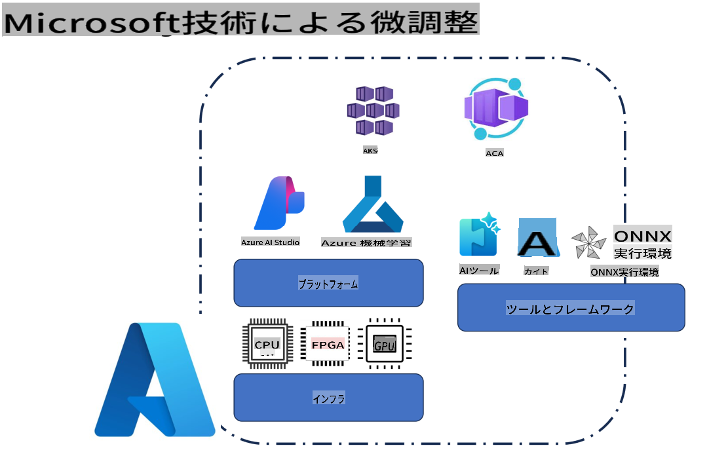
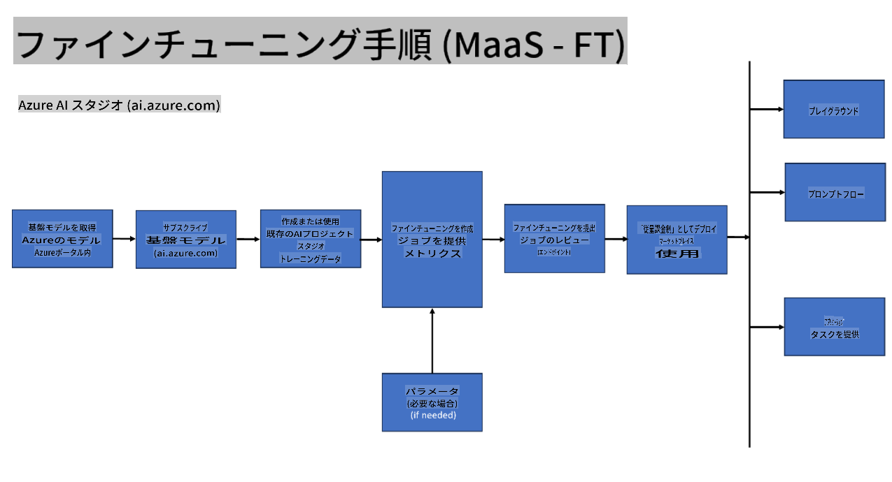
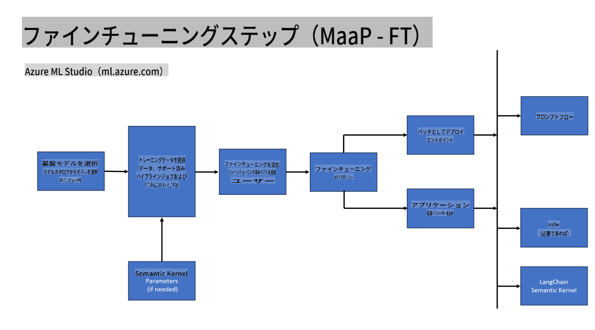
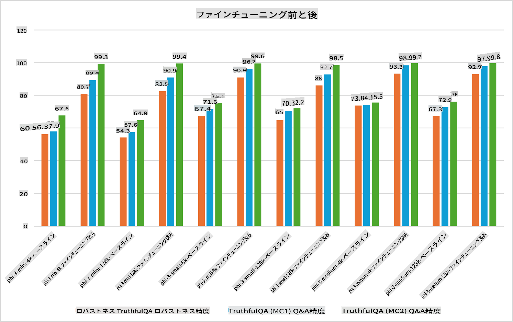

## 微調整のシナリオ

**プラットフォーム** これには、Azure AI Foundry、Azure Machine Learning、AI Tools、Kaito、ONNX Runtimeなどのさまざまな技術が含まれます。

**インフラストラクチャ** これには、微調整プロセスに不可欠なCPUとFPGAが含まれます。これらの技術のアイコンをお見せします。

**ツールとフレームワーク** これにはONNX Runtimeが含まれます。これらの技術のアイコンをお見せします。  
[ONNX Runtimeのアイコンを挿入]

Microsoftの技術を使った微調整プロセスには、さまざまなコンポーネントとツールが含まれます。これらの技術を理解し活用することで、アプリケーションを効果的に微調整し、より良いソリューションを作成することができます。

## サービスとしてのモデル

ホストされた微調整を使用して、計算リソースを作成・管理する必要なくモデルを微調整します。

サーバーレス微調整はPhi-3-miniおよびPhi-3-mediumモデルで利用可能であり、開発者はクラウドやエッジのシナリオ向けにモデルを迅速かつ簡単にカスタマイズできます。また、Phi-3-smallがModels-as-a-Serviceオファリングを通じて利用可能になったことを発表しました。これにより、開発者は基盤となるインフラストラクチャを管理することなく、AI開発をすぐに始めることができます。

## プラットフォームとしてのモデル

ユーザーは独自の計算リソースを管理して、モデルを微調整します。

[微調整サンプル](https://github.com/Azure/azureml-examples/blob/main/sdk/python/foundation-models/system/finetune/chat-completion/chat-completion.ipynb)

## 微調整のシナリオ

| | | | | | | |
|-|-|-|-|-|-|-|
|シナリオ|LoRA|QLoRA|PEFT|DeepSpeed|ZeRO|DORA|
|事前学習済みLLMを特定のタスクやドメインに適応させる|Yes|Yes|Yes|Yes|Yes|Yes|
|テキスト分類、固有表現抽出、機械翻訳などのNLPタスク向けの微調整|Yes|Yes|Yes|Yes|Yes|Yes|
|QAタスク向けの微調整|Yes|Yes|Yes|Yes|Yes|Yes|
|チャットボットで人間らしい応答を生成するための微調整|Yes|Yes|Yes|Yes|Yes|Yes|
|音楽、アート、その他の創造的な成果物を生成するための微調整|Yes|Yes|Yes|Yes|Yes|Yes|
|計算コストや金銭的コストの削減|Yes|Yes|No|Yes|Yes|No|
|メモリ使用量の削減|No|Yes|No|Yes|Yes|Yes|
|効率的な微調整のための少ないパラメータの使用|No|Yes|Yes|No|No|Yes|
|すべてのGPUデバイスの集約GPUメモリを活用するメモリ効率の高いデータ並列化|No|No|No|Yes|Yes|Yes|

## 微調整のパフォーマンス例

**免責事項**:  
本書類は、機械ベースのAI翻訳サービスを使用して翻訳されています。正確性を追求しておりますが、自動翻訳には誤りや不正確な部分が含まれる可能性があることをご承知おきください。原文（元の言語で記載された文書）が公式かつ信頼できる情報源と見なされるべきです。重要な情報については、専門の人間による翻訳を推奨します。本翻訳の使用に起因する誤解や解釈の誤りについて、当社は一切の責任を負いません。