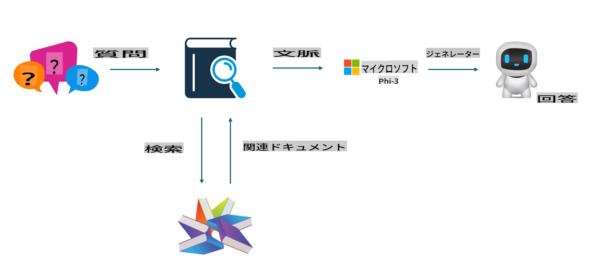

## ファインチューニング vs RAG

## 検索強化生成（RAG）

RAGはデータ検索とテキスト生成を組み合わせたものです。企業の構造化データや非構造化データがベクターデータベースに保存されます。関連する内容を検索する際、関連する要約や内容が見つかり、これが文脈を形成します。その上で、LLM/SLMのテキスト補完機能を組み合わせてコンテンツを生成します。

## RAGのプロセス

## ファインチューニング
ファインチューニングは、特定のモデルを改良することに基づいています。モデルのアルゴリズムから始める必要はありませんが、データを継続的に蓄積する必要があります。業界アプリケーションでより正確な専門用語や言語表現が必要な場合、ファインチューニングはより適した選択となります。ただし、データが頻繁に変化する場合、ファインチューニングは複雑になる可能性があります。

## 選び方
回答に外部データの導入が必要な場合、RAGが最適な選択です。

安定して正確な業界知識を出力する必要がある場合、ファインチューニングが良い選択となります。RAGは関連する内容を優先的に引き出しますが、専門的なニュアンスを完全に捉えることが難しい場合があります。

ファインチューニングには高品質なデータセットが必要です。データの範囲が小さい場合、大きな違いは生まれません。一方、RAGはより柔軟です。  
ファインチューニングはブラックボックスのようなもので、その内部メカニズムを理解するのは難しいです。しかし、RAGはデータの出所を見つけやすくし、幻覚や内容の誤りを効果的に調整することで、より高い透明性を提供します。

**免責事項**:  
この文書は、AI翻訳サービスを使用して機械翻訳されています。正確さを目指しておりますが、自動翻訳には誤りや不正確な部分が含まれる場合があります。元の言語で書かれた原文が公式な情報源とみなされるべきです。重要な情報については、専門の人間による翻訳を推奨します。本翻訳の使用に起因する誤解や誤った解釈について、当社は一切の責任を負いません。