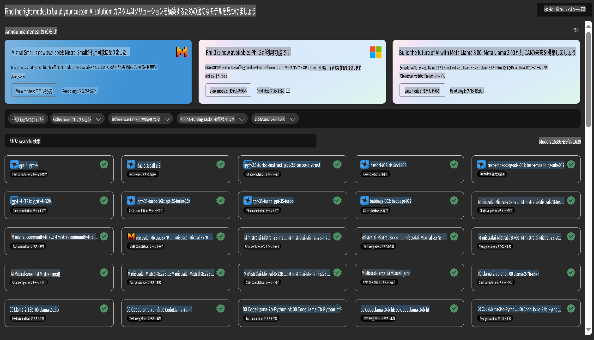

# **Azure Machine Learning Service の紹介**

[Azure Machine Learning](https://ml.azure.com?WT.mc_id=aiml-138114-kinfeylo) は、機械学習 (ML) プロジェクトのライフサイクルを加速し、管理するためのクラウドサービスです。

ML の専門家、データサイエンティスト、エンジニアは、日々のワークフローで次のことが可能です：

- モデルのトレーニングとデプロイ。
- 機械学習オペレーション (MLOps) の管理。
- Azure Machine Learning でモデルを作成するか、PyTorch、TensorFlow、scikit-learn などのオープンソースプラットフォームで構築されたモデルを使用できます。
- MLOps ツールを使用して、モデルの監視、再トレーニング、再デプロイを実施できます。

## Azure Machine Learning の対象者は？

**データサイエンティストと ML エンジニア**

日々のワークフローを加速し、自動化するためのツールを活用できます。  
Azure ML は、公平性、説明可能性、トラッキング、監査可能性をサポートする機能を提供します。

**アプリケーション開発者**

モデルをアプリケーションやサービスにシームレスに統合できます。

**プラットフォーム開発者**

堅牢なツールセットと Azure Resource Manager API による強力なサポートを受けられます。  
これにより、高度な ML ツールを構築することが可能です。

**企業**

Microsoft Azure クラウド環境で作業する企業は、馴染みのあるセキュリティとロールベースのアクセス制御の利点を享受できます。  
プロジェクトを設定して、保護されたデータや特定の操作へのアクセスを制御することが可能です。

## チーム全体の生産性向上

ML プロジェクトには、多様なスキルを持つチームが必要になることが多いです。  
Azure ML は、次のようなツールを提供して、チームのコラボレーションを支援します：

- 共有ノートブック、計算リソース、サーバーレスコンピューティング、データ、環境を通じてチームと連携。
- 公平性、説明可能性、トラッキング、監査可能性を備えたモデルを開発し、系譜や監査コンプライアンス要件を満たす。
- ML モデルを迅速かつ簡単に大規模にデプロイし、MLOps を使用して効率的に管理および統制。
- ガバナンス、セキュリティ、コンプライアンスを組み込んだ形で、どこでも機械学習ワークロードを実行可能。

## クロス互換性のあるプラットフォームツール

ML チームの誰もが、自分の好みのツールを使用して作業を進めることができます。  
迅速な実験、ハイパーパラメータチューニング、パイプラインの構築、推論の管理を行う際に、以下のような馴染みのあるインターフェースを利用できます：

- Azure Machine Learning Studio  
- Python SDK (v2)  
- Azure CLI (v2)  
- Azure Resource Manager REST APIs  

モデルを改良し、開発サイクル全体でコラボレーションを行う中で、Azure Machine Learning Studio の UI を通じて、アセット、リソース、メトリクスを共有および検索できます。

## **Azure ML における LLM/SLM**

Azure ML では、LLMOps と SLMOps を組み合わせた機能を多数追加し、企業全体で生成型人工知能技術プラットフォームを構築できるようにしています。

### **モデルカタログ**

企業ユーザーは、ビジネスシナリオに応じて異なるモデルをモデルカタログを通じてデプロイし、Model as Service としてサービスを提供し、企業開発者やユーザーがアクセスできるようにします。

Azure Machine Learning Studio 内のモデルカタログは、生成型 AI アプリケーションを構築するために使用できるさまざまなモデルを発見し利用するためのハブです。  
モデルカタログには、Azure OpenAI Service、Mistral、Meta、Cohere、Nvidia、Hugging Face、Microsoft がトレーニングしたモデルを含む、モデルプロバイダーによる数百のモデルが特徴として挙げられます。Microsoft 以外のプロバイダーによるモデルは、Microsoft の製品条項で定義される非 Microsoft 製品であり、モデルに付随する利用規約が適用されます。

### **ジョブパイプライン**

機械学習パイプラインのコアは、完全な機械学習タスクを複数のステップに分割したワークフローです。  
各ステップは、個別に開発、最適化、設定、自動化が可能な管理可能なコンポーネントです。  
ステップは明確に定義されたインターフェースを通じて接続されます。Azure Machine Learning パイプラインサービスは、パイプラインステップ間のすべての依存関係を自動的に調整します。

SLM / LLM のファインチューニングでは、パイプラインを通じてデータ、トレーニング、生成プロセスを管理できます。

### **プロンプトフロー**

Azure Machine Learning プロンプトフローの利点  
Azure Machine Learning プロンプトフローは、アイデアの発案から実験、最終的には LLM ベースのアプリケーションを本番環境で使用できる状態にするまでの移行を支援する、さまざまな利点を提供します：

**プロンプトエンジニアリングの柔軟性**

- インタラクティブな作成体験：Azure Machine Learning プロンプトフローは、フローの構造を視覚的に表現し、ユーザーがプロジェクトを簡単に理解しナビゲートできるようにします。また、効率的なフロー開発とデバッグのためのノートブックのようなコーディング体験を提供します。  
- プロンプトチューニングのバリエーション：ユーザーは複数のプロンプトバリエーションを作成して比較し、反復的な改良プロセスを促進できます。  
- 評価：組み込みの評価フローにより、プロンプトやフローの品質と有効性を評価できます。  
- 包括的なリソース：Azure Machine Learning プロンプトフローには、開発の出発点となる組み込みツール、サンプル、テンプレートのライブラリが含まれており、創造性を刺激し、プロセスを加速します。

**LLM ベースのアプリケーションにおける企業対応の準備**

- コラボレーション：Azure Machine Learning プロンプトフローはチームコラボレーションをサポートしており、複数のユーザーがプロンプトエンジニアリングプロジェクトで協力し、知識を共有し、バージョン管理を維持できます。  
- オールインワンプラットフォーム：Azure Machine Learning プロンプトフローは、開発、評価、デプロイ、モニタリングに至るまで、プロンプトエンジニアリングプロセス全体を効率化します。ユーザーはフローを Azure Machine Learning エンドポイントとして簡単にデプロイし、リアルタイムでパフォーマンスをモニタリングすることで、最適な運用と継続的な改善を保証できます。  
- Azure Machine Learning の企業対応ソリューション：プロンプトフローは、Azure Machine Learning の堅牢な企業対応ソリューションを活用し、フローの開発、実験、デプロイのための安全でスケーラブルかつ信頼性の高い基盤を提供します。

Azure Machine Learning プロンプトフローを活用することで、プロンプトエンジニアリングの柔軟性を発揮し、効果的にコラボレーションし、企業グレードのソリューションを活用して、LLM ベースのアプリケーションの開発とデプロイを成功に導くことができます。

Azure ML の計算能力、データ、およびさまざまなコンポーネントを組み合わせることで、企業開発者は独自の人工知能アプリケーションを簡単に構築できます。

**免責事項**:  
この文書は、機械ベースのAI翻訳サービスを使用して翻訳されています。正確さを追求していますが、自動翻訳には誤りや不正確さが含まれる可能性があることをご承知おきください。原文の言語による文書が正式な情報源と見なされるべきです。重要な情報については、専門の人間による翻訳を推奨します。本翻訳の利用に起因する誤解や解釈の誤りについて、当方は一切の責任を負いません。