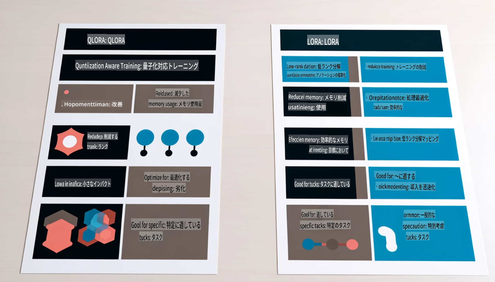

# **Phi-3を業界の専門家にする**

Phi-3モデルを業界で活用するためには、業界のビジネスデータをPhi-3モデルに追加する必要があります。そのための方法は2つあり、1つはRAG（Retrieval Augmented Generation）、もう1つはFine Tuningです。

## **RAGとFine-Tuningの比較**

### **Retrieval Augmented Generation**

RAGはデータの検索とテキスト生成を組み合わせた方法です。企業の構造化データや非構造化データをベクターデータベースに保存します。関連する内容を検索する際に、該当する要約やコンテンツを見つけてコンテキストを形成し、LLM/SLMのテキスト生成能力を組み合わせてコンテンツを生成します。

### **Fine-tuning**

Fine-tuningは、特定のモデルを改良する手法です。モデルのアルゴリズムから始める必要はなく、データを継続的に蓄積する必要があります。業界アプリケーションでより正確な専門用語や言語表現を求める場合、Fine-tuningが適しています。ただし、データが頻繁に変化する場合、Fine-tuningは複雑になる可能性があります。

### **選択方法**

1. 回答に外部データの導入が必要な場合、RAGが最適な選択です。

2. 安定して正確な業界知識を出力する必要がある場合、Fine-tuningが良い選択です。RAGは関連する内容を優先して引き出しますが、専門的なニュアンスを完全に捉えられない場合があります。

3. Fine-tuningには高品質なデータセットが必要で、データの範囲が小さい場合、大きな違いは生じません。一方、RAGはより柔軟です。

4. Fine-tuningはブラックボックス的で、内部の仕組みを理解するのが難しいですが、RAGはデータの出所を特定しやすく、幻覚や内容の誤りを効果的に調整し、透明性を向上させることができます。

### **シナリオ**

1. 垂直産業で特定の専門用語や表現が必要な場合、***Fine-tuning***が最適です。

2. 異なる知識点を統合するQAシステムには、***RAG***が最適です。

3. 自動化されたビジネスフローの組み合わせには、***RAG + Fine-tuning***が最適です。

## **RAGの使用方法**

ベクターデータベースは、データを数学的な形式で保存するデータの集合体です。ベクターデータベースを使用すると、機械学習モデルが以前の入力を記憶しやすくなり、検索、推薦、テキスト生成などのユースケースをサポートするために機械学習を利用できます。データを完全一致ではなく類似性メトリクスに基づいて識別できるため、コンピュータモデルがデータの文脈を理解することが可能になります。

ベクターデータベースはRAGを実現する鍵となります。text-embedding-3やjina-ai-embeddingなどのベクターモデルを使用して、データをベクターストレージに変換できます。

RAGアプリケーションの作成について詳しくはこちらをご覧ください：[https://github.com/microsoft/Phi-3CookBook](https://github.com/microsoft/Phi-3CookBook?WT.mc_id=aiml-138114-kinfeylo)

## **Fine-tuningの使用方法**

Fine-tuningでよく使われるアルゴリズムはLoraとQLoraです。どちらを選ぶべきでしょうか？
- [このサンプルノートブックで詳しく学ぶ](../../../../code/04.Finetuning/Phi_3_Inference_Finetuning.ipynb)
- [Python FineTuningのサンプル例](../../../../code/04.Finetuning/FineTrainingScript.py)

### **LoraとQLora**

LoRA（Low-Rank Adaptation）とQLoRA（Quantized Low-Rank Adaptation）は、Parameter Efficient Fine Tuning（PEFT）を使用して大規模言語モデル（LLMs）をFine-tuningする技術です。PEFT技術は、従来の方法よりも効率的にモデルをトレーニングすることを目的としています。  
LoRAは、重み更新行列に低ランク近似を適用することでメモリの使用量を削減する単独のFine-tuning技術です。トレーニング時間が短く、従来のFine-tuning方法に近いパフォーマンスを維持します。

QLoRAは、LoRAを拡張したバージョンで、量子化技術を取り入れることでさらにメモリ使用量を削減します。QLoRAは、事前トレーニングされたLLMの重みパラメータの精度を4ビット精度に量子化し、LoRAよりもメモリ効率が高いです。ただし、量子化と逆量子化のステップが追加されるため、QLoRAのトレーニングはLoRAより約30%遅くなります。

QLoRAは、量子化による誤差を修正するための補助としてLoRAを使用します。QLoRAを使用すると、比較的小規模で広く利用可能なGPU上で数十億パラメータを持つ巨大なモデルをFine-tuningできます。例えば、QLoRAは36台のGPUを必要とする70Bパラメータモデルを、わずか2台のGPUでFine-tuningすることが可能です。

**免責事項**:  
この文書は、AIによる機械翻訳サービスを使用して翻訳されています。正確性を期すよう努めておりますが、自動翻訳にはエラーや不正確な部分が含まれる可能性があります。本来の言語で記載された原文を正式な情報源と見なしてください。重要な情報については、専門の人間による翻訳を推奨します。本翻訳の使用に起因する誤解や誤った解釈について、当方は一切の責任を負いかねます。