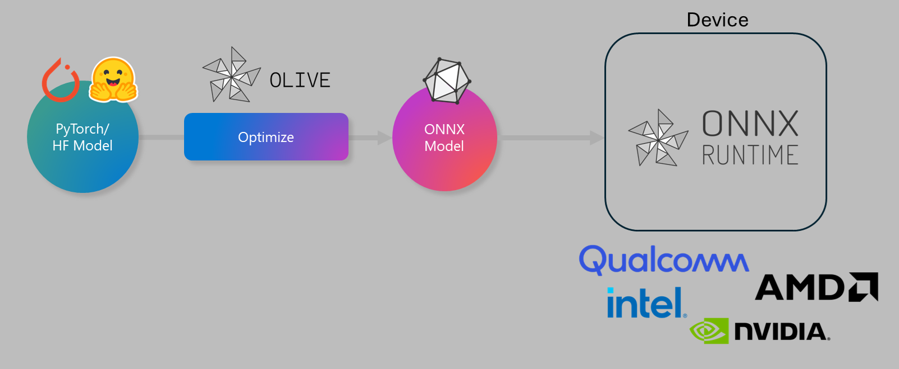

# ラボ. デバイス上での推論向けAIモデルの最適化

## はじめに

> [!IMPORTANT]
> このラボでは、**Nvidia A10またはA100 GPU** と、それに対応するドライバーおよびCUDAツールキット（バージョン12以上）が必要です。

> [!NOTE]
> このラボは、**35分間** で、OLIVEを使用してデバイス上での推論向けにモデルを最適化する基本概念を実践的に学ぶことができます。

## 学習目標

このラボを終了する頃には、OLIVEを使用して以下を行えるようになります：

- AWQ量子化手法を使用してAIモデルを量子化する。
- 特定のタスクに合わせてAIモデルを微調整する。
- ONNX Runtimeでの効率的なデバイス上推論のためにLoRAアダプター（微調整済みモデル）を生成する。

### Oliveとは

Olive (*O*NNX *live*) は、ONNX Runtime +++https://onnxruntime.ai+++ に対応するモデルを提供するためのモデル最適化ツールキットで、CLIも付属しています。



Oliveへの入力は通常、PyTorchまたはHugging Faceのモデルであり、出力はONNX Runtimeを実行するデバイス（デプロイメントターゲット）上で動作する最適化されたONNXモデルです。Oliveは、Qualcomm、AMD、Nvidia、Intelなどのハードウェアベンダーが提供するデプロイメントターゲットのAIアクセラレータ（NPU、GPU、CPU）に合わせてモデルを最適化します。

Oliveは、*ワークフロー* を実行します。これは、*パス* と呼ばれる個別のモデル最適化タスクの順序付けられたシーケンスです。例として、モデル圧縮、グラフキャプチャ、量子化、グラフ最適化などのパスがあります。各パスには、精度や遅延といった最良のメトリクスを達成するために調整可能なパラメータが設定されています。Oliveは、探索アルゴリズムを使用した探索戦略を採用して、個別または複数のパスを自動調整します。

#### Oliveの利点

- グラフ最適化、圧縮、量子化などの技術を試行錯誤する際の**手間と時間を削減**。品質と性能の制約を定義すれば、Oliveが最適なモデルを自動的に見つけてくれます。
- **40以上の組み込みモデル最適化コンポーネント** が、量子化、圧縮、グラフ最適化、微調整の最先端技術を網羅。
- **使いやすいCLI** により、一般的なモデル最適化タスクを簡単に実行可能。例: `olive quantize`, `olive auto-opt`, `olive finetune`。
- モデルのパッケージングとデプロイメントをサポート。
- **マルチLoRAサービング** 用モデルの生成をサポート。
- YAML/JSONを使用してワークフローを構築し、モデル最適化およびデプロイメントタスクをオーケストレーション。
- **Hugging Face** および **Azure AI** との統合。
- **キャッシュ機能** により、**コストを節約**。

## ラボ手順
> [!NOTE]
> Lab 1で設定したAzure AI Hubとプロジェクト、A100コンピュートが準備されていることを確認してください。

### ステップ 0: Azure AI Compute に接続する

**VS Code** のリモート機能を使用して、Azure AI Computeに接続します。

1. **VS Code** デスクトップアプリケーションを開きます。
1. **コマンドパレット** を **Shift+Ctrl+P** で開きます。
1. コマンドパレットで **AzureML - remote: Connect to compute instance in New Window** を検索します。
1. 画面の指示に従い、Lab 1で設定したAzure Subscription、Resource Group、Project、Compute名を選択して接続します。
1. Azure ML Computeノードに接続されると、**VS Codeの左下** に表示されます `><Azure ML: Compute Name`

### ステップ 1: このリポジトリをクローンする

VS Codeで **Ctrl+J** を押して新しいターミナルを開き、このリポジトリをクローンします。

ターミナルに以下のプロンプトが表示されます。

```
azureuser@computername:~/cloudfiles/code$ 
```
ソリューションをクローンします。

```bash
cd ~/localfiles
git clone https://github.com/microsoft/phi-3cookbook.git
```

### ステップ 2: フォルダをVS Codeで開く

ターミナルで以下のコマンドを実行して、該当フォルダをVS Codeで開きます。これにより新しいウィンドウが開きます：

```bash
code phi-3cookbook/code/04.Finetuning/Olive-lab
```

または、**ファイル** > **フォルダを開く** を選択してフォルダを開くこともできます。

### ステップ 3: 依存関係のインストール

Azure AI Computeインスタンス上のVS Codeターミナルウィンドウ（ヒント: **Ctrl+J**）を開き、以下のコマンドを実行して依存関係をインストールします：

```bash
conda create -n olive-ai python=3.11 -y
conda activate olive-ai
pip install -r requirements.txt
az extension remove -n azure-cli-ml
az extension add -n ml
```

> [!NOTE]
> すべての依存関係のインストールには約5分かかります。

このラボでは、Azure AIモデルカタログにモデルをダウンロードおよびアップロードします。モデルカタログにアクセスできるようにするため、以下のコマンドでAzureにログインする必要があります：

```bash
az login
```

> [!NOTE]
> ログイン時にサブスクリプションを選択するよう求められます。このラボで提供されたサブスクリプションを選択してください。

### ステップ 4: Oliveコマンドを実行する

Azure AI Computeインスタンス上のVS Codeターミナルウィンドウ（ヒント: **Ctrl+J**）を開き、`olive-ai` conda環境がアクティブになっていることを確認します：

```bash
conda activate olive-ai
```

次に、以下のOliveコマンドをコマンドラインで実行します。

1. **データを確認する:** この例では、Phi-3.5-Miniモデルを微調整して旅行関連の質問に答えられるようにします。以下のコードは、JSON lines形式のデータセットの最初の数件を表示します：
   
    ```bash
    head data/data_sample_travel.jsonl
    ```
1. **モデルを量子化する:** モデルをトレーニングする前に、Active Aware Quantization (AWQ) +++https://arxiv.org/abs/2306.00978+++ という手法を使用して以下のコマンドで量子化します。AWQは、推論中に生成される活性化を考慮してモデルの重みを量子化します。これにより、従来の重み量子化方法と比較して、モデルの精度をより良く保持することができます。
    
    ```bash
    olive quantize \
       --model_name_or_path microsoft/Phi-3.5-mini-instruct \
       --trust_remote_code \
       --algorithm awq \
       --output_path models/phi/awq \
       --log_level 1
    ```
    
    AWQ量子化の完了には**約8分**かかり、モデルサイズが**約7.5GBから約2.5GB**に削減されます。
   
   このラボでは、Hugging Faceからモデルを入力する方法を示しています（例: `microsoft/Phi-3.5-mini-instruct`). However, Olive also allows you to input models from the Azure AI catalog by updating the `model_name_or_path` argument to an Azure AI asset ID (for example:  `azureml://registries/azureml/models/Phi-3.5-mini-instruct/versions/4`). 

1. **Train the model:** Next, the `olive finetune` コマンドで量子化済みモデルを微調整します。量子化後ではなく**量子化前**にモデルを微調整することで、量子化による損失を一部回復するため、より良い精度が得られます。
    
    ```bash
    olive finetune \
        --method lora \
        --model_name_or_path models/phi/awq \
        --data_files "data/data_sample_travel.jsonl" \
        --data_name "json" \
        --text_template "<|user|>\n{prompt}<|end|>\n<|assistant|>\n{response}<|end|>" \
        --max_steps 100 \
        --output_path ./models/phi/ft \
        --log_level 1
    ```
    
    微調整（100ステップ）には**約6分**かかります。

1. **最適化:** モデルがトレーニングされたら、次にOliveの `auto-opt` command, which will capture the ONNX graph and automatically perform a number of optimizations to improve the model performance for CPU by compressing the model and doing fusions. It should be noted, that you can also optimize for other devices such as NPU or GPU by just updating the `--device` and `--provider` 引数を使用してモデルを最適化します。ただし、このラボではCPUを使用します。

    ```bash
    olive auto-opt \
       --model_name_or_path models/phi/ft/model \
       --adapter_path models/phi/ft/adapter \
       --device cpu \
       --provider CPUExecutionProvider \
       --use_ort_genai \
       --output_path models/phi/onnx-ao \
       --log_level 1
    ```
    
    最適化には**約5分**かかります。

### ステップ 5: モデル推論の簡易テスト

モデルの推論をテストするために、フォルダ内に **app.py** というPythonファイルを作成し、以下のコードをコピーして貼り付けます：

```python
import onnxruntime_genai as og
import numpy as np

print("loading model and adapters...", end="", flush=True)
model = og.Model("models/phi/onnx-ao/model")
adapters = og.Adapters(model)
adapters.load("models/phi/onnx-ao/model/adapter_weights.onnx_adapter", "travel")
print("DONE!")

tokenizer = og.Tokenizer(model)
tokenizer_stream = tokenizer.create_stream()

params = og.GeneratorParams(model)
params.set_search_options(max_length=100, past_present_share_buffer=False)
user_input = "what is the best thing to see in chicago"
params.input_ids = tokenizer.encode(f"<|user|>\n{user_input}<|end|>\n<|assistant|>\n")

generator = og.Generator(model, params)

generator.set_active_adapter(adapters, "travel")

print(f"{user_input}")

while not generator.is_done():
    generator.compute_logits()
    generator.generate_next_token()

    new_token = generator.get_next_tokens()[0]
    print(tokenizer_stream.decode(new_token), end='', flush=True)

print("\n")
```

以下のコマンドでコードを実行します：

```bash
python app.py
```

### ステップ 6: モデルをAzure AIにアップロードする

モデルをAzure AIモデルリポジトリにアップロードすることで、開発チームの他のメンバーと共有でき、モデルのバージョン管理も可能になります。以下のコマンドを実行してモデルをアップロードします：

> [!NOTE]
> `{}` placeholders with the name of your resource group and Azure AI Project Name. 

To find your resource group `"resourceGroup"とAzure AIプロジェクト名を更新し、以下のコマンドを実行してください。

```
az ml workspace show
```

または、+++ai.azure.com+++ にアクセスし、**管理センター** > **プロジェクト** > **概要** を選択します。

`{}` プレースホルダーをリソースグループ名とAzure AIプロジェクト名に置き換えてください。

```bash
az ml model create \
    --name ft-for-travel \
    --version 1 \
    --path ./models/phi/onnx-ao \
    --resource-group {RESOURCE_GROUP_NAME} \
    --workspace-name {PROJECT_NAME}
```
その後、https://ml.azure.com/model/list にアクセスして、アップロードしたモデルを確認し、デプロイすることができます。

**免責事項**:  
本書類は、機械翻訳AIサービスを使用して翻訳されています。正確性を追求しておりますが、自動翻訳には誤りや不正確さが含まれる可能性があります。元の言語で作成された原文を信頼できる情報源としてご参照ください。重要な情報については、専門の人間による翻訳を推奨します。本翻訳の利用に起因する誤解や解釈の誤りについて、当方は一切の責任を負いかねます。