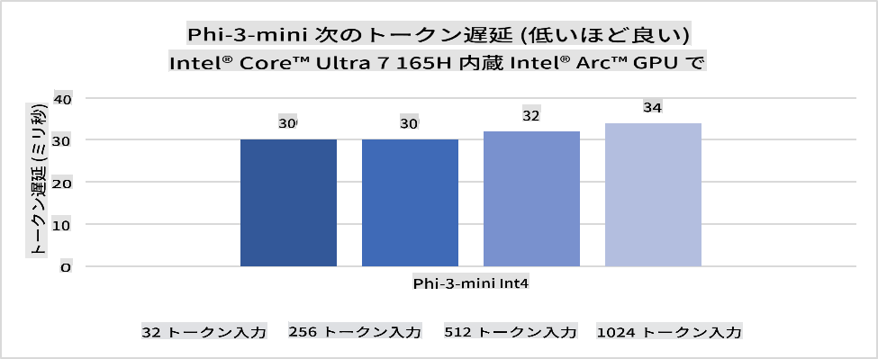
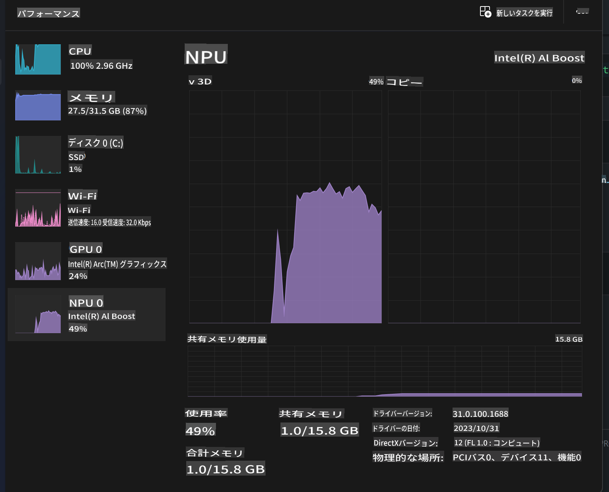
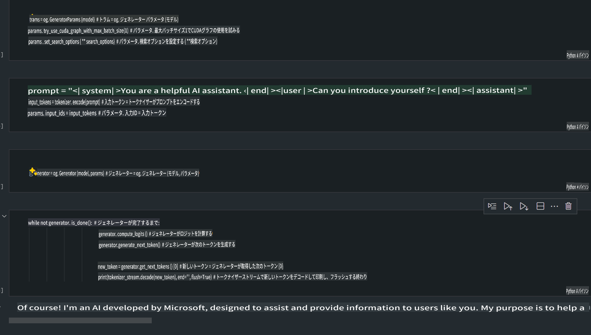
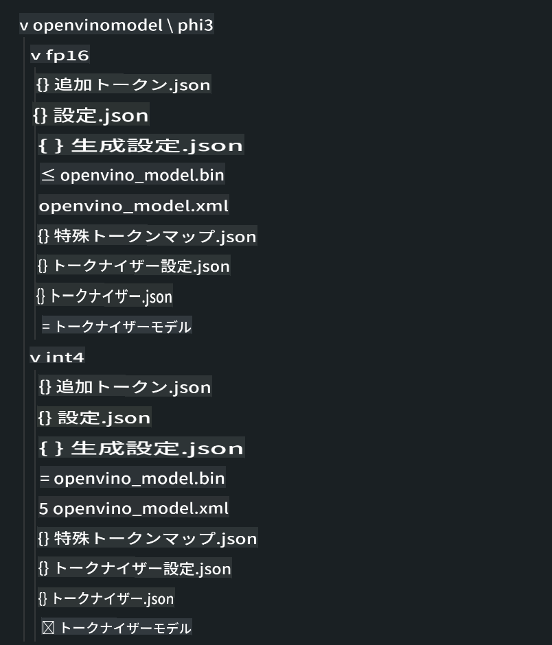
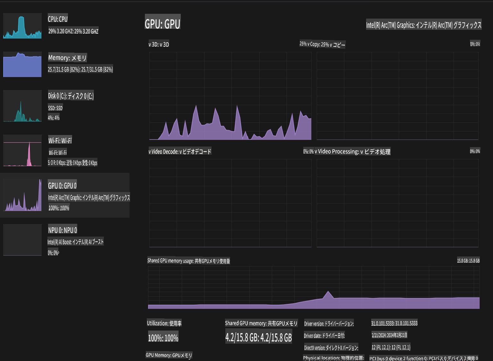

# **AI PCでのPhi-3推論**

生成AIの進化とエッジデバイスのハードウェア能力の向上により、ユーザーのBYOD（Bring Your Own Device）デバイスに生成AIモデルを統合できるようになってきました。AI PCもその一つです。2024年から、Intel、AMD、QualcommがPCメーカーと協力し、ハードウェアの改良を通じてローカル生成AIモデルの展開を支援するAI PCを導入します。この議論では、Intel AI PCに焦点を当て、Intel AI PC上でPhi-3を展開する方法を探ります。

### **NPUとは**

NPU（Neural Processing Unit）は、神経ネットワークの操作やAIタスクを加速するために特化されたプロセッサまたは処理ユニットです。一般的なCPUやGPUとは異なり、NPUはデータ駆動型の並列計算に最適化されており、ビデオや画像などの大量のマルチメディアデータや神経ネットワークのデータ処理を効率的に行います。特に、音声認識、ビデオ通話の背景ぼかし、物体検出などの写真やビデオ編集プロセスなどのAI関連のタスクに優れています。

## **NPUとGPUの比較** 
多くのAIおよび機械学習のワークロードはGPUで実行されますが、GPUとNPUには重要な違いがあります。
GPUは並列計算能力で知られていますが、すべてのGPUがグラフィックス処理以外でも効率的であるとは限りません。一方、NPUは神経ネットワーク操作に関わる複雑な計算のために特化されており、AIタスクに非常に効果的です。

要約すると、NPUはAI計算を高速化する数学の達人であり、新しいAI PCの時代において重要な役割を果たします！

***この例はIntelの最新のIntel Core Ultra Processorに基づいています***

## **1. NPUを使用してPhi-3モデルを実行する**

Intel® NPUデバイスは、Intel® Core™ Ultra世代のCPU（以前はMeteor Lakeとして知られていた）から統合されたAI推論アクセラレータです。これにより、人工神経ネットワークタスクのエネルギー効率の良い実行が可能になります。




**Intel NPU Acceleration Library**

Intel NPU Acceleration Library [https://github.com/intel/intel-npu-acceleration-library](https://github.com/intel/intel-npu-acceleration-library) は、Intel Neural Processing Unit (NPU) の力を活用して、互換性のあるハードウェア上で高速計算を行うことでアプリケーションの効率を高めるためのPythonライブラリです。

Intel® Core™ Ultraプロセッサを搭載したAI PCでのPhi-3-miniの例。


pipでPythonライブラリをインストール

```bash

   pip install intel-npu-acceleration-library

```

***Note*** プロジェクトはまだ開発中ですが、リファレンスモデルはすでに非常に完成度が高いです。

### **Intel NPU Acceleration Libraryを使用してPhi-3を実行する**

Intel NPUアクセラレーションを使用することで、このライブラリは従来のエンコードプロセスに影響を与えません。元のPhi-3モデルをFP16、INT8、INT4などに量子化するためにこのライブラリを使用するだけです。

```python

from transformers import AutoTokenizer, pipeline,TextStreamer
import intel_npu_acceleration_library as npu_lib
import warnings

model_id = "microsoft/Phi-3-mini-4k-instruct"

model = npu_lib.NPUModelForCausalLM.from_pretrained(
                                    model_id,
                                    torch_dtype="auto",
                                    dtype=npu_lib.int4,
                                    trust_remote_code=True
                                )

tokenizer = AutoTokenizer.from_pretrained(model_id)

text_streamer = TextStreamer(tokenizer, skip_prompt=True)

```
量子化が成功した後、実行を続けてNPUを呼び出し、Phi-3モデルを実行します。

```python

generation_args = {
            "max_new_tokens": 1024,
            "return_full_text": False,
            "temperature": 0.3,
            "do_sample": False,
            "streamer": text_streamer,
        }

pipe = pipeline(
            "text-generation",
            model=model,
            tokenizer=tokenizer,
)

query = "<|system|>You are a helpful AI assistant.<|end|><|user|>Can you introduce yourself?<|end|><|assistant|>"

with warnings.catch_warnings():
    warnings.simplefilter("ignore")
    pipe(query, **generation_args)


```

コードを実行する際、タスクマネージャーを通じてNPUの実行状況を確認できます。



***Samples*** : [AIPC_NPU_DEMO.ipynb](../../../../code/03.Inference/AIPC/AIPC_NPU_DEMO.ipynb)

## **2. DirectML + ONNX Runtimeを使用してPhi-3モデルを実行する**

### **DirectMLとは**

[DirectML](https://github.com/microsoft/DirectML) は、機械学習のための高性能でハードウェアアクセラレータを備えたDirectX 12ライブラリです。DirectMLは、AMD、Intel、NVIDIA、QualcommなどのベンダーからのDirectX 12対応GPUを含む幅広いハードウェアとドライバで、一般的な機械学習タスクにGPUアクセラレーションを提供します。

単独で使用する場合、DirectML APIは低レベルのDirectX 12ライブラリであり、フレームワーク、ゲーム、その他のリアルタイムアプリケーションなどの高性能で低レイテンシのアプリケーションに適しています。Direct3D 12とのシームレスな相互運用性、低オーバーヘッド、およびハードウェア全体での一貫性により、DirectMLは高性能が求められ、ハードウェア全体での結果の信頼性と予測可能性が重要な場合に機械学習を加速するのに最適です。

***Note*** : 最新のDirectMLはすでにNPUをサポートしています (https://devblogs.microsoft.com/directx/introducing-neural-processor-unit-npu-support-in-directml-developer-preview/)

###  DirectMLとCUDAの能力とパフォーマンスの比較：

**DirectML** はMicrosoftによって開発された機械学習ライブラリです。Windowsデバイス（デスクトップ、ノートパソコン、エッジデバイスを含む）で機械学習ワークロードを加速するために設計されています。
- DX12ベース: DirectMLはDirectX 12 (DX12)の上に構築されており、NVIDIAおよびAMDの両方を含むGPU全体で幅広いハードウェアサポートを提供します。
- 広範なサポート: DX12を利用するため、DirectMLはDX12をサポートする任意のGPUで動作でき、統合GPUでも動作可能です。
- 画像処理: DirectMLは神経ネットワークを使用して画像やその他のデータを処理し、画像認識や物体検出などのタスクに適しています。
- セットアップの簡便さ: DirectMLのセットアップは簡単で、特定のSDKやGPUメーカーのライブラリを必要としません。
- パフォーマンス: 場合によっては、DirectMLは良好なパフォーマンスを発揮し、特定のワークロードにおいてCUDAよりも高速な場合があります。
- 制限事項: しかし、DirectMLは特にfloat16の大きなバッチサイズにおいて遅くなる場合があります。

**CUDA** はNVIDIAの並列計算プラットフォームおよびプログラミングモデルです。NVIDIA GPUの力を活用して、機械学習や科学シミュレーションを含む汎用計算を行うことができます。
- NVIDIA特化: CUDAはNVIDIA GPUと密接に統合されており、特にそれらのために設計されています。
- 高度に最適化: NVIDIA GPUを使用する場合、GPUアクセラレータタスクに対して優れたパフォーマンスを提供します。
- 広く使用されている: 多くの機械学習フレームワークやライブラリ（TensorFlowやPyTorchなど）はCUDAをサポートしています。
- カスタマイズ: 開発者は特定のタスクのためにCUDA設定を微調整することができ、最適なパフォーマンスを実現できます。
- 制限事項: しかし、CUDAのNVIDIAハードウェアへの依存は、異なるGPU全体での互換性を広げたい場合に制限となることがあります。

### DirectMLとCUDAの選択:
DirectMLとCUDAの選択は、特定の使用ケース、ハードウェアの可用性、および好みに依存します。
広範な互換性とセットアップの容易さを求める場合、DirectMLが良い選択肢かもしれません。しかし、NVIDIA GPUを持ち、高度に最適化されたパフォーマンスが必要な場合、CUDAは依然として強力な選択肢です。要約すると、DirectMLとCUDAの両方に強みと弱みがあるため、選択する際には要件と利用可能なハードウェアを考慮してください。

### **ONNX Runtimeを使用した生成AI**

AIの時代において、AIモデルの移植性は非常に重要です。ONNX Runtimeを使用すると、トレーニングされたモデルを簡単に異なるデバイスに展開できます。開発者は推論フレームワークに注意を払う必要がなく、統一されたAPIを使用してモデル推論を完了できます。生成AIの時代には、ONNX Runtimeはコードの最適化も行っています (https://onnxruntime.ai/docs/genai/)。最適化されたONNX Runtimeを通じて、量子化された生成AIモデルを異なる端末で推論することができます。生成AIをONNX Runtimeで使用する際、Python、C#、C / C++を通じてAIモデルAPIを推論することができます。もちろん、iPhoneでの展開はC++のGenerative AI with ONNX Runtime APIを利用できます。

[サンプルコード](https://github.com/Azure-Samples/Phi-3MiniSamples/tree/main/onnx)

***ONNX Runtimeライブラリを使用して生成AIをコンパイル***

```bash

winget install --id=Kitware.CMake  -e

git clone https://github.com/microsoft/onnxruntime.git

cd .\onnxruntime\

./build.bat --build_shared_lib --skip_tests --parallel --use_dml --config Release

cd ../

git clone https://github.com/microsoft/onnxruntime-genai.git

cd .\onnxruntime-genai\

mkdir ort

cd ort

mkdir include

mkdir lib

copy ..\onnxruntime\include\onnxruntime\core\providers\dml\dml_provider_factory.h ort\include

copy ..\onnxruntime\include\onnxruntime\core\session\onnxruntime_c_api.h ort\include

copy ..\onnxruntime\build\Windows\Release\Release\*.dll ort\lib

copy ..\onnxruntime\build\Windows\Release\Release\onnxruntime.lib ort\lib

python build.py --use_dml


```

**ライブラリのインストール**


```bash

pip install .\onnxruntime_genai_directml-0.3.0.dev0-cp310-cp310-win_amd64.whl

```

これは実行結果です



***Samples*** : [AIPC_DirectML_DEMO.ipynb](../../../../code/03.Inference/AIPC/AIPC_DirectML_DEMO.ipynb)

## **3. Intel OpenVinoを使用してPhi-3モデルを実行する**

### **OpenVINOとは**

[OpenVINO](https://github.com/openvinotoolkit/openvino) は、深層学習モデルを最適化して展開するためのオープンソースツールキットです。TensorFlow、PyTorchなどの人気のあるフレームワークからの視覚、音声、言語モデルのディープラーニングパフォーマンスを向上させます。OpenVINOを使用して始めましょう。OpenVINOは、CPUおよびGPUと組み合わせてPhi3モデルを実行することもできます。

***Note***: 現在、OpenVINOはNPUをサポートしていません。

### **OpenVINOライブラリのインストール**

```bash

 pip install git+https://github.com/huggingface/optimum-intel.git

 pip install git+https://github.com/openvinotoolkit/nncf.git

 pip install openvino-nightly

```

### **OpenVINOを使用してPhi-3を実行する**

NPUと同様に、OpenVINOは量子化されたモデルを実行することで生成AIモデルの呼び出しを完了します。まずPhi-3モデルを量子化し、optimum-cliを使用してコマンドラインでモデルの量子化を完了します。

**INT4**

```bash

optimum-cli export openvino --model "microsoft/Phi-3-mini-4k-instruct" --task text-generation-with-past --weight-format int4 --group-size 128 --ratio 0.6  --sym  --trust-remote-code ./openvinomodel/phi3/int4

```

**FP16**

```bash

optimum-cli export openvino --model "microsoft/Phi-3-mini-4k-instruct" --task text-generation-with-past --weight-format fp16 --trust-remote-code ./openvinomodel/phi3/fp16

```

変換されたフォーマットは次のようになります



OVModelForCausalLMを通じてモデルパス（model_dir）、関連設定（ov_config = {"PERFORMANCE_HINT": "LATENCY", "NUM_STREAMS": "1", "CACHE_DIR": ""}）、およびハードウェアアクセラレータデバイス（GPU.0）をロードします。

```python

ov_model = OVModelForCausalLM.from_pretrained(
     model_dir,
     device='GPU.0',
     ov_config=ov_config,
     config=AutoConfig.from_pretrained(model_dir, trust_remote_code=True),
     trust_remote_code=True,
)

```

コードを実行する際、タスクマネージャーを通じてGPUの実行状況を確認できます。



***Samples*** : [AIPC_OpenVino_Demo.ipynb](../../../../code/03.Inference/AIPC/AIPC_OpenVino_Demo.ipynb)

### ***Note*** : 上記の3つの方法にはそれぞれの利点がありますが、AI PC推論にはNPUアクセラレーションを使用することをお勧めします。

免責事項: この翻訳はAIモデルによって元の文章から翻訳されたものであり、完璧ではない可能性があります。 出力を確認し、必要に応じて修正を行ってください。