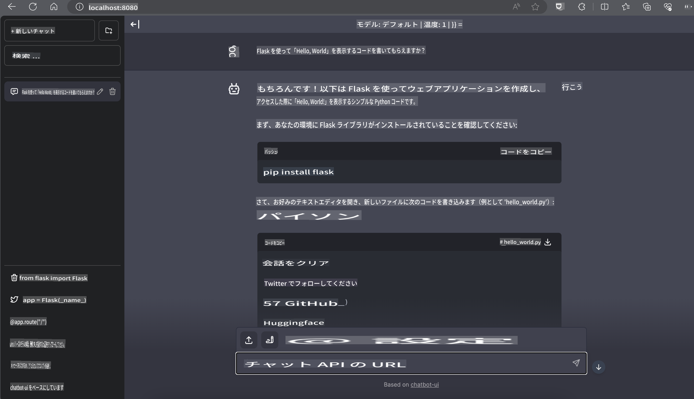

# **Nvidia JetsonでのPhi-3推論**

Nvidia Jetsonは、Nvidiaが提供する組み込みコンピューティングボードシリーズです。Jetson TK1、TX1、TX2モデルはすべて、ARMアーキテクチャの中央処理装置（CPU）を統合したNvidiaのTegraプロセッサ（またはSoC）を搭載しています。Jetsonは低消費電力システムであり、機械学習アプリケーションの加速を目的としています。Nvidia Jetsonは、あらゆる業界で画期的なAI製品を開発するためにプロの開発者に利用されており、学生や愛好者による実践的なAI学習や素晴らしいプロジェクトの作成にも使用されています。SLMはJetsonなどのエッジデバイスに展開され、産業用生成AIアプリケーションシナリオのより良い実装を可能にします。

## NVIDIA Jetsonでのデプロイメント:
自律ロボティクスや組み込みデバイスに取り組む開発者は、Phi-3 Miniを活用できます。Phi-3の比較的小さなサイズはエッジデプロイメントに理想的です。トレーニング中にパラメータが綿密に調整されており、高い応答精度が保証されています。

### TensorRT-LLM最適化:
NVIDIAの[TensorRT-LLMライブラリ](https://github.com/NVIDIA/TensorRT-LLM?WT.mc_id=aiml-138114-kinfeylo)は、大規模言語モデルの推論を最適化します。Phi-3 Miniの長いコンテキストウィンドウをサポートし、スループットとレイテンシの両方を向上させます。最適化には、LongRoPE、FP8、およびインフライトバッチングなどの技術が含まれます。

### 利用可能性とデプロイメント:
開発者は[NVIDIAのAI](https://www.nvidia.com/en-us/ai-data-science/generative-ai/)で128Kコンテキストウィンドウを持つPhi-3 Miniを探索できます。これは標準APIを備えたマイクロサービスとしてNVIDIA NIMにパッケージ化されており、どこにでもデプロイできます。さらに、[GitHubのTensorRT-LLM実装](https://github.com/NVIDIA/TensorRT-LLM)も利用可能です。

## **1. 準備**

a. Jetson Orin NX / Jetson NX

b. JetPack 5.1.2+

c. Cuda 11.8

d. Python 3.8+

## **2. JetsonでのPhi-3の実行**

[Ollama](https://ollama.com)または[LlamaEdge](https://llamaedge.com)を選ぶことができます。

クラウドとエッジデバイスで同時にggufを使用したい場合、LlamaEdgeはWasmEdgeと理解できます（WasmEdgeはクラウドネイティブ、エッジ、および分散アプリケーションに適した軽量で高性能なWebAssemblyランタイムです。サーバーレスアプリケーション、組み込み関数、マイクロサービス、スマートコントラクト、およびIoTデバイスをサポートします。LlamaEdgeを通じてggufの量子化モデルをエッジデバイスおよびクラウドにデプロイできます）。


使用手順は以下の通りです。

1. 関連ライブラリとファイルをインストールおよびダウンロード

```bash

curl -sSf https://raw.githubusercontent.com/WasmEdge/WasmEdge/master/utils/install.sh | bash -s -- --plugin wasi_nn-ggml

curl -LO https://github.com/LlamaEdge/LlamaEdge/releases/latest/download/llama-api-server.wasm

curl -LO https://github.com/LlamaEdge/chatbot-ui/releases/latest/download/chatbot-ui.tar.gz

tar xzf chatbot-ui.tar.gz

```

**Note**: llama-api-server.wasmとchatbot-uiは同じディレクトリに配置する必要があります

2. ターミナルでスクリプトを実行

```bash

wasmedge --dir .:. --nn-preload default:GGML:AUTO:{Your gguf path} llama-api-server.wasm -p phi-3-chat

```

実行結果は以下の通りです。



***サンプルコード*** [Phi-3 mini WASM Notebook Sample](https://github.com/Azure-Samples/Phi-3MiniSamples/tree/main/wasm)

まとめると、Phi-3 Miniは効率性、コンテキスト認識、NVIDIAの最適化能力を兼ね備えた言語モデルの進化を表しています。ロボットやエッジアプリケーションを構築する際には、Phi-3 Miniは強力なツールとなるでしょう。

免責事項: この翻訳はAIモデルによって原文から翻訳されたものであり、完全ではない可能性があります。出力を確認し、必要な修正を行ってください。