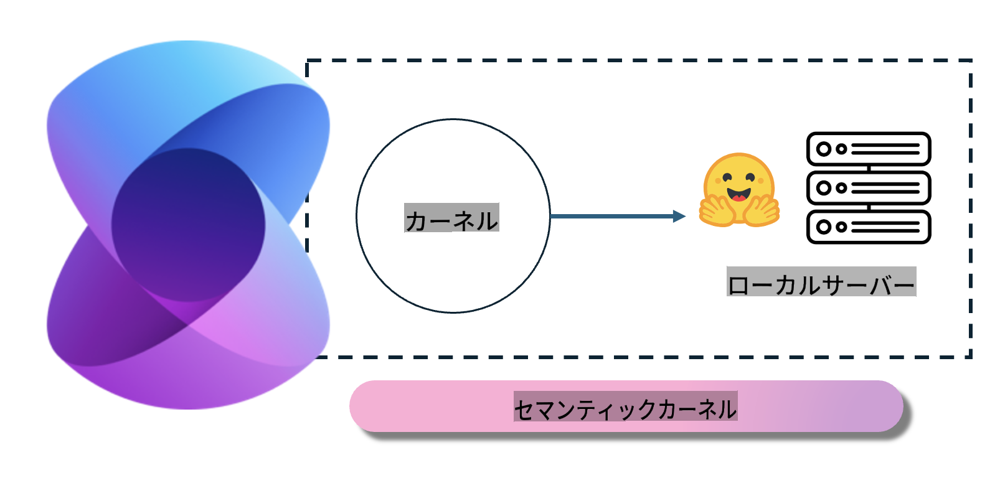
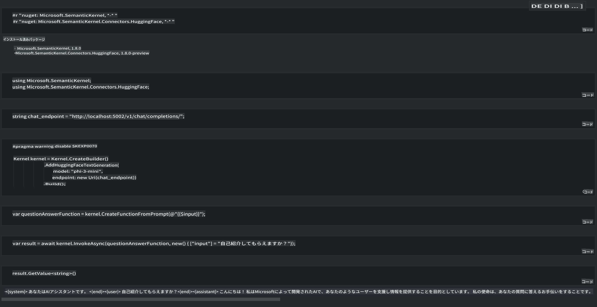

# **ローカルサーバーでのPhi-3の推論**

Phi-3をローカルサーバーにデプロイできます。ユーザーは[Ollama](https://ollama.com)や[LM Studio](https://llamaedge.com)のソリューションを選択するか、自分でコードを書くこともできます。Phi-3のローカルサービスには[Semantic Kernel](https://github.com/microsoft/semantic-kernel?WT.mc_id=aiml-138114-kinfeylo)や[Langchain](https://www.langchain.com/)を通じて接続し、Copilotアプリケーションを構築できます。

## **Semantic Kernelを使用してPhi-3-miniにアクセスする**

Copilotアプリケーションでは、Semantic Kernel / LangChainを通じてアプリケーションを作成します。この種のアプリケーションフレームワークは、一般的にAzure OpenAI Service / OpenAIモデルと互換性があり、Hugging Faceのオープンソースモデルやローカルモデルもサポートできます。Semantic Kernelを使用してPhi-3-miniにアクセスしたい場合はどうすればよいでしょうか？.NETを例に取ると、Semantic KernelのHugging Face Connectorと組み合わせることができます。デフォルトでは、Hugging Face上のモデルIDに対応します（初めて使用する場合、モデルはHugging Faceからダウンロードされるため時間がかかります）。また、自分で構築したローカルサービスに接続することもできます。これらを比較すると、特に企業アプリケーションでは後者の方が自律性が高いため、後者を使用することをお勧めします。

この図からわかるように、Semantic Kernelを通じてローカルサービスにアクセスすることで、自分で構築したPhi-3-miniモデルサーバーに簡単に接続できます。以下はその実行結果です。

***サンプルコード*** https://github.com/kinfey/Phi3MiniSamples/tree/main/semantickernel

**免責事項**:
この文書は、機械ベースのAI翻訳サービスを使用して翻訳されています。正確さを期すよう努めておりますが、自動翻訳には誤りや不正確さが含まれる可能性があることをご承知おきください。権威ある情報源としては、元の言語で書かれた原文を考慮すべきです。重要な情報については、専門の人間による翻訳をお勧めします。この翻訳の使用に起因する誤解や誤訳について、当社は一切の責任を負いません。