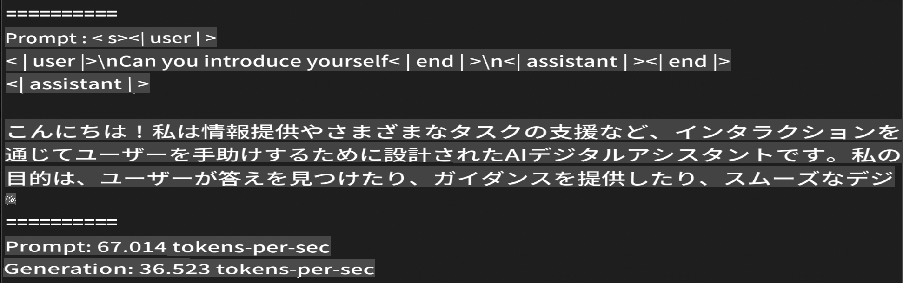
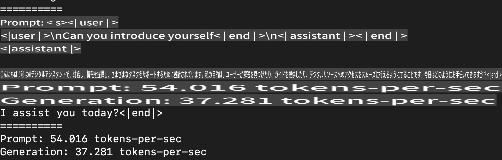

# **Apple MLXフレームワークでPhi-3を推論する**

## **MLXフレームワークとは**

MLXは、Appleシリコン上で機械学習研究を行うためのアレイフレームワークで、Appleの機械学習研究チームによって提供されています。

MLXは機械学習研究者のために設計されており、使いやすさとモデルの効率的なトレーニングとデプロイを両立しています。フレームワーク自体の設計も概念的にシンプルです。新しいアイデアを迅速に探索することを目的として、研究者がMLXを拡張し改善するのを容易にすることを意図しています。

LLMはMLXを通じてAppleシリコンデバイスで加速され、モデルは非常に便利にローカルで実行できます。

## **MLXを使ってPhi-3-miniを推論する**

### **1. MLX環境をセットアップする**

1. Python 3.11.x
2. MLXライブラリをインストールする


```bash

pip install mlx-lm

```

### **2. ターミナルでMLXを使ってPhi-3-miniを実行する**


```bash

python -m mlx_lm.generate --model microsoft/Phi-3-mini-4k-instruct --max-token 2048 --prompt  "<|user|>\nCan you introduce yourself<|end|>\n<|assistant|>"

```

結果（私の環境はApple M1 Max, 64GB）は以下の通りです



### **3. ターミナルでMLXを使ってPhi-3-miniを量子化する**


```bash

python -m mlx_lm.convert --hf-path microsoft/Phi-3-mini-4k-instruct

```

***Note：*** モデルはmlx_lm.convertを通じて量子化でき、デフォルトの量子化はINT4です。この例ではPhi-3-miniをINT4に量子化します

モデルはmlx_lm.convertを通じて量子化でき、デフォルトの量子化はINT4です。この例ではPhi-3-miniをINT4に量子化します。量子化後はデフォルトディレクトリ./mlx_modelに保存されます

ターミナルからMLXで量子化されたモデルをテストできます


```bash

python -m mlx_lm.generate --model ./mlx_model/ --max-token 2048 --prompt  "<|user|>\nCan you introduce yourself<|end|>\n<|assistant|>"

```

結果は以下の通りです




### **4. Jupyter NotebookでMLXを使ってPhi-3-miniを実行する**


***Note:*** このサンプルを読むには [このリンクをクリック](../../../../code/03.Inference/MLX/MLX_DEMO.ipynb)


## **リソース**

1. Apple MLXフレームワークについて学ぶ [https://ml-explore.github.io](https://ml-explore.github.io/mlx/build/html/index.html)

2. Apple MLX GitHubリポジトリ [https://github.com/ml-explore](https://github.com/ml-explore)

**免責事項**：
この文書は機械翻訳AIサービスを使用して翻訳されています。正確さを期していますが、自動翻訳には誤りや不正確さが含まれる場合があります。元の言語での原文を権威ある情報源と見なすべきです。重要な情報については、専門の人間による翻訳を推奨します。この翻訳の使用に起因する誤解や誤訳については、一切の責任を負いかねます。