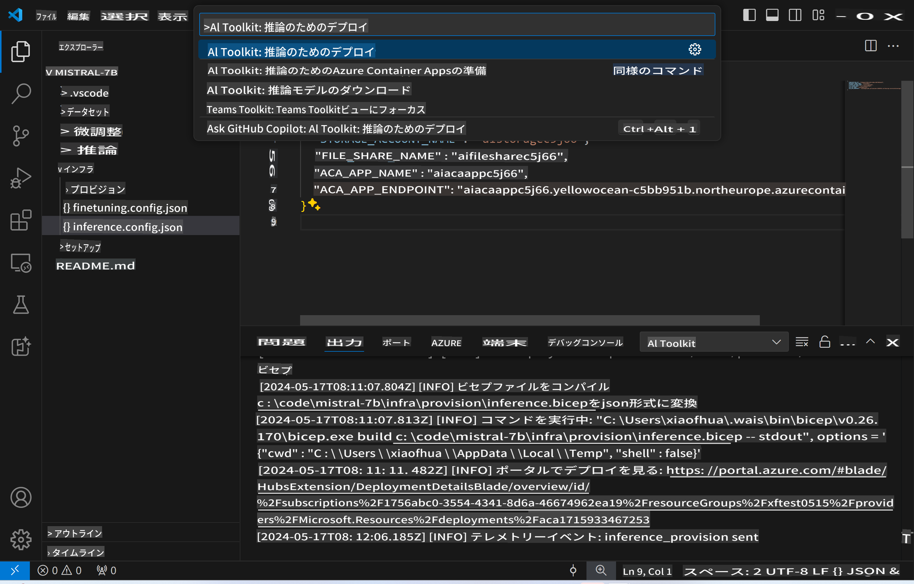
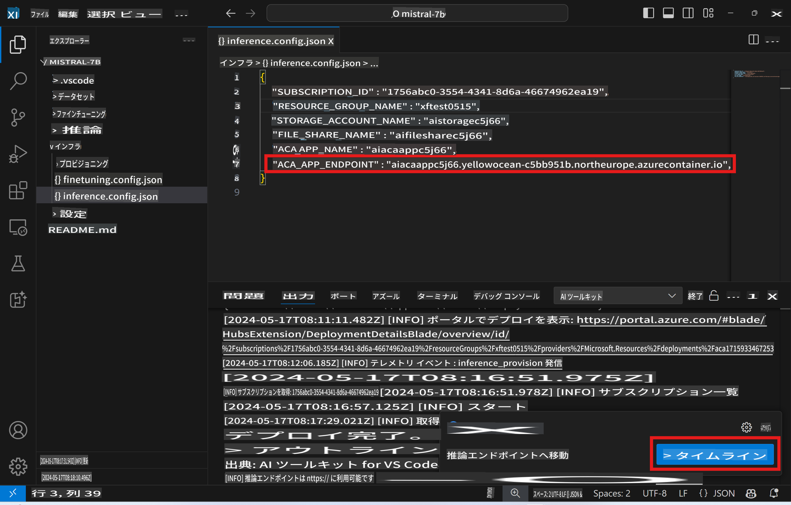

# 微調整モデルを使ったリモート推論

リモート環境でアダプタのトレーニングが完了したら、簡単なGradioアプリケーションを使ってモデルと対話できます。


### Azureリソースのプロビジョニング
リモート推論用のAzureリソースをセットアップするには、コマンドパレットから `AI Toolkit: Provision Azure Container Apps for inference` を実行します。このセットアップ中に、Azureのサブスクリプションとリソースグループを選択するよう求められます。  

   
デフォルトでは、推論用のサブスクリプションとリソースグループは微調整に使用したものと一致するはずです。推論は同じAzure Container App Environmentを使用し、微調整ステップで生成されたAzure Filesに保存されているモデルとモデルアダプタにアクセスします。

## AI Toolkitの使用方法

### 推論のデプロイ  
推論コードを修正したり、推論モデルをリロードしたい場合は、`AI Toolkit: Deploy for inference` コマンドを実行してください。これにより、最新のコードがACAと同期され、レプリカが再起動されます。  



デプロイが正常に完了すると、このエンドポイントを使用してモデルの評価が可能になります。

### 推論APIへのアクセス

VSCodeの通知に表示される "*Go to Inference Endpoint*" ボタンをクリックして推論APIにアクセスできます。または、`./infra/inference.config.json` の `ACA_APP_ENDPOINT` にウェブAPIエンドポイントが記載されていますし、出力パネルにも表示されます。



> **Note:** 推論エンドポイントが完全に動作するまでに数分かかる場合があります。

## テンプレートに含まれる推論コンポーネント
 
| フォルダ | 内容 |
| ------ |--------- |
| `infra` | リモート操作に必要なすべての設定が含まれています。 |
| `infra/provision/inference.parameters.json` | Azureリソースのプロビジョニングに使用するbicepテンプレートのパラメータが含まれています。 |
| `infra/provision/inference.bicep` | Azureリソースのプロビジョニング用テンプレートが含まれています。 |
| `infra/inference.config.json` | `AI Toolkit: Provision Azure Container Apps for inference` コマンドによって生成される設定ファイル。他のリモートコマンドパレットの入力として使用されます。 |

### AI Toolkitを使用したAzureリソースのプロビジョニング設定
[AI Toolkit](https://marketplace.visualstudio.com/items?itemName=ms-windows-ai-studio.windows-ai-studio) を設定し、`Provision Azure Container Apps for inference` コマンドを実行します。

設定パラメータは `./infra/provision/inference.parameters.json` ファイルにあります。詳細は以下の通りです：
| パラメータ | 説明 |
| --------- |------------ |
| `defaultCommands` | Web APIを起動するためのコマンドです。 |
| `maximumInstanceCount` | GPUインスタンスの最大容量を設定するパラメータです。 |
| `location` | Azureリソースがプロビジョニングされる場所です。デフォルト値は選択されたリソースグループの場所と同じです。 |
| `storageAccountName`, `fileShareName` `acaEnvironmentName`, `acaEnvironmentStorageName`, `acaAppName`,  `acaLogAnalyticsName` | これらのパラメータはAzureリソースの名前を指定するために使用されます。デフォルトでは、微調整リソースの名前と同じになります。新しい未使用のリソース名を入力してカスタム名のリソースを作成することも、既存のAzureリソースの名前を入力してそれを使用することもできます。詳細は [Using existing Azure Resources](../../../../md/03.Inference) セクションを参照してください。 |

### 既存のAzureリソースを使用する

デフォルトでは、推論のプロビジョニングには微調整に使用された同じAzure Container App Environment、Storage Account、Azure File Share、Azure Log Analyticsが使用されます。推論API専用のAzure Container Appが新たに作成されます。

微調整ステップでAzureリソースをカスタマイズした場合や、推論用に既存のAzureリソースを使用したい場合は、その名前を `./infra/inference.parameters.json` ファイルに指定してください。その後、コマンドパレットから `AI Toolkit: Provision Azure Container Apps for inference` コマンドを実行します。これにより、指定されたリソースが更新され、欠けているリソースが作成されます。

例えば、既存のAzureコンテナ環境がある場合、`./infra/finetuning.parameters.json` は次のようになります：

```json
{
    "$schema": "https://schema.management.azure.com/schemas/2019-04-01/deploymentParameters.json#",
    "contentVersion": "1.0.0.0",
    "parameters": {
      ...
      "acaEnvironmentName": {
        "value": "<your-aca-env-name>"
      },
      "acaEnvironmentStorageName": {
        "value": null
      },
      ...
    }
  }
```

### 手動プロビジョニング  
Azureリソースを手動で設定したい場合は、`./infra/provision` フォルダにあるbicepファイルを使用できます。AI Toolkitのコマンドパレットを使用せずにすでにAzureリソースを設定・構成している場合は、`inference.config.json` ファイルにリソース名を入力するだけで済みます。

例えば：

```json
{
  "SUBSCRIPTION_ID": "<your-subscription-id>",
  "RESOURCE_GROUP_NAME": "<your-resource-group-name>",
  "STORAGE_ACCOUNT_NAME": "<your-storage-account-name>",
  "FILE_SHARE_NAME": "<your-file-share-name>",
  "ACA_APP_NAME": "<your-aca-name>",
  "ACA_APP_ENDPOINT": "<your-aca-endpoint>"
}
```

免責事項: この翻訳はAIモデルによって元の文章から翻訳されたものであり、完璧ではないかもしれません。 出力内容を確認し、必要な修正を行ってください。