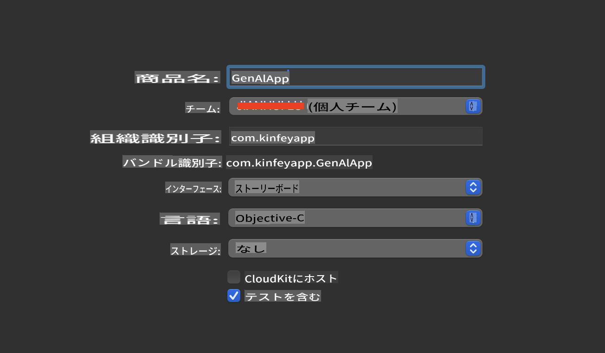
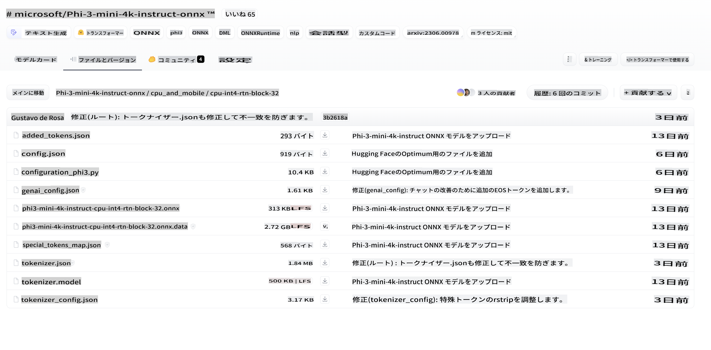
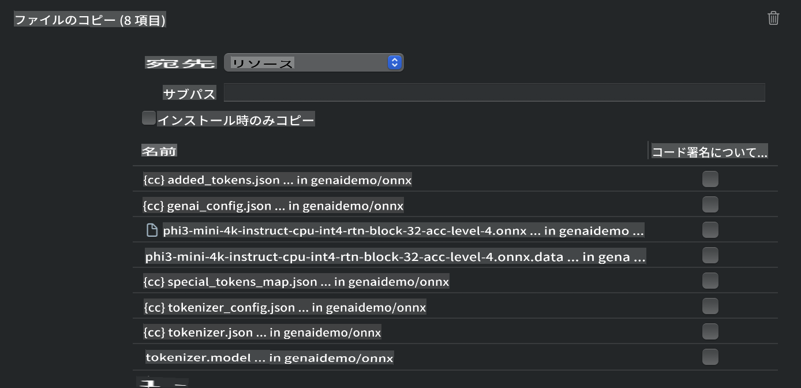
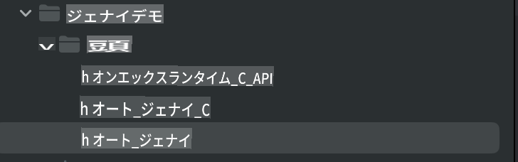
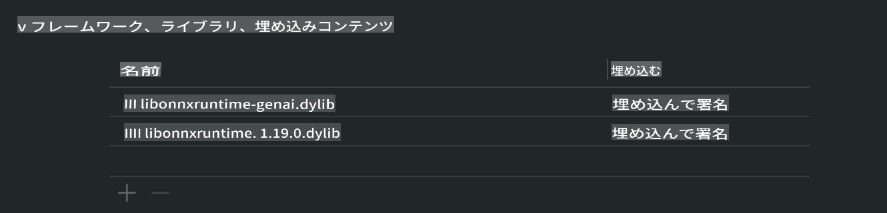
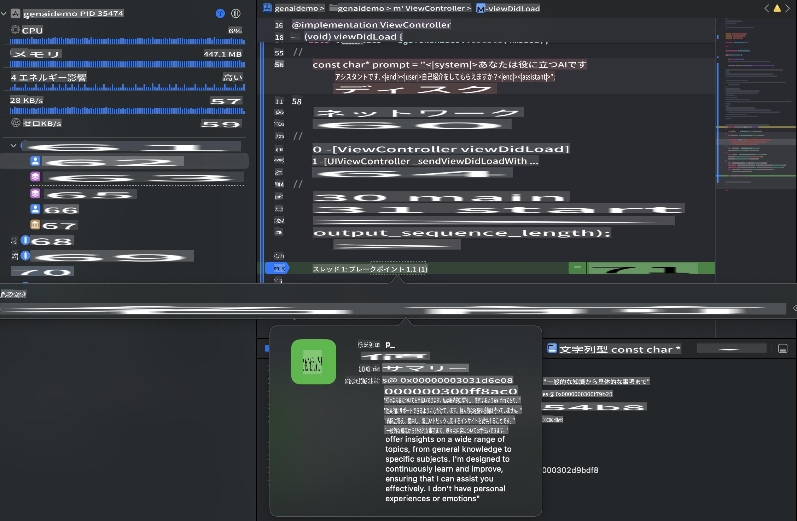

# **iOSでのPhi-3推論**

Phi-3-miniは、Microsoftが提供する新しいモデルシリーズで、大規模言語モデル（LLM）をエッジデバイスやIoTデバイスにデプロイすることができます。Phi-3-miniはiOS、Android、エッジデバイス向けに提供されており、BYOD環境での生成AIのデプロイが可能です。以下の例では、iOSでPhi-3-miniをデプロイする方法を示します。

## **1. 準備**

- **a.** macOS 14以上
- **b.** Xcode 15以上
- **c.** iOS SDK 17.x（iPhone 14 A16以上）
- **d.** Python 3.10以上をインストール（Conda推奨）
- **e.** Pythonライブラリをインストール: `python-flatbuffers`
- **f.** CMakeをインストール

### Semantic Kernelと推論

Semantic Kernelは、Azure OpenAI Service、OpenAIモデル、さらにはローカルモデルと互換性のあるアプリケーションを作成するためのフレームワークです。Semantic Kernelを介してローカルサービスにアクセスすることで、セルフホストされたPhi-3-miniモデルサーバーとの統合が簡単に行えます。

### OllamaまたはLlamaEdgeを使用した量子化モデルの呼び出し

多くのユーザーは、ローカルでモデルを実行するために量子化モデルを使用することを好みます。[Ollama](https://ollama.com)や[LlamaEdge](https://llamaedge.com)を使用すると、さまざまな量子化モデルを呼び出すことができます。

#### **Ollama**

`ollama run phi3`を直接実行するか、オフラインで設定することができます。`gguf`ファイルへのパスを含むModelfileを作成します。Phi-3-mini量子化モデルを実行するためのサンプルコード:

```gguf
FROM {Add your gguf file path}
TEMPLATE \"\"\"<|user|> .Prompt<|end|> <|assistant|>\"\"\"
PARAMETER stop <|end|>
PARAMETER num_ctx 4096
```

#### **LlamaEdge**

クラウドとエッジデバイスの両方で`gguf`を同時に使用したい場合、LlamaEdgeは優れた選択肢です。

## **2. iOS向けONNX Runtimeのコンパイル**

```bash

git clone https://github.com/microsoft/onnxruntime.git

cd onnxruntime

./build.sh --build_shared_lib --ios --skip_tests --parallel --build_dir ./build_ios --ios --apple_sysroot iphoneos --osx_arch arm64 --apple_deploy_target 17.5 --cmake_generator Xcode --config Release

cd ../

```

### **注意事項**

- **a.** コンパイルする前に、Xcodeが適切に設定されていることを確認し、ターミナルでアクティブな開発者ディレクトリとして設定します。

    ```bash
    sudo xcode-select -switch /Applications/Xcode.app/Contents/Developer
    ```

- **b.** ONNX Runtimeは異なるプラットフォーム向けにコンパイルする必要があります。iOS向けには、`arm64` or `x86_64`向けにコンパイルできます。

- **c.** 最新のiOS SDKを使用してコンパイルすることをお勧めしますが、以前のSDKとの互換性が必要な場合は古いバージョンを使用することもできます。

## **3. iOS向けONNX Runtimeを使用した生成AIのコンパイル**

> **Note:** 生成AIとONNX Runtimeの組み合わせはプレビュー段階にあるため、変更がある可能性があります。

```bash

git clone https://github.com/microsoft/onnxruntime-genai
 
cd onnxruntime-genai
 
mkdir ort
 
cd ort
 
mkdir include
 
mkdir lib
 
cd ../
 
cp ../onnxruntime/include/onnxruntime/core/session/onnxruntime_c_api.h ort/include
 
cp ../onnxruntime/build_ios/Release/Release-iphoneos/libonnxruntime*.dylib* ort/lib
 
export OPENCV_SKIP_XCODEBUILD_FORCE_TRYCOMPILE_DEBUG=1
 
python3 build.py --parallel --build_dir ./build_ios --ios --ios_sysroot iphoneos --ios_arch arm64 --ios_deployment_target 17.5 --cmake_generator Xcode --cmake_extra_defines CMAKE_XCODE_ATTRIBUTE_CODE_SIGNING_ALLOWED=NO

```

## **4. Xcodeでアプリケーションを作成**

Objective-Cをアプリ開発方法として選びました。これは、ONNX Runtime C++ APIを使用する場合、Objective-Cがより適しているためです。もちろん、Swiftブリッジングを通じて関連する呼び出しを完了することも可能です。



## **5. ONNX量子化INT4モデルをアプリケーションプロジェクトにコピー**

まず、ONNX形式のINT4量子化モデルをダウンロードして、プロジェクトのResourcesディレクトリに追加する必要があります。



ダウンロード後、XcodeのプロジェクトのResourcesディレクトリに追加します。



## **6. ViewControllersにC++ APIを追加**

> **注意事項:**

- **a.** プロジェクトに対応するC++ヘッダーファイルを追加します。

  

- **b.** `onnxruntime-genai` dynamic library in Xcode.

  

- **c.** Use the C Samples code for testing. You can also add additional features like ChatUI for more functionality.

- **d.** Since you need to use C++ in your project, rename `ViewController.m` to `ViewController.mm`を含めて、Objective-C++サポートを有効にします。

```objc

    NSString *llmPath = [[NSBundle mainBundle] resourcePath];
    char const *modelPath = llmPath.cString;

    auto model =  OgaModel::Create(modelPath);

    auto tokenizer = OgaTokenizer::Create(*model);

    const char* prompt = "<|system|>You are a helpful AI assistant.<|end|><|user|>Can you introduce yourself?<|end|><|assistant|>";

    auto sequences = OgaSequences::Create();
    tokenizer->Encode(prompt, *sequences);

    auto params = OgaGeneratorParams::Create(*model);
    params->SetSearchOption("max_length", 100);
    params->SetInputSequences(*sequences);

    auto output_sequences = model->Generate(*params);
    const auto output_sequence_length = output_sequences->SequenceCount(0);
    const auto* output_sequence_data = output_sequences->SequenceData(0);
    auto out_string = tokenizer->Decode(output_sequence_data, output_sequence_length);
    
    auto tmp = out_string;

```

## **7. アプリケーションの実行**

セットアップが完了したら、アプリケーションを実行してPhi-3-miniモデルの推論結果を確認できます。



詳細なサンプルコードや手順については、[Phi-3 Mini Samplesリポジトリ](https://github.com/Azure-Samples/Phi-3MiniSamples/tree/main/ios)をご覧ください。

**免責事項**:
この文書は機械翻訳AIサービスを使用して翻訳されています。正確さを期しておりますが、自動翻訳には誤りや不正確さが含まれる可能性があることをご理解ください。原文が元の言語で記載された文書が信頼できる情報源と見なされるべきです。重要な情報については、専門の人間による翻訳を推奨します。本翻訳の使用に起因する誤解や誤訳について、当社は一切の責任を負いません。