# Azure AI StudioでPhi-3をファインチューニング

MicrosoftのPhi-3 Mini言語モデルをAzure AI Studioでファインチューニングする方法を探ってみましょう。ファインチューニングにより、Phi-3 Miniを特定のタスクに適応させ、さらに強力で文脈に応じたモデルにすることができます。

## 考慮事項

- **機能:** どのモデルがファインチューニング可能か？ベースモデルは何ができるのか？
- **コスト:** ファインチューニングの価格モデルはどうなっているのか？
- **カスタマイズ性:** ベースモデルをどの程度、どのように変更できるのか？
- **利便性:** ファインチューニングは実際にどのように行うのか？カスタムコードを書く必要があるのか？自分の計算リソースを持ち込む必要があるのか？
- **安全性:** ファインチューニングされたモデルには安全リスクがあることが知られているが、意図しない害を防ぐためのガードレールはあるのか？

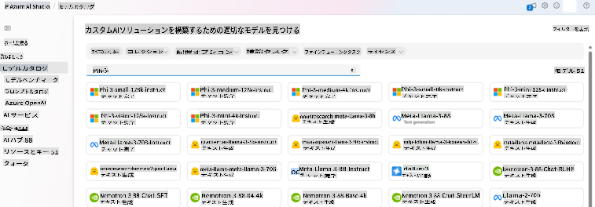

## ファインチューニングの準備

### 前提条件

> [!NOTE]
> Phi-3ファミリーモデルの場合、従量課金モデルのファインチューニングオファーは**East US 2**地域で作成されたハブでのみ利用可能です。

- Azureサブスクリプション。Azureサブスクリプションを持っていない場合は、[有料のAzureアカウント](https://azure.microsoft.com/pricing/purchase-options/pay-as-you-go)を作成してください。

- [AI Studioプロジェクト](https://ai.azure.com?WT.mc_id=aiml-138114-kinfeylo)。
- Azureロールベースのアクセス制御 (Azure RBAC) は、Azure AI Studioでの操作にアクセスを付与するために使用されます。この記事の手順を実行するには、ユーザーアカウントがリソースグループに__Azure AI Developerロール__として割り当てられている必要があります。

### サブスクリプションプロバイダの登録

サブスクリプションが`Microsoft.Network`リソースプロバイダに登録されていることを確認します。

1. [Azureポータル](https://portal.azure.com)にサインインします。
1. 左側のメニューから**サブスクリプション**を選択します。
1. 使用するサブスクリプションを選択します。
1. 左側のメニューから**AIプロジェクト設定** > **リソースプロバイダ**を選択します。
1. **Microsoft.Network**がリソースプロバイダのリストに含まれていることを確認します。含まれていない場合は追加します。

### データ準備

モデルをファインチューニングするためのトレーニングデータと検証データを準備します。トレーニングデータと検証データセットには、モデルがどのように動作するかの入力と出力の例が含まれます。

すべてのトレーニング例が推論の期待される形式に従っていることを確認してください。モデルを効果的にファインチューニングするためには、バランスの取れた多様なデータセットが必要です。

これには、データのバランスを保ち、さまざまなシナリオを含め、トレーニングデータを定期的に更新して現実世界の期待に合わせることが含まれ、最終的にはより正確でバランスの取れたモデルの応答が得られます。

異なるモデルタイプは異なる形式のトレーニングデータを必要とします。

### チャットコンプリーション

使用するトレーニングデータと検証データは**JSON Lines (JSONL) ドキュメント**としてフォーマットされている必要があります。`Phi-3-mini-128k-instruct`のファインチューニングデータセットは、チャットコンプリーションAPIで使用される会話形式でフォーマットされている必要があります。

### ファイル形式の例

```json
    {"messages": [{"role": "system", "content": "あなたはXboxカスタマーサポートエージェントで、主な目標はユーザーがXboxデバイスで経験している問題を解決することです。あなたはフレンドリーで簡潔です。質問に対して事実に基づいた回答のみを提供し、Xboxに関連しない回答は提供しません。"}, {"role": "user", "content": "XboxはPlayStationより良いですか？"}, {"role": "assistant", "content": "申し訳ありませんが、個人的な意見を提供することはできません。私の主な仕事は、Xboxデバイスに関連する問題を解決することです。Xboxに関連する問題はありますか？"}]}
    {"messages": [{"role": "system", "content": "あなたはXboxカスタマーサポートエージェントで、主な目標はユーザーがXboxデバイスで経験している問題を解決することです。あなたはフレンドリーで簡潔です。質問に対して事実に基づいた回答のみを提供し、Xboxに関連しない回答は提供しません。"}, {"role": "user", "content": "PCゲームをXboxでプレイできますか？"}, {"role": "assistant", "content": "XboxコンソールはPCゲームをネイティブにサポートしていませんが、多くのXboxゲームをプレイすることができ、その多くはPCでも利用可能です。Xboxデバイスに対応するゲームを見つけるお手伝いをしましょうか？"}]}
    {"messages": [{"role": "system", "content": "あなたはXboxカスタマーサポートエージェントで、主な目標はユーザーがXboxデバイスで経験している問題を解決することです。あなたはフレンドリーで簡潔です。質問に対して事実に基づいた回答のみを提供し、Xboxに関連しない回答は提供しません。"}, {"role": "user", "content": "XboxをWi-Fiに接続するのに問題があります。"}, {"role": "assistant", "content": "心配いりません。Xboxのネットワーク設定を確認しましょう。Wi-Fiに接続しようとしたときに何が起こるか教えてください。"}]}
```

サポートされているファイルタイプはJSON Linesです。ファイルはデフォルトのデータストアにアップロードされ、プロジェクトで利用可能になります。

## Azure AI StudioでのPhi-3のファインチューニング

Azure AI Studioを使用すると、大規模な言語モデルを個人のデータセットに合わせて調整することができます。ファインチューニングにより、特定のタスクやアプリケーションに対してカスタマイズと最適化が可能になり、パフォーマンスの向上、コスト効率の向上、レイテンシの削減、出力の調整が実現します。

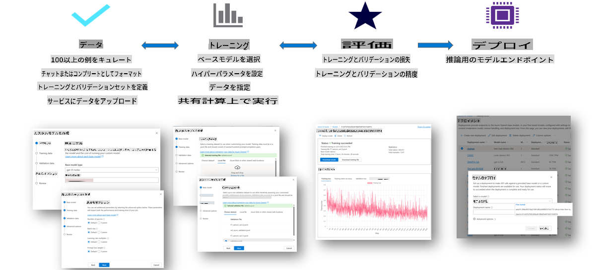

### 新しいプロジェクトを作成

1. [Azure AI Studio](https://ai.azure.com)にサインインします。

1. **+新しいプロジェクト**を選択して、Azure AI Studioで新しいプロジェクトを作成します。

    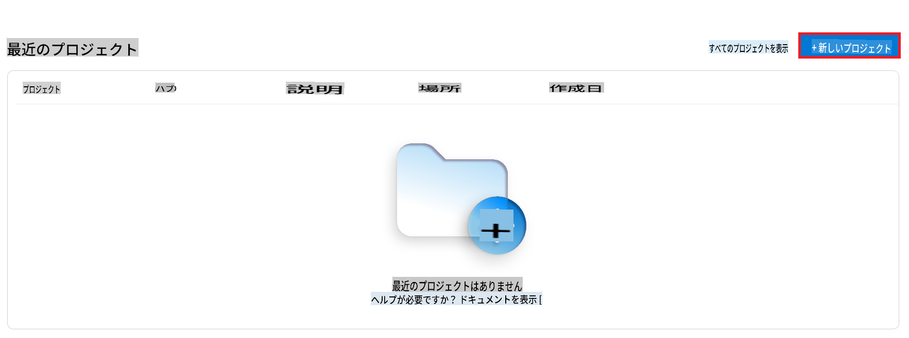

1. 次のタスクを実行します：

    - プロジェクトの**ハブ名**を入力します。これは一意の値である必要があります。
    - 使用する**ハブ**を選択します（必要に応じて新しいハブを作成します）。

    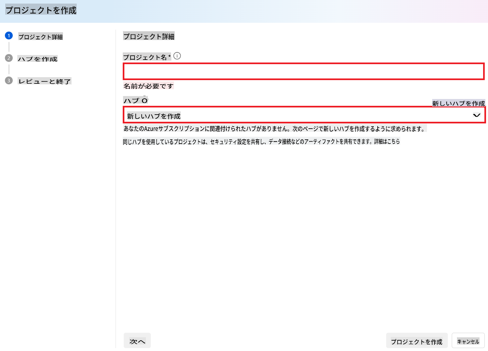

1. 新しいハブを作成するために次のタスクを実行します：

    - **ハブ名**を入力します。これは一意の値である必要があります。
    - Azureの**サブスクリプション**を選択します。
    - 使用する**リソースグループ**を選択します（必要に応じて新しいリソースグループを作成します）。
    - 使用したい**場所**を選択します。
    - 使用する**Azure AIサービスの接続**を選択します（必要に応じて新しいものを作成します）。
    - **Azure AI検索の接続**を選択して、**接続をスキップ**します。

    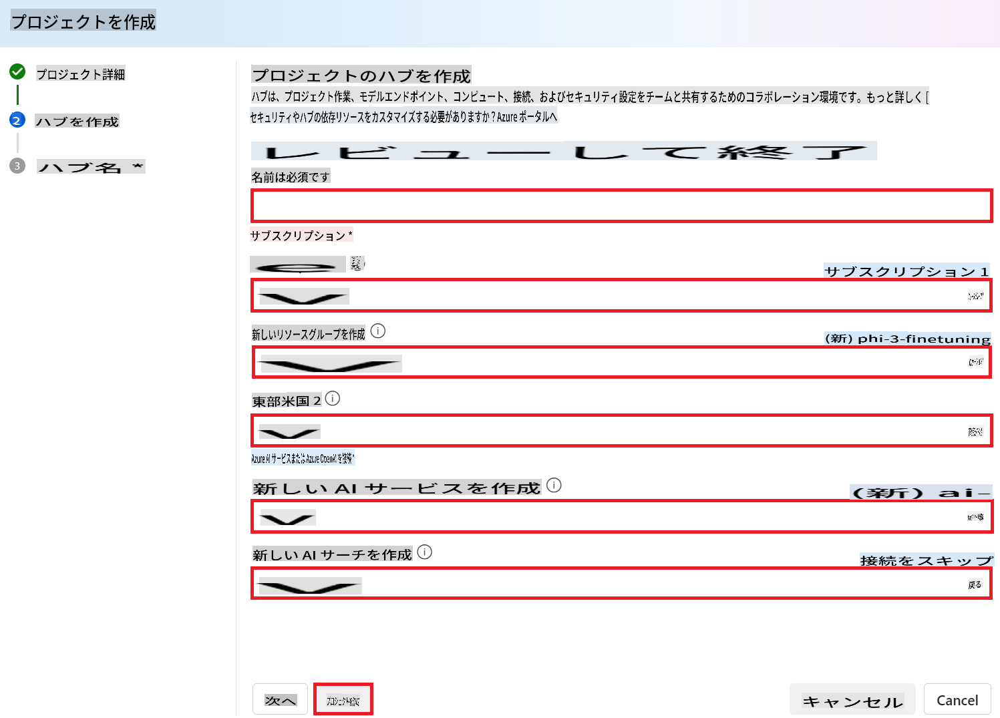

1. **次へ**を選択します。
1. **プロジェクトを作成**を選択します。

### データ準備

ファインチューニングの前に、チャット指示、質問と回答のペア、その他関連するテキストデータなど、タスクに関連するデータセットを収集または作成します。このデータをノイズを取り除き、欠損値を処理し、テキストをトークン化することでクリーンアップおよび前処理します。

### Azure AI StudioでPhi-3モデルをファインチューニング

> [!NOTE]
> Phi-3モデルのファインチューニングは、現在East US 2にあるプロジェクトでサポートされています。

1. 左側のタブから**モデルカタログ**を選択します。

1. **検索バー**に*phi-3*と入力し、使用したいphi-3モデルを選択します。

    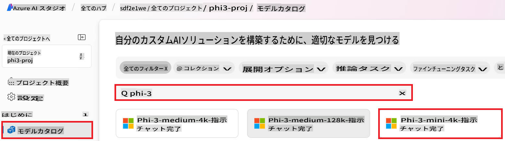

1. **ファインチューニング**を選択します。

    

1. **ファインチューニングされたモデル名**を入力します。

    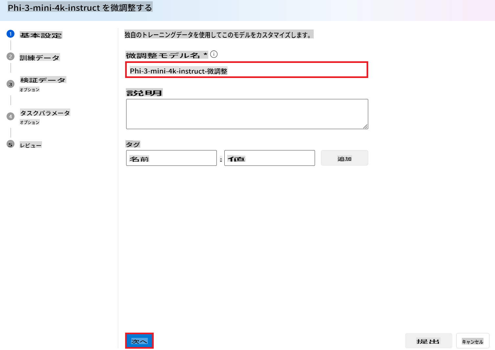

1. **次へ**を選択します。

1. 次のタスクを実行します：

    - **タスクタイプ**を**チャットコンプリーション**に選択します。
    - 使用したい**トレーニングデータ**を選択します。Azure AI Studioのデータからアップロードするか、ローカル環境からアップロードできます。

    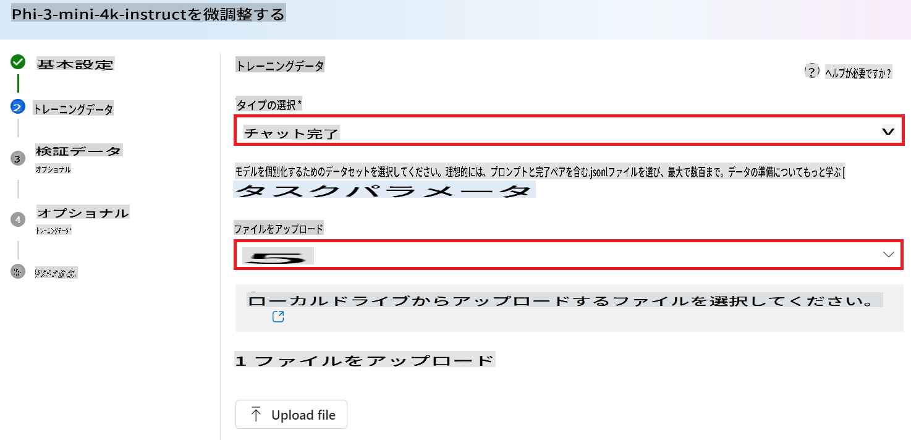

1. **次へ**を選択します。

1. 使用したい**検証データ**をアップロードします。または、**トレーニングデータの自動分割**を選択できます。

    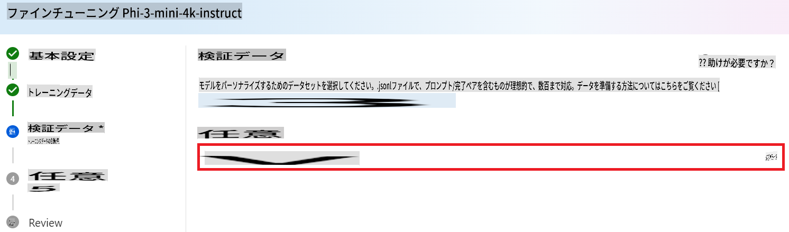

1. **次へ**を選択します。

1. 次のタスクを実行します：

    - 使用したい**バッチサイズの乗数**を選択します。
    - 使用したい**学習率**を選択します。
    - 使用したい**エポック**を選択します。

    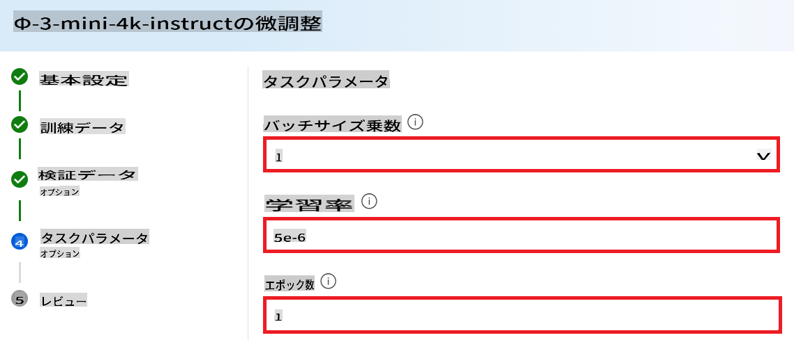

1. **送信**を選択して、ファインチューニングプロセスを開始します。

    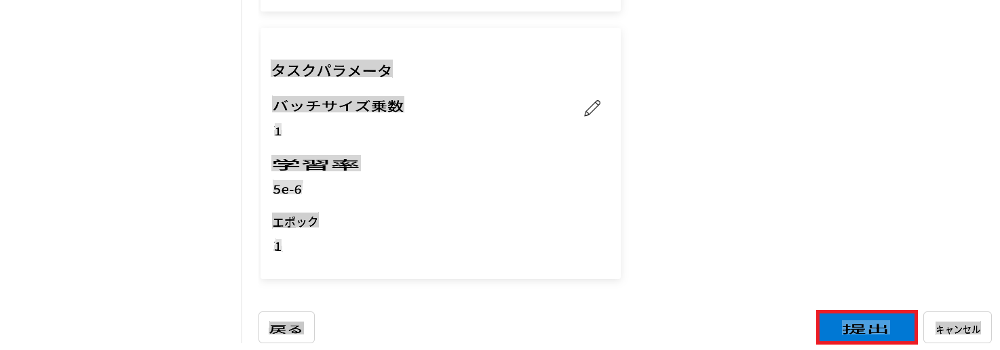


1. モデルのファインチューニングが完了すると、ステータスが**完了**として表示されます。これでモデルをデプロイし、プレイグラウンドやプロンプトフローで使用することができます。詳細については、[Azure AI StudioでのPhi-3ファミリーの小規模言語モデルのデプロイ方法](https://learn.microsoft.com/azure/ai-studio/how-to/deploy-models-phi-3?tabs=phi-3-5&pivots=programming-language-python)を参照してください。

    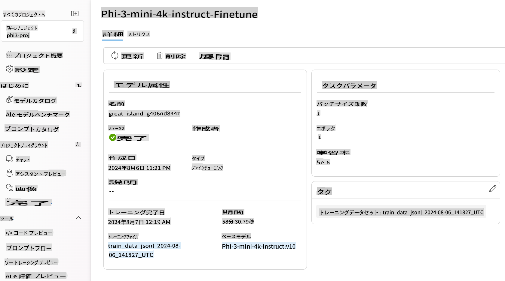

> [!NOTE]
> Phi-3のファインチューニングに関する詳細な情報については、[Azure AI StudioでのPhi-3モデルのファインチューニング](https://learn.microsoft.com/azure/ai-studio/how-to/fine-tune-phi-3?tabs=phi-3-mini)を参照してください。

## ファインチューニングされたモデルのクリーンアップ

ファインチューニングされたモデルは、[Azure AI Studio](https://ai.azure.com)のファインチューニングモデルリストやモデル詳細ページから削除できます。ファインチューニングページから削除するファインチューニングされたモデルを選択し、削除ボタンを選択して削除します。

> [!NOTE]
> 既存のデプロイメントがある場合、カスタムモデルを削除することはできません。まずモデルデプロイメントを削除してからカスタムモデルを削除してください。

## コストとクォータ

### サービスとしてファインチューニングされたPhi-3モデルのコストとクォータの考慮事項

サービスとしてファインチューニングされたPhiモデルはMicrosoftによって提供され、Azure AI Studioと統合されています。価格は、モデルを[デプロイ](https://learn.microsoft.com/azure/ai-studio/how-to/deploy-models-phi-3?tabs=phi-3-5&pivots=programming-language-python)またはファインチューニングする際に、デプロイメントウィザードの価格と条件タブで確認できます。

## コンテンツフィルタリング

従量課金制のサービスとしてデプロイされたモデルは、Azure AI Content Safetyによって保護されています。リアルタイムエンドポイントにデプロイする際、この機能をオプトアウトすることができます。Azure AI Content Safetyが有効な場合、プロンプトとコンプリーションの両方が有害なコンテンツの出力を検出および防止するための分類モデルのアンサンブルを通過します。コンテンツフィルタリングシステムは、入力プロンプトと出力コンプリーションの両方における特定のカテゴリーの潜在的に有害なコンテンツを検出し、対応します。詳細については、[Azure AI Content Safety](https://learn.microsoft.com/azure/ai-studio/concepts/content-filtering)を参照してください。

**ファインチューニングの設定**

ハイパーパラメータ: 学習率、バッチサイズ、トレーニングエポック数などのハイパーパラメータを定義します。

**損失関数**

タスクに適した損失関数（例：クロスエントロピー）を選択します。

**オプティマイザ**

トレーニング中の勾配更新のためにオプティマイザ（例：Adam）を選択します。

**ファインチューニングプロセス**

- 事前学習モデルのロード: Phi-3 Miniのチェックポイントをロードします。
- カスタムレイヤーの追加: タスクに特化したレイヤー（例：チャット指示のための分類ヘッド）を追加します。

**モデルのトレーニング**
準備したデータセットを使用してモデルをファインチューニングします。トレーニングの進行状況を監視し、必要に応じてハイパーパラメータを調整します。

**評価と検証**

検証セット: データをトレーニングセットと検証セットに分割します。

**パフォーマンスの評価**

精度、F1スコア、パープレキシティなどの指標を使用してモデルのパフォーマンスを評価します。

## ファインチューニングされたモデルの保存

**チェックポイント**
将来の使用のためにファインチューニングされたモデルのチェックポイントを保存します。

## デプロイ

- Webサービスとしてデプロイ: ファインチューニングされたモデルをAzure AI StudioでWebサービスとしてデプロイします。
- エンドポイントのテスト: デプロイされたエンドポイントにテストクエリを送信して、その機能を確認します。

## 繰り返しと改善

繰り返し: パフォーマンスが満足できない場合、ハイパーパラメータを調整したり、データを追加したり、追加のエポックでファインチューニングを行うことで改善します。

## モニタリングと改良

モデルの動作を継続的に監視し、必要に応じて改良します。

## カスタマイズと拡張

カスタムタスク: Phi-3 Miniはチャット指示以外のさまざまなタスクにファインチューニングすることができます。他のユースケースも探ってみましょう！
実験: パフォーマンスを向上させるために、異なるアーキテクチャ、レイヤーの組み合わせ、技術を試してみましょう。

> [!NOTE]
> ファインチューニングは反復的なプロセスです。実験し、学び、モデルを適応させて、特定のタスクに最適な結果を達成しましょう！

免責事項: 翻訳はAIモデルによって原文から翻訳されたものであり、完璧ではない可能性があります。
出力を確認し、必要な修正を行ってください。