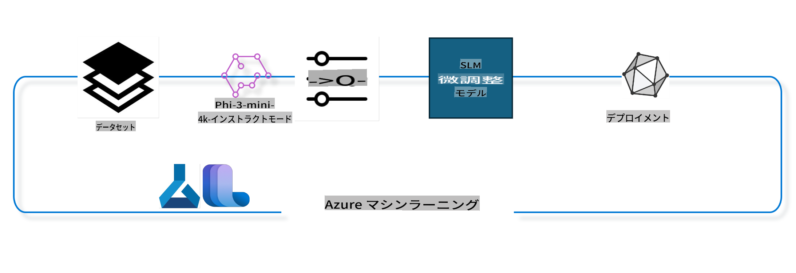

## Azure ML システムレジストリからチャット補完コンポーネントを使ってモデルを微調整する方法

この例では、ultrachat_200k データセットを使用して、2人の会話を完了するための Phi-3-mini-4k-instruct モデルの微調整を行います。



この例では、Azure ML SDK と Python を使用して微調整を行い、その後微調整されたモデルをオンラインエンドポイントにデプロイしてリアルタイム推論を行う方法を紹介します。

### トレーニングデータ

ultrachat_200k データセットを使用します。これは、最先端の 7b チャットモデルである Zephyr-7B-β をトレーニングするために使用された、UltraChat データセットの厳選されたバージョンです。

### モデル

Phi-3-mini-4k-instruct モデルを使用して、ユーザーがチャット補完タスク用にモデルを微調整する方法を示します。特定のモデルカードからこのノートブックを開いた場合は、特定のモデル名を置き換えることを忘れないでください。

### タスク

- 微調整するモデルを選ぶ。
- トレーニングデータを選んで調べる。
- 微調整ジョブを設定する。
- 微調整ジョブを実行する。
- トレーニングと評価のメトリクスを確認する。
- 微調整されたモデルを登録する。
- 微調整されたモデルをリアルタイム推論のためにデプロイする。
- リソースをクリーンアップする。

## 1. 前提条件のセットアップ

- 依存関係をインストールする
- AzureML ワークスペースに接続する。詳細は SDK 認証のセットアップを参照してください。以下の <WORKSPACE_NAME>, <RESOURCE_GROUP>, <SUBSCRIPTION_ID> を置き換えます。
- AzureML システムレジストリに接続する
- オプションの実験名を設定する
- コンピュートを確認または作成する

> [!NOTE]
> 単一の GPU ノードには複数の GPU カードがある場合があります。例えば、Standard_NC24rs_v3 の1ノードには4つの NVIDIA V100 GPU があり、Standard_NC12s_v3 には2つの NVIDIA V100 GPU があります。この情報はドキュメントを参照してください。ノードあたりの GPU カード数は以下の param gpus_per_node で設定します。この値を正しく設定することで、ノード内のすべての GPU を利用できます。推奨される GPU コンピュート SKU はここおよびここで確認できます。

### Python ライブラリ

以下のセルを実行して依存関係をインストールします。新しい環境で実行する場合、これは必須のステップです。

```bash
pip install azure-ai-ml
pip install azure-identity
pip install datasets==2.9.0
pip install mlflow
pip install azureml-mlflow
```

### Azure ML との対話

1. この Python スクリプトは、Azure Machine Learning (Azure ML) サービスと対話するために使用されます。以下はその概要です：

    - azure.ai.ml、azure.identity、および azure.ai.ml.entities パッケージから必要なモジュールをインポートします。また、time モジュールもインポートします。

    - DefaultAzureCredential() を使用して認証を試みます。これは、Azure クラウドで実行されるアプリケーションの開発を迅速に開始するための簡略化された認証体験を提供します。これが失敗した場合、InteractiveBrowserCredential() にフォールバックし、インタラクティブなログインプロンプトを提供します。

    - from_config メソッドを使用して、デフォルトの設定ファイル (config.json) から設定を読み込むことで、MLClient インスタンスの作成を試みます。これが失敗した場合、subscription_id、resource_group_name、および workspace_name を手動で提供して MLClient インスタンスを作成します。

    - "azureml" という名前の Azure ML レジストリ用に別の MLClient インスタンスを作成します。このレジストリには、モデル、微調整パイプライン、および環境が格納されています。

    - experiment_name を "chat_completion_Phi-3-mini-4k-instruct" に設定します。

    - 現在の時間（エポックからの秒数を浮動小数点数として）を整数に変換し、次に文字列に変換することで一意のタイムスタンプを生成します。このタイムスタンプは、一意の名前やバージョンを作成するために使用できます。

    ```python
    # Import necessary modules from Azure ML and Azure Identity
    from azure.ai.ml import MLClient
    from azure.identity import (
        DefaultAzureCredential,
        InteractiveBrowserCredential,
    )
    from azure.ai.ml.entities import AmlCompute
    import time  # Import time module
    
    # Try to authenticate using DefaultAzureCredential
    try:
        credential = DefaultAzureCredential()
        credential.get_token("https://management.azure.com/.default")
    except Exception as ex:  # If DefaultAzureCredential fails, use InteractiveBrowserCredential
        credential = InteractiveBrowserCredential()
    
    # Try to create an MLClient instance using the default config file
    try:
        workspace_ml_client = MLClient.from_config(credential=credential)
    except:  # If that fails, create an MLClient instance by manually providing the details
        workspace_ml_client = MLClient(
            credential,
            subscription_id="<SUBSCRIPTION_ID>",
            resource_group_name="<RESOURCE_GROUP>",
            workspace_name="<WORKSPACE_NAME>",
        )
    
    # Create another MLClient instance for the Azure ML registry named "azureml"
    # This registry is where models, fine-tuning pipelines, and environments are stored
    registry_ml_client = MLClient(credential, registry_name="azureml")
    
    # Set the experiment name
    experiment_name = "chat_completion_Phi-3-mini-4k-instruct"
    
    # Generate a unique timestamp that can be used for names and versions that need to be unique
    timestamp = str(int(time.time()))
    ```

## 2. 微調整する基盤モデルを選ぶ

1. Phi-3-mini-4k-instruct は 3.8B パラメータを持つ、最先端の軽量オープンモデルで、Phi-2 のデータセットに基づいて構築されています。このモデルは Phi-3 モデルファミリーに属し、Mini バージョンは 4K と 128K の 2 つのバリアントがあり、サポートできるコンテキストの長さ（トークン単位）が異なります。このモデルを使用するためには、特定の目的に合わせてモデルを微調整する必要があります。AzureML Studio のモデルカタログでチャット補完タスクをフィルタリングしてこれらのモデルを閲覧できます。この例では Phi-3-mini-4k-instruct モデルを使用します。異なるモデル用にこのノートブックを開いた場合は、モデル名とバージョンを適宜置き換えてください。

    > [!NOTE]
    > モデルの model id プロパティ。これは微調整ジョブの入力として渡されます。これはまた、AzureML Studio モデルカタログのモデル詳細ページのアセット ID フィールドとしても利用できます。

2. この Python スクリプトは、Azure Machine Learning (Azure ML) サービスと対話しています。以下はその概要です：

    - model_name を "Phi-3-mini-4k-instruct" に設定します。

    - registry_ml_client オブジェクトの models プロパティの get メソッドを使用して、指定された名前の最新バージョンのモデルを Azure ML レジストリから取得します。get メソッドは 2 つの引数を取ります：モデルの名前と、最新バージョンのモデルを取得することを指定するラベルです。

    - 微調整に使用するモデルの名前、バージョン、および id をコンソールに表示するメッセージを出力します。format メソッドを使用して、モデルの名前、バージョン、および id をメッセージに挿入します。モデルの名前、バージョン、および id は foundation_model オブジェクトのプロパティとしてアクセスされます。

    ```python
    # Set the model name
    model_name = "Phi-3-mini-4k-instruct"
    
    # Get the latest version of the model from the Azure ML registry
    foundation_model = registry_ml_client.models.get(model_name, label="latest")
    
    # Print the model name, version, and id
    # This information is useful for tracking and debugging
    print(
        "\n\nUsing model name: {0}, version: {1}, id: {2} for fine tuning".format(
            foundation_model.name, foundation_model.version, foundation_model.id
        )
    )
    ```

## 3. ジョブで使用するコンピュートを作成する

微調整ジョブは GPU コンピュートでのみ動作します。コンピュートのサイズはモデルの大きさに依存し、ほとんどの場合、ジョブに適したコンピュートを特定するのは難しいです。このセルでは、ジョブに適したコンピュートを選択するためのガイドを提供します。

> [!NOTE]
> 以下にリストされているコンピュートは、最適化された構成で動作します。構成を変更すると Cuda Out Of Memory エラーが発生する可能性があります。その場合は、より大きなコンピュートサイズにアップグレードすることを試みてください。

> [!NOTE]
> 以下の compute_cluster_size を選択する際、コンピュートがリソースグループ内で利用可能であることを確認してください。特定のコンピュートが利用できない場合、コンピュートリソースへのアクセスをリクエストすることができます。

### 微調整サポートの確認

1. この Python スクリプトは、Azure Machine Learning (Azure ML) モデルと対話しています。以下はその概要です：

    - ast モジュールをインポートします。これは Python の抽象構文木を処理するための関数を提供します。

    - foundation_model オブジェクト（Azure ML 内のモデルを表す）が finetune_compute_allow_list というタグを持っているかどうかを確認します。Azure ML のタグは、モデルをフィルタリングおよびソートするために使用できるキーと値のペアです。

    - finetune_compute_allow_list タグが存在する場合、ast.literal_eval 関数を使用してタグの値（文字列）を安全に Python リストに解析します。このリストは computes_allow_list 変数に割り当てられます。その後、リストからコンピュートを作成するように指示するメッセージを表示します。

    - finetune_compute_allow_list タグが存在しない場合、computes_allow_list を None に設定し、finetune_compute_allow_list タグがモデルのタグの一部ではないことを示すメッセージを表示します。

    - 要約すると、このスクリプトはモデルのメタデータ内の特定のタグを確認し、存在する場合はタグの値をリストに変換し、ユーザーにフィードバックを提供しています。

    ```python
    # Import the ast module, which provides functions to process trees of the Python abstract syntax grammar
    import ast
    
    # Check if the 'finetune_compute_allow_list' tag is present in the model's tags
    if "finetune_compute_allow_list" in foundation_model.tags:
        # If the tag is present, use ast.literal_eval to safely parse the tag's value (a string) into a Python list
        computes_allow_list = ast.literal_eval(
            foundation_model.tags["finetune_compute_allow_list"]
        )  # convert string to python list
        # Print a message indicating that a compute should be created from the list
        print(f"Please create a compute from the above list - {computes_allow_list}")
    else:
        # If the tag is not present, set computes_allow_list to None
        computes_allow_list = None
        # Print a message indicating that the 'finetune_compute_allow_list' tag is not part of the model's tags
        print("`finetune_compute_allow_list` is not part of model tags")
    ```

### コンピュートインスタンスの確認

1. この Python スクリプトは、Azure Machine Learning (Azure ML) サービスと対話し、コンピュートインスタンスに対していくつかのチェックを行っています。以下はその概要です：

    - compute_cluster に格納されている名前のコンピュートインスタンスを Azure ML ワークスペースから取得しようとします。コンピュートインスタンスのプロビジョニング状態が "failed" の場合、ValueError を発生させます。

    - computes_allow_list が None でないことを確認します。そうでない場合、リスト内のすべてのコンピュートサイズを小文字に変換し、現在のコンピュートインスタンスのサイズがリストに含まれているかどうかを確認します。含まれていない場合、ValueError を発生させます。

    - computes_allow_list が None の場合、現在のコンピュートインスタンスのサイズがサポートされていない GPU VM サイズのリストに含まれているかどうかを確認します。含まれている場合、ValueError を発生させます。

    - ワークスペース内のすべての利用可能なコンピュートサイズのリストを取得します。その後、このリストを反復処理し、各コンピュートサイズについて、その名前が現在のコンピュートインスタンスのサイズと一致するかどうかを確認します。そうである場合、そのコンピュートサイズの GPU 数を取得し、gpu_count_found を True に設定します。

    - gpu_count_found が True である場合、コンピュートインスタンスの GPU 数を表示します。gpu_count_found が False である場合、ValueError を発生させます。

    - 要約すると、このスクリプトは Azure ML ワークスペース内のコンピュートインスタンスに対していくつかのチェックを行っており、プロビジョニング状態、許可リストまたは拒否リストに対するサイズ、GPU 数などを確認しています。
    
    ```python
    # Print the exception message
    print(e)
    # Raise a ValueError if the compute size is not available in the workspace
    raise ValueError(
        f"WARNING! Compute size {compute_cluster_size} not available in workspace"
    )
    
    # Retrieve the compute instance from the Azure ML workspace
    compute = workspace_ml_client.compute.get(compute_cluster)
    # Check if the provisioning state of the compute instance is "failed"
    if compute.provisioning_state.lower() == "failed":
        # Raise a ValueError if the provisioning state is "failed"
        raise ValueError(
            f"Provisioning failed, Compute '{compute_cluster}' is in failed state. "
            f"please try creating a different compute"
        )
    
    # Check if computes_allow_list is not None
    if computes_allow_list is not None:
        # Convert all compute sizes in computes_allow_list to lowercase
        computes_allow_list_lower_case = [x.lower() for x in computes_allow_list]
        # Check if the size of the compute instance is in computes_allow_list_lower_case
        if compute.size.lower() not in computes_allow_list_lower_case:
            # Raise a ValueError if the size of the compute instance is not in computes_allow_list_lower_case
            raise ValueError(
                f"VM size {compute.size} is not in the allow-listed computes for finetuning"
            )
    else:
        # Define a list of unsupported GPU VM sizes
        unsupported_gpu_vm_list = [
            "standard_nc6",
            "standard_nc12",
            "standard_nc24",
            "standard_nc24r",
        ]
        # Check if the size of the compute instance is in unsupported_gpu_vm_list
        if compute.size.lower() in unsupported_gpu_vm_list:
            # Raise a ValueError if the size of the compute instance is in unsupported_gpu_vm_list
            raise ValueError(
                f"VM size {compute.size} is currently not supported for finetuning"
            )
    
    # Initialize a flag to check if the number of GPUs in the compute instance has been found
    gpu_count_found = False
    # Retrieve a list of all available compute sizes in the workspace
    workspace_compute_sku_list = workspace_ml_client.compute.list_sizes()
    available_sku_sizes = []
    # Iterate over the list of available compute sizes
    for compute_sku in workspace_compute_sku_list:
        available_sku_sizes.append(compute_sku.name)
        # Check if the name of the compute size matches the size of the compute instance
        if compute_sku.name.lower() == compute.size.lower():
            # If it does, retrieve the number of GPUs for that compute size and set gpu_count_found to True
            gpus_per_node = compute_sku.gpus
            gpu_count_found = True
    # If gpu_count_found is True, print the number of GPUs in the compute instance
    if gpu_count_found:
        print(f"Number of GPU's in compute {compute.size}: {gpus_per_node}")
    else:
        # If gpu_count_found is False, raise a ValueError
        raise ValueError(
            f"Number of GPU's in compute {compute.size} not found. Available skus are: {available_sku_sizes}."
            f"This should not happen. Please check the selected compute cluster: {compute_cluster} and try again."
        )
    ```

## 4. モデルの微調整に使用するデータセットを選ぶ

1. ultrachat_200k データセットを使用します。このデータセットには 4 つのスプリットがあり、Supervised fine-tuning (sft) に適しています。
生成ランキング (gen)。各スプリットの例数は以下の通りです：

    ```bash
    train_sft test_sft  train_gen  test_gen
    207865  23110  256032  28304
    ```

1. 次のいくつかのセルは、微調整のための基本的なデータ準備を示しています：

### データ行の可視化

このサンプルを迅速に実行するために、すでにトリムされた行の 5% を含む train_sft、test_sft ファイルを保存します。これは微調整されたモデルの精度が低くなることを意味し、実際の使用には適していません。
download-dataset.py を使用して ultrachat_200k データセットをダウンロードし、データセットを微調整パイプラインコンポーネントの消費可能な形式に変換します。また、データセットが大きいため、ここではデータセットの一部のみを使用しています。

1. 以下のスクリプトを実行すると、データの 5% のみがダウンロードされます。この割合は dataset_split_pc パラメータを変更することで増やすことができます。

    > [!NOTE]
    > 一部の言語モデルには異なる言語コードがあり、データセットの列名もそれに応じて反映される必要があります。

1. データの例は以下のようになります。
チャット補完データセットは、次のスキーマを使用して各エントリが格納されたパーケット形式です：

    - これは JSON (JavaScript Object Notation) ドキュメントであり、データ交換フォーマットとして広く使用されています。これは実行可能なコードではなく、データを保存および転送する方法です。以下はその構造の概要です：

    - "prompt": このキーは、AI アシスタントに対して提示されたタスクや質問を表す文字列値を持ちます。

    - "messages": このキーは、オブジェクトの配列を持ちます。各オブジェクトは、ユーザーと AI アシスタントの間の会話のメッセージを表します。各メッセージオブジェクトには 2 つのキーがあります：

    - "content": このキーは、メッセージの内容を表す文字列値を持ちます。
    - "role": このキーは、メッセージを送信したエンティティの役割を表す文字列値を持ちます。これは "user" または "assistant" のいずれかです。
    - "prompt_id": このキーは、プロンプトの一意の識別子を表す文字列値を持ちます。

1. この特定の JSON ドキュメントでは、ユーザーがディストピアの物語の主人公を作成するように AI アシスタントに依頼する会話が表現されています。アシスタントが応答し、その後ユーザーがさらに詳細を求めます。アシスタントが詳細を提供することに同意します。この会話全体が特定のプロンプト ID に関連付けられています。

    ```python
    {
        // The task or question posed to an AI assistant
        "prompt": "Create a fully-developed protagonist who is challenged to survive within a dystopian society under the rule of a tyrant. ...",
        
        // An array of objects, each representing a message in a conversation between a user and an AI assistant
        "messages":[
            {
                // The content of the user's message
                "content": "Create a fully-developed protagonist who is challenged to survive within a dystopian society under the rule of a tyrant. ...",
                // The role of the entity that sent the message
                "role": "user"
            },
            {
                // The content of the assistant's message
                "content": "Name: Ava\n\n Ava was just 16 years old when the world as she knew it came crashing down. The government had collapsed, leaving behind a chaotic and lawless society. ...",
                // The role of the entity that sent the message
                "role": "assistant"
            },
            {
                // The content of the user's message
                "content": "Wow, Ava's story is so intense and inspiring! Can you provide me with more details.  ...",
                // The role of the entity that sent the message
                "role": "user"
            }, 
            {
                // The content of the assistant's message
                "content": "Certainly! ....",
                // The role of the entity that sent the message
                "role": "assistant"
            }
        ],
        
        // A unique identifier for the prompt
        "prompt_id": "d938b65dfe31f05f80eb8572964c6673eddbd68eff3db6bd234d7f1e3b86c2af"
    }
    ```

### データのダウンロード

1. この Python スクリプトは、download-dataset.py というヘルパースクリプトを使用してデータセットをダウンロードするために使用されます。以下はその概要です：

    - os モジュールをインポートします。これは、オペレーティングシステムに依存する機能を移植可能な方法で使用するためのものです。

    - os.system 関数を使用して、特定のコマンドライン引数を指定して download-dataset.py スクリプトをシェルで実行します。引数は、ダウンロードするデータセット (HuggingFaceH4/ultrachat_200k)、ダウンロード先のディレクトリ (ultrachat_200k_dataset)、およびデータセットを分割する割合 (5) を指定します。os.system 関数は実行したコマンドの終了ステータスを返します。このステータスは exit_status 変数に格納されます。

    - exit_status が 0 でない場合を確認します。Unix 系のオペレーティングシステムでは、終了ステータスが 0 の場合はコマンドが成功したことを示し、他の番号はエラーを示します。exit_status が 0 でない場合、データセットのダウンロードにエラーがあったことを示すメッセージと共に Exception を発生させます。

    - 要約すると、このスクリプトはヘルパースクリプトを使用してデータセットをダウンロードするコマンドを実行し、コマンドが失敗した場合は例外を発生させます。
    
    ```python
    # Import the os module, which provides a way of using operating system dependent functionality
    import os
    
    # Use the os.system function to run the download-dataset.py script in the shell with specific command-line arguments
    # The arguments specify the dataset to download (HuggingFaceH4/ultrachat_200k), the directory to download it to (ultrachat_200k_dataset), and the percentage of the dataset to split (5)
    # The os.system function returns the exit status of the command it executed; this status is stored in the exit_status variable
    exit_status = os.system(
        "python ./download-dataset.py --dataset HuggingFaceH4/ultrachat_200k --download_dir ultrachat_200k_dataset --dataset_split_pc 5"
    )
    
    # Check if exit_status is not 0
    # In Unix-like operating systems, an exit status of 0 usually indicates that a command has succeeded, while any other number indicates an error
    # If exit_status is not 0, raise an Exception with a message indicating that there was an error downloading the dataset
    if exit_status != 0:
        raise Exception("Error downloading dataset")
    ```

### データをデータフレームに読み込む

1. この Python スクリプトは、JSON Lines ファイルを pandas データフレームに読み込み、最初の 5 行を表示します。以下はその概要です：

    - pandas ライブラリをインポートします。これは強力なデータ操作と分析のためのライブラリです。

    - pandas の表示オプションの最大列幅を 0 に設定します。これは、データフレームが表示されるときに各列の全文が切り捨てられずに表示されることを意味します。

    - pd.read_json 関数を使用して、ultrachat_200k_dataset ディレクトリから train_sft.jsonl ファイルをデータフレームに読み込みます。lines=True 引数は、ファイルが
トレーニングパイプラインを様々なパラメータに基づいて作成し、その表示名をプリントします。 ```python
    # Define a function to generate a display name for the training pipeline
    def get_pipeline_display_name():
        # Calculate the total batch size by multiplying the per-device batch size, the number of gradient accumulation steps, the number of GPUs per node, and the number of nodes used for fine-tuning
        batch_size = (
            int(finetune_parameters.get("per_device_train_batch_size", 1))
            * int(finetune_parameters.get("gradient_accumulation_steps", 1))
            * int(gpus_per_node)
            * int(finetune_parameters.get("num_nodes_finetune", 1))
        )
        # Retrieve the learning rate scheduler type
        scheduler = finetune_parameters.get("lr_scheduler_type", "linear")
        # Retrieve whether DeepSpeed is applied
        deepspeed = finetune_parameters.get("apply_deepspeed", "false")
        # Retrieve the DeepSpeed stage
        ds_stage = finetune_parameters.get("deepspeed_stage", "2")
        # If DeepSpeed is applied, include "ds" followed by the DeepSpeed stage in the display name; if not, include "nods"
        if deepspeed == "true":
            ds_string = f"ds{ds_stage}"
        else:
            ds_string = "nods"
        # Retrieve whether Layer-wise Relevance Propagation (LoRa) is applied
        lora = finetune_parameters.get("apply_lora", "false")
        # If LoRa is applied, include "lora" in the display name; if not, include "nolora"
        if lora == "true":
            lora_string = "lora"
        else:
            lora_string = "nolora"
        # Retrieve the limit on the number of model checkpoints to keep
        save_limit = finetune_parameters.get("save_total_limit", -1)
        # Retrieve the maximum sequence length
        seq_len = finetune_parameters.get("max_seq_length", -1)
        # Construct the display name by concatenating all these parameters, separated by hyphens
        return (
            model_name
            + "-"
            + "ultrachat"
            + "-"
            + f"bs{batch_size}"
            + "-"
            + f"{scheduler}"
            + "-"
            + ds_string
            + "-"
            + lora_string
            + f"-save_limit{save_limit}"
            + f"-seqlen{seq_len}"
        )
    
    # Call the function to generate the display name
    pipeline_display_name = get_pipeline_display_name()
    # Print the display name
    print(f"Display name used for the run: {pipeline_display_name}")
    ``` ### パイプラインの設定 このPythonスクリプトは、Azure Machine Learning SDKを使用して機械学習パイプラインを定義および設定しています。以下はその概要です: 1. Azure AI ML SDKから必要なモジュールをインポートします。 2. レジストリから "chat_completion_pipeline" という名前のパイプラインコンポーネントを取得します。 3. `@pipeline` decorator and the function `create_pipeline`. The name of the pipeline is set to `pipeline_display_name`.

1. Inside the `create_pipeline` function, it initializes the fetched pipeline component with various parameters, including the model path, compute clusters for different stages, dataset splits for training and testing, the number of GPUs to use for fine-tuning, and other fine-tuning parameters.

1. It maps the output of the fine-tuning job to the output of the pipeline job. This is done so that the fine-tuned model can be easily registered, which is required to deploy the model to an online or batch endpoint.

1. It creates an instance of the pipeline by calling the `create_pipeline` function.

1. It sets the `force_rerun` setting of the pipeline to `True`, meaning that cached results from previous jobs will not be used.

1. It sets the `continue_on_step_failure` setting of the pipeline to `False` を使用してパイプラインジョブを定義します。これは、パイプラインのいずれかのステップが失敗した場合、パイプラインが停止することを意味します。 4. 要約すると、このスクリプトはAzure Machine Learning SDKを使用してチャット完了タスクのための機械学習パイプラインを定義および設定しています。 ```python
    # Import necessary modules from the Azure AI ML SDK
    from azure.ai.ml.dsl import pipeline
    from azure.ai.ml import Input
    
    # Fetch the pipeline component named "chat_completion_pipeline" from the registry
    pipeline_component_func = registry_ml_client.components.get(
        name="chat_completion_pipeline", label="latest"
    )
    
    # Define the pipeline job using the @pipeline decorator and the function create_pipeline
    # The name of the pipeline is set to pipeline_display_name
    @pipeline(name=pipeline_display_name)
    def create_pipeline():
        # Initialize the fetched pipeline component with various parameters
        # These include the model path, compute clusters for different stages, dataset splits for training and testing, the number of GPUs to use for fine-tuning, and other fine-tuning parameters
        chat_completion_pipeline = pipeline_component_func(
            mlflow_model_path=foundation_model.id,
            compute_model_import=compute_cluster,
            compute_preprocess=compute_cluster,
            compute_finetune=compute_cluster,
            compute_model_evaluation=compute_cluster,
            # Map the dataset splits to parameters
            train_file_path=Input(
                type="uri_file", path="./ultrachat_200k_dataset/train_sft.jsonl"
            ),
            test_file_path=Input(
                type="uri_file", path="./ultrachat_200k_dataset/test_sft.jsonl"
            ),
            # Training settings
            number_of_gpu_to_use_finetuning=gpus_per_node,  # Set to the number of GPUs available in the compute
            **finetune_parameters
        )
        return {
            # Map the output of the fine tuning job to the output of pipeline job
            # This is done so that we can easily register the fine tuned model
            # Registering the model is required to deploy the model to an online or batch endpoint
            "trained_model": chat_completion_pipeline.outputs.mlflow_model_folder
        }
    
    # Create an instance of the pipeline by calling the create_pipeline function
    pipeline_object = create_pipeline()
    
    # Don't use cached results from previous jobs
    pipeline_object.settings.force_rerun = True
    
    # Set continue on step failure to False
    # This means that the pipeline will stop if any step fails
    pipeline_object.settings.continue_on_step_failure = False
    ``` ### ジョブの送信 このPythonスクリプトは、Azure Machine Learningワークスペースに機械学習パイプラインジョブを送信し、ジョブが完了するのを待ちます。以下はその概要です: - `workspace_ml_client` 内の `jobs` オブジェクトの `create_or_update` メソッドを呼び出してパイプラインジョブを送信します。実行するパイプラインは `pipeline_object` で指定され、ジョブが実行される実験は `experiment_name` で指定されます。 - 次に、`workspace_ml_client` 内の `jobs` オブジェクトの `stream` メソッドを呼び出してパイプラインジョブが完了するのを待ちます。待つジョブは `pipeline_job` オブジェクトの `name` 属性で指定されます。 - 要約すると、このスクリプトはAzure Machine Learningワークスペースに機械学習パイプラインジョブを送信し、ジョブが完了するのを待ちます。 ```python
    # Submit the pipeline job to the Azure Machine Learning workspace
    # The pipeline to be run is specified by pipeline_object
    # The experiment under which the job is run is specified by experiment_name
    pipeline_job = workspace_ml_client.jobs.create_or_update(
        pipeline_object, experiment_name=experiment_name
    )
    
    # Wait for the pipeline job to complete
    # The job to wait for is specified by the name attribute of the pipeline_job object
    workspace_ml_client.jobs.stream(pipeline_job.name)
    ``` ## 6. 微調整されたモデルをワークスペースに登録する 微調整ジョブの出力からモデルを登録します。これにより、微調整されたモデルと微調整ジョブの間の系譜が追跡されます。微調整ジョブはさらに、基盤モデル、データ、およびトレーニングコードへの系譜を追跡します。 ### MLモデルの登録 このPythonスクリプトは、Azure Machine Learningパイプラインでトレーニングされた機械学習モデルを登録します。以下はその概要です: - Azure AI ML SDKから必要なモジュールをインポートします。 - `workspace_ml_client` の `jobs` オブジェクトの `get` メソッドを呼び出し、その `outputs` 属性にアクセスして、パイプラインジョブから `trained_model` 出力が利用可能かどうかを確認します。 - パイプラインジョブの名前と出力の名前 ("trained_model") を使用してトレーニング済みモデルへのパスを構築します。 - 元のモデル名に "-ultrachat-200k" を追加し、スラッシュをハイフンに置き換えて微調整されたモデルの名前を定義します。 - モデルのパス、モデルのタイプ (MLflowモデル)、モデルの名前とバージョン、およびモデルの説明など、さまざまなパラメータを使用してModelオブジェクトを作成し、モデルを登録する準備をします。 - `workspace_ml_client` の `models` オブジェクトの `create_or_update` メソッドを呼び出し、Modelオブジェクトを引数としてモデルを登録します。 - 登録されたモデルをプリントします。 要約すると、このスクリプトはAzure Machine Learningパイプラインでトレーニングされた機械学習モデルを登録します。 ```python
    # Import necessary modules from the Azure AI ML SDK
    from azure.ai.ml.entities import Model
    from azure.ai.ml.constants import AssetTypes
    
    # Check if the `trained_model` output is available from the pipeline job
    print("pipeline job outputs: ", workspace_ml_client.jobs.get(pipeline_job.name).outputs)
    
    # Construct a path to the trained model by formatting a string with the name of the pipeline job and the name of the output ("trained_model")
    model_path_from_job = "azureml://jobs/{0}/outputs/{1}".format(
        pipeline_job.name, "trained_model"
    )
    
    # Define a name for the fine-tuned model by appending "-ultrachat-200k" to the original model name and replacing any slashes with hyphens
    finetuned_model_name = model_name + "-ultrachat-200k"
    finetuned_model_name = finetuned_model_name.replace("/", "-")
    
    print("path to register model: ", model_path_from_job)
    
    # Prepare to register the model by creating a Model object with various parameters
    # These include the path to the model, the type of the model (MLflow model), the name and version of the model, and a description of the model
    prepare_to_register_model = Model(
        path=model_path_from_job,
        type=AssetTypes.MLFLOW_MODEL,
        name=finetuned_model_name,
        version=timestamp,  # Use timestamp as version to avoid version conflict
        description=model_name + " fine tuned model for ultrachat 200k chat-completion",
    )
    
    print("prepare to register model: \n", prepare_to_register_model)
    
    # Register the model by calling the create_or_update method of the models object in the workspace_ml_client with the Model object as the argument
    registered_model = workspace_ml_client.models.create_or_update(
        prepare_to_register_model
    )
    
    # Print the registered model
    print("registered model: \n", registered_model)
    ``` ## 7. 微調整されたモデルをオンラインエンドポイントにデプロイする オンラインエンドポイントは、モデルを使用する必要があるアプリケーションと統合するために使用できる耐久性のあるREST APIを提供します。 ### エンドポイントの管理 このPythonスクリプトは、Azure Machine Learningで登録されたモデルのために管理されたオンラインエンドポイントを作成します。以下はその概要です: - Azure AI ML SDKから必要なモジュールをインポートします。 - タイムスタンプを "ultrachat-completion-" という文字列に追加して、オンラインエンドポイントの一意の名前を定義します。 - エンドポイントの名前、エンドポイントの説明、認証モード ("key") など、さまざまなパラメータを使用してManagedOnlineEndpointオブジェクトを作成し、オンラインエンドポイントを作成する準備をします。 - `workspace_ml_client` の `begin_create_or_update` メソッドを呼び出してManagedOnlineEndpointオブジェクトを引数としてオンラインエンドポイントを作成します。その後、`wait` メソッドを呼び出して作成操作が完了するのを待ちます。 要約すると、このスクリプトはAzure Machine Learningで登録されたモデルのために管理されたオンラインエンドポイントを作成します。 ```python
    # Import necessary modules from the Azure AI ML SDK
    from azure.ai.ml.entities import (
        ManagedOnlineEndpoint,
        ManagedOnlineDeployment,
        ProbeSettings,
        OnlineRequestSettings,
    )
    
    # Define a unique name for the online endpoint by appending a timestamp to the string "ultrachat-completion-"
    online_endpoint_name = "ultrachat-completion-" + timestamp
    
    # Prepare to create the online endpoint by creating a ManagedOnlineEndpoint object with various parameters
    # These include the name of the endpoint, a description of the endpoint, and the authentication mode ("key")
    endpoint = ManagedOnlineEndpoint(
        name=online_endpoint_name,
        description="Online endpoint for "
        + registered_model.name
        + ", fine tuned model for ultrachat-200k-chat-completion",
        auth_mode="key",
    )
    
    # Create the online endpoint by calling the begin_create_or_update method of the workspace_ml_client with the ManagedOnlineEndpoint object as the argument
    # Then wait for the creation operation to complete by calling the wait method
    workspace_ml_client.begin_create_or_update(endpoint).wait()
    ``` > [!NOTE]
> デプロイに対応しているSKUのリストはこちらで確認できます - [Managed online endpoints SKU list](https://learn.microsoft.com/azure/machine-learning/reference-managed-online-endpoints-vm-sku-list)

### MLモデルのデプロイ

このPythonスクリプトは、Azure Machine Learningで登録された機械学習モデルを管理されたオンラインエンドポイントにデプロイします。以下はその概要です:

- `ast` モジュールをインポートします。このモジュールは、Python抽象構文ツリーを処理するための関数を提供します。

- デプロイのインスタンスタイプを "Standard_NC6s_v3" に設定します。

- 基盤モデルに `inference_compute_allow_list` タグが存在するか確認します。存在する場合、タグの値を文字列からPythonリストに変換し、それを `inference_computes_allow_list` に割り当てます。存在しない場合、`inference_computes_allow_list` を `None` に設定します。

- 指定されたインスタンスタイプが許可リストに含まれているか確認します。含まれていない場合、ユーザーに許可リストからインスタンスタイプを選択するようにメッセージを表示します。

- デプロイを作成するために、デプロイの名前、エンドポイントの名前、モデルのID、インスタンスタイプとカウント、リブネスプローブの設定、リクエストの設定など、さまざまなパラメータを使用してManagedOnlineDeploymentオブジェクトを作成します。

- `workspace_ml_client` の `begin_create_or_update` メソッドを呼び出してManagedOnlineDeploymentオブジェクトを引数としてデプロイを作成します。その後、`wait` メソッドを呼び出して作成操作が完了するのを待ちます。

- エンドポイントのトラフィックを "demo" デプロイに100％割り当てます。

- `workspace_ml_client` の `begin_create_or_update` メソッドを呼び出してエンドポイントオブジェクトを引数としてエンドポイントを更新します。その後、`result` メソッドを呼び出して更新操作が完了するのを待ちます。

要約すると、このスクリプトはAzure Machine Learningで登録された機械学習モデルを管理されたオンラインエンドポイントにデプロイします。

```python
    # Import the ast module, which provides functions to process trees of the Python abstract syntax grammar
    import ast
    
    # Set the instance type for the deployment
    instance_type = "Standard_NC6s_v3"
    
    # Check if the `inference_compute_allow_list` tag is present in the foundation model
    if "inference_compute_allow_list" in foundation_model.tags:
        # If it is, convert the tag value from a string to a Python list and assign it to `inference_computes_allow_list`
        inference_computes_allow_list = ast.literal_eval(
            foundation_model.tags["inference_compute_allow_list"]
        )
        print(f"Please create a compute from the above list - {computes_allow_list}")
    else:
        # If it's not, set `inference_computes_allow_list` to `None`
        inference_computes_allow_list = None
        print("`inference_compute_allow_list` is not part of model tags")
    
    # Check if the specified instance type is in the allow list
    if (
        inference_computes_allow_list is not None
        and instance_type not in inference_computes_allow_list
    ):
        print(
            f"`instance_type` is not in the allow listed compute. Please select a value from {inference_computes_allow_list}"
        )
    
    # Prepare to create the deployment by creating a `ManagedOnlineDeployment` object with various parameters
    demo_deployment = ManagedOnlineDeployment(
        name="demo",
        endpoint_name=online_endpoint_name,
        model=registered_model.id,
        instance_type=instance_type,
        instance_count=1,
        liveness_probe=ProbeSettings(initial_delay=600),
        request_settings=OnlineRequestSettings(request_timeout_ms=90000),
    )
    
    # Create the deployment by calling the `begin_create_or_update` method of the `workspace_ml_client` with the `ManagedOnlineDeployment` object as the argument
    # Then wait for the creation operation to complete by calling the `wait` method
    workspace_ml_client.online_deployments.begin_create_or_update(demo_deployment).wait()
    
    # Set the traffic of the endpoint to direct 100% of the traffic to the "demo" deployment
    endpoint.traffic = {"demo": 100}
    
    # Update the endpoint by calling the `begin_create_or_update` method of the `workspace_ml_client` with the `endpoint` object as the argument
    # Then wait for the update operation to complete by calling the `result` method
    workspace_ml_client.begin_create_or_update(endpoint).result()
    ```

## 8. サンプルデータでエンドポイントをテストする

テストデータセットからいくつかのサンプルデータを取得し、オンラインエンドポイントに提出して推論を行います。その後、スコアリングされたラベルと実際のラベルを表示します。

### 結果の読み取り

このPythonスクリプトは、JSON Linesファイルをpandas DataFrameに読み込み、ランダムサンプルを取り、インデックスをリセットします。以下はその概要です:

- `./ultrachat_200k_dataset/test_gen.jsonl` ファイルをpandas DataFrameに読み込みます。ファイルはJSON Lines形式であり、各行が個別のJSONオブジェクトであるため、`read_json` 関数を `lines=True` 引数と共に使用します。

- DataFrameから1行のランダムサンプルを取得します。`sample` 関数を `n=1` 引数と共に使用して選択するランダム行の数を指定します。

- DataFrameのインデックスをリセットします。`reset_index` 関数を `drop=True` 引数と共に使用して元のインデックスを削除し、デフォルトの整数値の新しいインデックスに置き換えます。

- `head` 関数を引数 `2` と共に使用してDataFrameの最初の2行を表示します。ただし、サンプリング後のDataFrameには1行しか含まれていないため、この行だけが表示されます。

要約すると、このスクリプトはJSON Linesファイルをpandas DataFrameに読み込み、1行のランダムサンプルを取り、インデックスをリセットし、最初の行を表示します。

```python
    # Import pandas library
    import pandas as pd
    
    # Read the JSON Lines file './ultrachat_200k_dataset/test_gen.jsonl' into a pandas DataFrame
    # The 'lines=True' argument indicates that the file is in JSON Lines format, where each line is a separate JSON object
    test_df = pd.read_json("./ultrachat_200k_dataset/test_gen.jsonl", lines=True)
    
    # Take a random sample of 1 row from the DataFrame
    # The 'n=1' argument specifies the number of random rows to select
    test_df = test_df.sample(n=1)
    
    # Reset the index of the DataFrame
    # The 'drop=True' argument indicates that the original index should be dropped and replaced with a new index of default integer values
    # The 'inplace=True' argument indicates that the DataFrame should be modified in place (without creating a new object)
    test_df.reset_index(drop=True, inplace=True)
    
    # Display the first 2 rows of the DataFrame
    # However, since the DataFrame only contains one row after the sampling, this will only display that one row
    test_df.head(2)
    ```

### JSONオブジェクトの作成

このPythonスクリプトは、特定のパラメータを持つJSONオブジェクトを作成し、ファイルに保存します。以下はその概要です:

- `json` モジュールをインポートします。このモジュールは、JSONデータを操作するための関数を提供します。

- `temperature`, `top_p`, `do_sample`, `max_new_tokens` というキーと、それぞれ 0.6, 0.9, True, 200 という値を持つ辞書 `parameters` を作成します。

- もう一つの辞書 `test_json` を作成します。この辞書には `input_data` と `params` という2つのキーがあります。`input_data` の値は `input_string` と `parameters` というキーを持つもう一つの辞書です。`input_string` の値は `test_df` DataFrameの最初のメッセージを含むリストです。`parameters` の値は先ほど作成した `parameters` 辞書です。`params` の値は空の辞書です。

- `sample_score.json` という名前のファイルを開きます。

```python
    # Import the json module, which provides functions to work with JSON data
    import json
    
    # Create a dictionary `parameters` with keys and values that represent parameters for a machine learning model
    # The keys are "temperature", "top_p", "do_sample", and "max_new_tokens", and their corresponding values are 0.6, 0.9, True, and 200 respectively
    parameters = {
        "temperature": 0.6,
        "top_p": 0.9,
        "do_sample": True,
        "max_new_tokens": 200,
    }
    
    # Create another dictionary `test_json` with two keys: "input_data" and "params"
    # The value of "input_data" is another dictionary with keys "input_string" and "parameters"
    # The value of "input_string" is a list containing the first message from the `test_df` DataFrame
    # The value of "parameters" is the `parameters` dictionary created earlier
    # The value of "params" is an empty dictionary
    test_json = {
        "input_data": {
            "input_string": [test_df["messages"][0]],
            "parameters": parameters,
        },
        "params": {},
    }
    
    # Open a file named `sample_score.json` in the `./ultrachat_200k_dataset` directory in write mode
    with open("./ultrachat_200k_dataset/sample_score.json", "w") as f:
        # Write the `test_json` dictionary to the file in JSON format using the `json.dump` function
        json.dump(test_json, f)
    ```

### エンドポイントの呼び出し

このPythonスクリプトは、Azure Machine Learningのオンラインエンドポイントを呼び出してJSONファイルをスコアリングします。以下はその概要です:

- `workspace_ml_client` オブジェクトの `online_endpoints` プロパティの `invoke` メソッドを呼び出します。このメソッドはオンラインエンドポイントにリクエストを送信し、レスポンスを取得するために使用されます。

- エンドポイント名とデプロイ名を `endpoint_name` と `deployment_name` 引数で指定します。この場合、エンドポイント名は `online_endpoint_name` 変数に格納され、デプロイ名は "demo" です。

- スコアリングするJSONファイルのパスを `request_file` 引数で指定します。この場合、ファイルは `./ultrachat_200k_dataset/sample_score.json` です。

- エンドポイントからのレスポンスを `response` 変数に格納します。

- 生のレスポンスをプリントします。

要約すると、このスクリプトはAzure Machine Learningのオンラインエンドポイントを呼び出してJSONファイルをスコアリングし、レスポンスをプリントします。

```python
    # Invoke the online endpoint in Azure Machine Learning to score the `sample_score.json` file
    # The `invoke` method of the `online_endpoints` property of the `workspace_ml_client` object is used to send a request to an online endpoint and get a response
    # The `endpoint_name` argument specifies the name of the endpoint, which is stored in the `online_endpoint_name` variable
    # The `deployment_name` argument specifies the name of the deployment, which is "demo"
    # The `request_file` argument specifies the path to the JSON file to be scored, which is `./ultrachat_200k_dataset/sample_score.json`
    response = workspace_ml_client.online_endpoints.invoke(
        endpoint_name=online_endpoint_name,
        deployment_name="demo",
        request_file="./ultrachat_200k_dataset/sample_score.json",
    )
    
    # Print the raw response from the endpoint
    print("raw response: \n", response, "\n")
    ```

## 9. オンラインエンドポイントを削除する

オンラインエンドポイントを削除しないと、エンドポイントで使用されるコンピューティングの課金メーターが動作し続けるので注意してください。このPythonコードは、Azure Machine Learningでオンラインエンドポイントを削除します。以下はその概要です:

- `workspace_ml_client` オブジェクトの `online_endpoints` プロパティの `begin_delete` メソッドを呼び出します。このメソッドはオンラインエンドポイントの削除を開始するために使用されます。

- 削除するエンドポイントの名前を `name` 引数で指定します。この場合、エンドポイント名は `online_endpoint_name` 変数に格納されています。

- 削除操作が完了するのを待つために `wait` メソッドを呼び出します。これはブロッキング操作であり、削除が完了するまでスクリプトの実行を続行しません。

要約すると、このコードはAzure Machine Learningでオンラインエンドポイントの削除を開始し、操作が完了するのを待ちます。

```python
    # Delete the online endpoint in Azure Machine Learning
    # The `begin_delete` method of the `online_endpoints` property of the `workspace_ml_client` object is used to start the deletion of an online endpoint
    # The `name` argument specifies the name of the endpoint to be deleted, which is stored in the `online_endpoint_name` variable
    # The `wait` method is called to wait for the deletion operation to complete. This is a blocking operation, meaning that it will prevent the script from continuing until the deletion is finished
    workspace_ml_client.online_endpoints.begin_delete(name=online_endpoint_name).wait()
    ```

**免責事項**：
この文書は、機械ベースのAI翻訳サービスを使用して翻訳されています。正確さを期すために努めておりますが、自動翻訳には誤りや不正確さが含まれる可能性があることをご承知おきください。原文が書かれている言語の文書を権威ある情報源と見なすべきです。重要な情報については、専門の人間による翻訳をお勧めします。この翻訳の使用に起因する誤解や誤訳について、当社は責任を負いかねます。