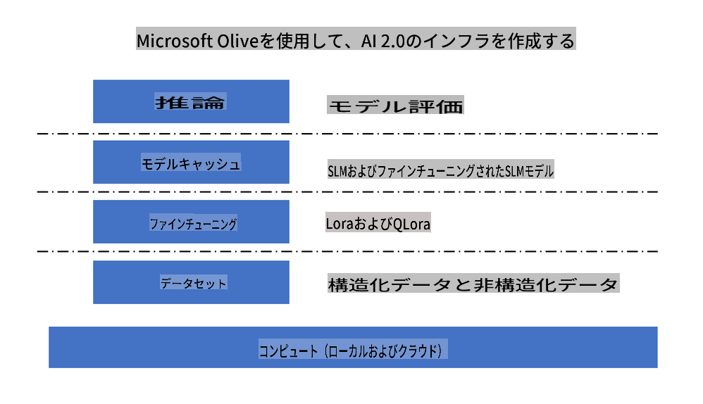
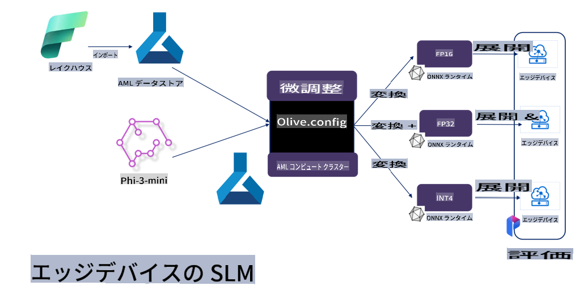

# **Microsoft Olive で Phi-3 をファインチューニングする**

[Olive](https://github.com/microsoft/OLive?WT.mc_id=aiml-138114-kinfeylo) は、モデル圧縮、最適化、およびコンパイルに関する業界トップの技術を統合した、使いやすいハードウェア対応のモデル最適化ツールです。

これは、機械学習モデルの最適化プロセスを合理化し、特定のハードウェアアーキテクチャを最大限に活用することを目的としています。

クラウドベースのアプリケーションやエッジデバイスで作業している場合でも、Olive を使用すると、モデルを簡単かつ効果的に最適化できます。

## 主な特徴:
- Olive は、目的のハードウェアターゲットに対する最適化技術を集約し、自動化します。
- すべてのシナリオに適した単一の最適化技術は存在しないため、Olive は業界の専門家が最適化の革新をプラグインできるように拡張性を提供します。

## エンジニアリング作業の削減:
- 開発者は通常、トレーニング済みモデルをデプロイするために、複数のハードウェアベンダー固有のツールチェーンを学び、利用する必要があります。
- Olive は、目的のハードウェアに対する最適化技術を自動化することで、この作業を簡素化します。

## すぐに使える E2E 最適化ソリューション:

統合された技術を組み合わせて調整することで、Olive はエンドツーエンドの最適化のための統一ソリューションを提供します。
モデルを最適化する際に、精度やレイテンシなどの制約を考慮します。

## Microsoft Olive を使用してファインチューニング

Microsoft Olive は、生成型人工知能の分野でファインチューニングや参照をカバーできる非常に使いやすいオープンソースのモデル最適化ツールです。簡単な設定を行い、オープンソースの小さな言語モデルや関連するランタイム環境（AzureML / ローカル GPU、CPU、DirectML）を使用することで、自動最適化を通じてモデルのファインチューニングや参照を完了し、クラウドまたはエッジデバイスにデプロイするための最適なモデルを見つけることができます。企業はオンプレミスおよびクラウドで独自の業界縦型モデルを構築できます。



## Microsoft Olive で Phi-3 をファインチューニングする



## Phi-3 Olive のサンプルコードと例
この例では、Olive を使用して次のことを行います:

- LoRA アダプターをファインチューニングして、フレーズを Sad、Joy、Fear、Surprise に分類します。
- アダプターの重みをベースモデルに統合します。
- モデルを最適化し、int4 に量子化します。

[サンプルコード](../../code/04.Finetuning/olive-ort-example/README.md)

### Microsoft Olive のセットアップ

Microsoft Olive のインストールは非常に簡単で、CPU、GPU、DirectML、Azure ML にもインストールできます。

```bash
pip install olive-ai
```

CPU で ONNX モデルを実行したい場合は、次のコマンドを使用できます

```bash
pip install olive-ai[cpu]
```

GPU で ONNX モデルを実行したい場合は、次のコマンドを使用できます

```python
pip install olive-ai[gpu]
```

Azure ML を使用したい場合は、次のコマンドを使用してください

```python
pip install git+https://github.com/microsoft/Olive#egg=olive-ai[azureml]
```

**注意**
OS 要件 : Ubuntu 20.04 / 22.04

### **Microsoft Olive の Config.json**

インストール後、データ、計算、トレーニング、デプロイ、およびモデル生成を含むさまざまなモデル固有の設定を Config ファイルを通じて構成できます。

**1. データ**

Microsoft Olive では、ローカルデータおよびクラウドデータでのトレーニングがサポートされており、設定で構成できます。

*ローカルデータの設定*

ファインチューニングのためにトレーニングする必要があるデータセットを簡単に設定できます。通常は json 形式で、データテンプレートと適合させます。これはモデルの要件に基づいて調整する必要があります（例：Microsoft Phi-3-mini が必要とする形式に適合させる。他のモデルを持っている場合は、他のモデルが必要とするファインチューニング形式を参照してください）

```json

    "data_configs": [
        {
            "name": "dataset_default_train",
            "type": "HuggingfaceContainer",
            "load_dataset_config": {
                "params": {
                    "data_name": "json", 
                    "data_files":"dataset/dataset-classification.json",
                    "split": "train"
                }
            },
            "pre_process_data_config": {
                "params": {
                    "dataset_type": "corpus",
                    "text_cols": [
                            "phrase",
                            "tone"
                    ],
                    "text_template": "### Text: {phrase}\n### The tone is:\n{tone}",
                    "corpus_strategy": "join",
                    "source_max_len": 2048,
                    "pad_to_max_len": false,
                    "use_attention_mask": false
                }
            }
        }
    ],
```

**クラウドデータソースの設定**

Azure AI Studio/Azure Machine Learning Service のデータストアをリンクすることで、クラウドのデータをリンクできます。Microsoft Fabric および Azure Data を通じて、さまざまなデータソースを Azure AI Studio/Azure Machine Learning Service に導入し、データのファインチューニングをサポートできます。

```json

    "data_configs": [
        {
            "name": "dataset_default_train",
            "type": "HuggingfaceContainer",
            "load_dataset_config": {
                "params": {
                    "data_name": "json", 
                    "data_files": {
                        "type": "azureml_datastore",
                        "config": {
                            "azureml_client": {
                                "subscription_id": "Your Azure Subscrition ID",
                                "resource_group": "Your Azure Resource Group",
                                "workspace_name": "Your Azure ML Workspaces name"
                            },
                            "datastore_name": "workspaceblobstore",
                            "relative_path": "Your train_data.json Azure ML Location"
                        }
                    },
                    "split": "train"
                }
            },
            "pre_process_data_config": {
                "params": {
                    "dataset_type": "corpus",
                    "text_cols": [
                            "Question",
                            "Best Answer"
                    ],
                    "text_template": "<|user|>\n{Question}<|end|>\n<|assistant|>\n{Best Answer}\n<|end|>",
                    "corpus_strategy": "join",
                    "source_max_len": 2048,
                    "pad_to_max_len": false,
                    "use_attention_mask": false
                }
            }
        }
    ],
    
```

**2. 計算設定**

ローカルで実行する場合は、ローカルデータリソースを直接使用できます。Azure AI Studio / Azure Machine Learning Service のリソースを使用する必要がある場合は、関連する Azure パラメータ、計算力の名前などを設定する必要があります。

```json

    "systems": {
        "aml": {
            "type": "AzureML",
            "config": {
                "accelerators": ["gpu"],
                "hf_token": true,
                "aml_compute": "Your Azure AI Studio / Azure Machine Learning Service Compute Name",
                "aml_docker_config": {
                    "base_image": "Your Azure AI Studio / Azure Machine Learning Service docker",
                    "conda_file_path": "conda.yaml"
                }
            }
        },
        "azure_arc": {
            "type": "AzureML",
            "config": {
                "accelerators": ["gpu"],
                "aml_compute": "Your Azure AI Studio / Azure Machine Learning Service Compute Name",
                "aml_docker_config": {
                    "base_image": "Your Azure AI Studio / Azure Machine Learning Service docker",
                    "conda_file_path": "conda.yaml"
                }
            }
        }
    },
```

***注意***

Azure AI Studio/Azure Machine Learning Service でコンテナを介して実行されるため、必要な環境を設定する必要があります。これは conda.yaml 環境で設定されます。

```yaml

name: project_environment
channels:
  - defaults
dependencies:
  - python=3.8.13
  - pip=22.3.1
  - pip:
      - einops
      - accelerate
      - azure-keyvault-secrets
      - azure-identity
      - bitsandbytes
      - datasets
      - huggingface_hub
      - peft
      - scipy
      - sentencepiece
      - torch>=2.2.0
      - transformers
      - git+https://github.com/microsoft/Olive@jiapli/mlflow_loading_fix#egg=olive-ai[gpu]
      - --extra-index-url https://aiinfra.pkgs.visualstudio.com/PublicPackages/_packaging/ORT-Nightly/pypi/simple/ 
      - ort-nightly-gpu==1.18.0.dev20240307004
      - --extra-index-url https://aiinfra.pkgs.visualstudio.com/PublicPackages/_packaging/onnxruntime-genai/pypi/simple/
      - onnxruntime-genai-cuda

    

```

**3. SLM の選択**

Hugging face から直接モデルを使用することも、Azure AI Studio / Azure Machine Learning のモデルカタログと直接組み合わせて使用するモデルを選択することもできます。以下のコード例では、Microsoft Phi-3-mini を例として使用します。

ローカルにモデルがある場合は、この方法を使用できます

```json

    "input_model":{
        "type": "PyTorchModel",
        "config": {
            "hf_config": {
                "model_name": "model-cache/microsoft/phi-3-mini",
                "task": "text-generation",
                "model_loading_args": {
                    "trust_remote_code": true
                }
            }
        }
    },
```

Azure AI Studio / Azure Machine Learning Service からモデルを使用したい場合は、この方法を使用できます

```json

    "input_model":{
        "type": "PyTorchModel",
        "config": {
            "model_path": {
                "type": "azureml_registry_model",
                "config": {
                    "name": "microsoft/Phi-3-mini-4k-instruct",
                    "registry_name": "azureml-msr",
                    "version": "11"
                }
            },
             "model_file_format": "PyTorch.MLflow",
             "hf_config": {
                "model_name": "microsoft/Phi-3-mini-4k-instruct",
                "task": "text-generation",
                "from_pretrained_args": {
                    "trust_remote_code": true
                }
            }
        }
    },
```

**注意:**
Azure AI Studio / Azure Machine Learning Service と統合する必要があるため、モデルの設定時にはバージョン番号や関連する名前を参照してください。

Azure 上のすべてのモデルは PyTorch.MLflow に設定する必要があります。

Hugging face アカウントを持ち、キーを Azure AI Studio / Azure Machine Learning のキー値にバインドする必要があります。

**4. アルゴリズム**

Microsoft Olive は Lora および QLora のファインチューニングアルゴリズムを非常によくカプセル化しています。必要なのは関連するパラメータをいくつか設定することだけです。ここでは QLora を例にとります。

```json
        "lora": {
            "type": "LoRA",
            "config": {
                "target_modules": [
                    "o_proj",
                    "qkv_proj"
                ],
                "double_quant": true,
                "lora_r": 64,
                "lora_alpha": 64,
                "lora_dropout": 0.1,
                "train_data_config": "dataset_default_train",
                "eval_dataset_size": 0.3,
                "training_args": {
                    "seed": 0,
                    "data_seed": 42,
                    "per_device_train_batch_size": 1,
                    "per_device_eval_batch_size": 1,
                    "gradient_accumulation_steps": 4,
                    "gradient_checkpointing": false,
                    "learning_rate": 0.0001,
                    "num_train_epochs": 3,
                    "max_steps": 10,
                    "logging_steps": 10,
                    "evaluation_strategy": "steps",
                    "eval_steps": 187,
                    "group_by_length": true,
                    "adam_beta2": 0.999,
                    "max_grad_norm": 0.3
                }
            }
        },
```

量子化変換を希望する場合、Microsoft Olive メインブランチはすでに onnxruntime-genai メソッドをサポートしています。必要に応じて設定できます：

1. アダプターの重みをベースモデルに統合
2. ModelBuilder によって必要な精度でモデルを onnx モデルに変換

例：量子化された INT4 に変換

```json

        "merge_adapter_weights": {
            "type": "MergeAdapterWeights"
        },
        "builder": {
            "type": "ModelBuilder",
            "config": {
                "precision": "int4"
            }
        }
```

**注意** 
- QLoRA を使用する場合、ONNXRuntime-genai の量子化変換は現在サポートされていません。

- ここで指摘しておくべき点は、上記の手順を自分のニーズに応じて設定できることです。これらの手順を完全に設定する必要はありません。ニーズに応じて、ファインチューニングせずにアルゴリズムの手順を直接使用できます。最後に、関連するエンジンを設定する必要があります。

```json

    "engine": {
        "log_severity_level": 0,
        "host": "aml",
        "target": "aml",
        "search_strategy": false,
        "execution_providers": ["CUDAExecutionProvider"],
        "cache_dir": "../model-cache/models/phi3-finetuned/cache",
        "output_dir" : "../model-cache/models/phi3-finetuned"
    }
```

**5. ファインチューニング完了**

コマンドラインで、olive-config.json のディレクトリで実行します

```bash
olive run --config olive-config.json  
```

**免責事項**：
この文書は機械ベースのAI翻訳サービスを使用して翻訳されています。正確さを期していますが、自動翻訳にはエラーや不正確さが含まれる場合があります。元の言語の文書を権威ある情報源と見なしてください。重要な情報については、専門の人間による翻訳をお勧めします。この翻訳の使用に起因する誤解や誤解釈について、当社は責任を負いません。