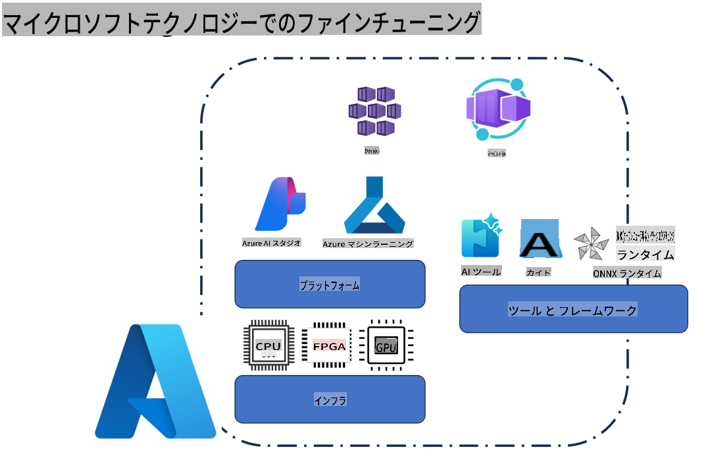
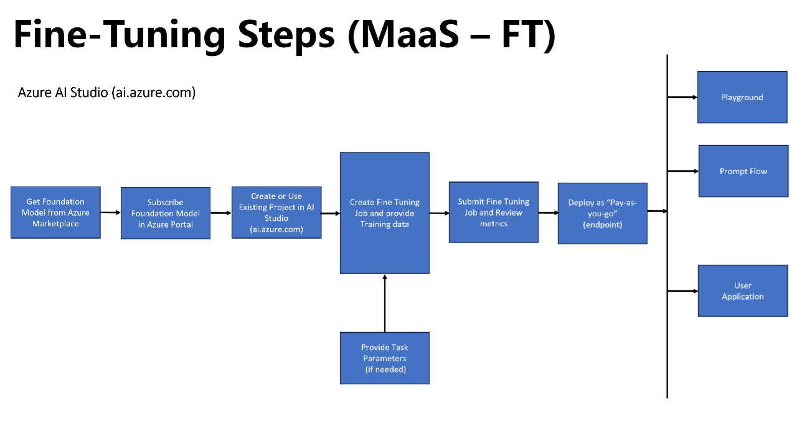
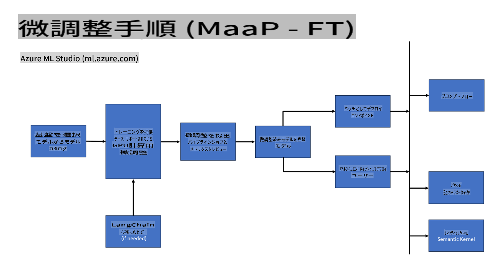
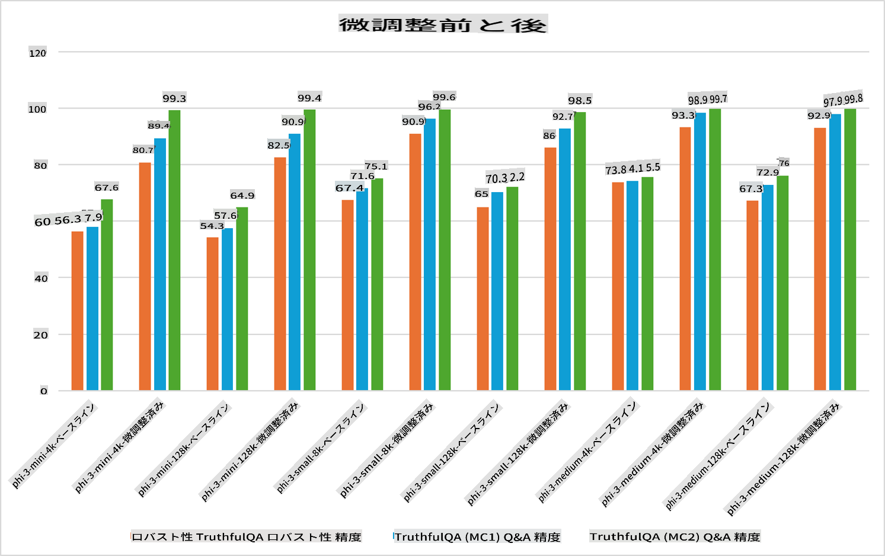

## ファインチューニングシナリオ

**プラットフォーム** これには、Azure AI Studio、Azure Machine Learning、AI Tools、Kaito、ONNX Runtimeなどのさまざまな技術が含まれます。

**インフラストラクチャ** これには、ファインチューニングプロセスに不可欠なCPUおよびFPGAが含まれます。これらの技術のアイコンをお見せします。

**ツール & フレームワーク** これにはONNX Runtimeが含まれます。これらの技術のアイコンをお見せします。
[Insert icons for ONNX Runtime and ONNX Runtime]

Microsoftの技術を使用したファインチューニングプロセスには、さまざまなコンポーネントとツールが含まれます。これらの技術を理解し活用することで、アプリケーションを効果的にファインチューニングし、より良いソリューションを作成することができます。

## モデル・アズ・サービス

ホストされたファインチューニングを使用して、コンピュートを作成および管理する必要なしにモデルをファインチューニングします。

サーバーレスファインチューニングはPhi-3-miniおよびPhi-3-mediumモデルで利用可能で、開発者はコンピュートを手配することなく、クラウドおよびエッジのシナリオに対してモデルを迅速かつ簡単にカスタマイズできます。また、Phi-3-smallがModels-as-a-Service提供を通じて利用可能になったことを発表しましたので、開発者は基盤となるインフラストラクチャを管理することなく、AI開発を迅速かつ簡単に開始できます。

[Fine Tuning Sample](https://github.com/microsoft/Phi-3CookBook/blob/main/md/04.Fine-tuning/FineTuning_AIStudio.md)
## モデル・アズ・プラットフォーム

ユーザーは自分のコンピュートを管理し、モデルをファインチューニングします。

[Fine Tuning Sample](https://github.com/Azure/azureml-examples/blob/main/sdk/python/foundation-models/system/finetune/chat-completion/chat-completion.ipynb)

## ファインチューニングシナリオ

| | | | | | | |
|-|-|-|-|-|-|-|
|シナリオ|LoRA|QLoRA|PEFT|DeepSpeed|ZeRO|DORA|
|特定のタスクやドメインに合わせた事前トレーニング済みLLMの適応|Yes|Yes|Yes|Yes|Yes|Yes|
|テキスト分類、固有表現認識、機械翻訳などのNLPタスクのファインチューニング|Yes|Yes|Yes|Yes|Yes|Yes|
|QAタスクのファインチューニング|Yes|Yes|Yes|Yes|Yes|Yes|
|チャットボットでの人間らしい応答生成のファインチューニング|Yes|Yes|Yes|Yes|Yes|Yes|
|音楽、アート、その他の創造的な形態の生成のファインチューニング|Yes|Yes|Yes|Yes|Yes|Yes|
|計算および財政コストの削減|Yes|Yes|No|Yes|Yes|No|
|メモリ使用量の削減|No|Yes|No|Yes|Yes|Yes|
|効率的なファインチューニングのためのパラメータの削減|No|Yes|Yes|No|No|Yes|
|利用可能なすべてのGPUデバイスの総GPUメモリにアクセスできるメモリ効率の良いデータ並列化の形式|No|No|No|Yes|Yes|Yes|

## ファインチューニングパフォーマンス例

