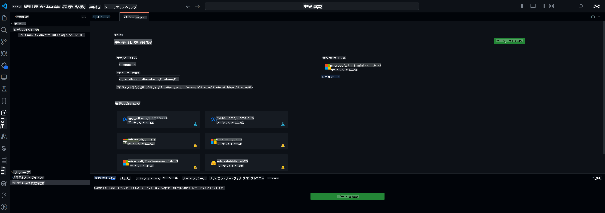

## AI Toolkit for VS Code へようこそ

[AI Toolkit for VS Code](https://github.com/microsoft/vscode-ai-toolkit/tree/main) は、Azure AI Studio Catalog や Hugging Face などのカタログから様々なモデルを集めています。このツールキットは、生成 AI ツールとモデルを使用して AI アプリを構築するための一般的な開発タスクを簡素化します。
- モデルの発見とプレイグラウンドから始める。
- ローカルコンピューティングリソースを使用したモデルの微調整と推論。
- Azure リソースを使用したリモート微調整と推論。

[AI Toolkit for VSCode をインストール](https://marketplace.visualstudio.com/items?itemName=ms-windows-ai-studio.windows-ai-studio)



**[Private Preview]** Azure Container Apps のワンクリックプロビジョニングで、クラウドでのモデルの微調整と推論を実行できます。

さあ、AI アプリ開発を始めましょう：

- [ローカル開発](../../../../md/04.Fine-tuning)
    - [準備](../../../../md/04.Fine-tuning)
    - [Conda のアクティベート](../../../../md/04.Fine-tuning)
    - [ベースモデルの微調整のみ](../../../../md/04.Fine-tuning)
    - [モデルの微調整と推論](../../../../md/04.Fine-tuning)
- [**[Private Preview]** リモート開発](../../../../md/04.Fine-tuning)
    - [前提条件](../../../../md/04.Fine-tuning)
    - [リモート開発プロジェクトの設定](../../../../md/04.Fine-tuning)
    - [Azure リソースのプロビジョニング](../../../../md/04.Fine-tuning)
    - [[オプション] Huggingface トークンを Azure Container App のシークレットに追加](../../../../md/04.Fine-tuning)
    - [微調整の実行](../../../../md/04.Fine-tuning)
    - [推論エンドポイントのプロビジョニング](../../../../md/04.Fine-tuning)
    - [推論エンドポイントのデプロイ](../../../../md/04.Fine-tuning)
    - [高度な使用法](../../../../md/04.Fine-tuning)

## ローカル開発
### 準備

1. ホストに NVIDIA ドライバがインストールされていることを確認してください。
2. データセットの利用に HF を使用する場合は、`huggingface-cli login` を実行します。
3. メモリ使用量を変更するものに関する `Olive` キー設定の説明。

### Conda のアクティベート
WSL 環境を使用しているため、手動で conda 環境をアクティベートする必要があります。このステップの後、微調整や推論を実行できます。

```bash
conda activate [conda-env-name]
```

### ベースモデルの微調整のみ
ベースモデルを微調整せずに試すだけの場合、conda をアクティベートした後に次のコマンドを実行できます。

```bash
cd inference

# Web ブラウザインターフェースでは、最大新トークン長、温度などのパラメータを調整できます。
# gradio が接続を開始した後、ユーザーは手動でブラウザでリンク (例: http://0.0.0.0:7860) を開く必要があります。
python gradio_chat.py --baseonly
```

### モデルの微調整と推論

ワークスペースが dev コンテナで開かれたら、ターミナルを開き（デフォルトパスはプロジェクトルート）、次のコマンドを実行して選択したデータセットに LLM を微調整します。

```bash
python finetuning/invoke_olive.py
```

チェックポイントと最終モデルは `models` フォルダに保存されます。

次に、微調整されたモデルを使用して `console`、`web browser`、または `prompt flow` でチャットを通じて推論を実行します。

```bash
cd inference

# コンソールインターフェース。
python console_chat.py

# Web ブラウザインターフェースでは、最大新トークン長、温度などのパラメータを調整できます。
# gradio が接続を開始した後、ユーザーは手動でブラウザでリンク (例: http://127.0.0.1:7860) を開く必要があります。
python gradio_chat.py
```

VS Code で `prompt flow` を使用するには、この [Quick Start](https://microsoft.github.io/promptflow/how-to-guides/quick-start.html) を参照してください。

### モデルの微調整

次に、デバイスに GPU があるかどうかに応じて、以下のモデルをダウンロードします。

QLoRA を使用してローカル微調整セッションを開始するには、カタログから微調整したいモデルを選択します。
| プラットフォーム | GPU 使用可能 | モデル名 | サイズ (GB) |
|---------|---------|--------|--------|
| Windows | Yes | Phi-3-mini-4k-**directml**-int4-awq-block-128-onnx | 2.13GB |
| Linux | Yes | Phi-3-mini-4k-**cuda**-int4-onnx | 2.30GB |
| Windows<br>Linux | No | Phi-3-mini-4k-**cpu**-int4-rtn-block-32-acc-level-4-onnx | 2.72GB |

**_Note_** モデルをダウンロードするために Azure アカウントは必要ありません。

Phi3-mini (int4) モデルは約 2GB-3GB のサイズです。ネットワーク速度によっては、ダウンロードに数分かかる場合があります。

プロジェクト名と場所を選択して開始します。
次に、モデルカタログからモデルを選択します。プロジェクトテンプレートのダウンロードを求められます。その後、「プロジェクトの設定」をクリックして、さまざまな設定を調整できます。

### Microsoft Olive

カタログから PyTorch モデルを使用して QLoRA 微調整を実行するために [Olive](https://microsoft.github.io/Olive/why-olive.html) を使用します。すべての設定はデフォルト値で事前設定されており、メモリの最適使用を考慮してローカルで微調整プロセスを実行するように最適化されていますが、シナリオに応じて調整できます。

### 微調整のサンプルとリソース

- [微調整の開始ガイド](https://learn.microsoft.com/windows/ai/toolkit/toolkit-fine-tune)
- [HuggingFace データセットを使用した微調整](https://github.com/microsoft/vscode-ai-toolkit/blob/main/archive/walkthrough-hf-dataset.md)
- [シンプルデータセットを使用した微調整](https://github.com/microsoft/vscode-ai-toolkit/blob/main/archive/walkthrough-simple-dataset.md)

## **[Private Preview]** リモート開発
### 前提条件
1. リモート Azure Container App 環境でモデルの微調整を実行するには、サブスクリプションに十分な GPU 容量があることを確認してください。アプリケーションに必要な容量をリクエストするには、[サポートチケット](https://azure.microsoft.com/support/create-ticket/) を提出してください。 [GPU 容量の詳細](https://learn.microsoft.com/azure/container-apps/workload-profiles-overview)
2. HuggingFace のプライベートデータセットを使用している場合は、[HuggingFace アカウント](https://huggingface.co/) を作成し、[アクセストークンを生成](https://huggingface.co/docs/hub/security-tokens) してください。
3. AI Toolkit for VS Code でリモート微調整および推論機能フラグを有効にします。
   1. *ファイル -> 設定 -> 設定* を選択して VS Code 設定を開きます。
   2. *拡張機能* に移動し、*AI Toolkit* を選択します。
   3. *"Enable Remote Fine-tuning And Inference"* オプションを選択します。
   4. 効果を反映するために VS Code をリロードします。

- [リモート微調整](https://github.com/microsoft/vscode-ai-toolkit/blob/main/archive/remote-finetuning.md)

### リモート開発プロジェクトの設定
1. コマンドパレットで `AI Toolkit: Focus on Resource View` を実行します。
2. *Model Fine-tuning* に移動してモデルカタログにアクセスします。プロジェクトに名前を付け、マシン上の場所を選択します。その後、*"Configure Project"* ボタンをクリックします。
3. プロジェクト設定
    1. *"Fine-tune locally"* オプションを有効にしないでください。
    2. Olive 設定がデフォルト値で表示されます。必要に応じてこれらの設定を調整して入力してください。
    3. *Generate Project* に進みます。この段階では WSL を活用し、新しい Conda 環境を設定します。将来的なアップデートには Dev Containers が含まれます。
4. *"Relaunch Window In Workspace"* をクリックしてリモート開発プロジェクトを開きます。

> **Note:** プロジェクトは現在、AI Toolkit for VS Code 内でローカルまたはリモートのいずれかで動作します。プロジェクト作成時に *"Fine-tune locally"* を選択すると、リモート開発機能なしで WSL 内でのみ動作します。一方、*"Fine-tune locally"* を有効にしない場合、プロジェクトはリモート Azure Container App 環境に限定されます。

### Azure リソースのプロビジョニング
開始するには、リモート微調整のための Azure リソースをプロビジョニングする必要があります。コマンドパレットから `AI Toolkit: Provision Azure Container Apps job for fine-tuning` を実行して行います。

出力チャンネルに表示されるリンクを通じてプロビジョニングの進行状況を監視します。

### [オプション] Huggingface トークンを Azure Container App のシークレットに追加
プライベート HuggingFace データセットを使用している場合、HuggingFace トークンを環境変数として設定し、Hugging Face Hub への手動ログインを避けることができます。
これを行うには、`AI Toolkit: Add Azure Container Apps Job secret for fine-tuning` コマンドを使用します。このコマンドを使用して、シークレット名を [`HF_TOKEN`](https://huggingface.co/docs/huggingface_hub/package_reference/environment_variables#hftoken) として設定し、Hugging Face トークンをシークレット値として使用します。

### 微調整の実行
リモート微調整ジョブを開始するには、`AI Toolkit: Run fine-tuning` コマンドを実行します。

システムおよびコンソールログを表示するには、出力パネルのリンクを使用して Azure ポータルにアクセスします（詳細な手順は [View and Query Logs on Azure](https://aka.ms/ai-toolkit/remote-provision#view-and-query-logs-on-azure) を参照）。または、`AI Toolkit: Show the running fine-tuning job streaming logs` コマンドを実行して VSCode 出力パネルでコンソールログを直接表示することもできます。
> **Note:** リソース不足のためジョブがキューに入ることがあります。ログが表示されない場合は、`AI Toolkit: Show the running fine-tuning job streaming logs` コマンドを実行し、しばらく待ってから再度コマンドを実行してストリーミングログに再接続してください。

このプロセス中、QLoRA は微調整に使用され、推論時に使用するための LoRA アダプターを作成します。
微調整の結果は Azure Files に保存されます。

### 推論エンドポイントのプロビジョニング
リモート環境でアダプターがトレーニングされた後、簡単な Gradio アプリケーションを使用してモデルと対話します。
微調整プロセスと同様に、コマンドパレットから `AI Toolkit: Provision Azure Container Apps for inference` を実行してリモート推論のための Azure リソースを設定する必要があります。

デフォルトでは、推論に使用されるサブスクリプションとリソースグループは微調整に使用されたものと一致する必要があります。推論は同じ Azure Container App 環境を使用し、微調整ステップで生成されたモデルとモデルアダプターにアクセスします。

### 推論エンドポイントのデプロイ
推論コードを修正したり、推論モデルを再ロードしたりする場合は、`AI Toolkit: Deploy for inference` コマンドを実行してください。これにより、最新のコードが Azure Container App と同期され、レプリカが再起動されます。

デプロイが正常に完了すると、VSCode の通知に表示される "*Go to Inference Endpoint*" ボタンをクリックして推論 API にアクセスできます。または、Web API エンドポイントは `./infra/inference.config.json` の `ACA_APP_ENDPOINT` にあり、出力パネルにも表示されます。このエンドポイントを使用してモデルを評価する準備が整いました。

### 高度な使用法
AI Toolkit を使用したリモート開発の詳細については、[リモートでの微調整](https://aka.ms/ai-toolkit/remote-provision) および [微調整モデルでの推論](https://aka.ms/ai-toolkit/remote-inference) のドキュメントを参照してください。

免責事項: この翻訳はAIモデルによって原文から翻訳されたものであり、完璧ではない可能性があります。
出力を確認し、必要に応じて修正を行ってください。