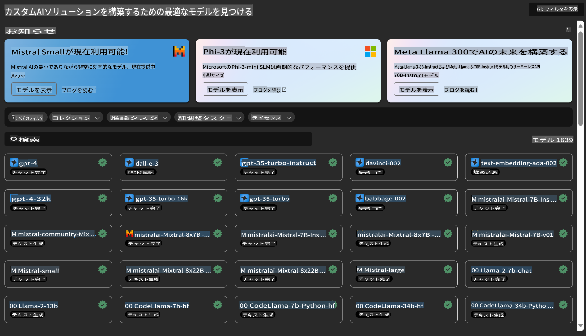

# **Azure Machine Learning Service の紹介**

[Azure Machine Learning](https://ml.azure.com?WT.mc_id=aiml-138114-kinfeylo) は、機械学習 (ML) プロジェクトのライフサイクルを加速し、管理するためのクラウドサービスです。

ML の専門家、データサイエンティスト、エンジニアは、日々のワークフローで次のことができます:

- モデルをトレーニングしてデプロイする。
- 機械学習オペレーション (MLOps) を管理する。
- Azure Machine Learning でモデルを作成するか、PyTorch、TensorFlow、scikit-learn などのオープンソースプラットフォームで構築されたモデルを使用することができます。
- MLOps ツールを使用して、モデルの監視、再トレーニング、再デプロイを行います。

## Azure Machine Learning は誰のためのものか？

**データサイエンティストと ML エンジニア**

彼らは日々のワークフローを加速し、自動化するためのツールを使用できます。
Azure ML は、公平性、説明可能性、追跡性、監査可能性の機能を提供します。

**アプリケーション開発者**

彼らはモデルをアプリケーションやサービスにシームレスに統合することができます。

**プラットフォーム開発者**

耐久性のある Azure Resource Manager API に支えられた強力なツールセットにアクセスできます。
これらのツールを使用して、先進的な ML ツールを構築することができます。

**企業**

Microsoft Azure クラウドで作業する企業は、慣れ親しんだセキュリティとロールベースのアクセス制御の利点を享受できます。
プロジェクトを設定して、保護されたデータや特定の操作へのアクセスを制御します。

## チーム全員の生産性向上

ML プロジェクトは、構築および維持するために、さまざまなスキルセットを持つチームを必要とすることがよくあります。

Azure ML は次のことを可能にするツールを提供します:
- 共有ノートブック、コンピューティングリソース、サーバーレスコンピューティング、データ、および環境を介してチームと協力する。
- 系譜および監査コンプライアンス要件を満たすために、公平性、説明可能性、追跡性、および監査可能性を備えたモデルを開発する。
- ML モデルを迅速かつ簡単に大規模にデプロイし、MLOps を使用して効率的に管理および統治する。
- ガバナンス、セキュリティ、およびコンプライアンスが組み込まれた状態で、どこでも機械学習ワークロードを実行する。

## クロスコンパチブルなプラットフォームツール

ML チームの誰もが、自分の好みのツールを使用して仕事を完了できます。
迅速な実験、ハイパーパラメータチューニング、パイプラインの構築、推論の管理など、どの作業を行っていても、以下のような使い慣れたインターフェイスを使用できます:
- Azure Machine Learning Studio
- Python SDK (v2)
- Azure CLI (v2)
- Azure Resource Manager REST APIs

モデルを洗練し、開発サイクル全体でコラボレーションする際には、Azure Machine Learning Studio UI 内でアセット、リソース、およびメトリクスを共有し、見つけることができます。

## **Azure ML における LLM/SLM**

Azure ML は、多くの LLM/SLM 関連機能を追加し、LLMOps と SLMOps を組み合わせて、企業全体の生成型人工知能技術プラットフォームを作成しています。

### **モデルカタログ**

企業ユーザーは、モデルカタログを通じて、さまざまなビジネスシナリオに応じて異なるモデルをデプロイし、Model as Service としてサービスを提供することで、企業開発者やユーザーがアクセスできるようにします。

Azure Machine Learning Studio のモデルカタログは、生成型 AI アプリケーションを構築するためのさまざまなモデルを発見し、使用するためのハブです。モデルカタログには、Azure OpenAI サービス、Mistral、Meta、Cohere、Nvidia、Hugging Face などのモデルプロバイダーや Microsoft によってトレーニングされたモデルを含む、数百のモデルが含まれています。Microsoft 以外のプロバイダーからのモデルは、Microsoft の製品条件で定義される Non-Microsoft Products であり、モデルに付随する条件に従う必要があります。

### **ジョブパイプライン**

機械学習パイプラインのコアは、完全な機械学習タスクを複数のステップに分割することです。各ステップは、個別に開発、最適化、構成、および自動化できる管理可能なコンポーネントです。ステップは明確に定義されたインターフェイスを通じて接続されます。Azure Machine Learning パイプラインサービスは、パイプラインステップ間のすべての依存関係を自動的にオーケストレーションします。

SLM / LLM のファインチューニングでは、パイプラインを通じてデータ、トレーニング、および生成プロセスを管理できます。

### **プロンプトフロー**

Azure Machine Learning プロンプトフローを使用する利点
Azure Machine Learning プロンプトフローは、アイデアから実験、最終的には LLM ベースの本番アプリケーションへの移行を支援する多くの利点を提供します:

**プロンプトエンジニアリングの敏捷性**

インタラクティブなオーサリング体験: Azure Machine Learning プロンプトフローは、フローの構造の視覚的表現を提供し、ユーザーがプロジェクトを簡単に理解し、ナビゲートできるようにします。また、効率的なフロー開発とデバッグのためのノートブックのようなコーディング体験も提供します。
プロンプトチューニングのバリアント: ユーザーは複数のプロンプトバリアントを作成して比較し、反復的な洗練プロセスを促進します。

評価: 組み込みの評価フローにより、ユーザーはプロンプトとフローの品質と有効性を評価できます。

包括的なリソース: Azure Machine Learning プロンプトフローには、開発の出発点となる組み込みツール、サンプル、およびテンプレートのライブラリが含まれており、創造性を刺激し、プロセスを加速します。

**LLM ベースのアプリケーションの企業向け準備**

コラボレーション: Azure Machine Learning プロンプトフローは、チームコラボレーションをサポートし、複数のユーザーがプロンプトエンジニアリングプロジェクトで協力し、知識を共有し、バージョン管理を維持できるようにします。

オールインワンプラットフォーム: Azure Machine Learning プロンプトフローは、開発、評価からデプロイおよび監視まで、プロンプトエンジニアリングプロセス全体を簡素化します。ユーザーはフローを Azure Machine Learning エンドポイントとして簡単にデプロイし、リアルタイムでパフォーマンスを監視し、最適な運用と継続的な改善を確保できます。

Azure Machine Learning 企業向け準備ソリューション: プロンプトフローは、Azure Machine Learning の強力な企業向け準備ソリューションを活用し、フローの開発、実験、およびデプロイのための安全でスケーラブルで信頼性のある基盤を提供します。

Azure Machine Learning プロンプトフローを使用すると、ユーザーはプロンプトエンジニアリングの敏捷性を発揮し、効果的にコラボレーションし、企業向けソリューションを活用して、LLM ベースのアプリケーションの開発とデプロイを成功させることができます。

Azure ML の計算能力、データ、およびさまざまなコンポーネントを組み合わせることで、企業開発者は独自の人工知能アプリケーションを簡単に構築できます。

免責事項: この翻訳はAIモデルによって原文から翻訳されたものであり、完全ではない可能性があります。出力を確認し、必要に応じて修正してください。