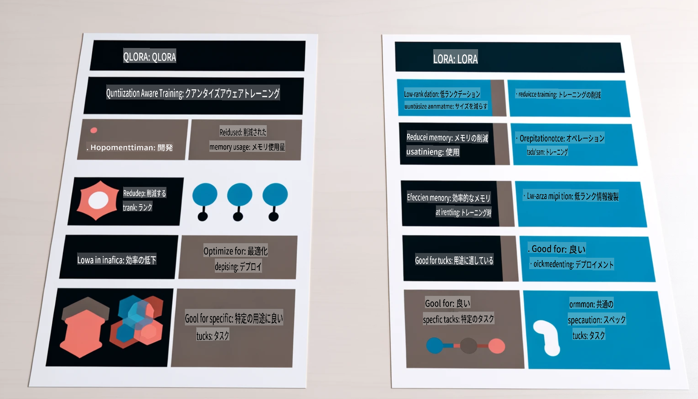

# **Phi-3を業界の専門家にする**

Phi-3モデルを業界に導入するためには、業界のビジネスデータをPhi-3モデルに追加する必要があります。私たちには2つの異なるオプションがあります。1つ目はRAG（Retrieval Augmented Generation）、2つ目はファインチューニングです。

## **RAGとファインチューニングの比較**

### **Retrieval Augmented Generation**

RAGはデータの取得とテキスト生成を組み合わせたものです。企業の構造化データと非構造化データをベクトルデータベースに保存します。関連する内容を検索する際に、関連する要約と内容を見つけてコンテキストを形成し、LLM/SLMのテキスト補完機能と組み合わせてコンテンツを生成します。

### **ファインチューニング**

ファインチューニングは、特定のモデルの改善に基づいています。モデルのアルゴリズムから始める必要はありませんが、データを継続的に蓄積する必要があります。業界アプリケーションでより正確な用語や言語表現が必要な場合、ファインチューニングがより良い選択となります。しかし、データが頻繁に変わる場合、ファインチューニングは複雑になる可能性があります。

### **選び方**

1. 外部データの導入が必要な場合、RAGが最適な選択です。

2. 安定して正確な業界知識を出力する必要がある場合、ファインチューニングが良い選択です。RAGは関連するコンテンツを優先して引っ張ってきますが、専門的なニュアンスを必ずしも捉えられないことがあります。

3. ファインチューニングには高品質なデータセットが必要で、データの範囲が狭い場合、大きな違いはありません。RAGはより柔軟です。

4. ファインチューニングはブラックボックスであり、その内部メカニズムを理解するのは難しいです。しかし、RAGはデータの出所を見つけやすくすることで、幻覚やコンテンツの誤りを効果的に調整し、より良い透明性を提供します。

### **シナリオ**

1. 特定の専門用語や表現が必要な垂直業界では、***ファインチューニング***が最適な選択です。

2. 異なる知識点の統合を含むQAシステムでは、***RAG***が最適な選択です。

3. 自動化されたビジネスフローの組み合わせでは、***RAG + ファインチューニング***が最適な選択です。

## **RAGの使用方法**

ベクトルデータベースは、数学的な形式で保存されたデータの集合です。ベクトルデータベースは、機械学習モデルが以前の入力を記憶しやすくし、検索、推奨、テキスト生成などのユースケースをサポートするために機械学習を使用できるようにします。データは正確な一致ではなく類似性の指標に基づいて識別されるため、コンピュータモデルがデータのコンテキストを理解することができます。

ベクトルデータベースはRAGを実現する鍵です。text-embedding-3やjina-ai-embeddingなどのベクトルモデルを通じてデータをベクトルストレージに変換することができます。

RAGアプリケーションの作成について詳しくは[https://github.com/microsoft/Phi-3CookBook](https://github.com/microsoft/Phi-3CookBook?WT.mc_id=aiml-138114-kinfeylo)をご覧ください。

## **ファインチューニングの使用方法**

ファインチューニングで一般的に使用されるアルゴリズムはLoraとQLoraです。どちらを選ぶべきでしょうか？
- [このサンプルノートブックで詳細を学ぶ](../../../../code/04.Finetuning/Phi_3_Inference_Finetuning.ipynb)
- [Python FineTuning Sampleの例](../../../../code/04.Finetuning/FineTrainingScript.py)

### **LoraとQLora**

LoRA（Low-Rank Adaptation）とQLoRA（Quantized Low-Rank Adaptation）は、どちらもパラメータ効率の良いファインチューニング（PEFT）を使用して大規模言語モデル（LLM）を微調整するための技術です。PEFT技術は従来の方法よりも効率的にモデルをトレーニングするように設計されています。LoRAは、重み更新行列に低ランク近似を適用することでメモリフットプリントを削減するスタンドアロンのファインチューニング技術です。高速なトレーニング時間を提供し、従来のファインチューニング方法に近い性能を維持します。

QLoRAは、量子化技術を組み込んでメモリ使用量をさらに削減するLoRAの拡張バージョンです。QLoRAは、事前トレーニングされたLLMの重みパラメータの精度を4ビット精度に量子化し、LoRAよりもメモリ効率が高くなります。ただし、追加の量子化および逆量子化ステップのために、QLoRAのトレーニングはLoRAのトレーニングよりも約30％遅くなります。

QLoRAは、量子化エラーを修正するためのアクセサリーとしてLoRAを使用します。QLoRAは、比較的小さくて入手しやすいGPUで数十億のパラメータを持つ巨大なモデルをファインチューニングすることを可能にします。例えば、QLoRAは36台のGPUが必要な70Bパラメータモデルを、わずか2台のGPUでファインチューニングすることができます。

**免責事項**:
この文書は、機械ベースのAI翻訳サービスを使用して翻訳されています。正確性を期すために努力していますが、自動翻訳にはエラーや不正確な点が含まれる可能性があることをご了承ください。元の言語で書かれた原文が権威ある情報源と見なされるべきです。重要な情報については、専門の人間による翻訳を推奨します。この翻訳の使用に起因する誤解や誤訳について、当社は責任を負いません。