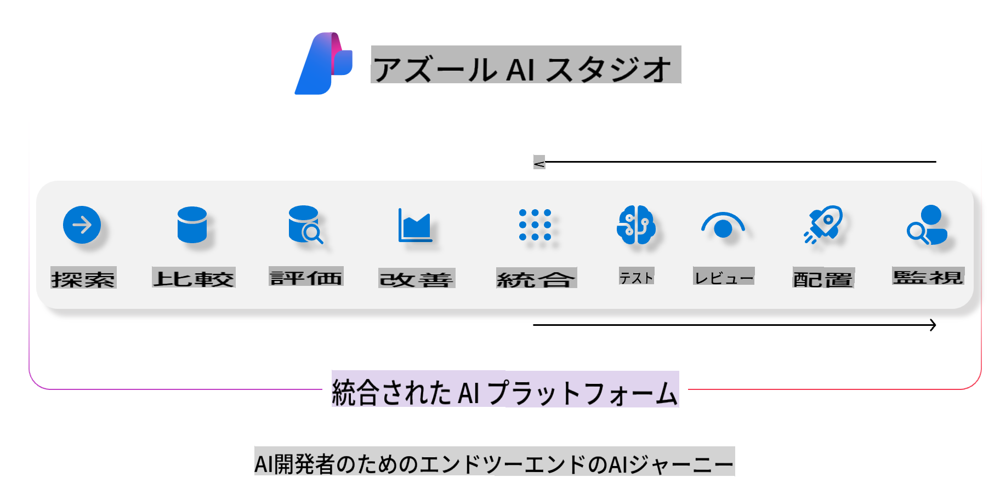
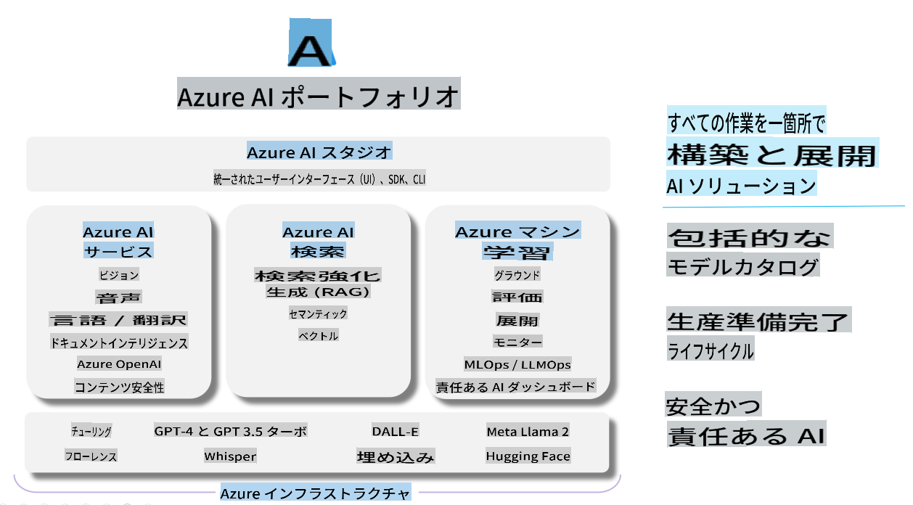

# **Azure AI Studioを使った評価**

[Azure AI Studio](https://ai.azure.com?WT.mc_id=aiml-138114-kinfeylo)を使って生成AIアプリケーションを評価する方法をご紹介します。単一ターンや複数ターンの会話を評価する際に、Azure AI Studioはモデルの性能と安全性を評価するためのツールを提供します。

## Azure AI Studioで生成AIアプリを評価する方法
詳細な手順については[Azure AI Studio Documentation](https://learn.microsoft.com/azure/ai-studio/how-to/evaluate-generative-ai-app?WT.mc_id=aiml-138114-kinfeylo)をご覧ください。

以下は始めるためのステップです：

## Azure AI Studioで生成AIモデルを評価する

**前提条件**

- CSVまたはJSON形式のテストデータセット。
- デプロイされた生成AIモデル（Phi-3、GPT 3.5、GPT 4、またはDavinciモデルなど）。
- 評価を実行するためのコンピュートインスタンスを持つランタイム。

## 組み込み評価指標

Azure AI Studioでは、単一ターンと複雑な複数ターンの会話の両方を評価できます。
特定のデータに基づいたモデルを使用するRetrieval Augmented Generation (RAG)シナリオでは、組み込みの評価指標を使用してパフォーマンスを評価できます。
また、一般的な単一ターンの質問応答シナリオ（非RAG）も評価できます。

## 評価ランの作成

Azure AI StudioのUIから、EvaluateページまたはPrompt Flowページに移動します。
評価作成ウィザードに従って評価ランを設定します。評価の名前を任意で入力します。
アプリケーションの目的に合ったシナリオを選択します。
モデルの出力を評価するための1つ以上の評価指標を選択します。

## カスタム評価フロー（オプション）

より柔軟に対応するために、カスタム評価フローを設定することもできます。特定の要件に基づいて評価プロセスをカスタマイズします。

## 結果の確認

評価を実行した後、Azure AI Studioで詳細な評価指標をログ、表示、分析します。アプリケーションの能力と限界について洞察を得ることができます。

**Note** Azure AI Studioは現在パブリックプレビュー中のため、実験や開発目的で使用してください。本番環境のワークロードには他のオプションを検討してください。詳細およびステップバイステップの手順については公式の[AI Studio documentation](https://learn.microsoft.com/azure/ai-studio/?WT.mc_id=aiml-138114-kinfeylo)をご覧ください。

免責事項：この翻訳はAIモデルによって元の言語から翻訳されたものであり、完全ではない可能性があります。出力を確認し、必要に応じて修正を行ってください。