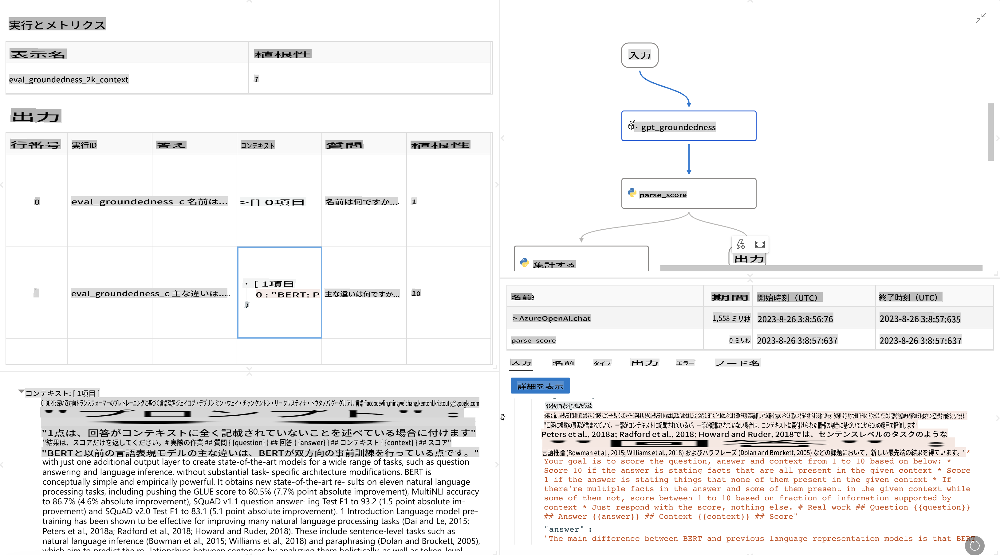

# **Promptflowの紹介**

[Microsoft Prompt Flow](https://microsoft.github.io/promptflow/index.html?WT.mc_id=aiml-138114-kinfeylo)は、ビジュアルワークフローオートメーションツールで、ユーザーが事前に構築されたテンプレートやカスタムコネクタを使用して自動化されたワークフローを作成できるようにします。データ管理、コラボレーション、プロセス最適化などのタスクに対して迅速に自動化プロセスを構築できるように設計されています。Prompt Flowを使用すると、さまざまなサービス、アプリケーション、システムを簡単に接続し、複雑なビジネスプロセスを自動化できます。

Microsoft Prompt Flowは、大規模言語モデル（LLM）を活用したAIアプリケーションのエンドツーエンドの開発サイクルを効率化するために設計されています。アイデア出し、プロトタイピング、テスト、評価、デプロイのどの段階でも、Prompt Flowはプロセスを簡素化し、プロダクション品質のLLMアプリを構築できるようにします。

## Microsoft Prompt Flowの主な機能と利点：

**インタラクティブな作成体験**

Prompt Flowはフローの構造を視覚的に表現し、プロジェクトの理解とナビゲーションを容易にします。
ノートブックのようなコーディング体験を提供し、効率的なフロー開発とデバッグを可能にします。

**プロンプトのバリエーションと調整**

複数のプロンプトバリエーションを作成して比較し、反復的な改善プロセスを促進します。異なるプロンプトのパフォーマンスを評価し、最も効果的なものを選択します。

**組み込みの評価フロー**

組み込みの評価ツールを使用して、プロンプトやフローの品質と効果を評価します。
LLMベースのアプリケーションがどれだけうまく機能しているかを理解します。

**包括的なリソース**

Prompt Flowには、組み込みツール、サンプル、テンプレートのライブラリが含まれています。これらのリソースは開発の出発点として機能し、創造性を刺激し、プロセスを加速します。

**コラボレーションとエンタープライズ対応**

複数のユーザーがプロンプトエンジニアリングプロジェクトで共同作業できるようにし、チームのコラボレーションをサポートします。
バージョン管理を維持し、知識を効果的に共有します。開発、評価、デプロイ、モニタリングまで、プロンプトエンジニアリングプロセス全体を効率化します。

## Prompt Flowでの評価

Microsoft Prompt Flowでは、AIモデルのパフォーマンスを評価するために評価が重要な役割を果たします。Prompt Flow内で評価フローとメトリクスをカスタマイズする方法を見てみましょう：

**Prompt Flowでの評価の理解**

Prompt Flowでは、フローは入力を処理し出力を生成する一連のノードを表します。評価フローは、特定の基準と目標に基づいて実行のパフォーマンスを評価するために設計された特別なタイプのフローです。

**評価フローの主な機能**

通常、テスト対象のフローの後に実行され、その出力を使用します。テスト対象のフローのパフォーマンスを測定するためにスコアやメトリクスを計算します。メトリクスには、精度、関連性スコア、その他の関連する指標が含まれます。

### 評価フローのカスタマイズ

**入力の定義**

評価フローは、テスト対象の実行の出力を取り込む必要があります。標準フローと同様に入力を定義します。
例えば、QnAフローを評価する場合は、入力を「answer」と名付けます。分類フローを評価する場合は、入力を「category」と名付けます。実際のラベルなどのグラウンドトゥルース入力も必要になることがあります。

**出力とメトリクス**

評価フローは、テスト対象のフローのパフォーマンスを測定する結果を生成します。メトリクスはPythonやLLM（大規模言語モデル）を使用して計算できます。log_metric()関数を使用して関連するメトリクスを記録します。

**カスタマイズされた評価フローの使用**

特定のタスクや目標に合わせた評価フローを開発します。評価目標に基づいてメトリクスをカスタマイズします。
このカスタマイズされた評価フローをバッチ実行に適用して、大規模なテストを行います。

## 組み込みの評価方法

Prompt Flowには組み込みの評価方法も提供されています。
バッチ実行を提出し、これらの方法を使用してフローが大規模データセットでどれだけうまく機能するかを評価できます。
評価結果を表示し、メトリクスを比較し、必要に応じて反復します。
評価は、AIモデルが望ましい基準と目標を満たすことを保証するために重要です。Microsoft Prompt Flowの評価フローの開発と使用に関する詳細な指示については、公式ドキュメントを参照してください。

まとめると、Microsoft Prompt Flowはプロンプトエンジニアリングを簡素化し、堅牢な開発環境を提供することで、開発者が高品質のLLMアプリケーションを作成できるようにします。LLMを扱っている場合、Prompt Flowはぜひ探索すべき価値のあるツールです。Microsoft Prompt Flowで評価フローを開発し使用するための詳細な指示については、[Prompt Flow Evaluation Documents](https://learn.microsoft.com/azure/machine-learning/prompt-flow/how-to-develop-an-evaluation-flow?view=azureml-api-2?WT.mc_id=aiml-138114-kinfeylo)を参照してください。

免責事項：この翻訳はAIモデルによって原文から翻訳されたものであり、完全ではない可能性があります。出力内容を確認し、必要に応じて修正を行ってください。