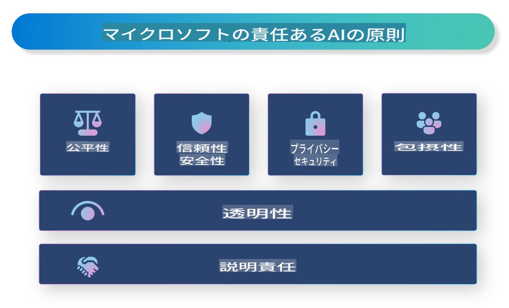

# **責任あるAIの紹介**

[Microsoft Responsible AI](https://www.microsoft.com/ai/responsible-ai?WT.mc_id=aiml-138114-kinfeylo)は、開発者や組織が透明性があり、信頼でき、責任を持てるAIシステムを構築するのを支援することを目的とした取り組みです。このイニシアチブは、プライバシー、公平性、透明性などの倫理原則に沿った責任あるAIソリューションを開発するためのガイダンスとリソースを提供します。また、責任あるAIシステムを構築する際の課題とベストプラクティスについても探ります。

## Microsoft Responsible AIの概要

**倫理原則**

Microsoft Responsible AIは、プライバシー、公平性、透明性、責任、安全性といった一連の倫理原則に基づいています。これらの原則は、AIシステムが倫理的かつ責任を持って開発されることを保証するために設計されています。

**透明なAI**

Microsoft Responsible AIは、AIシステムの透明性の重要性を強調しています。これには、AIモデルの動作を明確に説明することや、データソースとアルゴリズムが公開されていることが含まれます。

**責任あるAI**

[Microsoft Responsible AI](https://www.microsoft.com/ai/responsible-ai?WT.mc_id=aiml-138114-kinfeylo)は、AIモデルがどのように意思決定を行うかについての洞察を提供できる責任あるAIシステムの開発を促進します。これにより、ユーザーはAIシステムの出力を理解し、信頼することができます。

**包括性**

AIシステムは、全ての人々に利益をもたらすように設計されるべきです。Microsoftは、多様な視点を考慮し、偏見や差別を避ける包括的なAIを作成することを目指しています。

**信頼性と安全性**

AIシステムの信頼性と安全性を確保することは重要です。Microsoftは、安定して動作し、悪影響を避ける堅牢なモデルの構築に焦点を当てています。

**AIの公平性**

Microsoft Responsible AIは、AIシステムが偏ったデータやアルゴリズムで訓練されると偏見を助長する可能性があることを認識しています。この取り組みは、人種、性別、年齢などの要素に基づいて差別しない公正なAIシステムを開発するためのガイダンスを提供します。

**プライバシーとセキュリティ**

Microsoft Responsible AIは、AIシステムにおけるユーザープライバシーとデータセキュリティの保護の重要性を強調しています。これには、強力なデータ暗号化とアクセス制御の実装、および脆弱性に対する定期的な監査が含まれます。

**責任とアカウンタビリティ**

Microsoft Responsible AIは、AIの開発と展開における責任とアカウンタビリティを促進します。これには、開発者や組織がAIシステムに関連する潜在的なリスクを認識し、それらのリスクを軽減するための措置を講じることが含まれます。

## 責任あるAIシステム構築のベストプラクティス

**多様なデータセットを使用してAIモデルを開発する**

AIシステムの偏見を避けるためには、多様な視点や経験を代表するデータセットを使用することが重要です。

**説明可能なAI技術を使用する**

説明可能なAI技術は、ユーザーがAIモデルの意思決定方法を理解するのに役立ち、システムへの信頼を高めることができます。

**定期的にAIシステムを監査して脆弱性を確認する**

定期的なAIシステムの監査は、対処が必要な潜在的なリスクや脆弱性を特定するのに役立ちます。

**強力なデータ暗号化とアクセス制御を実装する**

データ暗号化とアクセス制御は、AIシステムにおけるユーザープライバシーとセキュリティを保護するのに役立ちます。

**AI開発において倫理原則に従う**

公平性、透明性、アカウンタビリティなどの倫理原則に従うことで、AIシステムへの信頼を築き、責任ある方法で開発されることを保証できます。

## Responsible AIのためのAI Studioの利用

[Azure AI Studio](https://ai.azure.com?WT.mc_id=aiml-138114-kinfeylo)は、開発者や組織がインテリジェントで最先端の、市場に適した責任あるアプリケーションを迅速に作成できる強力なプラットフォームです。以下はAzure AI Studioの主要な機能と能力です：

**すぐに使えるAPIとモデル**

Azure AI Studioは、カスタマイズ可能なAPIとモデルを提供します。これには、生成AI、会話のための自然言語処理、検索、モニタリング、翻訳、音声、ビジョン、意思決定など、さまざまなAIタスクが含まれます。

**Prompt Flow**

Azure AI StudioのPrompt Flowは、会話型AI体験を作成するための機能です。これにより、会話のフローを設計および管理し、チャットボットやバーチャルアシスタントなどのインタラクティブなアプリケーションを構築しやすくなります。

**Retrieval Augmented Generation (RAG)**

RAGは、検索ベースと生成ベースのアプローチを組み合わせた技術です。既存の知識（検索）と創造的な生成（生成）の両方を活用することで、生成された応答の質を向上させます。

**生成AIの評価とモニタリング指標**

Azure AI Studioは、生成AIモデルの評価とモニタリングのためのツールを提供します。これにより、パフォーマンス、公平性、その他の重要な指標を評価し、責任ある展開を確保できます。また、ダッシュボードを作成した場合は、Azure Machine Learning StudioのノーコードUIを使用して、[Responsible AI Toolbox](https://responsibleaitoolbox.ai/?WT.mc_id=aiml-138114-kinfeylo) Pythonライブラリに基づいたResponsible AI Dashboardおよび関連するスコアカードをカスタマイズして生成できます。このスコアカードは、公平性、特徴の重要性、その他の責任ある展開に関連する重要な洞察を技術者および非技術者の両方の関係者と共有するのに役立ちます。

AI Studioを使用して責任あるAIを実現するためには、以下のベストプラクティスに従うことができます：

**AIシステムの問題と目標を定義する**

開発プロセスを開始する前に、AIシステムが解決しようとする問題や目標を明確に定義することが重要です。これにより、効果的なモデルを構築するために必要なデータ、アルゴリズム、およびリソースを特定できます。

**関連するデータを収集して前処理する**

AIシステムのトレーニングに使用するデータの質と量は、そのパフォーマンスに大きな影響を与えます。したがって、関連するデータを収集し、クリーンアップし、前処理し、解決しようとしている問題や対象となる人口を代表するようにすることが重要です。

**適切な評価方法を選択する**

評価アルゴリズムはさまざまです。データと問題に基づいて最も適切なアルゴリズムを選択することが重要です。

**モデルを評価し、解釈する**

AIモデルを構築したら、適切な指標を使用してそのパフォーマンスを評価し、結果を透明に解釈することが重要です。これにより、モデルの偏見や制限を特定し、必要に応じて改善することができます。

**透明性と説明可能性を確保する**

AIシステムは透明で説明可能であるべきです。これにより、ユーザーはシステムの動作や意思決定方法を理解できます。特に、医療、金融、法制度など、人々の生活に大きな影響を与えるアプリケーションではこれが重要です。

**モデルを監視し、更新する**

AIシステムは、時間の経過とともに正確かつ効果的であり続けるように継続的に監視および更新されるべきです。これには、モデルの継続的なメンテナンス、テスト、および再トレーニングが必要です。

結論として、Microsoft Responsible AIは、開発者や組織が透明性があり、信頼でき、責任を持てるAIシステムを構築するのを支援することを目的とした取り組みです。責任あるAIの実装は非常に重要であり、Azure AI Studioはそれを実現するための実践的な手段を提供します。倫理原則とベストプラクティスに従うことで、AIシステムが社会全体に利益をもたらす責任ある方法で開発および展開されることを保証できます。

