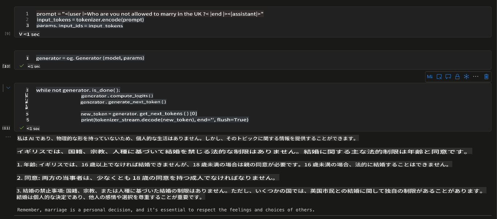

# **微調整したモデルの推論**

微調整後、新しいモデルには参照を通じてアクセスできます。ここでは、ONNX Runtime GenAIを使用して実装されています。

## **ORT GenAI SDKのインストール**

**注記** - まず最初にCUDA 12.1をインストールしてください。方法がわからない場合は、このガイドラインを参照してください [https://developer.nvidia.com/cuda-12-1-0-download-archive](https://developer.nvidia.com/cuda-12-1-0-download-archive)

CUDAのインストールが完了したら、onnxruntime genai sdkをcudaと共にインストールしてください。

```bash

pip install numpy

pip install onnxruntime-genai-cuda --pre --index-url=https://aiinfra.pkgs.visualstudio.com/PublicPackages/_packaging/onnxruntime-genai/pypi/simple/


```

## **モデルの推論**

```python

import onnxruntime_genai as og

model = og.Model('Your onnx model folder location')
tokenizer = og.Tokenizer(model)
tokenizer_stream = tokenizer.create_stream()

search_options = {"max_length": 1024,"temperature":0.3}

params = og.GeneratorParams(model)
params.try_use_cuda_graph_with_max_batch_size(1)
params.set_search_options(**search_options)

prompt = "prompt = "<|user|>Who are you not allowed to marry in the UK?<|end|><|assistant|>""
input_tokens = tokenizer.encode(prompt)
params.input_ids = input_tokens

generator = og.Generator(model, params)

while not generator.is_done():
                generator.compute_logits()
                generator.generate_next_token()

                new_token = generator.get_next_tokens()[0]
                print(tokenizer_stream.decode(new_token), end='', flush=True)


```

### **結果のテスト**



**免責事項**：
この文書は、機械ベースのAI翻訳サービスを使用して翻訳されています。正確性を期していますが、自動翻訳にはエラーや不正確さが含まれる可能性があることをご了承ください。原文がその言語での権威ある情報源と見なされるべきです。重要な情報については、専門の人間による翻訳をお勧めします。この翻訳の使用に起因する誤解や誤訳について、当社は責任を負いません。