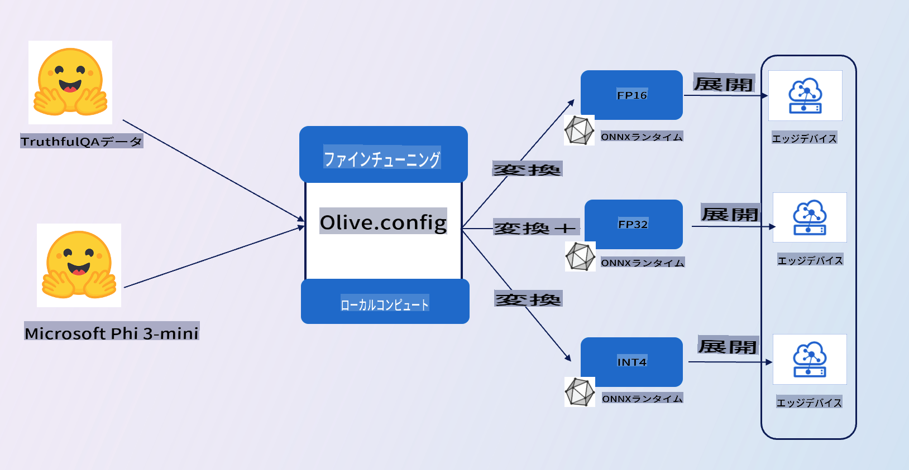

# **E2Eサンプルの紹介**

このサンプルは [TruthfulQAのデータ](https://github.com/sylinrl/TruthfulQA/blob/main/TruthfulQA.csv) を使用してPhi-3-miniモデルをファインチューニングします。以下がアーキテクチャです。

## **紹介**

[TruthfulQAのデータ](https://github.com/sylinrl/TruthfulQA/blob/main/TruthfulQA.csv) セットを使用して、Phi-3-miniが私たちの質問に対してより専門的に答えるようにすることを目指しています。これはPhi-3-miniを使用した最初のE2Eプロジェクトです。

### **要件**

1. Python 3.10+
2. CUDA 12.1
3. Linux / WSL
4. Azure ML
5. Azure Compute A100

### **知識**

1. [Phi-3について学ぶ](../01.Introduce/Phi3Family.md)
2. [Microsoft Oliveを使ったファインチューニングについて学ぶ](../04.Fine-tuning/FineTuning_MicrosoftOlive.md)
3. [生成AIのためのONNX Runtimeについて学ぶ](https://github.com/microsoft/onnxruntime-genai)

**免責事項**:
この文書は、機械ベースのAI翻訳サービスを使用して翻訳されています。正確さを期していますが、自動翻訳には誤りや不正確さが含まれる場合がありますのでご注意ください。元の言語での原文が権威ある情報源と見なされるべきです。重要な情報については、専門の人間による翻訳を推奨します。この翻訳の使用に起因する誤解や誤解については責任を負いません。