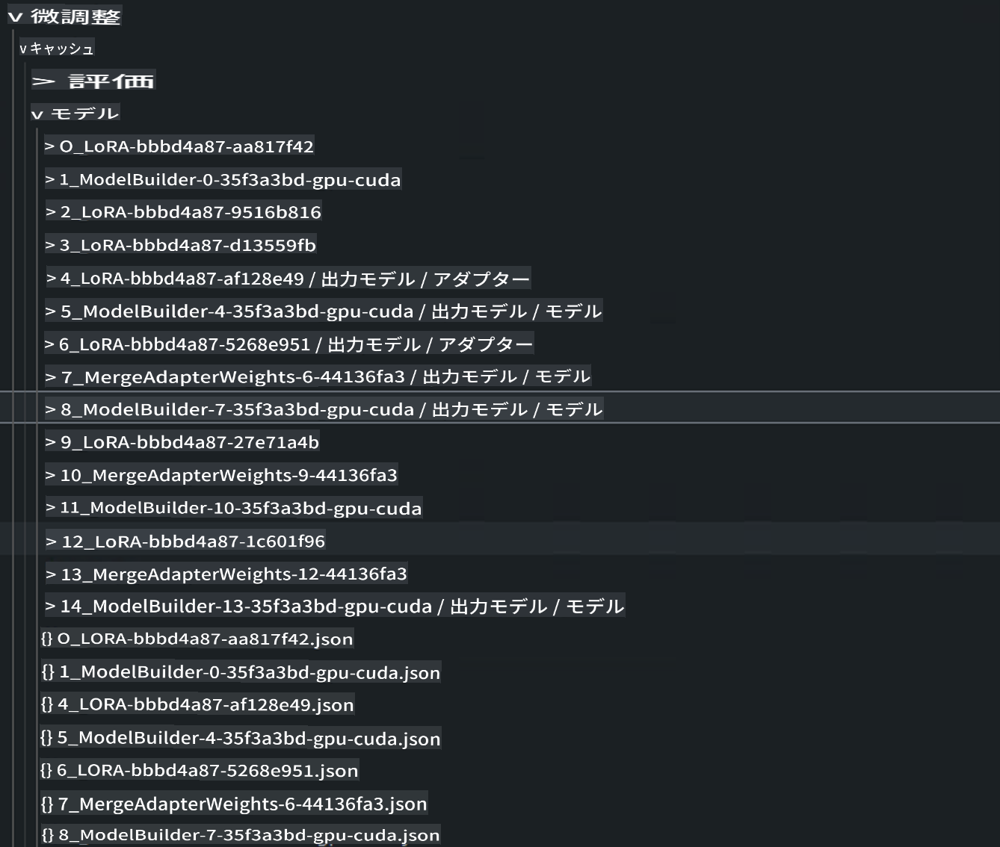

# **Microsoft Oliveを使用してプロジェクトを設計する**

企業が独自の業界向けモデルを持ちたい場合、データの収集、微調整、およびデプロイメントから始める必要があります。前回の内容ではMicrosoft Oliveについて紹介しましたが、今回はE2Eの作業に基づいてより詳細な紹介を行います。

## **アーキテクチャ**

VS Code用のAI Toolkitで生成されたプロジェクトを参考にして、データ、モデル、微調整形式、および推論を含むプロジェクトを構築できます。例えば以下のように

```txt

｜-- Your Phi-3-mini E2E Proj
    ｜-- datasets
    ｜-- fine-tuning
    ｜-- inferences
    ｜-- model-cache
    ｜-- gen-model
    ｜-- setup
     

```

- **datasets**

    データはcsvやjsonなどの形式で保存できます。この例では、エクスポートされたjsonデータです。[dataset](./E2E_Datasets.md) 

    ***Note*** データはすでにAzure MLにアップロードされているため、ここでの設定は無視できます（ローカルの場合はここでデータをアップロードできます）

- **fine-tuning**
    
    微調整のためのQLoRAとLoRAアルゴリズム、および関連するパラメータを指定します

- **inferences**

    推論は微調整後のモデルです。微調整されたAdapter層の参照、微調整後にAdapterと統合されたモデルの参照、または量子化されたONNX Runtimeモデルが含まれます。

- **model-cache**

    Hugging face CLIを使用してダウンロードされたモデル、ここではPhi-3-Miniモデルです（Azure MLを使用する場合、この内容は無視できます。ローカルで操作する場合は以下のスクリプトを実行してphi-3モデルを取得してください）


```bash

huggingface-cli login

# input your key from Hugging Face Portal

huggingface-cli download microsoft/Phi-3-mini-4k-instruct --local-dir Your Phi-3-mini location

```

- **gen-model**

操作後に保存されたモデルには、微調整されたAdapterモデル、統合された微調整Adapterモデル、およびONNX Runtimeで実行される量子化モデルが含まれます。

- **setup**

必要なインストール環境、これを実行してOlive環境を設定してください


```bash

pip install -r requirements.txt

```

## **Microsoft Oliveの設定**

Microsoft Oliveの設定について知りたい場合は、[Fine Tuning with Microsoft Olive](../04.Fine-tuning/FineTuning_MicrosoftOlive.md)をご覧ください。

***Note*** 最新情報を得るために、以下を使用してMicrosoft Oliveをインストールしてください


```bash

pip install git+https://github.com/microsoft/Olive

```

## **Azure MLでMicrosoft Oliveを実行する**

**LoRA**

このサンプルはクラウドコンピュート、クラウドデータセットを使用し、fine-tuningフォルダにolive.configを追加します


```json

{
    "azureml_client": {
        "subscription_id": "Your Azure Subscription ID",
        "resource_group": "Your Azure Resource Group",
        "workspace_name": "Your Azure ML Worksapce",
        "keyvault_name":  "Your Azure Key Valuts"
    },
    "input_model":{
        "type": "PyTorchModel",
        "config": {
            "hf_config": {
                "model_name": "microsoft/Phi-3-mini-4k-instruct",
                "task": "text-generation",
                "from_pretrained_args": {
                    "trust_remote_code": true
                }
            }
        }
    },
    "systems": {
        "aml": {
            "type": "AzureML",
            "config": {
                "accelerators": [
                    {
                        "device": "gpu",
                        "execution_providers": [
                            "CUDAExecutionProvider"
                        ]
                    }
                ],
                "hf_token": true,
                "aml_compute": "Your Azure ML Compute Cluster",
                "aml_docker_config": {
                    "base_image": "mcr.microsoft.com/azureml/openmpi4.1.0-cuda11.8-cudnn8-ubuntu22.04",
                    "conda_file_path": "conda.yaml"
                }
            }
        },
        "azure_arc": {
            "type": "AzureML",
            "config": {
                "accelerators": [
                    {
                        "device": "gpu",
                        "execution_providers": [
                            "CUDAExecutionProvider"
                        ]
                    }
                ],
                "aml_compute": "Your Azure ML Compute",
                "aml_docker_config": {
                    "base_image": "mcr.microsoft.com/azureml/openmpi4.1.0-cuda11.8-cudnn8-ubuntu22.04",
                    "conda_file_path": "conda.yaml"
                }
            }
        }
    },
    "data_configs": [
        {
            "name": "dataset_default_train",
            "type": "HuggingfaceContainer",
            "load_dataset_config": {
                "params": {
                    "data_name": "json", 
                    "data_files": {
                        "type": "azureml_datastore",
                        "config": {
                            "azureml_client": {
                                "subscription_id": "Your Azure Subscrition ID",
                                "resource_group": "Your Azure Resource Group",
                                "workspace_name": "Your Azure ML Workspaces name"
                            },
                            "datastore_name": "workspaceblobstore",
                            "relative_path": "Your train_data.json Azure ML Location"
                        }
                    },
                    "split": "train"
                }
            },
            "pre_process_data_config": {
                "params": {
                    "dataset_type": "corpus",
                    "text_cols": [
                            "Question",
                            "Best Answer"
                    ],
                    "text_template": "<|user|>\n{Question}<|end|>\n<|assistant|>\n{Best Answer}\n<|end|>",
                    "corpus_strategy": "join",
                    "source_max_len": 2048,
                    "pad_to_max_len": false,
                    "use_attention_mask": false
                }
            }
        }
    ],
    "passes": {
        "lora": {
            "type": "LoRA",
            "config": {
                "target_modules": [
                    "o_proj",
                    "qkv_proj"
                ],
                "double_quant": true,
                "lora_r": 64,
                "lora_alpha": 64,
                "lora_dropout": 0.1,
                "train_data_config": "dataset_default_train",
                "eval_dataset_size": 0.1,
                "training_args": {
                    "seed": 0,
                    "data_seed": 42,
                    "per_device_train_batch_size": 1,
                    "per_device_eval_batch_size": 1,
                    "gradient_accumulation_steps": 4,
                    "gradient_checkpointing": false,
                    "learning_rate": 0.0001,
                    "num_train_epochs": 1000,
                    "max_steps": 100,
                    "logging_steps": 100,
                    "evaluation_strategy": "steps",
                    "eval_steps": 187,
                    "group_by_length": true,
                    "adam_beta2": 0.999,
                    "max_grad_norm": 0.3
                }
            }
        },
        "merge_adapter_weights": {
            "type": "MergeAdapterWeights"
        },
        "builder": {
            "type": "ModelBuilder",
            "config": {
                "precision": "int4"
            }
        }
    },
    "engine": {
        "log_severity_level": 0,
        "host": "aml",
        "target": "aml",
        "search_strategy": false,
        "cache_dir": "cache",
        "output_dir" : "../model-cache/models/phi3-finetuned"
    }
}


```


**QLoRA**


```json

{
    "azureml_client": {
        "subscription_id": "Your Azure Subscription ID",
        "resource_group": "Your Azure Resource Group",
        "workspace_name": "Your Azure ML Worksapce",
        "keyvault_name":  "Your Azure Key Valuts"
    },
    "input_model":{
        "type": "PyTorchModel",
        "config": {
            "hf_config": {
                "model_name": "microsoft/Phi-3-mini-4k-instruct",
                "task": "text-generation",
                "from_pretrained_args": {
                    "trust_remote_code": true
                }
            }
        }
    },
    "systems": {
        "aml": {
            "type": "AzureML",
            "config": {
                "accelerators": [
                    {
                        "device": "gpu",
                        "execution_providers": [
                            "CUDAExecutionProvider"
                        ]
                    }
                ],
                "hf_token": true,
                "aml_compute": "Your Azure ML Compute Cluster",
                "aml_docker_config": {
                    "base_image": "mcr.microsoft.com/azureml/openmpi4.1.0-cuda11.8-cudnn8-ubuntu22.04",
                    "conda_file_path": "conda.yaml"
                }
            }
        },
        "azure_arc": {
            "type": "AzureML",
            "config": {
                "accelerators": [
                    {
                        "device": "gpu",
                        "execution_providers": [
                            "CUDAExecutionProvider"
                        ]
                    }
                ],
                "aml_compute": "Your Azure ML Compute",
                "aml_docker_config": {
                    "base_image": "mcr.microsoft.com/azureml/openmpi4.1.0-cuda11.8-cudnn8-ubuntu22.04",
                    "conda_file_path": "conda.yaml"
                }
            }
        }
    },
    "data_configs": [
        {
            "name": "dataset_default_train",
            "type": "HuggingfaceContainer",
            "load_dataset_config": {
                "params": {
                    "data_name": "json", 
                    "data_files": {
                        "type": "azureml_datastore",
                        "config": {
                            "azureml_client": {
                                "subscription_id": "Your Azure Subscrition ID",
                                "resource_group": "Your Azure Resource Group",
                                "workspace_name": "Your Azure ML Workspaces name"
                            },
                            "datastore_name": "workspaceblobstore",
                            "relative_path": "Your train_data.json Azure ML Location"
                        }
                    },
                    "split": "train"
                }
            },
            "pre_process_data_config": {
                "params": {
                    "dataset_type": "corpus",
                    "text_cols": [
                            "Question",
                            "Best Answer"
                    ],
                    "text_template": "<|user|>\n{Question}<|end|>\n<|assistant|>\n{Best Answer}\n<|end|>",
                    "corpus_strategy": "join",
                    "source_max_len": 2048,
                    "pad_to_max_len": false,
                    "use_attention_mask": false
                }
            }
        }
    ],
    "passes": {
        "qlora": {
            "type": "QLoRA",
            "config": {
                "compute_dtype": "bfloat16",
                "quant_type": "nf4",
                "double_quant": true,
                "lora_r": 64,
                "lora_alpha": 64,
                "lora_dropout": 0.1,
                "train_data_config": "dataset_default_train",
                "eval_dataset_size": 0.3,
                "training_args": {
                    "seed": 0,
                    "data_seed": 42,
                    "per_device_train_batch_size": 1,
                    "per_device_eval_batch_size": 1,
                    "gradient_accumulation_steps": 4,
                    "gradient_checkpointing": false,
                    "learning_rate": 0.0001,
                    "num_train_epochs": 3,
                    "max_steps": 10,
                    "logging_steps": 10,
                    "evaluation_strategy": "steps",
                    "eval_steps": 187,
                    "group_by_length": true,
                    "adam_beta2": 0.999,
                    "max_grad_norm": 0.3
                }
            }
        },
        "merge_adapter_weights": {
            "type": "MergeAdapterWeights"
        }
    },
    "engine": {
        "log_severity_level": 0,
        "host": "aml",
        "target": "aml",
        "search_strategy": false,
        "cache_dir": "cache",
        "output_dir" : "../model-cache/models/phi3-finetuned"
    }
}


```

***Notice*** 

- QLoRAを使用する場合、ONNXRuntime-genaiの量子化変換は現在サポートされていません。


- ここでは、自分のニーズに応じて上記の手順を設定できることを指摘しておきます。上記の手順を完全に構成する必要はなく、ニーズに応じてアルゴリズムの手順を微調整せずに直接使用できます。最終的に関連するエンジンを構成する必要があります。

### **Microsoft Oliveの実行**


Microsoft Oliveを完了したら、ターミナルでこのコマンドを実行する必要があります


```bash

olive run --config olive-config.json  

```

***Notice*** 

1. Microsoft Oliveを実行すると、各ステップをキャッシュに保存できます。微調整ディレクトリを表示することで関連ステップの結果を確認できます。




2. LoRAとQLoRAの両方を提供しており、ニーズに応じて設定できます。

3. 推奨される実行環境はWSL / Ubuntu 22.04+です。

4. なぜORTを選ぶのか？それはORTがエッジデバイスにデプロイでき、推論がORT環境で実装されるからです。


**免責事項**:
この文書は機械ベースのAI翻訳サービスを使用して翻訳されています。正確さを期すために努力していますが、自動翻訳には誤りや不正確さが含まれる場合があります。元の言語での文書が権威ある情報源と見なされるべきです。重要な情報については、専門の人間による翻訳をお勧めします。この翻訳の使用に起因する誤解や誤訳について、当社は一切の責任を負いません。